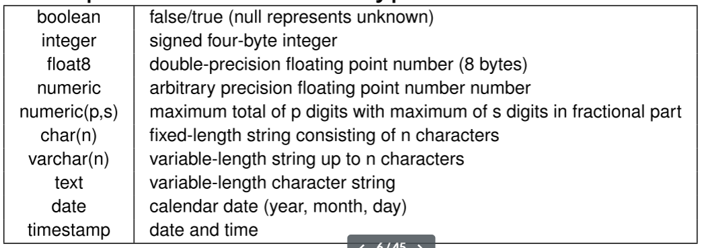
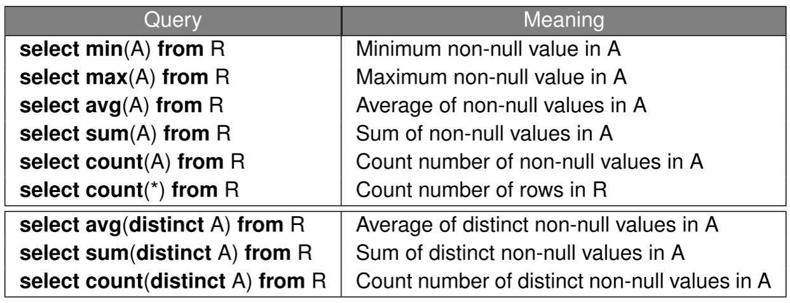
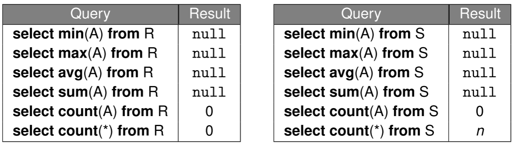

## Create/Drop tables

```sql
-- Comments in SQL are preceded
-- by two hyphens
create table Students (
  studentId integer,
  name TEXT
  birthDate DATE
);
/* SQL also supports
C-style comments */
drop table Students;
drop table if exists Students;
drop table if exists Students cascade;
```

## Data Types



Null Values:

- Result of a **comparison operation** involving null value is `unknown`
- Result of an **arithmetic operation** involving null value is `null`

Check for `null`:

- `x IS NULL`
- `x IS NOT NULL` = `NOT (x IS NULL)`

`x IS DISTINCT FROM y`: similar to `x <> y` but works for `null`

## Constraints in Data Definitions

A constraint is violated if it evaluates to `false`

**Constraint Types:**

- Not-null constraints: is violated if $\exists x \in Students$ where `x.name IS NOT NULL` evaluates to `false`
- Unique constraints: is violated if $\exists x, y \in Students$ where `x.id <> y.id` evaluates to `false`
- Primary key constraints
- Foreign key constraints:
  - `REFERENCES Room(level, number)` does not check partially null foreign key
  - `REFERENCES Room(level, number) MATCH FULL` to fix this (but still allows all `null` value like `(null, null)`)
- Check constraints

  ```sql
  --Column constraint
  day SMALLINT CHECK (day IN (1,2,3,4,5)),

  --Table constraint
  CHECK (
    (day IN (1,2,3,4,5) AND hour >= 8 AND hour <= 17)
    OR
    (day = 6 AND hour IN (9,10,11))
  )
  ```

**Constraint Names:**

```sql
--Column constraint
pname VARCHAR(50)
  CONSTRAINT lectures_pname CHECK (pname IS NOT NULL),

--Table constraint:
CONSTRAINT lectures_pri_key PRIMARY KEY (cname, day, hour),
```

## Database Modifications

**Insert:**

```sql
CREATE TABLE Students (
  studentId INTEGER PRIMARY KEY,
  name VARCHAR(100) NOT NULL,
  birthDate date,
  dept VARCHAR(20) DEFAULT 'CS'
);

INSERT INTO Students
VALUES (12345, 'Alice', '1999-12-25', 'Maths');

INSERT INTO Students (name, studentId)
VALUES ('Bob', 67890), ('Carol', 11122);
```

**Delete:**

```sql
-- Remove all students from Maths department
DELETE FROM Students
WHERE dept = 'math';
```

**Update:**

```sql
-- Add $500 to account 12345 & change name to 'Alice'
UPDATE Accounts
SET balance = balance + 500, name = 'Alice'
WHERE accountId = 12345;
```

## Foreign Key Constraint Violations

- `NO ACTION`: rejects delete/update if it violates constraint (default option)
- `RESTRICT`: similar to `NO ACTION` except that constraint checking can’t be deferred
- `CASCADE`: propagates delete/update to referencing tuples
- `SET DEFAULT`: updates foreign keys of referencing tuples to some default value
- `SET NULL`: updates foreign keys of referencing tuples to `null` value

```sql
foreign key (sid) references Students
  on delete cascade
  on update cascade
```

## Transaction

`begin` command starts a new transaction. Each transaction must end with either a `commit` or `rollback` command

```sql
begin;
update Accounts
set balance = balance + 1000
where accountId = 2;

update Accounts
set balance = balance - 1000
where accountId = 1;
commit;
```

**Deferrable Constraints:** By default, constraints are checked immediately at the end of SQL statement execution. A violation will cause the statement to be rollbacked. The checking could also be deferred for some constraints to the end of transaction execution. Deferrable constraints: `UNIQUE, PRIMARY KEY, FOREIGN KEY`

- `deferrable initially deferred`
- `deferrable initially immediate`: deferrable but immediate by default, can change to deferred later

```sql
create table Employees (
  eid integer primary key,
  ename varchar(100),
  managerId integer,
  constraint employees_fkey foreign key (managerId) references Employees
    deferrable initially immediate
);

insert into Employees values (1, 'Alice', null), (2, 'Bob', 1), (3, 'Carol', 2);

begin;
set constraints employees_fkey deferred;
delete from Employees where eid = 2;
update Employees set managerId = 1 where eid = 3;
commit;
```

## Modifying Schema

```sql
--Add/remove/modify columns
alter table Students alter column dept drop default;
alter table Students drop column dept;
alter table Students add column faculty varchar(20);

--Add/remove constraints
alter table Students add constraint fk_grade foreign key(grade) references Grades;
```

## Simple Queries

```sql
select ∗ from Sells
where ((price < 20) and (rname <> 'Pizza King'))
or
rname = 'Corleone Corner';

select 'Price of '|| pizza || ' is ' || round(price / 1.3) || ' USD' as menu
from Sells
where rname = 'Corleone Corner';
```

## Set Operations

```sql
select cname from Customers
union
select rname from Restaurants;

select pizza from Contains where ingredient = 'cheese'
intersect
select pizza from Contains where ingredient = 'chili';

select pizza from Contains where ingredient = 'cheese'
except
select pizza from Contains where ingredient = 'chilli';
```

`union all`, `intersect all`, and `except all` preserves duplicate records

## Multi-relation Queries

```sql
select cname, rname
from Customers as C, Restaurants as R
where C.area = R.area;
--is the same as
select cname, rname
from Customers C cross join Restaurants R
where C.area = R.area;

select cname, rname
from Customers C join Restaurants R
  on C.area = R.area;

--Find distinct restaurant pairs (R1,R2) where R1 < R2 and they sell some common pizza
select distinct S1.rname, S2.rname
from Sells S1, Sells S2
where S1.rname < S2.rname
  and S1.pizza = S2.pizza;
--or
select distinct S1.rname, S2.rname
from Sells S1 join Sells S2
on (S1.rname < S2.rname)
and (S1.pizza = S2.pizza);
```

## Subquery Expression

**`EXISTS (subquery)`/`NOT EXISTS (subquery)`**

- Returns `true` if the the output of the subquery is non-empty; otherwise, `false`

```sql
--Find distinct customers who like some pizza sold by “Corleone Corner”
select distinct cname
from Likes L
where exists (
  select 1
  from Sells S
  where S.rname = 'Corleone Corner'
    and S.pizza = L.pizza
  );
```

**`expr IN (subquerry)`**

- Subquery must return exactly one column
- Returns `false` if the output of the subquery is empty; otherwise return the result of the boolean expression

$$
((v=v_1) \vee (v=v_2) \vee \dots (v=v_n))
$$

where $v$ denote the result of the expression, $\{v_1, v_2, \dots, v_n\}$ denote the output of the subquerry

```sql
select distinct cname
from Likes
  where pizza in (
  select pizza
  from Sells
  where rname = ’Corleone Corner’
  );

--Find pizzas that contain ham or seafood
select distinct pizza from Contains
where ingredient in (’ham’, ’seafood’);
```

**`expr op ANY/SOME (subquery)`**

- Subquery must return exactly one column
- Returns `false` if the output of the subquery is empty; otherwise return the result of the boolean expression

$$
((v\ op\ v_1) \vee (v\ op\ v_2) \vee \dots (v\ op\ v_n))
$$

where $v$ denote the result of the expression, $\{v_1, v_2, \dots, v_n\}$ denote the output of the subquery, and $op$ denote comparison operator (i.e., =, \<>, \<, >, \<=, >=)

```sql
select distinct rname
from Sells
where rname <> ’Corleone Corner’
  and
  price > any (
    select price
    from Sells
    where rname = ’Corleone Corner’
    );
```

**`expr op ALL (subquery)`**

- same as `ANY/SOME` but use $\wedge$ instead of $\vee$

**Row Constructors:**

- Possible to use subqueries that return more than one column

```sql
select pname, day, hour
from Lectures L
where row(day,hour) <= all (
  select day, hour
  from Lectures L2
  where L2.pname = L.pname
);
```

**Scalar Subqueries:**

- A scalar subquery is a subquery that returns at most one tuple with one column. If the subquery’s output is empty, its return value is `null`.
- A scalar subquery can be used as a scalar expression.
- Non-scalar subquery expressions can be used in different parts of SQL queries: `WHERE`, `FROM`, `HAVING` clause.

**Database modification:**

```sql
insert into Enrolls (sid, cid)
select studentId, 101
from Students S
where S.year = 1;
```

## `ORDER BY`/`LIMIT`/`OFFSET` Clause

```sql title="ORDER BY"
select ∗
from Restaurants, Sells
where Restaurants.rname = Sells.rname
order by area asc, price desc;

select ∗
from Restaurants, Sells
where Restaurants.rname = Sells.rname
order by area, price desc;
```

```sql title="LIMIT/OFFSET"
select pizza, rname, price
from Sells
order by price desc
limit 3;

select pizza, rname, price
from Sells
order by price desc
offset 3
limit 2;
```

## Aggregate functions



```sql
select min (price), max (price), avg (price)
from Sells
where rname = ’Corleone Corner’
```

Let R be an empty relation and S be a relation with cardinality = n where all values of attribute A are `null` values



Aggregate functions can be used in different parts of SQL queries: `SELECT`, `HAVING`, and `ORDER BY` clause

```sql
select count(∗), max(price ∗ qty)
from Orders;

select pizza, rname
from Sells
where price = (select max(price) from Sells);
```

## `GROUP BY` Clause

In a query with `GROUP BY a1, a2, · · · , an`, two tuples t & t′ belong to the same group if the following expression evaluates to `true`:

```sql
(t.a1 IS NOT DISTINCT FROM t′.a1) AND · · · AND (t.an IS NOT DISTINCT FROM t′.an)
```

Each output tuple corresponds to one group

For each column A in relation R that appears in the `SELECT` clause, one of the following conditions must hold:

- A appears in the `GROUP BY` clause,
- A appears in an aggregated expression in the `SELECT` clause (e.g., `min(A)`), or
- the primary (~~or a candidate~~) key of R appears in the `GROUP BY` clause

```sql
--Find the number of students for each (dept,year) combination.
--Show the output in ascending order of (dept,year).
select dept, year, count(∗) as num
from Students
group by dept, year;
order by dept, year;

--Show all restaurants in descending order of their average pizza price.
--Exclude restaurants that do not sell any pizza.
select rname
from Sells
group by rname
order by avg(price) desc;

--invalid query
select year, count(∗) --year is ambiguos
from Students
group by dept;

select rname, min(price), max(price) --cannot include rname if dont have GROUP BY
from Sells

select distinct rname
from Sells
order by price; --price is ambiguous, cannot order by price
```

## `HAVING` Clause

similar to `WHERRE` clause but for `GROUP BY`

```sql
--Find restaurants located in the ‘East’ area that sell
--pizzas with an average selling price higher than the
--minimum selling price at Pizza King
select rname
from Sells
where rname in (
  select rname
  from Restaurants
  where area = 'East'
)
group by rname
having avg(price) >
  (select min(price)
  from Sells
  where rname = 'Pizza King');
```

For each column A in relation R that appears in the `HAVING` clause, one of the following conditions must hold:

- A appears in the GROUP BY clause,
- A appears in an aggregated expression in the `HAVING` clause, or
- the primary (~~or a candidate~~) key of R appears in the `GROUP BY` clause

## Conceptual Evaluation of Queries

```sql
SELECT DISTINCT '<select-list>'
FROM '<from-list>'
WHERE '<where-condition>'
GROUP BY '<groupby-list>'
HAVING '<having-condition>'
ORDER BY '<orderby-list>'
OFFSET '<offset-specification>'
LIMIT '<limit-specification>'
```

1. Compute the cross-product of the tables in `from-list`
2. Select the tuples in the cross-product that evaluate to true for the `where-condition`
3. Partition the selected tuples into groups using the `groupby-list`
4. Select the groups that evaluate to true for the `having-condition` condition
5. For each selected group, generate an output tuple by selecting/computing the attributes/expressions that appear in the `select-list`
6. Remove any duplicate output tuples
7. Sort the output tuples based on the `orderby-list`
8. Remove the appropriate output tuples based on the `offset-specification` and `limit-specification`

## Common Table Expressions (CTEs)

```sql
WITH
  R1 AS (Q1),
  R2 AS (Q2),
  ...,
  Rn AS (Qn)
SELECT/INSERT/DELETE/UPDATE '<smth>'
```

## Views: Providing Logical Data Independence

```sql
create view CourseInfo as
select cname, pname, lectureTime,numUGrad+numPGrad+numExchange+numAudit as numEnrolled
from Courses natural join Profs natural join Enrollment;
```

## Conditional Expressions

```sql title="CASE"
--Case 1
case
  when condition_1 then result_1
  ...
  when condition_n then result_n
  else result_0
end

--Case 2
case expression
  when value_1 then result_1
  ...
  when value_n then result_n
  else result_0
end

--Example
select name, case
  when marks >= 70 then ’A’
  when marks >= 60 then ’B’
  when marks >= 50 then ’C’
  else ’D’
end as grade
from Scores;
```

**`COALESCE(a, b, ...)`** returns the first non-null value in its arguments. Returns `null` if all the arguments are `null`

**`NULLIF(value1, value2)`** returns null if `value1` is equal to `value2`; otherwise returns `value1`

```sql
select name, nullif(result,’absent’) as status
from Tests;
```

## Pattern Matching with `LIKE` Operator

```sql
select cname from Customers where cname like '___%e';
```

- Underscore `_` matches any single character
- Percent `%` matches any sequence of 0 or more characters
- `string not like '<pattern>'` is equivalent to `not (string like '<pattern>')`
- For more advanced regular expressions, use `similar to` operator

## Queries with Universal Quantification

**Example**: Find the names of all students who have enrolled in all the courses offered by CS department

```sql
/* Courses (courseId, name, dept)
Students (studentId, name, birthDate)
Enrolls (sid, cid, grade) */

--F(x): set of courseIds of CS courses that are not enrolled by student with studentId x
select courseId
from Courses C
where dept = 'CS' and not exists (
  select 1
  from Enrolls E
  where E.cid = C.courseId and E.sid = x
);

--Names of students who have enrolled in all CS Courses
select name
from Students S
where not exists (
  select courseId
  from Courses C
  where dept = 'CS' and not exists (
    select 1
    from Enrolls E
    where E.cid = C.courseId
    and E.sid = S.studentId
  )
);
```

## Window Functions

**`SUM()`, `COUNT()`, `AVG()`**

```sql
SELECT start_terminal,
       duration_seconds,
       SUM(duration_seconds) OVER
         (PARTITION BY start_terminal) AS running_total,
       COUNT(duration_seconds) OVER
         (PARTITION BY start_terminal) AS running_count,
       AVG(duration_seconds) OVER
         (PARTITION BY start_terminal) AS running_avg
FROM tutorial.dc_bikeshare_q1_2012
WHERE start_time < '2012-01-08';
```

**`ROW_NUMBER()`**: same value different number; `RANK():` same value same rank

**`RANK()`** would give the identical rows a rank of 2, then skip ranks 3 and 4, so the next result would be 5

**`DENSE_RANK()`** would still give all the identical rows a rank of 2, but the following row would be 3—no ranks would be skipped.

```sql
SELECT depname, empno, salary,
       rank() OVER (PARTITION BY depname ORDER BY salary DESC)
FROM empsalary;
```

**`NTILE(#buckets)`** identifies what percentile (or quartile when #buckets = 4, or any other subdivision) a given row falls into

```sql
SELECT start_terminal,
       duration_seconds,
       NTILE(4) OVER
         (PARTITION BY start_terminal ORDER BY duration_seconds)
          AS quartile,
       NTILE(5) OVER
         (PARTITION BY start_terminal ORDER BY duration_seconds)
         AS quintile,
       NTILE(100) OVER
         (PARTITION BY start_terminal ORDER BY duration_seconds)
         AS percentile
FROM tutorial.dc_bikeshare_q1_2012
WHERE start_time < '2012-01-08'
ORDER BY start_terminal, duration_seconds;
```

**`LAG`  `LEAD`** create columns that pull values from other rows—all you need to do is enter which column to pull from and how many rows away you'd like to do the pull. `LAG` pulls from previous rows and `LEAD` pulls from following rows

```sql
SELECT start_terminal,
       duration_seconds,
       LAG(duration_seconds, 1) OVER
         (PARTITION BY start_terminal ORDER BY duration_seconds) AS lag,
       LEAD(duration_seconds, 1) OVER
         (PARTITION BY start_terminal ORDER BY duration_seconds) AS lead
FROM tutorial.dc_bikeshare_q1_2012
ORDER BY start_terminal, duration_seconds;

  -- Calculate differences between rows
SELECT start_terminal,
       duration_seconds,
       duration_seconds -LAG(duration_seconds, 1) OVER
          (PARTITION BY start_terminal ORDER BY duration_seconds)
          AS difference
FROM tutorial.dc_bikeshare_q1_2012
WHERE start_time < '2012-01-08'
ORDER BY start_terminal, duration_seconds;

-- Remove NULL from boundary columns
SELECT *
FROM (
  SELECT start_terminal,
          duration_seconds,
          duration_seconds -LAG(duration_seconds, 1) OVER
            (PARTITION BY start_terminal ORDER BY duration_seconds)
            AS difference
  FROM tutorial.dc_bikeshare_q1_2012
  WHERE start_time < '2012-01-08'
  ORDER BY start_terminal, duration_seconds
) sub
WHERE sub.difference IS NOT NULL;
```

**Window Alias:** If you're planning to write several window functions in to the same query, using the same window, you can create an alias

```sql
SELECT start_terminal,
     duration_seconds,
     NTILE(4) OVER
       (PARTITION BY start_terminal ORDER BY duration_seconds)
       AS quartile,
     NTILE(5) OVER
       (PARTITION BY start_terminal ORDER BY duration_seconds)
       AS quintile,
     NTILE(100) OVER
       (PARTITION BY start_terminal ORDER BY duration_seconds)
       AS percentile
FROM tutorial.dc_bikeshare_q1_2012
WHERE start_time < '2012-01-08'
ORDER BY start_terminal, duration_seconds;

-- Using window alias
SELECT start_terminal,
        duration_seconds,
        NTILE(4) OVER ntile_window AS quartile,
        NTILE(5) OVER ntile_window AS quintile,
        NTILE(100) OVER ntile_window AS percentile
FROM tutorial.dc_bikeshare_q1_2012
WHERE start_time < '2012-01-08'
WINDOW ntile_window AS # always come after WHERE
      (PARTITION BY start_terminal ORDER BY duration_seconds)
ORDER BY start_terminal, duration_seconds;
```

## Pivot

```sql
--  MSSQL
SELECT Subscription_plan,
    [2023-06-01],
    [2023-06-02],
    [2023-06-03],
FROM (SELECT Subscription_plan,[Subscribed_customers], DATE FROM customers) AS IQ
PIVOT (
  SUM([Subscribed_customers])
  FOR Date IN([2023-06-01],[2023-06-02],[2023-06-03])
) AS PT;

--  MySQL
SELECT Subscription_plan,
    SUM(CASE
      WHEN Date = STR_TO_DATE('06/01/2023','%m/%d/%Y') THEN Subscribed_customers ELSE 0 END
    ) AS '06/01/2023',
    SUM(CASE
      WHEN Date = STR_TO_DATE('06/02/2023','%m/%d/%Y') THEN Subscribed_customers ELSE 0 END
    ) AS '06/02/2023',
    SUM(CASE
      WHEN Date = STR_TO_DATE('06/03/2023','%m/%d/%Y') THEN Subscribed_customers ELSE 0 END
    ) AS '06/03/2023',
FROM customers
GROUP BY Subscription_plan;

--  PostgreSQL
CREATE EXTENSION IF NOT EXISTS tablefunc;

SELECT *
FROM crosstab('select Subscription_plan, Date, Subscribed_customers from customers ORDER BY 1,2') AS ct (
  Subscription_plan varchar(50),
  "06/01/2023" int,
  "06/02/2023" int,
  "06/03/2023" int,
  "06/04/2023" int,
  "06/05/2023" int,
  "06/06/2023" int,
  "06/07/2023" int
);
```
