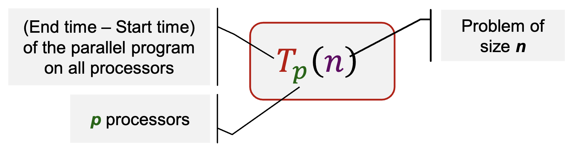
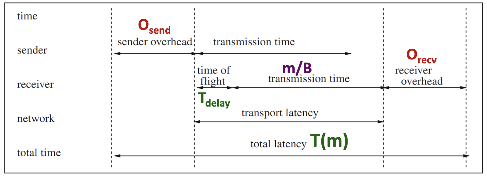

Performance Goals:

- Users: reduced response time → Time between the start and termination of the program
- Computer managers: high throughput
  - Average number of work units executed per unit time, e.g. jobs per second, transactions per second

## Execution Time

Response Time in Sequential Programs (wall-clock time): includes

- User CPU time: time CPU spends for executing program
- System CPU time: time CPU spends executing OS routines
- Waiting time: I/O waiting time and the execution of other programs because of time sharing

Considerations:

- waiting time: depends on the load of the computer system
- system CPU time: depends on the OS implementation

### User CPU Time

Depends on:

- Translation of program statements by the compiler into instructions
- Execution time for each instruction:

  $Time_{user}(A) = N_{cycle}(A) \times Time_{cycle}$

  - $Time_{user}$ → User CPU time of a program A
  - $N_{cycle}(A)$ → Total number of CPU cycles needed for all instructions
  - $Time_{cycle}$ → Cycle time of CPU (clock_cycle_time = 1/clock_rate)

But instructions may have different execution times

→ For a program with n types of instructions, I1,..., In

$$
N_{cycle}(A) = \sum_{i = 1}^n {n_i(A)\times CPI_i}
$$

- $n_i(A)$ → number of instructions of type Ii
- $CPI_i$ → average number of CPU cycles needed for instructions of type Ii

Thus:

$$
Time_{user} = N_{instr}(A) \times CPI(A) \times Time_{cycle}
$$

- $CPI(A)$ → depends on the internal organization of the CPU, memory system, and compiler
- $N_{instr}(A)$ → total number of instructions executed for A, depends on the architecture of the computer system and the compiler

Include memory access time to the user time:

$$
Time_{user}(A) = \left(N_{cycle}(A) + N_{mm\_cycle}(A) \right) \times Time_{cycle}
$$

- $N_{mm\_cycle}(A)$ → number of additional clock cycles due to memory accesses

Consider a one-level cache:

$$
N_{mm\_cycle}(A) = N_{read\_cycle}(A) + N_{write\_cycle}(A) \\[10px]
N_{read\_cycle}(A) = N_{read\_op}(A) \times R_{read\_miss}(A) \times N_{miss\_cycle}(A)
$$

$N_{mm\_cycle}(A)$ is similar

import memoryAccess from "./l5-performance-of-parallel-systems/untitled.png";
import { Image } from "astro:assets";

<figure class="mx-auto w-[240px]">
  <Image src={memoryAccess} alt="Memory Access" />
  <figcaption class="text-center text-sm !mt-0">
    Memory Access: Illustration
  </figcaption>
</figure>

**Terminology:**

- LLC = last level cache
- Cache line/block = each block of memory content in cache
- Mapping = mechanism used to store and locate a memory block in cache

import readWorkflow from "./l5-performance-of-parallel-systems/untitled-1.png";
import writeWorkflow from "./l5-performance-of-parallel-systems/untitled-2.png";

  <figure class="basis-72">
    <Image src={readWorkflow} alt="Read access (load) workflow" />
    <figcaption class="text-center text-sm !mt-0">
      Read access (load) workflow
    </figcaption>
  </figure>
  <figure class="basis-72 !mt-0">
    <Image src={writeWorkflow} alt="Write access (store) workflow" />
    <figcaption class="text-center text-sm !mt-0">
      Write access (store) workflow
    </figcaption>
  </figure>

**Refinement with Memory Access Time:**

- User time with instructions with different execution times extension:

  $$
  Time_{user}(A) = \\
  \left(N_{instr}(A) \times CPI(A) + N_{rw\_op}(A) \times R_{miss}(A) \times N_{miss\_cycles}(A) \right) \times Time_{cycle}
  $$

  - $N_{rw\_op}$ → total number of read or write operations
  - $R_{miss}(A)$ → (read and write) miss rate
  - $N_{miss\_cycles}$ → number of additional cycles needed for loading a new cache line

**Average Memory Access Time:**

$$
T_{read\_access}(A) = T_{read\_hit} + R_{read\_miss}(A) \times T_{read\_miss}(A)
$$

- $T_{read\_access}(A)$ → average read access time of a program A
- $T_{read\_hit}$ → time for a read access to the cache irrespective of hit or miss (additional time is captured in misses)
- $R_{read\_miss}(A)$ → cache read miss rate of a program A
- $T_{read\_miss}(A)$ → read miss penalty time
- Can be applied to multiple level of cache or virtual memory

$$
T_{read\_access}(A) = T^{L1}*{read\_hit} + R^{L1}*{read\_miss}(A) \times T^{L1}*{read\_miss}(A) \\[10px]
T^{L1}*{read\_miss}(A) = T^{L2}*{read\_hit} + R^{L2}*{read\_miss}(A) \times T^{L2}_{read\_miss}(A)
$$

- Global miss rate: $R^{L1}*{read\_miss}(A) \times R^{L2}*{read\_miss}(A)$

**Example:**\
Processor for which each instruction takes 2 cycles to execute.
The processor uses a cache for which the loading of a cache block takes 100 cycles.
Program A for which the (read and write) miss rate is 2% and in which 33% of the instructions executed are load and store operations

Scenarios – Execution time when

- No cache

$$
Time_{user}(A) = \left(N_{cycle}(A) + N_{mm\_cycle}(A) \right) \times Time_{cycle} \\[10px]
Time_{user}(A) = \left(N\times2 + 0.33N\times1\times100 \right) \times Time_{cycle} = 35 \frac{N}{f} \tag{1}
$$

- Double clock rate while the time to load a cache block doubles (200 cycles)

$$
Time_{user}(A) = \left(N\times2 + 0.33N\times0.02\times200 \right) \times Time_{cycle} = (3.32)\frac{N}{2f} \tag{2} \\[10px]
\therefore \frac{(1)}{(2)} = \frac{35\times2}{3.32} = 21.08
$$

→ Case (2) is 21.08 times more efficient than case (1)

### Throughput

Million-Instruction-Per-Second:

$$
MIPS(A) = \frac{N_{instr}(A)}{Time_{user}(A)\times 10^6}  \\[10px]

MIPS(A) = \frac{f}{CPI(A) \times 10^6}
$$

- **Drawbacks**:
  - Consider only the number of instructions
  - Easily manipulated (by making instruction smaller)

Million-Floating point-Operation-Per-Second:

$$
MFLOPS(A) = \frac{N_{fl\_ops}(A)}{Time_{user}(A)\times 10^6}  \\[10px]
$$

- $N_{fl\_ops}(A)$ → number of floating-point operations in program A
- **Drawback**: No differentiation between different types of floating-point operations

## Speedup

### Parallel Execution Time

Consists of:

- Time for executing local **computations**
- Time for **exchange of data** between processors
- Time for **synchronization** between processors
- **Waiting** time
  - Unequal load distribution of the processors
  - Wait to access a shared data structure

### Parallel Program: Cost

Cost of a parallel program with input size n executed on p processors:

$$
C_p(n)= p\times T_p(n)
$$

$C_p(n)$ measures the total amount of work performed by all processors, i.e. processor-runtime product

A parallel program is cost-optimal if it executes the same total number of operations as the fastest sequential program

### **Parallel Program: Speedup**

- Measure the benefit of parallelism: a comparison between sequential and parallel execution time

$$
S_p(n) = \frac{T_{best_seq}(n)}{T_p(n)} = \frac{T_\*(n)}{T_p(n)}
$$

- Theoretically, $S_p(n) \leq p$ always holds
- In practice, $S_p(n) > p$ (superlinear speedup) can occur, for e.g. when problem working task “fits” in the cache

Best Sequential Algorithm:

- Best sequential algorithm may not be known
- There exists an algorithm with the optimum asymptotic execution time, but other algorithms lead to lower execution times in practice
- Complex implementation for the fastest algorithm

### Parallel Program: Efficiency

Actual degree of speedup performance achieved compared to the maximum

$$
E_p(n) = \frac{T_*(n)}{C_p(n)} = \frac{S_p(n)}{p} = \frac{T_*(n)}{p\times T_p(n)}
$$

Ideal speedup: $S_p(n) = p \Rarr E_p(n) = 1$

## Scalability

Interaction between the size of the problem and the size of the parallel computer

- Impact on load balancing, overhead, arithmetic intensity, locality of data access
- Application dependent

Fixed problem size and the machine

- Small problem size:
  - Parallelism overheads dominate parallelism benefits
  - Problem size may be appropriate for a small machine, but inappropriate for large one
- Large problem size: (problem size chosen to be appropriate for large machine)
  - Key working set may not “fit” in small machine (causing thrashing to disk, or key working set exceeds cache capacity, or can’t run at all)

**Scaling Constraints:**

- Application-oriented scaling properties (specific to application)
  - Particles per processor in a parallel N-body simulation
  - Transactions per processor in a distributed database
  - In practice, problem size is a combination of parameters, not only one number
- Resource-oriented scaling properties
  - **Problem constrained** scaling (PC): use a parallel computer to solve the same problem faster
  - **Time constrained** scaling (TC): completing more work in a fixed amount of time
  - **Memory constrained** scaling (MC): run the largest problem possible without overflowing main memory

### Amdahl’s Law

:::note
💡 Speedup of parallel execution is limited by the fraction of the algorithm that cannot be parallelized (f).

:::

f (0 ≤ f ≤ 1) is called the sequential fraction
Also known as fixed-workload performance

import sequentialTime from "./l5-performance-of-parallel-systems/untitled-4.png";
import parallelTime from "./l5-performance-of-parallel-systems/untitled-5.png";

  <figure class="basis-96">
    <Image src={sequentialTime} alt="Sequential Execution Time" />
    <figcaption class="text-center text-sm !mt-0">
      Sequential Execution Time
    </figcaption>
  </figure>
  <figure class="basis-96 !mt-0">
    <Image src={parallelTime} alt="Parallel Execution Time" />
    <figcaption class="text-center text-sm !mt-0">
      Parallel Execution Time
    </figcaption>
  </figure>

$$
S_p(n) = \frac{T_*(n)}{f\times T_*(n) + \frac{1-f}{p}\times T_*(n)} = \frac{1}{f + \frac{1-f}{p}} \leq \frac{1}{f}
$$

However, in many computing problems, f is not a constant

- Commonly dependent on problem size n
- f is a function of n, f(n)

An effective parallel algorithm is:

$$
\lim_{x \to \infty} f(x) = 0
$$

Thus, speedup:

$$
\lim_{x \to \infty} S_p(n) = \frac{p}{1 + (p - 1)\ f(n)} = p
$$

→ Amdahl's Law can be circumvented for large problem size!

### Gustafson’s Law (1988)

There are certain applications where the main constraint is execution time

- e.g. weather forecasting, chess program, etc
- Higher computing power is used to improve accuracy / better result

If f is not a constant but decreases when problem size increases, then $S_p(n) \leq p$

$\tau_f$ → constant execution time for sequential part

$\tau_\nu(n, p)$ → execution time of the parallelizable part for a problem of size n and p processors

$$
S_p(n) = \frac{\tau_f + \tau_\nu(n, 1)}{\tau_f + \tau_\nu(n, p)}
$$

Assume parallel program is perfectly parallelizable (without overheads), then

$$
\tau_\nu(n, 1) = T_*(n) - \tau_f \text{ and } \tau_\nu(n, p) = \frac{T_*(n) - \tau_f}{p}
$$

If T\*(n) increases strongly monotonically with n, then $\lim_{x \to \infty} S_p(n) = p$

## Communication Time

### Message Transmission: Sender

> Sending processor

To send a message

- Message is copied into a system buffer
- A checksum is computed
- A header is added to the message
- A timer is started and the message is sent out

After sending the message

- If acknowledgment message arrives, release the system buffer
- If the timer has elapsed, the message is re-sent
  - Restart timer, possibly with a longer time

### Message Transmission: Receiver

> Receiving processor

Message is copied from the network interface into a system buffer

Compare computed checksum and received checksum

- **Mismatch**: discard the message; re-sent after the sender timer has elapsed
- **Identical**: message is copied from the system buffer into the user buffer; application program gets a notification and can continue execution

### Performance Measures

| Measure            | Definition                                                                                | Unit                    |
| ------------------ | ----------------------------------------------------------------------------------------- | ----------------------- |
| Bandwidth          | Maximum rate at which data can be sent                                                    | bits (bytes) per second |
| Byte transfer time | Time to transmit a single byte                                                            | Seconds/byte            |
| Time of flight     | Time the first bit arrived at the receiver (channel propagation delay)                    | second                  |
| Transmission time  | Time to transmit a message                                                                | second                  |
| Transport latency  | Total time to transfer a message = transmission time + time of flight                     | second                  |
| Sender overhead    | Time of computing the checksum, appending the header, and executing the routing algorithm | second                  |
| Receiver overhead  | Time of checksum comparison and generation of an acknowledgment                           | second                  |
| Throughput         | Effective bandwidth                                                                       | bits (bytes) per second |

Total Latency of a Message of Size m:

$$
T(m) = O_{send} + T_{delay} + \frac{m}{B} + O_{recv} = T_{overhead} + \frac{m}{B} = T_{overhead} + t_B\times m
$$

- $B$ → network bandwidth
- $T_{delay}$ → time first bit to arrive at receiver
- no checksum error and network contention and congestion,
- $T_{overhead} = O_{send} + T_{delay} + O_{recv}$ → is independent of the message size
- $t_B = \frac{1}{B}$ → the byte transfer time

## Performance Analysis

### Experimentation Challenges

Experiment with writing and tuning your own parallel programs

- Many times, we obtain misleading results or tune code for a workload that is not representative of real-world use cases

Start by setting your application performance goals

- Response time, throughput, speedup?
- Determine if your evaluation approach is consistent with these goals

Try the simplest parallel solution first and measure performance to see where you stand

Performance analysis strategy:

- Determine what limits performance:
  - Computation
  - Memory bandwidth (or memory latency)
  - Synchronization
- Establish the bottleneck

### Possible bottlenecks

**Instruction-rate limited:** add “math” (non-memory instructions)

- Does execution time increase linearly with operation count as math is added?

**Memory bottleneck:** remove almost all math, but load same data

- How much does execution-time decrease?

**Locality of data access:** change all array accesses to A\[0]

- How much faster does your code get?

**Synchronization overhead:** remove all atomic operations or locks

- How much faster does your code get? (provided it still does approximately the same amount of work)
