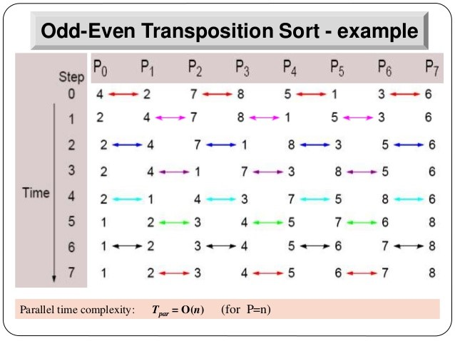

## Sorting a Linear Array

### Odd-Even Transposition Sort (1D)

### **Shear Sort Algorithm (2D)**

1. Row Sorting:
   - Odd Rows sort in ascending order
   - Even Rows sort in descending order
2. Column Sorting: All columns sort in ascending order (top to bottom)
3. Repeat until sorted

import { Image } from "astro:assets";
import shearSort0 from "./l11-interconnection-network/untitled-1.png";
import shearSort1 from "./l11-interconnection-network/untitled-2.png";
import shearSort2 from "./l11-interconnection-network/untitled-3.png";
import shearSort3 from "./l11-interconnection-network/untitled-4.png";
import shearSort4 from "./l11-interconnection-network/untitled-5.png";
import shearSort5 from "./l11-interconnection-network/untitled-6.png";

  <figure class="basis-72">
    <Image src={shearSort0} alt="Step 0" />
    <figcaption class="text-center text-sm !mt-0">Step 0</figcaption>
  </figure>
  <figure class="basis-72">
    <Image src={shearSort1} alt="Step 1" />
    <figcaption class="text-center text-sm !mt-0">Step 1</figcaption>
  </figure>
  <figure class="basis-72">
    <Image src={shearSort2} alt="Step 2" />
    <figcaption class="text-center text-sm !mt-0">Step 2</figcaption>
  </figure>
  <figure class="basis-72">
    <Image src={shearSort3} alt="Step 3" />
    <figcaption class="text-center text-sm !mt-0">Step 3</figcaption>
  </figure>
  <figure class="basis-72">
    <Image src={shearSort4} alt="Step 4" />
    <figcaption class="text-center text-sm !mt-0">Step 4</figcaption>
  </figure>
  <figure class="basis-72">
    <Image src={shearSort5} alt="Sorted (snake-like arrangement)" />
    <figcaption class="text-center text-sm !mt-0">
      Step 5 - Sorted (snake-like arrangement)
    </figcaption>
  </figure>

Complexity: $ O(n^\frac{1}{2} (\log_2 {n + 1})) $

### Interconnection Network Impact

- System scalability – size and extensibility
- System performance and energy efficiency
  - Communication speed
  - Latency to memory
  - Energy spent to communicate

## Topology

import directInterconnection from "./l11-interconnection-network/untitled-7.png";
import indirectInterconnection from "./l11-interconnection-network/untitled-8.png";

  <figure class="basis-72">
    <Image src={directInterconnection} alt="Direct Interconnection" />
    <figcaption class="text-center text-sm !mt-0">
      Direct Interconnection
    </figcaption>
  </figure>
  <figure class="basis-72">
    <Image src={indirectInterconnection} alt="Indirect Interconnection" />
    <figcaption class="text-center text-sm !mt-0">
      Indirect Interconnection
    </figcaption>
  </figure>

Direct Interconnection

- Also known as Static or Point-to-Point
- Usually endpoints are of the same type (core, memory)

Indirect Interconnection:

- Also known as Dynamic Interconnect is formed by switches
- Topology can be modeled as a Graph: G = (V, E), V = vertices; E = edges
- Metrics: Diameter, Degree, Bisection Width, Connectivity

### Direct Interconnection

Diameter: Diameter $\delta(G)$: maximum distance between any pair of nodes

$$
\delta(G) = \max_{u,v \in V}(\min_{\substack{\phi\text{ path from u to v}}} \set{k | k \text{ is the length of the path from u to v}})
$$

- **Usefulness:** Small diameter ensures small distances for message transmission

Degree:

- Degree g(v): number of direct neighbour nodes of node v
- Degree g(G): maximum degree of a node in a network G

$$
g(G) = max\set{g(v) | g(v) \text{ degree of } v\in V}
$$

- **Usefulness:** Small node degree reduces the node hardware overhead

Bisection Width:

- Bisection width B(G): minimum number of edges that must be removed in to divide the network into two equal halves

$$
B(G) = \min_{\substack{U_1,U_2\text{ partition of V}\\[2px] |\left|U_1| - |U_2|\right| \leq 1}} \left| \set{(u, v)\in E | u \in U_1, v\in U_2} \right|
$$

- Bisection bandwidth BW(G): Total bandwidth available between the two bisected portion of the network
- **Usefulness:** a measure for the capacity of a network when transmitting messages simultaneously

Connectivity:

- **Node connectivity:** nc(G) – minimum number of nodes that must fail to disconnect the network

  $$
  nc(G) = \min_{M\subset V}\set{\lvert M\rvert | \exists u, v\in V, s.t.; \nexists\text{ path in } G_{V\setminus M}\text{ from $u$ to $v$}}
  $$

  - **Usefulness**: Determine the robustness of the network

- **Edge connectivity:** ec(G) – minimum number of edges that must fail to disconnect the network

  $$
  ec(G) = \min_{F\subset E}\set{\lvert F\rvert | \exists u, v\in V, s.t.; \nexists\text{ path in } G_{E\setminus F}\text{ from $u$ to $v$}}
  $$

  - **Usefulness**: Determine number of independent paths between any pair of nodes

import basicNetworks from "./l11-interconnection-network/untitled-9.png";

<figure class="mx-auto w-[580px]">
  <Image src={basicNetworks} alt="Basic Networks" />
  <figcaption class="text-center text-sm !mt-0">Basic Networks</figcaption>
</figure>

import meshNetworks from "./l11-interconnection-network/untitled-10.png";

<figure class="mx-auto w-[580px]">
  <Image src={meshNetworks} alt="Mesh Networks" />
  <figcaption class="text-center text-sm !mt-0">
    Mesh Networks - d-dimension: #nodes n = r^d
  </figcaption>
</figure>

import completeBinaryTree from "./l11-interconnection-network/untitled-11.png";

<figure class="mx-auto w-[580px]">
  <Image src={completeBinaryTree} alt="Complete Binary Tree" />
  <figcaption class="text-center text-sm !mt-0">
    Complete Binary Tree
  </figcaption>
</figure>

import hypercubeNetworks from "./l11-interconnection-network/untitled-12.png";

<figure class="mx-auto w-[580px]">
  <Image src={hypercubeNetworks} alt="Hypercube Networks" />
  <figcaption class="text-center text-sm !mt-0">Hypercube Networks</figcaption>
</figure>

**Cube-Connected-Cycles (CCC):**

import cccNetworks from "./l11-interconnection-network/untitled-13.png";

<figure class="mx-auto w-[580px]">
  <Image src={cccNetworks} alt="Cube-Connected-Cycles (CCC)" />
  <figcaption class="text-center text-sm !mt-0">
    Cube-Connected-Cycles (CCC)
  </figcaption>
</figure>

- From a k-dimensional hypercube (k ≥ 3), substitute each node with a cycle of k-nodes
  - Each of the k-nodes take one of the original k links
  - Total nodes = $k2^k$

import cccMetrics from "./l11-interconnection-network/untitled-14.png";

<figure class="mx-auto w-[580px]">
  <Image src={cccMetrics} alt="Metrics of Cube-Connected-Cycles (CCC)" />
  <figcaption class="text-center text-sm !mt-0">
    Metrics of Cube-Connected-Cycles (CCC)
  </figcaption>
</figure>

- Each node in a k-dimensional CCC is labeled as (X, Y)
  - X = the corresponding node index in hypercube
  - Y = the position in the cycle, i.e. 0...k-1
- Node (X, Y) is connected to:
  - $(X, (Y+1)\mod k)$
  - $(X, (Y-1)\mod k)$
  - $(X\oplus2^Y, Y)$, where $\oplus$ is bitwise XOR (flip the ith significant bit)

import metricsSummary from "./l11-interconnection-network/untitled-15.png";

<figure class="mx-auto w-[580px]">
  <Image src={metricsSummary} alt="Summary of Metrics" />
  <figcaption class="text-center text-sm !mt-0">Summary of Metrics</figcaption>
</figure>

### **Indirect Interconnection**

- **Why**: Reduce hardware costs by sharing switches and links
- **How**: Switches provide indirect connection between nodes and can be configured dynamically
- **Metric**: Cost (number of switches / links), Concurrent connections

**Bus Network:**

import busNetwork from "./l11-interconnection-network/untitled-16.png";

<figure class="mx-auto w-[420px]">
  <Image src={busNetwork} alt="Bus Network" />
  <figcaption class="text-center text-sm !mt-0">Bus Network</figcaption>
</figure>

- A set of wires to transport data from a sender to a receiver
- Only one pair of devices can communicate at a time
  - A bus arbiter is used for the coordination
  - Typically used for a small number of processors

**Crossbar Network:**

import crossbarNetwork from "./l11-interconnection-network/untitled-17.png";

<figure class="mx-auto w-[580px]">
  <Image src={crossbarNetwork} alt="Crossbar Network" />
  <figcaption class="text-center text-sm !mt-0">Crossbar Network</figcaption>
</figure>

- A n × m crossbar network has n inputs and m outputs
- 2 states of a switch: straight or direction change
- Hardware is costly (n x m switches) → small number of processors

**Multistage Switching Network**

import multistageSwitchingNetwork from "./l11-interconnection-network/untitled-18.png";

<figure class="mx-auto w-[580px]">
  <Image src={multistageSwitchingNetwork} alt="Multistage Switching Network" />
  <figcaption class="text-center text-sm !mt-0">
    Multistage Switching Network
  </figcaption>
</figure>

- Several intermediate switches with connecting wires between neighbouring stages
- **Goal**: obtain a small distance for arbitrary pairs of input and output devices

**Omega Network:**

import omegaNetwork from "./l11-interconnection-network/untitled-19.png";

<figure class="mx-auto w-[420px]">
  <Image src={omegaNetwork} alt="Omega Network" />
  <figcaption class="text-center text-sm !mt-0">Omega Network</figcaption>
</figure>

- One unique path for every input to output

- An n × n Omega network has log n stages

  - n/2 switches per stage, each switch has 2 input and 2 output links
  - Connections between stages are regular
  - Also known as (lg n – 1) – dimension Omega Network

- A switch position: (α, i)

  - α: position of a switch within a stage; i: stage number

- Has an edge from node (α, i) to two nodes (β,i + 1) where
  - β = α by a cyclic left shift
  - β = α by a cyclic left shift + inversion of the LSBit

import omegaNetworkExample from "./l11-interconnection-network/untitled-20.png";

<figure class="mx-auto w-[580px]">
  <Image src={omegaNetworkExample} alt="Omega Network Example" />
  <figcaption class="text-center text-sm !mt-0">
    Omega Network Example
  </figcaption>
</figure>

- **Omega Network vs Crossbar Switches:** To connect 16 processor nodes to 16 memory nodes
  - Crossbar = 16 x 16 = 256 switches
  - Omega: n=16 and using 2x2 switches
    - Total number of switches = n/2 switches per stage \* log n stages
    - 32 switches

**Butterfly Network:**

import butterflyNetwork from "./l11-interconnection-network/untitled-21.png";

<figure class="mx-auto w-[420px]">
  <Image src={butterflyNetwork} alt="Butterfly Network" />
  <figcaption class="text-center text-sm !mt-0">Butterfly Network</figcaption>
</figure>

- Node (α, i) connects to
  - (α, i+1), i.e. straight edge
  - (α', i+1), α and α' differ in the (i + 1)th bit from the left, i.e. cross edge

**Baseline Network:** k stages

import baselineNetwork from "./l11-interconnection-network/untitled-22.png";

<figure class="mx-auto w-[420px]">
  <Image src={baselineNetwork} alt="Baseline Network" />
  <figcaption class="text-center text-sm !mt-0">Baseline Network</figcaption>
</figure>

- Node (α, i) to two nodes (β, i + 1) where
  - β = cyclic right shift of last (k-i) bits of α
  - β = inversion of the LSBit of α + cyclic right shift of last (k - i) bits

**Other networks:** Beneš network, Clos network, Fat-Tree, Folded Butterfly, etc

## Routing

:::note
💡 Routing algorithm determines path(s) from source to destination within a given interconnection topology

:::

Classification:

- Based on path length: **Minimal** or **Non-minimal** routing: whether the shortest path is always chosen
- Based on adaptivity:
  - **Deterministic**: Always use the same path for the same pair of (source, destination) node
  - **Adaptive**: May take into account of network status and adapt accordingly, e.g. avoid congested path, avoid dead nodes etc

### XY Routing for 2D Mesh

import xyRouting from "./l11-interconnection-network/untitled-23.png";

<figure class="mx-auto w-[420px]">
  <Image src={xyRouting} alt="XY Routing for 2D Mesh" />
  <figcaption class="text-center text-sm !mt-0">
    XY Routing for 2D Mesh
  </figcaption>
</figure>

`(X_src, Y_src)` to `(X_dst, Y_dst)`:

- Move in X direction until `X_src == X_dst`
- Move in Y direction until `Y_src == Y_dst`

### E-Cube Routing for Hypercube

import eCubeRouting from "./l11-interconnection-network/untitled-24.png";

<figure class="mx-auto w-[420px]">
  <Image src={eCubeRouting} alt="E-Cube Routing for Hypercube" />
  <figcaption class="text-center text-sm !mt-0">
    E-Cube Routing for Hypercube
  </figcaption>
</figure>

Let $(\alpha_{n-1}\alpha_{n-2}\dots\alpha_1\alpha_0)$ and $(\beta_{n-1}\ \beta_{n-2}\dots\beta_1\beta_0)$ be the bit representations of source and destination node address respectively:

- Number of bits difference in source and target node address → number of hops (i.e. **hamming distance)**
- Start from MSB to LSB (or LSB to MSB)

  - Find the first different bit
  - Go to the neighboring node with the bit corrected

    → At most n hops

### **XOR-Tag Routing for Omega Network**

import xorTagRouting from "./l11-interconnection-network/untitled-25.png";

<figure class="mx-auto w-[480px]">
  <Image src={xorTagRouting} alt="XOR-Tag Routing for Omega Network" />
  <figcaption class="text-center text-sm !mt-0">
    XOR-Tag Routing for Omega Network
  </figcaption>
</figure>

- Let T = Source Id ⊕ Destination Id
- At stage-k:
  - Go straight if bit k of T is 0
  - Crossover if bit k of T is 1

## Current Trends

### Ethernet

- Support point-to-point and broadcast
- Commonly-used topologies: physical bus, physical star with a logical bus, etc

import busTopology from "./l11-interconnection-network/untitled-26.png";
import starTopology from "./l11-interconnection-network/untitled-27.png";

  <figure class="basis-72">
    <Image src={busTopology} alt="Bus Topology" />
    <figcaption class="text-center text-sm !mt-0">Bus Topology</figcaption>
  </figure>
  <figure class="basis-72 !mt-0">
    <Image src={starTopology} alt="Star Topology" />
    <figcaption class="text-center text-sm !mt-0">Star Topology</figcaption>
  </figure>

### InfiniBand

- Support point-to-point and multicast (on top of point-to-point capabilities)
- Commonly-use topologies: Fat tree , torus, etc.

import fatTreeTopology from "./l11-interconnection-network/untitled-28.png";
import torusTopology from "./l11-interconnection-network/untitled-29.png";

  <figure class="basis-80">
    <Image src={fatTreeTopology} alt="Fat Tree Topology" />
    <figcaption class="text-center text-sm !mt-0">Fat Tree Topology</figcaption>
  </figure>
  <figure class="basis-64 !mt-0">
    <Image src={torusTopology} alt="Torus Topology" />
    <figcaption class="text-center text-sm !mt-0">Torus Topology</figcaption>
  </figure>

