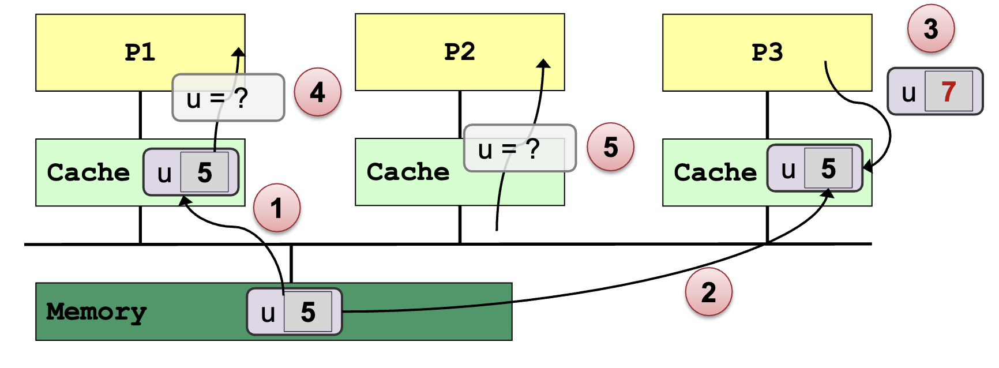
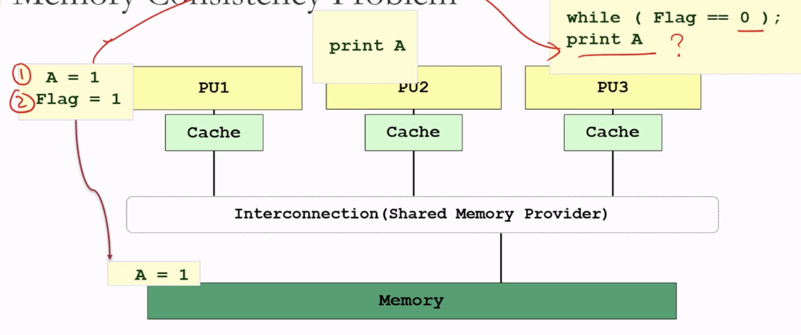
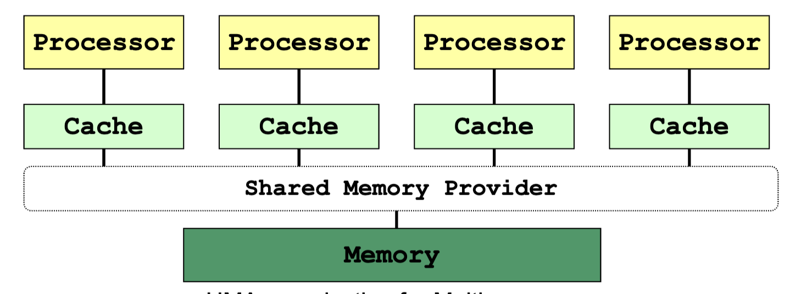
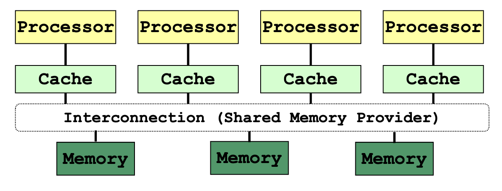
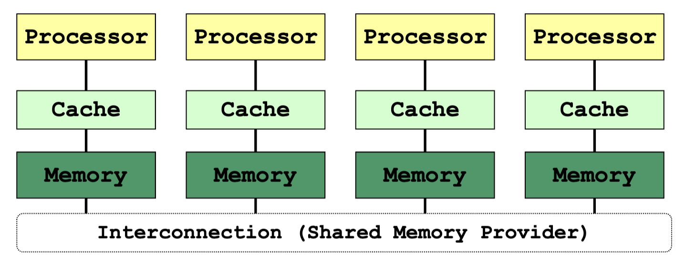
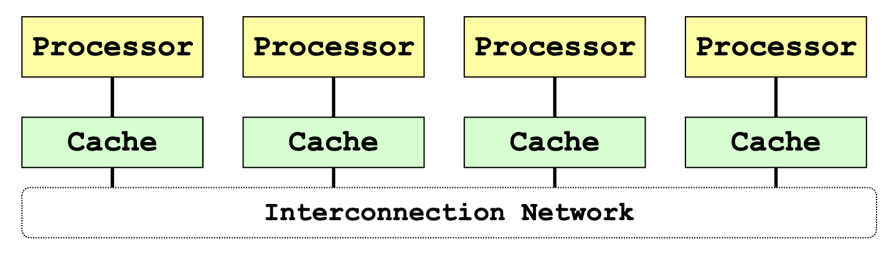

## **Source of Processor Performance Gain**

### Bit Level Parallelism

**Word size** may mean: (16/32/64 bits)

- Unit of transfer between processor memory
- Memory address space capacity
- Integer size
- Single precision floating point number size

### Instruction Level Parallelism

**Pipelining:**

- Split instruction execution in multiple stages, e.g. Fetch (IF), Decode (ID), Execute (EX), Write-Back (WB)
- Allow multiple instructions to occupy different stages in the same clock cycle
  - Provided there is no data / control dependencies
- Number of pipeline stages == Maximum achievable speedup
- **Disadvantages**: Independence, Bubbles, Hazards: data and control flow

**Superscalar:** Duplicate the pipelines:

- Allow multiple instructions to pass through the same stage
- Scheduling is challenging (decide which instructions can be executed together):
  - Dynamic (Hardware decision)
  - Static (Compiler decision)
- Disadvantages: structural hazard, data/control dependencies

import { Image } from "astro:assets";
import pipelined from "./l3-parallel-computing-architectures/untitled.png";
import superscalar from "./l3-parallel-computing-architectures/untitled-1.png";

<figure class="mx-auto w-[480px]">
  <Image src={pipelined} alt="Pipelined" />
  <figcaption class="text-center text-sm !mt-0">Pipelined</figcaption>
</figure>

<figure class="mx-auto w-[480px]">
  <Image src={superscalar} alt="Superscalar" />
  <figcaption class="text-center text-sm !mt-0">Superscalar</figcaption>
</figure>

Pipelined vs Superscalar Processor:

import pipelinedProcessor from "./l3-parallel-computing-architectures/untitled-2.png";
import superscalarProcessor from "./l3-parallel-computing-architectures/untitled-3.png";

  <figure class="basis-32">
    <Image src={pipelinedProcessor} alt="Pipelined" />
    <figcaption class="text-center text-sm !mt-0">Pipelined</figcaption>
  </figure>
  <figure class="basis-96 !mt-0">
    <Image src={superscalarProcessor} alt="Superscalar" />
    <figcaption class="text-center text-sm !mt-0">Superscalar</figcaption>
  </figure>

### Thread Level Parallelism

import threadLevelParallelism from "./l3-parallel-computing-architectures/untitled-4.png";

<figure class="mx-auto w-[480px]">
  <Image src={threadLevelParallelism} alt="Thread Level Parallelism" />
  <figcaption class="text-center text-sm !mt-0">
    Thread Level Parallelism Hierarchy
  </figcaption>
</figure>

- Processor can provide hardware support for multiple "thread contexts“: simultaneous multithreading (SMT)
  - Information specific to each thread, e.g. Program Counter, Registers, etc
  - Software threads can then execute in parallel
- E.g: Intel processors with hyper-threading technology, e.g. each i7 core can execute 2 threads at the same time

### **Processor Level Parallelism (Multiprocessing)**

- Add more cores to the processor
- The application should have multiple execution flows
  - Each process/thread needs an independent context that can be mapped to multiple processor cores

## **Flynn's Parallel Architecture Taxonomy**

Instruction stream: A single execution flow i.e. a single Program Counter (PC)

Data stream: Data being manipulated by the instruction stream

### Single Instruction Single Data (SISD)

import sisd from "./l3-parallel-computing-architectures/untitled-5.png";

<figure class="mx-auto w-[320px]">
  <Image src={sisd} alt="SISD" />
  <figcaption class="text-center text-sm !mt-0">SISD</figcaption>
</figure>

- A single instruction stream is executed
- Each instruction work on single data
- Most of the uniprocessors fall into this category

### Single Instruction Multiple Data (SIMD)

import simd from "./l3-parallel-computing-architectures/untitled-6.png";

<figure class="mx-auto w-[320px]">
  <Image src={simd} alt="SIMD" />
  <figcaption class="text-center text-sm !mt-0">SIMD</figcaption>
</figure>

- A single stream of instructions
- Each instruction works on multiple data
- Exploit data parallelism, commonly known as vector processor
- Same instruction broadcasted to all ALUs
- Not great for divergent executions

### Multiple Instruction Single Data (MISD)

import misd from "./l3-parallel-computing-architectures/untitled-7.png";

<figure class="mx-auto w-[320px]">
  <Image src={misd} alt="MISD" />
  <figcaption class="text-center text-sm !mt-0">MISD</figcaption>
</figure>

- Multiple instruction streams
- All instruction work on the same data at any time
- No actual implementation except for the systolic array

### Multiple Instruction Multiple Data (MIMD)

import mimd from "./l3-parallel-computing-architectures/untitled-8.png";

<figure class="mx-auto w-[320px]">
  <Image src={mimd} alt="MIMD" />
  <figcaption class="text-center text-sm !mt-0">MIMD</figcaption>
</figure>

- Each PU fetch its own instruction
- Each PU operates on its data
- Currently the most popular model for multiprocessor

## Multicore Architecture

### Hierarchical Design

import hierarchicalDesign from "./l3-parallel-computing-architectures/untitled-9.png";

<figure class="mx-auto w-[320px]">
  <Image src={hierarchicalDesign} alt="Hierarchical Design" />
  <figcaption class="text-center text-sm !mt-0">Hierarchical Design</figcaption>
</figure>

- Multiple cores share multiple caches
- Cache size increases from the leaves to the root
- Each core can have a separate L1 cache and shares the L2 cache with other cores
- All cores share the common external memory
- Usages: Standard desktop, Server processors, Graphics processing units

### Pipelined Design

import pipelinedDesign from "./l3-parallel-computing-architectures/untitled-10.png";

<figure class="mx-auto w-[320px]">
  <Image src={pipelinedDesign} alt="Pipelined Design" />
  <figcaption class="text-center text-sm !mt-0">Pipelined Design</figcaption>
</figure>

- Data elements are processed by multiple execution cores in a pipelined way
- Useful if same computation steps have to be applied to a long sequence of data elements
- E.g. processors used in routers and graphics processors

### Network-based Design

import networkBasedDesign1 from "./l3-parallel-computing-architectures/untitled-11.png";
import networkBasedDesign2 from "./l3-parallel-computing-architectures/untitled-12.png";

  <figure class="basis-72">
    <Image src={networkBasedDesign1} alt="Network-based Design 1" />
  </figure>
  <figure class="basis-72 !mt-0">
    <Image src={networkBasedDesign2} alt="Network-based Design 2" />
  </figure>

- Cores and their local caches and memories are connected via an interconnection network

## Memory Organization

import memoryOrganization from "./l3-parallel-computing-architectures/untitled-13.png";

<figure class="mx-auto w-[480px]">
  <Image src={memoryOrganization} alt="Memory Organization" />
  <figcaption class="text-center text-sm !mt-0">Memory Organization</figcaption>
</figure>

### Distributed Memory System

import distributedMemorySystem from "./l3-parallel-computing-architectures/untitled-14.png";

<figure class="mx-auto w-[480px]">
  <Image src={distributedMemorySystem} alt="Distributed Memory System" />
  <figcaption class="text-center text-sm !mt-0">
    Distributed Memory System
  </figcaption>
</figure>

- Each node is an independent unit
  - With processor, memory and, sometimes, peripheral elements
- Physically distributed memory module
  - Memory in a node is private

### Shared Memory System

import sharedMemorySystem from "./l3-parallel-computing-architectures/untitled-15.png";
import intelCoreI7 from "./l3-parallel-computing-architectures/untitled-16.png";

  <figure class="basis-80">
    <Image src={sharedMemorySystem} alt="Shared Memory System" />
    <figcaption class="text-center text-sm !mt-0">
      Shared Memory System
    </figcaption>
  </figure>
  <figure class="basis-64 !mt-0">
    <Image src={intelCoreI7} alt="Intel Core i7 (quad core)" />
    <figcaption class="text-center text-sm !mt-0">
      Intel Core i7 (quad core) (interconnect is a ring)
    </figcaption>
  </figure>

- Parallel programs / threads access memory through the shared memory provider
- Program is unaware of the actual hardware memory architecture
  - Cache coherence and memory consistency

**Cache Coherence:**

- Multiple copies of the same data exist on different caches
- Local update by processor → Other processors should not see the unchanged data

**Memory Consistency:**

**Uniform Memory Access (Time) (UMA):**

- Latency of accessing the main memory is the same for every processor
- Suitable for small number of processors – due to **contention**

**Non-Uniform Memory Access (NUMA):**

import modernMultiSocketConfig from "./l3-parallel-computing-architectures/untitled-21.png";

<figure class="mx-auto w-[360px]">
  <Image src={modernMultiSocketConfig} alt="Modern multi-socket config" />
  <figcaption class="text-center text-sm !mt-0">
    Modern multi-socket config
  </figcaption>
</figure>

- Physically distributed memory of all processing elements are combined to form a global shared-memory address space
  - also called distributed shared-memory
- Accessing local memory is faster than remote memory for a processor

**ccNUMA:**

- Cache Coherent Non-Uniform Memory Access
  - Each node has cache memory to reduce contention

**COMA:**

- Cache Only Memory Architecture
  - Each memory block works as cache memory
  - Data migrates dynamically and continuously according to the cache coherence scheme

Advantages:

- No need to partition code or data
- No need to physically move data among processors → communication is efficient

Disadvantages:

- Special synchronization constructs are required
- Lack of scalability due to contention

### **Hybrid (Distributed-Shared Memory)**

import hybridArchitecture from "./l3-parallel-computing-architectures/untitled-24.png";
import hybridWithGPU from "./l3-parallel-computing-architectures/untitled-25.png";

  <figure class="basis-96">
    <Image
      src={hybridArchitecture}
      alt="Hybrid with Shared-memory Multicore Processors"
    />
    <figcaption class="text-center text-sm !mt-0">
      Hybrid with Shared-memory Multicore Processors
    </figcaption>
  </figure>
  <figure class="basis-96 !mt-0">
    <Image
      src={hybridWithGPU}
      alt="Hybrid with Shared-memory Multicore Processor and GPU"
    />
    <figcaption class="text-center text-sm !mt-0">
      Hybrid with Shared-memory Multicore Processor and GPU
    </figcaption>
  </figure>

