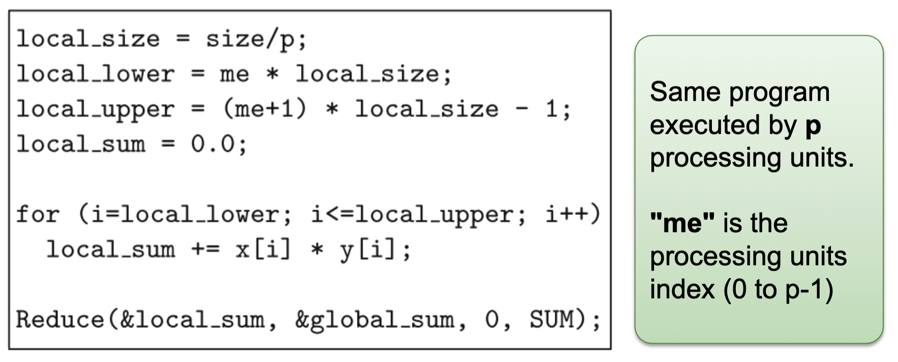
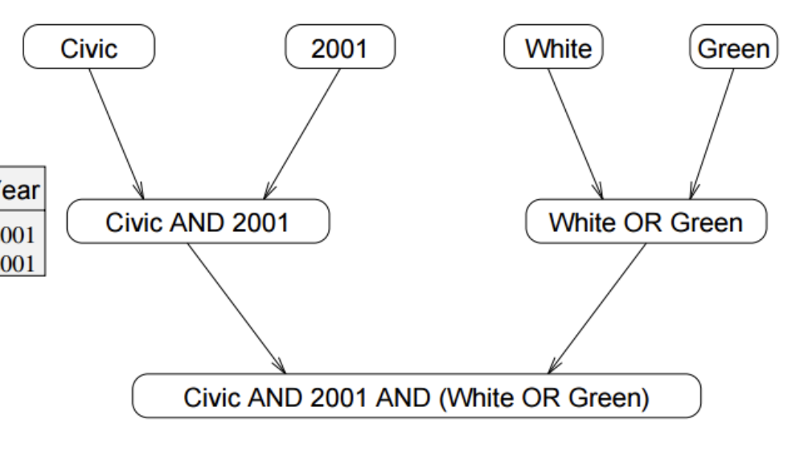
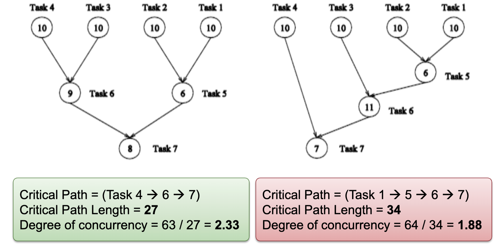
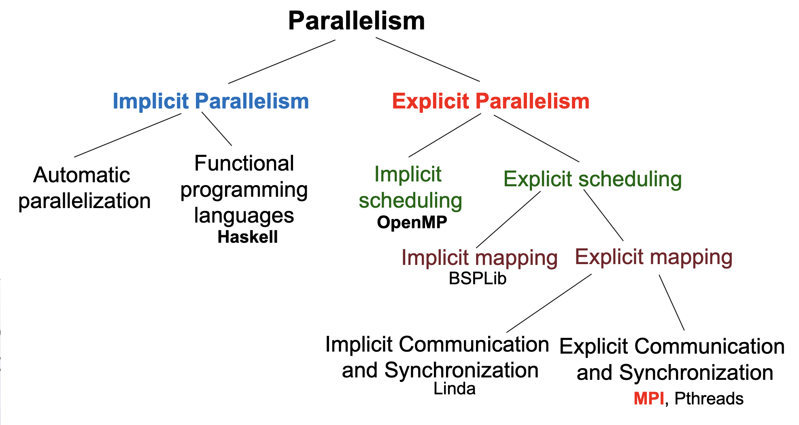

## Parallelism

- Average number of units of work that can be performed in parallel per unit time
  - Example: MIPS, MFLOPS, average number of threads (processes) per second
- Limits in exploiting parallelism
  - Program dependencies – data dependencies, control dependencies
  - Runtime – memory contention, communication overheads, thread/process overhead, synchronization (coordination)

:::note
💡 Work = tasks + dependencies

:::

### Data Parallelism

- Same operation is applied to different elements of a data set
  - If operations are independent, elements can be distributed among cores for parallel execution data parallelism
- SIMD computers / instructions are designed to exploit data parallelism
- Many algorithms perform computations by iteratively traversing a large data structure
  - Commonly expressed as a loop
- If the iterations are independent, iterations can be executed in arbitrary order and in parallel on different cores

```cpp
// Parallelize the matrix multiplication (result = a x b)
// Each thread will work on one iteration of the outer-most loop
// Variables are shared among threads (a, b, result)
// and each thread has its own private copy (i, j, k)

#pragma omp parallel for num_threads(8) shared(a, b, result) private (i, j, k)
for (i = 0; i < size; i++)
  for (j = 0; j < size; j++)
    for (k = 0; k < size; k++)
      result.element[i][j] += a.element[i][k] * b.element[k][j];
```

Data Parallelism on MIMD:

- Common model: SPMD
- One parallel program is executed by all cores in parallel (both shared and distributed address space)



E.g: Scalar product of $\vec\{x} \cdot \vec\{y}$ on p processing units



Query `Model = "civic" AND Year = "2001" AND (Color = "green" OR Color = "white")`

Task (Functional) Parallelism:

- Independent program parts (tasks) can be executed in parallel
- **Tasks**: single statement, series of statements, loops or function calls
- Further decomposition: A single task can be executed sequentially by one processing units, or in parallel by multiple processing units

Task Dependence Graph:

- Can be used to visualize and evaluate the task decomposition strategy
- A directed acyclic graph:
  - **Node**: Represent each task, node value is the expected execution time
  - **Edge**: Represent control dependency between task
- Properties:
  - Critical path length: Maximum completion time
  - Degree of concurrency = Total Work / Critical Path Length
    - An indication of amount of work that can be done concurrently





:::note
💡 Programming environments expose different amount of parallelism to coder

:::

## Models of Coordination

### Shared Address Space

- Communication abstraction
  - Tasks communicate by reading/writing from/to shared variables
  - Ensure mutual exclusion via use of locks
  - Logical extension of uniprocessor programming
- Requires hardware support to implement efficiently
  - Any processor can load and store from any address – contention
  - Even with NUMA, costly to scale
- Matches shared memory systems – UMA, NUMA, etc

### Data Parallel

- Historically: same operation on each element of an array → SIMD, vector processors
- Basic structure: map a function onto a large collection of data
  - Functional: side-effect-free execution
  - No communication among distinct function invocations → Allows invocations to be scheduled in parallel
  - Stream programming model
- Modern performance-oriented data-parallel languages do not enforce this SIMD structure anymore (SPMD instead).
  - E.g: CUDA, OpenCL, ISPC

### Message Passing

- Tasks operate within their own private address spaces and communicate by explicitly sending/receiving messages
- Popular software library: MPI (message passing interface)
- Hardware does not implement system-wide loads and stores
  - Can connect commodity systems together to form large parallel machine
- Matches distributed memory systems → Programming model for clusters, supercomputers, etc.

:::note
💡 Any type of coordination can be implemented in any hardware

:::

- It is common to implement message-passing abstractions on shared memory machines (hardware)
  - “Sending message” means copying data into message library buffers
  - “Receiving message” means copying data from message library buffers
- It is possible to implement shared address space abstraction on machines that do not support it in hardware
  - Less efficient software solutions
  - Modify a shared variable: send messages to invalidate all (mem) pages containing the shared variable
  - Reading a shared variable: page-fault handler issues appropriate network requests (messages)

Shared address space:

- very little structure
- All threads can read and write to all shared variables
- Drawback: not all reads and writes have the same cost (and that cost is not apparent in program text)

Data-parallel:

- very rigid computation structure
- Programs perform the same function on different data elements in a collection

Message passing:

- highly structured communication
- All communication occurs in the form of messages

## Program Parallelization

### Foster’s Design Methodology

#### 1. Partitioning

- Divide computation and data into independent pieces to discover maximum parallelism
  - Different way of thinking about problems – reveals structure in a problem, and hence opportunities for optimization

Data Centric: Domain decomposition → Data Parallelism

- Divide data into pieces of approximately equal size
- Determine how to associate computations with the data

Computation Centric: Functional decomposition → Task Parallelism

- Divide computation into pieces (tasks)
- Determine how to associate data with the computations

Partitioning Rules of Thumb:

- At least 10x more primitive tasks than cores in target computer
- Minimize redundant computations and redundant data storage
- Primitive tasks are roughly of the same size
- Number of tasks ia an increasing function of problem size

#### 2. Communication (Coordination)

- Tasks are intended to execute in parallel, but generally not executing independently

  → Need to determine data passed among tasks

Local communication:

- Task needs data from a small number of other tasks (“neighbors”)
- Create channels illustrating data flow

Global communication:

- Significant number of tasks contribute data to perform a computation
- Don’t create channels for them early in design

:::note
💡 Ideally, distribute and overlap computation and communication

:::

Communication Rules of Thumb:

- Communication operations balanced among tasks
- Each task communicates with only a small group of neighbors
- Tasks can perform communication in parallel
- Overlap computation with communication

#### 3. Agglomeration

- Combine tasks into larger tasks → Number of tasks >= number of cores
- Goals:
  - Improve performance (cost of task creation + communication)
  - Maintain scalability of program
  - Simplify programming
- Motivation: Eliminate communication between primitive tasks agglomerated into consolidated task

Agglomeration Rules of Thumb:

- Locality of parallel algorithm has increased
- Number of tasks increases with problem size
- Number of tasks suitable for likely target systems
- Tradeoff between agglomeration and code modifications costs is reasonable

#### 4. Mapping

- Assignment of tasks to execution units
- Conflicting goals:
  - Maximize processor utilization – place tasks on different processing units to increase parallelism
  - Minimize inter-processor communication – place tasks that communicate frequently on the same processing units to increase locality
- Mapping may be performed by:
  - OS for centralized multiprocessor
  - User for distributed memory systems

Mapping Rules of Thumb:

- Finding optimal mapping is NP hard in general → Must rely on heuristic
- Consider designs based on one task per core and multiple tasks per core
- Evaluate static and dynamic task allocation
  - If dynamic task allocation is chosen, the task allocator should not be a bottleneck to performance
  - If static task allocation is chosen, the ratio of tasks to cores is at least 10:1

### Automatic Parallelization

Parallelizing compilers perform decomposition and scheduling

Drawbacks:

- Dependence analysis is difficult for pointer based computations or indirect addressing
- Execution time of function calls or loops with unknown bounds is difficult to predict at compile time

### Functional Programming Languages

Describe the computations of a program as the evaluation of mathematical functions without side effects

Advantages: New language constructs are not necessary to enable a parallel execution

Challenge: Extract the parallelism at the right level of recursion

## Parallel Programming Pattern

### Fork-Join

Task T creates child tasks

- Children run in parallel, but they are independent of each other
- The children can execute the same or a different program part, or function
- Children might join the parent at different times

Implementation: Processes, threads, and any paradigm that makes use of these concepts

### Parbegin–Parend

Programmer specifies a sequence of statements (function calls) to be executed by a set of cores in parallel

- When an executing thread reaches a parbegin-parend construct, a set of threads is created and the statements of the construct are assigned to these threads for execution
- Usually, the threads execute the same code (function)

The statements following the parbegin-parend construct are only executed after all these threads have finished their work
Like a fork-join pattern, where all forks are done at the same time, and all joins are done at the same time

Implementation: A language construct such as OpenMP or compiler directives

### SIMD

Single instructions are executed synchronously by the different threads on different data

Similar to parbegin-parend, all threads execute the same instruction at the same time

Implementation: AVX/SSE Instruction on Intel processor

### SPMD

Same program executed on different cores but operate on different data

- Different threads may execute different parts of the parallel program because of
  - Different speeds of the executing cores
  - Control statement in the program, e.g., If statement
- Similar to parbegin-parend, but SPMD is the preferred name when we do not follow the pattern

No implicit synchronization

- Synchronization can be achieved by explicit synchronization operations

Implementation: Programs running on GPGPU

### Master–Worker

A single program (master) controls the execution of the program

- Master executes the main function
- Assigns work to worker threads

**Master task:** Generally responsible for coordination and perform initializations, timings, and output operations
**Worker task:** Wait for instruction from master task

### Task (Work) Pools

A common data structure from which threads can access to retrieve tasks for execution

Number of threads is fixed

- Threads are created statically by the main thread
- Once a task is finished, the worker thread retrieves another task from the pool
- Work is not pre-allocated to the worker threads; instead, a new task is retrieved from the pool by the worker thread

During the processing of a task, a thread can generate new tasks and insert them into the task pool

Access to the task pool must be synchronized to avoid race conditions

Execution of a parallel program is completed when

- Task pool is empty
- Each thread has terminated the processing of its last task

Advantages:

- Useful for adaptive and irregular applications
- Tasks can be generated dynamically
- Overhead for thread creation is independent of the problem size and the number of tasks

Disadvantages:

- For fine grained tasks, the overhead of retrieval and insertion of tasks becomes important

### Producer–Consumer

Producer threads produce data which are used as input by consumer threads

Synchronization has to be used to ensure correct coordination between producer and consumer threads

### Pipelining

Data in the application is partitioned into a stream of data elements that flows through the pipeline stages one after the other to perform different processing steps

A form of functional parallelism: **Stream parallelism**
