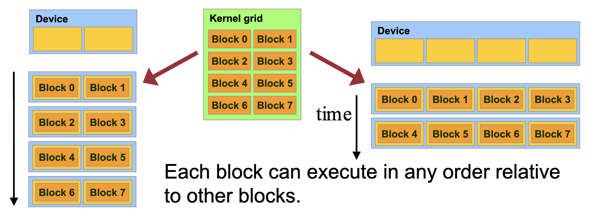
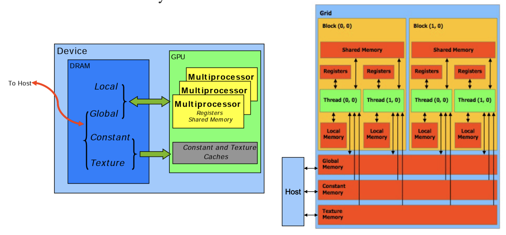
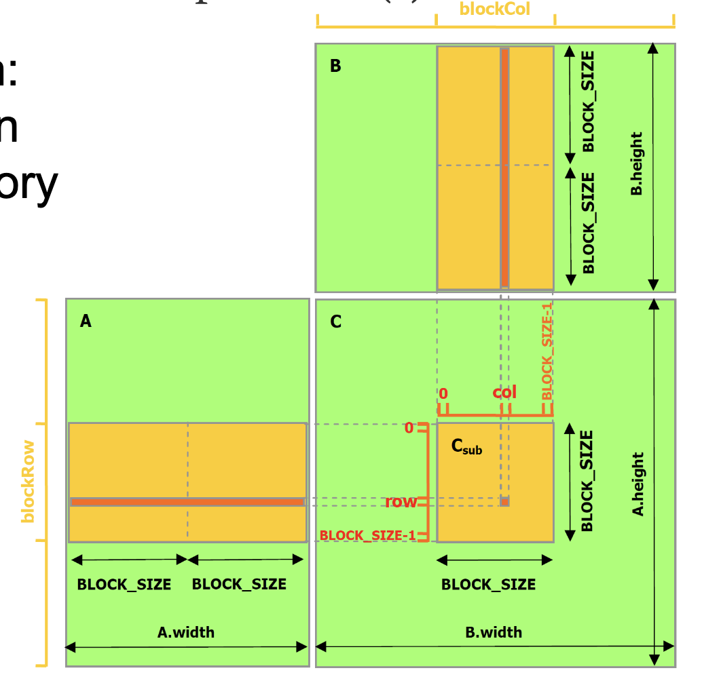

## GPU Architecture

Multiple Streaming Processors (SMs), which have

- Memory and Cache
- Connecting interface (usually PCI Express) with the host (CPU)

SM consists of multiple compute cores, which have

- Memory (registers, L1 cache, shared memory)
- Logic for threads and instruction management

import { Image } from "astro:assets";
import GPUArchitecture from "./l6-gpgpu-programming/untitled.png";

<figure class="mx-auto w-[520px]">
  <Image src={GPUArchitecture} alt="GPU architecture" />
  <figcaption class="text-center text-sm !mt-0">GPU architecture</figcaption>
</figure>

import SMArchitecture from "./l6-gpgpu-programming/untitled-1.png";
import turingSMArchitecture from "./l6-gpgpu-programming/untitled-2.png";

<div class="flex flex-wrap justify-center gap-4">
  <figure class="basis-72">
    <Image src={SMArchitecture} alt="SM Architecture" />
    <figcaption class="text-center text-sm !mt-0">SM Architecture</figcaption>
  </figure>
  <figure class="basis-72 !mt-0">
    <Image src={turingSMArchitecture} alt="Turing SM Architecture" />
    <figcaption class="text-center text-sm !mt-0">
      Turing SM Architecture
    </figcaption>
  </figure>
</div>

### Compute Capability

Tesla (1.x), Fermi (2.x), Kepler (3.x), Maxwell (5.x), Pascal (6.x), Volta (7.0, 7.2), Turing (7.5), Ampere (8.0, 8.6)

On the SoC Compute Cluster:

- xgpd\[0-9] – 2xTitan V (CC 7.0)
- xgpe\[0-11] – Titan RTX(CC 7.5)
- xgpf\[0-10] – Tesla T4 (CC 7.5)
- xgpg\[0-9], xgph\[0-19] – Tesla A100 (CC 8.0)

## CUDA Programming Model

“Compute Unified Device Architecture”

import cudaProgrammingModel from "./l6-gpgpu-programming/untitled-3.png";

<figure class="mx-auto w-[420px]">
  <Image src={cudaProgrammingModel} alt="CUDA programming model" />
  <figcaption class="text-center text-sm !mt-0">
    CUDA programming model
  </figcaption>
</figure>

**CUDA C Runtime:**

- Minimal set of extensions to the C language
- Kernels defined as C functions embedded in application source code
- Requires a runtime API (built on top of CUDA driver API)

**CUDA driver API:**

- Low-level C API to load compiled kernels, inspect their parameters, and to launch them
- Kernels are written in C and compiled to CUDA binary or assembly code
- Requires more code, harder to program and debug
- Much like using the OpenGL API on GLSL shaders

**Compilation and Linking:**

import compilationAndLinking from "./l6-gpgpu-programming/untitled-4.png";

<figure class="mx-auto w-[240px]">
  <Image src={compilationAndLinking} alt="Compilation and linking" />
  <figcaption class="text-center text-sm !mt-0">
    Compilation and linking
  </figcaption>
</figure>

- Compiler: NVCC
- NVCC outputs
  - C code (host CPU code) → Must then be using another tool
  - PTX → Object code or PTX source interpreted at runtime
- Linking with two static/dynamic libraries
  - CUDA runtime library (cudart)
  - CUDA core library (cuda)

### CUDA Kernels and Threads:

Device = GPU, Host = CPU, Kernel = function that runs on the device

Parallel portions execute on device as kernels

- One or multiple kernels are executed at a time
- Multiple kernels are allowed in newer CUDA hardware

CUDA threads are extremely lightweight

- Very little creation overhead
- Instant switching

CUDA uses thousands of threads to achieve efficiency

Array of 32 parallel threads (a warp) executing in lockstep all at once (SPMD):



Thread blocks:

- In a block: shared memory, atomic operation, barrier synchronization
- Threads in different block cannot cooperate
- Hardware is free to schedule thread blocks to any processor at any time
  - A kernel scales across any number of parallel multiprocessors

import threadHierarchy from "./l6-gpgpu-programming/untitled-6.png";

<figure class="mx-auto w-[320px]">
  <Image src={threadHierarchy} alt="CUDA thread hierarchy" />
  <figcaption class="text-center text-sm !mt-0">
    CUDA thread hierarchy
  </figcaption>
</figure>

CUDA Thread Hierarchy:

- A kernel is executed by a grid of thread blocks. Blocks:
  - Share data through shared memory
  - Synchronize their execution
- Threads from different blocks cannot cooperate

Block IDs and Thread IDs

- Each thread uses IDs to decide what data to work on
  - Block ID: 1D, 2D, or 3D
  - Thread ID: 1D, 2D, or 3D

### Execution Model Mapping to Architecture:

Kernels are launched in **grids**: 1 or multiple kernels execute at a time

A block executes on one SM: Does **not migrate**, GPUs usually have **multiple SMs**

Several blocks can reside concurrently on one SM

- Control limitations (depending on capability)
- Number is further limited by SM resources
  - Register file is partitioned among all resident threads
  - Shared memory is partitioned among all resident thread blocks

SIMT (single-instruction, multiple-thread) execution model

Multiprocessor creates, manages, schedules and execute threads in SIMT warps (group of 32 parallel threads)

Threads in a warp start together at the same program address. Threads have individual instruction program counter and register state

A block is always split into warps the same way. Each warp contains threads of consecutive, increasing thread IDs.
Warp executes one common instruction at a time

### CUDA Memory Model:



- Data must be explicitly transferred from CPU to device
- Global Memory and Shared Memory →Most important, commonly used
  - Global memory is cached
  - Shared memory is not cached, it’s the cache itself
  - L1-cache is partitioned in shared memory
- Local, Constant, and Texture Memory for convenience / performance
  - Local: automatic array variables allocated there by compiler → Cached
  - Constant: useful for uniformly-accessed read-only data → Cached
  - Texture: useful for spatially coherent random-access read-only data → Cached
    - Provides filtering, address clamping and wrapping

**Coalesced Access to Global Memory:**

- Simultaneous accesses to global memory by threads in a warp are coalesced into a number of transactions equal to the number of 32-byte transactions necessary to service all of the threads of the warp (compute capability 6.0 and above)
- The k-th thread accesses the k-th word in a 32-byte aligned array. Not all threads need to participate

import coalescedAccess from "./l6-gpgpu-programming/untitled-8.png";

<figure class="mx-auto w-[520px]">
  <Image src={coalescedAccess} alt="Coalesced access" />
  <figcaption class="text-center text-sm !mt-0">Coalesced access</figcaption>
</figure>

import misalignedAccess from "./l6-gpgpu-programming/untitled-9.png";

<figure class="mx-auto w-[520px]">
  <Image src={misalignedAccess} alt="Misaligned access" />
  <figcaption class="text-center text-sm !mt-0">Misaligned access</figcaption>
</figure>

**Shared Memory:**

Higher bandwidth and lower latency than local or global memory

Divided into equally-sized memory modules, called banks. Addresses from different banks can be accessed simultaneously

Bank conflict: two addresses of a memory request fall in the same memory bank

- Memory access has to be serialized
- Each bank has a bandwidth of 32 bits every clock cycle, and successive 32-bit words are assigned to successive banks
  - The warp size is 32 threads and the number of banks is also 32

import noBankConflict from "./l6-gpgpu-programming/untitled-10.png";
import bankConflicts from "./l6-gpgpu-programming/untitled-11.png";
import noConflictBroadcasted from "./l6-gpgpu-programming/untitled-12.png";

<div class="flex flex-wrap justify-center gap-4">
  <figure class="basis-52">
    <Image src={noBankConflict} alt="No bank conflict → access in parallel" />
    <figcaption class="text-center text-sm !mt-0">
      No bank conflict → access in parallel
    </figcaption>
  </figure>
  <figure class="basis-52">
    <Image src={bankConflicts} alt="Bank conflicts" />
    <figcaption class="text-center text-sm !mt-0">Bank conflicts</figcaption>
  </figure>
  <figure class="basis-24">
    <Image src={noConflictBroadcasted} alt="No conflict (broadcasted)" />
    <figcaption class="text-center text-sm !mt-0">
      No conflict (broadcasted)
    </figcaption>
  </figure>
</div>

**Strided Access:**

import stridedAccess from "./l6-gpgpu-programming/untitled-13.png";

<figure class="mx-auto w-[420px]">
  <Image src={stridedAccess} alt="Strided access" />
  <figcaption class="text-center text-sm !mt-0">Strided access</figcaption>
</figure>

- Threads within a warp access words in memory with a stride of 2
- A stride of 2 results in a 50% of load/store efficiency
  - half the elements in the transaction are not used and represent wasted bandwidth

## Programming in CUDA

Device Code: C functions with some restrictions

- Can only access GPU memory
- No variable number of arguments (“varargs”)
- No static variable
- No recursion (\*)

Function Type: Function qualifiers

- `__host__`
- `__device__`
- `__global__`
  - Function is a kernel
  - Must have void return type
  - A call to function must specify execution configuration
  - Function parameters are passed via shared memory (\*)
- `__host__` and `__device__` can be used together

**Launching Kernels:**

- Modified C function call syntax

```cpp
kernel<<<dim3 grid, dim3 block, int smem, int stream>>>(...)
```

- Execution Configuration (`<<< >>>`)
  - grid dimensions: x and y
  - thread-block dimensions: x, y, and z
  - shared memory: number of bytes per block for extern smem variables declared without size → optional, 0 by default
  - stream ID → optional, 0 by default

**CUDA Built-In Device Variables:** All `__global__` and `__device__` functions have access to these automatically defined variables

- `dim3 gridDim`: Dimensions of the grid in blocks (gridDim.z unused)
- `dim3 blockDim`: Dimensions of the block in threads
- `dim3 blockIdx`: Block index within the grid
- `dim3 threadIdx`: Thread index within the block

**Variable Qualifiers (Device code):**

- `__device__`
  - Stored in global memory (large, high latency, no cache)
  - Read/write by all threads within grid
  - Written by CPU via `cudaMemcpyToSymbol()`
  - Lifetime: application
- `__constant__`
  - Same as **device**, but cached and read-only by all threads within grid
  - Written by CPU via `cudaMemcpyToSymbol()`
  - Lifetime: application
- `__shared__`
  - Stored in on-chip shared memory (very low latency)
  - Read/write by all threads in the same thread block
  - Lifetime: block
- Unqualified variables (in device code)
  - Scalars and built-in vector types are stored in registers
  - Arrays of more than 4 elements or run-time indices stored in local memory
  - Read/write by thread only
  - Lifetime: thread

### GPU Memory Allocation / Release / Copy

**GPU memory allocation / release:**

- `cudaMalloc(void **pointer, size_t nbytes);`
- `cudaMemset(void *pointer, int value, size_t count);`
- `cudaFree(void* pointer);`

**Data copy:**

- `cudaMemcpy(void *dst, void *src, size_t nbytes, enum cudaMemcpyKind direction);`
  - `enum cudaMemcpyKind` can be `cudaMemcpyHostToDevice`, `cudaMemcpyDeviceToHost`, `cudaMemcpyDeviceToDevice`
- Unified memory model does not need data transfer: `__managed__`
  - Page-locked host memory

### Thread Synchronization Function

`void __syncthreads();`

- Synchronizes all threads in a block
- Generates barrier synchronization instruction
- Used to avoid RAW / WAR / WAW hazards when accessing shared memory

## CUDA Examples

### Add 2 arrays

```cpp title="add.cu"
// Device code
__global__ void VecAdd( float *A, float *B, float *C )
{
	int i = blockIdx.x * blockDim.x + threadIdx.x;
	if ( i < N ) C[i] = A[i] + B[i];
}

// Host code
int main()
{
	// Allocate vectors in device memory
	size_t size = N * sizeof(float);
	float *d_A;
	cudaMalloc( (void**)&d_A, size );
	float *d_B;
	cudaMalloc( (void**)&d_B, size );
	float *d_C;
	cudaMalloc( (void**)&d_C, size );

	// Copy vectors from host memory to device memory
	// h_A and h_B are input vectors stored in host memory
	cudaMemcpy( d_A, h_A, size, cudaMemcpyHostToDevice );
	cudaMemcpy( d_B, h_B, size, cudaMemcpyHostToDevice );

	// Invoke kernel
	int threadsPerBlock = 256;
	int blocksPerGrid = (N + threadsPerBlock – 1) /
	threadsPerBlock;
	VecAdd<<<blocksPerGrid, threadsPerBlock>>>(d_A, d_B, d_C);

	// Copy result from device memory to host memory
	// h_C contains the result in host memory
	cudaMemcpy( h_C, d_C, size, cudaMemcpyDeviceToHost );

	// Free device memory
	cudaFree(d_A); cudaFree(d_B); cudaFree(d_C);
}
```

### Matrix Multiplication

Matrix multiplication in global memory:

```cpp title="matrixMul.cu"
// Matrices are stored in row-major order:
// M(row, col) = *(M.elements + row * M.width + col)
typedef struct {
	int width;
	int height;
	float* elements;
} Matrix;

// Thread block size
#define BLOCK_SIZE 16

// Forward declaration of the matrix multiplication kernel
__global__ void MatMulKernel(const Matrix, const Matrix, Matrix);

// Matrix multiplication - Host code
// Matrix dimensions are assumed to be multiples of BLOCK_SIZE
void MatMul(const Matrix A, const Matrix B, Matrix C)
{
	// Load A and B to device memory
	Matrix d_A;
	d_A.width = A.width; d_A.height = A.height;
	size_t size = A.width * A.height * sizeof(float);
	cudaMalloc((void**)&d_A.elements, size);
	cudaMemcpy(d_A.elements, A.elements, size, cudaMemcpyHostToDevice);
	Matrix d_B;
	d_B.width = B.width; d_B.height = B.height;
	size = B.width * B.height * sizeof(float);
	cudaMalloc((void**)&d_B.elements, size);
	cudaMemcpy(d_B.elements, B.elements, size, cudaMemcpyHostToDevice);

	// Allocate C in device memory
	Matrix d_C;
	d_C.width = C.width; d_C.height = C.height;
	size = C.width * C.height * sizeof(float);
	cudaMalloc((void**)&d_C.elements, size);

	// Invoke kernel
	dim3 dimBlock(BLOCK_SIZE, BLOCK_SIZE);
	dim3 dimGrid(B.width / dimBlock.x, A.height / dimBlock.y);
	MatMulKernel<<<dimGrid, dimBlock>>>(d_A, d_B, d_C);

	// Read C from device memory
	cudaMemcpy(C.elements, d_C.elements, size, cudaMemcpyDeviceToHost);
	// Free device memory
	cudaFree(d_A.elements); cudaFree(d_B.elements); cudaFree(d_C.elements);
}

// Matrix multiplication kernel called by MatMul()
__global__ void MatMulKernel(Matrix A, Matrix B, Matrix C)
{
	// Each thread computes one element of C
	// by accumulating results into Cvalue
	float Cvalue = 0;
	int row = blockIdx.y * blockDim.y + threadIdx.y;
	int col = blockIdx.x * blockDim.x + threadIdx.x;
	for (int e = 0; e < A.width; ++e)
	Cvalue += A.elements[row * A.width + e]
	* B.elements[e * B.width + col];
	C.elements[row * C.width + col] = Cvalue;
}
```

**Block multiplication:** matrix multiplication using shared memory



## Optimizing CUDA Programs

### Optimization Strategies

1. Optimizing **memory usage** to achieve maximum memory bandwidth
   - Different memory spaces and access patterns have vastly different performance
2. Maximizing **parallel execution**
   - Restructure algorithm to expose as much data parallelism as possible
   - Map to hardware to increase occupancy (hardware utilization)
3. Optimizing **instruction usage** to achieve maximum instruction throughput
   - Use high throughput arithmetic instructions
   - Avoid different execution paths within same warp

### Memory Optimizations

1. Minimize **data transfer** between host and device
2. Ensure global memory accesses are **coalesced** whenever possible
3. Minimize global memory accesses by using **shared memory**
4. Minimize **bank conflicts** in shared memory accesses

Data Transfer between Host and Device:

- Peak bandwidth between device memory and GPU is much higher than that between host memory and device memory
- Should minimize data transfer between host and device memory
  - Even if that means running kernels on GPU that do not have any speed-up over CPU
  - Batching many small transfers into one larger transfer performs significantly better than making each transfer separately
- Use page-locked (or pinned) memory transfer
  - Pinned memory is not cached
  - Use the zero-copy feature that allows the threads to directly access the host memory

Concurrent data transfers and executions: Overlapping asynchronous transfers with computation

- `cudaMemcpyAsync()` instead of `cudaMemcpy()` when possible
  - CPU computation while data transfers, followed by device code is executed
- Use different streams to achieve concurrent copy (transfer) and execute

import syncTransfer from "./l6-gpgpu-programming/untitled-15.png";
import asyncTransfer from "./l6-gpgpu-programming/untitled-16.png";

<div class="flex flex-wrap justify-center gap-4">
  <figure class="basis-72">
    <Image src={syncTransfer} alt="Sync" />
    <figcaption class="text-center text-sm !mt-0">Sync</figcaption>
  </figure>
  <figure class="basis-72 !mt-0">
    <Image src={asyncTransfer} alt="Async" />
    <figcaption class="text-center text-sm !mt-0">Async</figcaption>
  </figure>
</div>

### Execution Configuration

Strike a balance between occupancy and resource utilization

- Improve occupancy:
  - \#warps should be larger than #multiprocessors → All multiprocessors have at least one warp to execute
  - Low occupancy makes hiding memory latency impossible
  - No idling when a block synchronizes
- Threads per block should be multiple of warp size, minimum of 64 threads
  - Use the resources in the best way
  - Avoid memory bank conflicts, facilitate coalescing
  - Several smaller thread blocks rather than one large thread block per multiprocessor
- Multiple concurrent blocks can reside on a multiprocessor
- Block size limited by registers and shared memory used
  - Per thread resources required by a CUDA kernel might limit the maximum block size in an unwanted way
  - Ensure that at least one block can run on an SM
  - When a thread block allocates more registers than are available on a multiprocessor, the kernel launch fails
- Avoid multiple contexts per GPU within the same CUDA application
  - If multiple CUDA application processes access the same GPU concurrently, this almost always implies multiple contexts

### Maximize Instruction Throughput

Minimize the use of arithmetic instructions with low throughput

- Trade precision for speed
- Single-precision floats provide the best performance
- Integer division and modulo operations are particularly costly → Replace with bitwise operations
- Use signed loop counters (C can apply more aggressive optimizations, even if there is undefined behavior at overflow)
- Functions operating on `char` or `short` whose operands generally need to be converted to an `int`

Control Flow:

- Minimize divergent warps caused by control flow instructions
  - If the control flow depends on the thread ID, the controlling condition should be written to minimize the number of divergent warps
- Reduce the number of instructions
  - Optimizing out synchronization points
