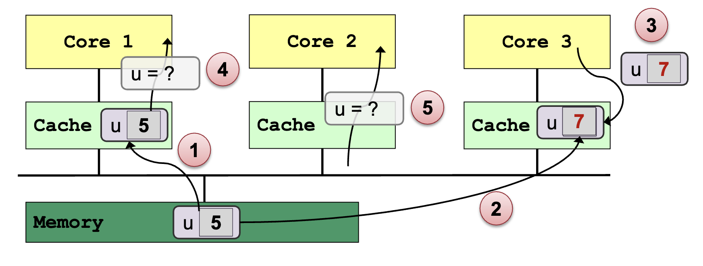
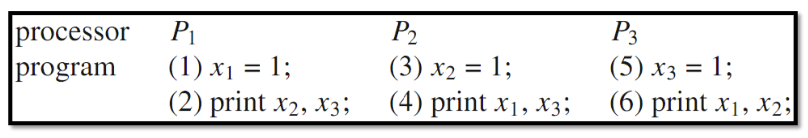
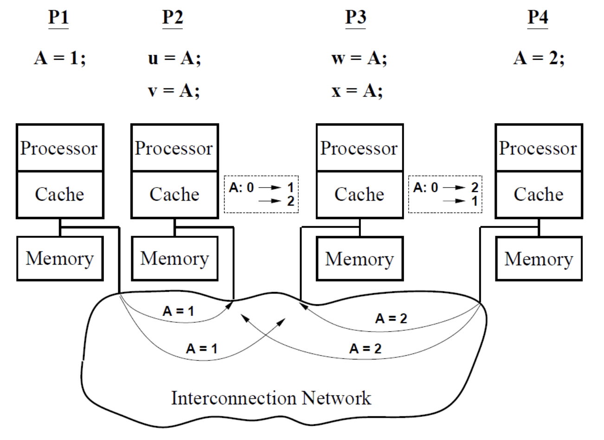
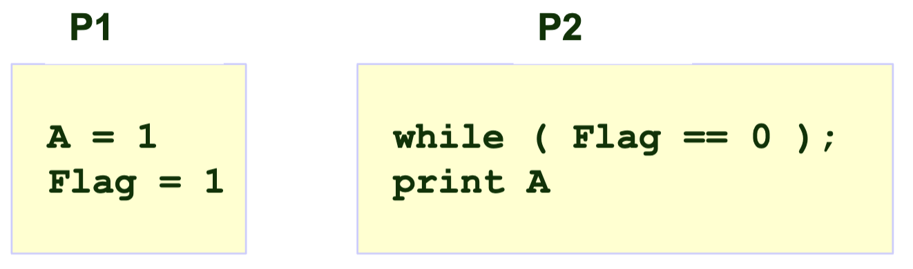
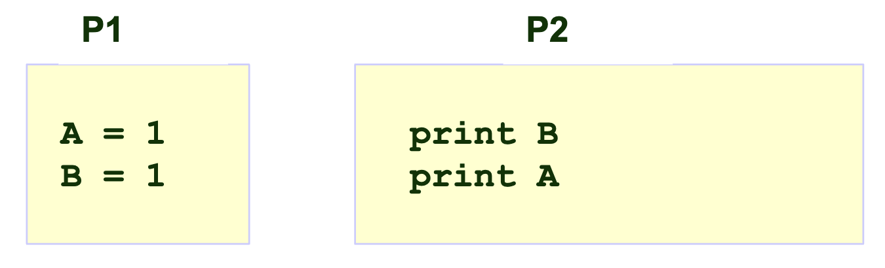
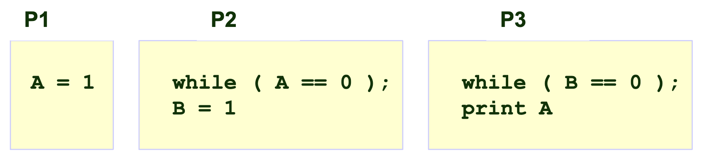
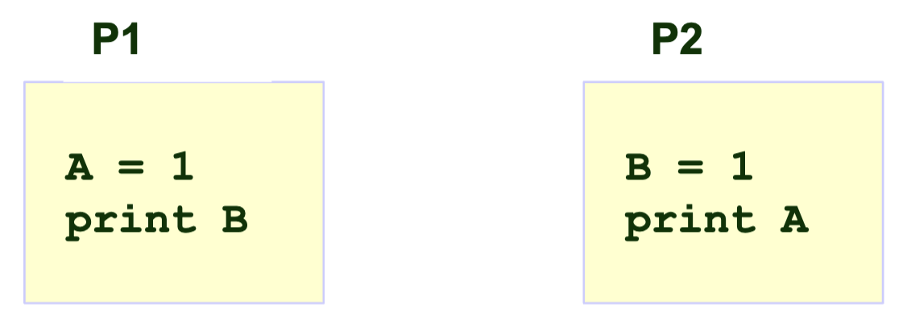

## Cache Coherence

### Cache Properties

- **Cache size**: larger cache increases access time (because of increased addressing complexity) but reduces cache misses
- **Block size (cache line)**: data is transferred between main memory and cache in blocks of a fixed length
  - Larger blocks reduces the number of blocks but replacement lasts longer → block size should be small
  - But larger block increase the chance of spatial locality cache hit → block size should be large
- Typical sizes for L1 cache blocks (lines) are 4 or 8 memory words (4 bytes)

### Write Policy

Write-through: write access is immediately transferred to main memory

- **Advantage**: always get the newest value of a memory block
- **Disadvantages**: slow down due to many memory accesses
  - Use a write buffer

Write-back: write operation is performed only in the cache

- Write is performed to the main memory when the cache block is replaced
- Uses a dirty bit
- **Advantages**: less write operations
- **Disadvantages**: memory may contain invalid entries
- Example: processor executes `int x = 1;`
  1. Processor performs write to address that "misses” in cache
  2. Cache selects location to place line in cache, if there is a dirty line currently in this location, the dirty line is written out to memory
  3. Cache loads line from memory (“allocates line in cache”)
  4. Whole cache line is fetched
  5. Cache line is marked as dirty

### Cache Coherence Problem

- Multiple copies of the same data exists on different caches
- Local update by processor → Other processors may still see the unchanged data

### Memory Coherence

Memory Coherence for Shared Address Space:

- Intuitively, reading value at an address should return the last value written at that address by any processing unit (core)
- Uniprocessor: typically writes come from one source, the processing unit
- Multiprocessor: a single shared address space leads to a memory coherence problem because there is
  - Global storage space (main memory)
  - Core caches (multiple levels)

Definition:

- **Coherence** ensures that each processing unit has consistent view of memory (each memory location) through its local cache
  - All processing units must agree on the order of reads/writes to the SAME memory location (address), X
  - In other words: it is possible to put all operations involving the SAME memory location, X, on a timeline such that the observations of all processing units are consistent with that timeline
- 3 **properties** of a coherent memory system
  - Program Order
  - Write Propagation
  - Transaction Serialization

Property 1: **Program Order**

- Given the sequence
  1. P (processing unit) writes to X
  2. No write to X (from the other processing units)
  3. P reads from X
- P should get the value written in 1.

Property 2: **Write Propagation**

- Given a system that meets program order property, the sequence
  1. P1 (processing unit) writes to X
  2. No further write to X (by any processing unit)
  3. P2 reads from X:
- P2 should read value written by P1

  → Writes become visible to other processing units **eventually**

Property 3: **Transaction Serialization**

- Given the sequence
  1. Write V1 to X (by any processing unit)
  2. Write V2 to X (by any processing unit)
- processing units can **never** read X as V2, then **later** as V1

  → All writes to a location (from the same or different processing units) are **seen in the same order** by all processing units

### Maintaining Memory Coherence

- The programmer must ensure the programs are correctly synchronized
  - Programs suffer of data races when changes are made to the same memory location without proper synchronization
- Cache coherence can be maintained by:
  - **Software based** solution
    - OS + Compiler + Hardware aided solution
    - E.g. OS uses page-fault mechanism to propagate writes
  - **Hardware based** solution
    - Most common on multiprocessor system
    - Known as **cache coherence protocols**

Tracking Cache Line Sharing Status:

- **Snooping Based:**
  - No centralized directory
  - Each cache keeps track of the sharing status
  - Cache monitors or snoops on the bus → to update the status of cache line and takes appropriate action
  - **Bus-based** cache coherence
    - All the processing units on the bus can observe every bus transactions → (Write Propagation)
    - Bus transactions are visible to the processing units in the same order → (Write Serialization)
  - Granularity of cache coherence is cache block
- **Directory Based:**
  - Sharing status is kept in a centralized location
  - Commonly used with NUMA architectures

### Cache Coherence Implications:

Overhead in shared address space

- CC appears as increased memory latency in multiprocessor
- CC lowers the hit rate in cache

**Cache ping-pong:** Multiple processing units read and modify the same global variable

**False sharing:**

- 2 processing units write to different addresses
- The addresses map to the same cache line

## Memory Consistency Models

### Coherence vs. Consistency:

**Coherence:** All processing units must agree on the order of reads/writes to the **SAME** memory location (address)

- Coherence only guarantees that writes to address X will eventually propagate to other processing units

**Memory consistency:** constraints the order in which memory operations performed by one thread become visible to other threads for **DIFFERENT** memory locations

- Consistency deals with when writes to X propagate to other processing units, relative to reads and writes to other addresses

### Importance of memory consistency:

Instructions of a program can be reordered to achieve better performance

- The consistency models dictate what is allowed and what the expected behavior should be
- Compilers and the hardware use consistency models at different levels to decide to produce equivalent programs

The consistency model is used:

- By programmers to reason about correctness and program behavior
- By system/compiler designers to decide the reordering of memory operations possible by hardware and compiler

### Memory Operations on Multiprocessors

A program defines a sequence of loads and stores (“program order” of the loads and stores)

Four types of memory operation orderings

- W→R: write to X must commit before subsequent read from Y
- R→R: read from X must commit before subsequent read from Y
- R→W: read from X must commit before subsequent write to Y
- W→W: write to X must commit before subsequent write to Y

Reordered in an unintuitive way to hide write latencies

- Application programmers rarely see this behavior
- Systems (OS and compiler) developers see it all the time

### Sequential Consistency Model (SC)

In a **sequentially consistent** memory system:

- Every processing unit issues its memory operations in program order
  - Global result of all memory accesses of all processing units appears to all processing units in the same sequential order irrespective of the arbitrary interleaving of the memory accesses by different processing units
  - Effect of each memory operation must be visible to all processing units before the next memory operation on any processing unit
- A sequentially consistent memory system preserves all four memory operation orderings (W→R, R→W, W→W, R→R)

→ Extension of uniprocessor memory model: Intuitive, but can result in loss of performance

Example:

Possible outputs:

- (1)-(3)-(5)-(2)-(4)-(6) → 111111
- (1)-(2)-(3)-(4)-(5)-(6) → 001011

Impossible output: 011001

Initlially, A = 0

- (u,v,w,x)=(1,2,2,1) should not be possible

### Relaxed Consistency

- Relax the ordering of memory operations if data dependencies allow
- Dependencies: if two operations access the same memory location

  - R → W: anti-dependency (WAR)
  - W → W: output dependency (WAW)
  - W → R: flow dependency (RAW)

    → Must be preserved!

- Relaxed memory consistency models allow certain orderings to be violated

**Motivation:**

- Hiding memory latency: overlap memory access operations with other operations when they are independent
- Overlap memory access operations with other operations when they are independent

### Relaxed Consistency: W→ R

**Key Idea:**

- Allow a read on processing unit P to be reordered w.r.t. to the previous write of the same processing unit

  → Hide the write latency

- Different timing of the return of the read defines different models

- ❗️ Data dependencies and Cache coherence are preserved!

**Total Store Ordering (TSO):**

- Processing unit P can read B before its write to A is seen by all PUs (processing unit can move its own reads in front of its own writes)
- Reads by other processing units cannot return new value of A until the write to A is observed by all processing units (**write atomicity** property)

**Processor Consistency (PC):**

- Return the value of any write (even from another processing unit) before the write is observed by all processing units
- Write serialization and write propagation are preserved, but write atomicity is not
  - Writes are observed eventually by all processing units
  - Writes to the same memory location are observed by all PUs in the same order
  - But the writes can be read by some processing unit, before they are observed by all processing units

### Relax Consistency: W → W

**Key Idea:**

- Writes can bypass earlier writes (to different locations) in write buffer
- Allow write miss to overlap and hide latency

**Example Model:** Partial Store Ordering (PSO)

- Relax W → R order (Similar to TSO)
- Relax W → W order

**Example 1:**

A = Flag = 0 initially

Can A = 0 be printed under the models?

- **SC**: A = 0 → ❌
- **TSO/PC**: A = 0 → ❌
- **PSO:** A = 0 → ✅

**Example 2:**

A = B = 0 initially

Can A = 0; B = 1 be printed under the models?

- **SC**: A = 0; B = 1 → ❌
- **TSO/PC**: A = 0; B = 1 → ❌
- **PSO:** A = 0; B = 1 →✅

**Example 3:**

A = B = 0 initially

Can A = 0 be printed under the models?

- **SC**: A = 0 → ❌
- **TSO/PSO**: A = 0 → ❌
- **PC**: A = 0 → ✅

**Example 4:**

A = B = 0 initially

Can A = 0; B = 0 be printed under the models?

- **SC**: A = 0 ; B = 0 → ❌
- **TSO/PC/PSO**: A = 0 ; B = 0 → ✅
