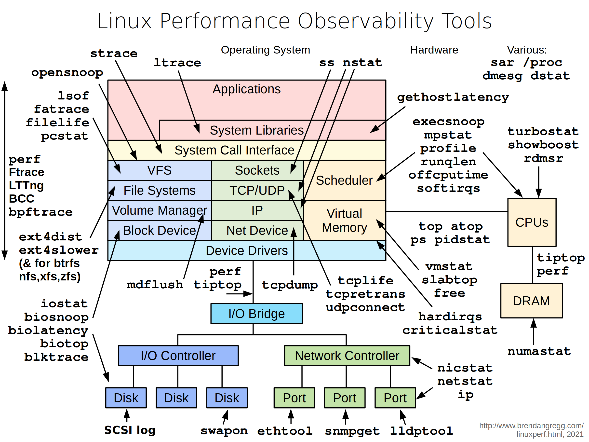
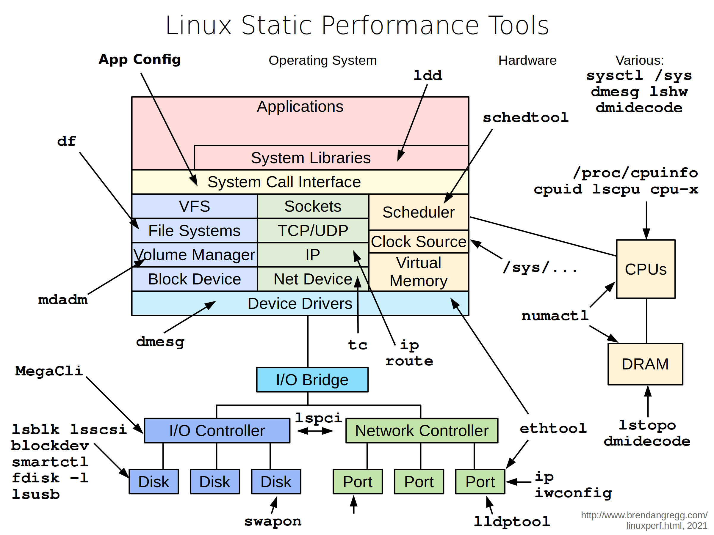
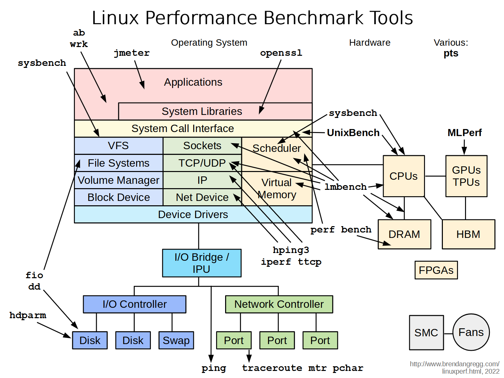
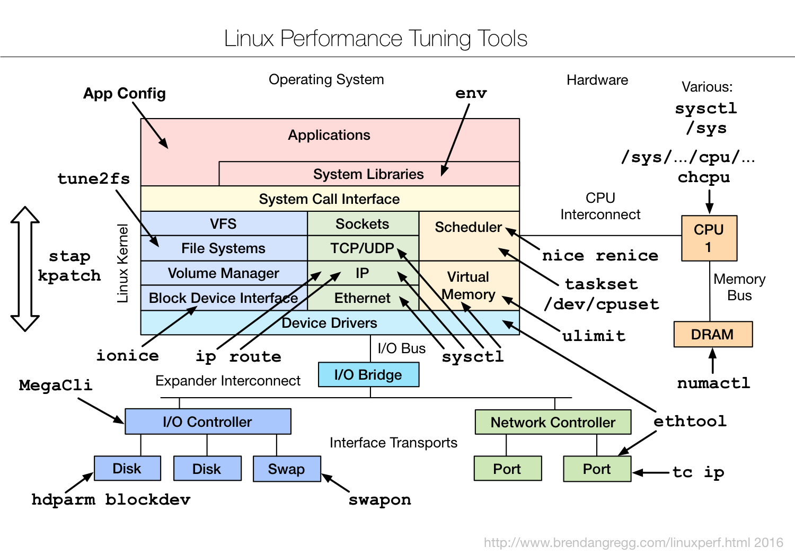
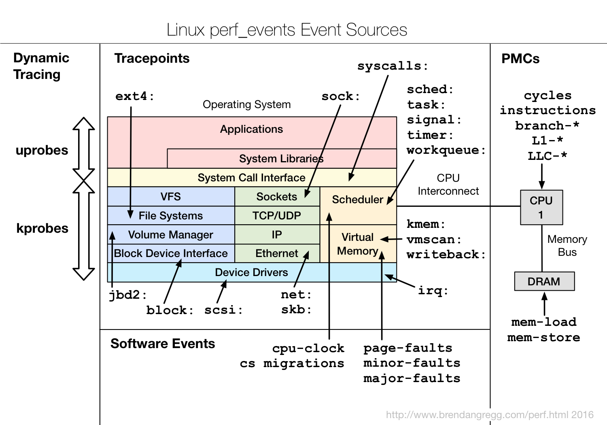
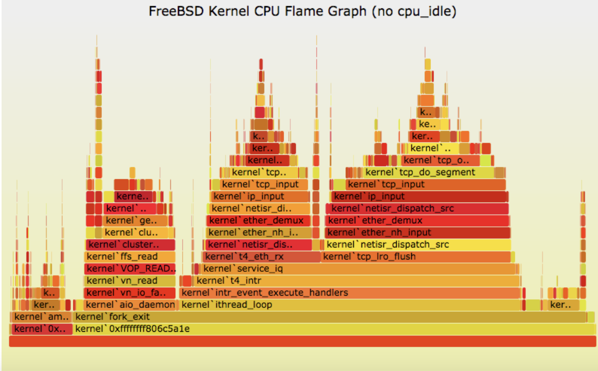
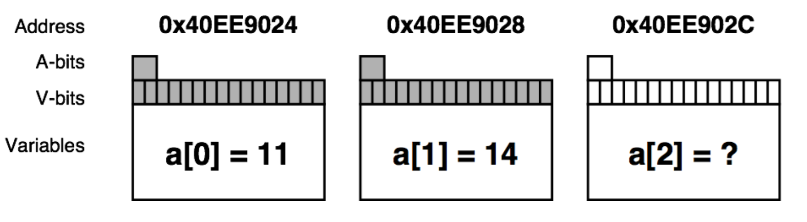

Aspects:

- Measures the quality attributes of the system
  - Scalability
  - Reliability
  - Resource usage
- Workload: normal (loaded) and overloaded
- Timeline
  - Not time sensitive: testing before release
  - Time sensitive: incident performance response (Software Reliability Engineering - SRE)

## Terminologies

Workload:

- The input to the system or the load applied is the workload.
- For a database, the workload consists of the database queries and commands sent by the clients.

Latency:

- A measure of time an operation spends waiting to be serviced.
- In some contexts, it can refer to the entire time for an operation, equivalent to response time

Response time:

- The time for an operation to complete.
- This includes any time spent waiting and time spent being serviced (service time), including the time to transfer the result.

Throughput:

- The rate of work performed.
- Especially in communications, the term is used to refer to the data rate (bytes per second or bits per second). In some contexts (e.g., databases) throughput can refer to the operation rate (operations per second or transactions per second).

Utilization:

- For resources that service requests, utilization is a measure of how busy a resource is, based on how much time in a given interval it was actively performing work.
- For resources that provide storage, utilization may refer to the capacity that is consumed (e.g., memory utilization).

Saturation:

- The degree to which a resource has queued work it cannot service.

Bottleneck:

- In systems performance, a bottleneck is a resource that limits the performance of the system.
- Identifying and removing systemic bottlenecks is a key activity of systems performance.

## Perspectives

- The resource analysis perspective → system administrators
- The workload analysis perspective → application developers

Resource analysis:

- Begins with analysis of the system resources: CPUs, memory, disks, network interfaces, buses, and interconnects
- Includes
  - Performance issue investigations
  - Capacity planning
- Focusses on utilization: Demand - supply

Workload analysis

- Examines the workload applied and how the application is responding
- Targets
  - Requests: The workload applied
  - Latency: The response time of the application
  - Completion: Looking for errors
- Metrics: Throughout and Latency

## Methodologies

### Anti-methodologies:

- The lack of a deliberate methodology: Tune things too early
- Street Light Anti-Method: Look for obvious issues in tools that are
  - Familiar
  - Found on the Internet
  - Found at random
- Drunk Man Anti-Method
  - Tune things at random until the problem goes away
  - Tune the wrong software (OS instead of application)

### Problem Statement Method:

1. What makes you think there is a performance problem?
2. Has this system ever performed well?
3. What has changed recently? (Software? Hardware? Load?)
4. Can the performance degradation be expressed in terms of latency or run time?
5. Does the problem affect other people or applications (or is it just you)?
6. What is the environment? Software, hardware, instance types? Versions? Configuration?

### USE Method:

- For every resource (CPU, memory, bus, etc.), check
  - Utilization: busy time
  - Saturation: queue length or queued time
  - Errors: easy to interpret (objective)
- Helps if you have a functional (block) diagram of your system / software / environment, showing all resources
- Start with the questions, then find the tools

### Monitoring:

- Records performance statistics over time (a time series) so that the past can be compared to the present and time-based usage patterns can be identified
- Useful for
  - Capacity planning
  - Quantifying growth
  - Showing peak usage
- Historic values can also provide context for understanding the current value of performance metrics → Time-based patterns

### Performance Analysis in 60 secs:

- Load averages: `uptime`

- Kernel errors: `dmesg | tail`

- Overall stats by time: `vmstat 1`

- CPU balance: `mpstat -P ALL 1`

- Process usage: `pidstat 1`

- Disk I/O: `iostat -xz 1`

- Memory usage: `free -m`

- Network I/O: `sar -n DEV 1`

- TCP stats: `sar -n TCP,ETCP 1`

- Check overview: `top`

### Tools method:

1. List available performance tools (optionally, install or purchase more).
2. For each tool, list useful metrics it provides.
3. For each metric, list possible ways to interpret it.

Types of tools:

| Type          | Characteristics                                                               |
| ------------- | ----------------------------------------------------------------------------- |
| Observability | Watch activity under workload. Safe, usually, depending on resource overhead. |

- insert timing statements
- check performance counters |
  | Static | Examine attributes of the system at rest rather than under active workload. Should be safe. |
  | Benchmarking | Load test. Caution: production tests can cause issues due to contention. |
  | Tuning | Change default settings. Danger: changes could hurt performance, now or later with load. |

Tools Categorization

- System-wide or per-process observability
- Fixed counters:
  - Kernels maintain various counters for providing system statistics
  - Kernels expose these counters as metrics
- Event-based counters:
  - Enabled as needed
  - **Profiling**: characterizes the target by collecting a set of samples or snapshots of its behavior
  - **Tracing**: instruments every occurrence of an event, and can store event-based details for later analysis or produce a summary

Instrumentation Tools: Modify the source code, executable or runtime environment to understand the performance

- **Manual**: Performed by the programmer
- **Automatic** **source** **level**: instrumentation added to the source code by an automatic tool
- **Intermediate** **language**/**Compiler** **assisted**: instrumentation added to assembly or decompiled bytecodes
- **Binary** **translation**: adds instrumentation to a compiled executable.
- **Runtime** **instrumentation**: program run is fully supervised and controlled by the tool.
- **Runtime** **injection**: code is modified at runtime to have jumps to helper functions.

Overhead:

- The execution is slowed down when instrumentation is added
- Ideally, minimal impact is desired
- Time measurements might not be accurate, but other measurements should be useful
  - Finding bottlenecks
  - Debugging

### CPU Profling

Objectives:

- Profile CPU usage by stack sampling
  - Generate CPU flame graphs
  - Use perf/perf_events
- Other tools: Gprof or Vtune

Perf:

- Modern architectures expose performance counters: Cache misses, branch mispredictions, IPC, etc
- Perf tool provides easy access to these counters
  - `perf list` – list counters available on the system
  - `perf stat` – count the total events
  - `perf record` – profile using one event
  - `perf report` – Browse results of perf record

perf_events:

- Multi-tool with many capabilities
  - CPU profiling
  - Cache profiling
  - Static & dynamic tracing
- In Linux source code: tools/perf
  - Usually pkg added by linux-tools-common, etc

Method:

- Understand all software in CPU profile > 1%
- Discovers a wide range of issues by CPU usage
  - Directly: CPU consumers
  - Indirectly: initialization of I/O, locks, times, ...
- Narrows down software to study

Flame graphs:

- Each box presents a function in the stack (stack frame)
- x-axis: percent of time on CPU
- y-axis: stack depth
- colors: random, or can be a dimension

### Debugging Tools

Help in identifying bugs

- Valgrind:
  - Heavy-weight binary instrumentation: >4x overhead
  - Designed to shadow all program values: registers and memory
  - Shadowing requires serializing threads
  - Usually used for memcheck
- Sanitizers: Compilation-based approach

Valgrind memcheck: Validates memory operations in a program `valgrind --tool=memcheck <prog ...>`

- Each allocation is freed only once
- Each access is to a currently allocated space
- All reads are to locations already written
- 10 – 20x overhead

- Shadow memory
  - Used to track and store information on the memory that is used by a program during its execution.
  - Used to detect and report incorrect accesses of memory
- **A-bit:** corresponding byte accessible
- **V-bit**: corresponding bit initialized

Sanitizers:

- Compilation-based approach to detect issues
  - GCC and LLVM support
  - \~2x overhead
  - Add `-fsanitize=address`
- Examples:
  - ThreadSanitizer (e.g., data races)
  - MemorySanitizer (e.g., uninitialized reads)
  - UndefinedBehaviorSanitizer (e.g., Integer Overflow, Null Pointer)
  - LeakSanitizer (e.g., memory leaks)

Identifying False Sharing using Perf:

- Use `perf c2c`
- At a high level it shows:
  - The cache lines where false sharing was detected.
  - The readers and writers to those cache lines, and the offsets where those accesses occurred.
  - The pid, tid, instruction addr, function name, binary object name for those readers and writers.
  - The source file and line number for each reader and writer.
  - The average load latency for the loads to those cachelines.

### Benchmarking Tools

- \~100% of benchmarks are wrong
- Results are usually misleading: you benchmark A, but actually measure B, and conclude you measured C
- Common mistakes:
  - Testing the wrong target: eg, FS cache instead of disk
  - Choosing the wrong target: eg, disk instead of FS cache ... doesn’t resemble real world usage
  - Invalid results: bugs
- The energy needed to refute benchmarks is multiple orders of magnitude bigger than to run them
- It is not easy to evaluate and compare the performance of computer systems
  - Our discussion focused only on processor and memory performance
  - Much more complicated if we bring in other aspects of a system

Industry Standards:

- SPEC benchmark suites:
  - SPECint, SPECfp: For processor + memory + compiler
  - SPECjvm2008: For Java performance …
- EEMBC benchmark suites
  - ANDBench: For Android performance
  - DPIBench: For system and network performance …
- Numerical Aerodynamic Simulation (NAS):
  - From NASA
  - Massively parallel benchmark: For computer cluster

Simple benchmark:

- Linpack: Linear Algebra Solver → Used in the SuperComputer ranking
- Dhrystone / Whetstone: Small program to test integer / floating performance
- Tak Function: To test recursion optimization
