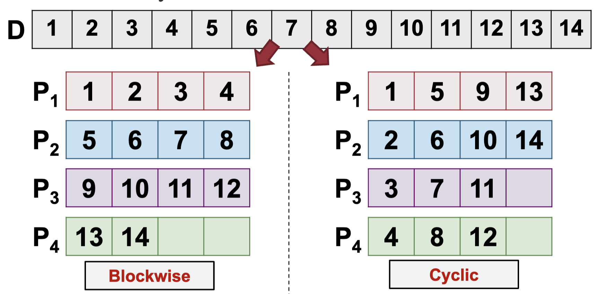
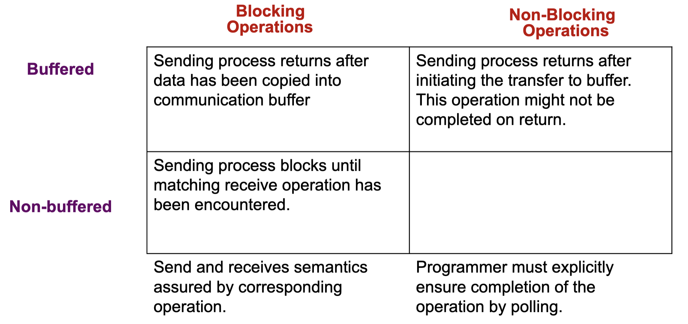
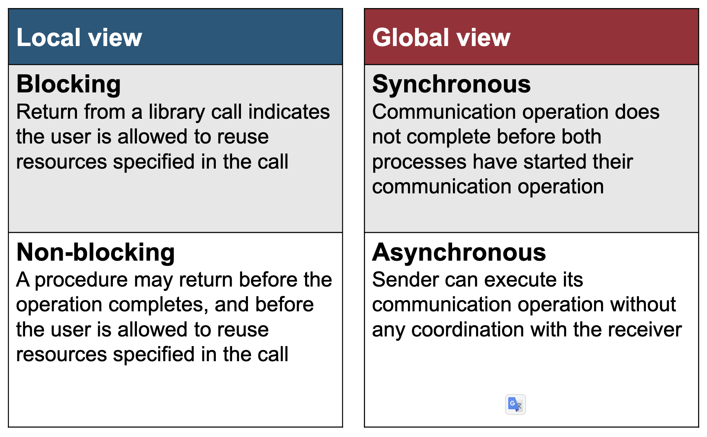

## Data Distribution

- Parallel computing problems are commonly based on array of various dimensions
- Useful to study how to decompose the arrays for distribution on multiple processors
  - known as data distribution / work distribution / decomposition / partitioning
- For problems exhibiting data parallelism, data distribution can be used as a simple parallelization strategy

### **Data Distribution for 1D Arrays**

- Assumptions for discussion:
  - p identical processors, P1, P2, .., Pp, and with processor rank i in \{1, 2, .., p}
  - Array elements numbered from 1 to n
- Given a one dimensional array, common distribution patterns:
  - Blockwise data distribution
  - Cyclic data distribution

### Data distribution for 2D Arrays

import { Image } from "astro:assets";
import OneDDistributions from "./l9-parallel-programming-model-ii/untitled-1.png";

<figure class="mx-auto w-[520px]">
  <Image src={OneDDistributions} alt="1D distributions (column dimension)" />
  <figcaption class="text-center text-sm !mt-0">
    1D distributions (column dimension)
  </figcaption>
</figure>

- Combination of blockwise / cyclic distribution in one or both dimensions can be used

import BlockCyclicB2 from "./l9-parallel-programming-model-ii/untitled-2.png";

<figure class="mx-auto w-[520px]">
  <Image src={BlockCyclicB2} alt="Block-Cyclic with b = 2" />
  <figcaption class="text-center text-sm !mt-0">
    Block-Cyclic with b = 2
  </figcaption>
</figure>

**1-dimension distributions:**

- Block-Cyclic is a new distribution pattern
- Form blocks of size b, then perform cyclic (round robin) allocation

**2-dimension distributions:**

- Processors are virtually organized into 2D mesh of R x C, i.e. each Processor now has a row and column number
- Checkerboard distribution can then be applied:
  - Blockwise: elements split into blocks along both dimensions depending on R and C
  - Cyclic: cyclic assignment of elements according to processor mesh
  - Block-Cyclic: elements spilt into b1 x b2 size blocks, then cyclical assignment to processors

import TwoDBlockwise from "./l9-parallel-programming-model-ii/untitled-3.png";
import TwoDCyclic from "./l9-parallel-programming-model-ii/untitled-4.png";

  <figure class="basis-72">
    <Image src={TwoDBlockwise} alt="2D Blockwise" />
    <figcaption class="text-center text-sm !mt-0">2D Blockwise</figcaption>
  </figure>
  <figure class="basis-72 !mt-0">
    <Image src={TwoDCyclic} alt="2D Cyclic" />
    <figcaption class="text-center text-sm !mt-0">2D Cyclic</figcaption>
  </figure>

import TwoDBlockCyclic from "./l9-parallel-programming-model-ii/untitled-5.png";

<figure class="mx-auto w-[420px]">
  <Image src={TwoDBlockCyclic} alt="2D Block-Cyclic" />
  <figcaption class="text-center text-sm !mt-0">2D Block-Cyclic</figcaption>
</figure>

**Example:** Matrix Multiplication $A \times B = C$ (size N), p processors

1. $1 < p \leq N$
   - A is distributed with block-cyclic (row dimension) of size b or with cyclic
   - B is distributed to all processors in full
   - C: same as A
2. $p = N^2$
   - A: each row is assigned to N processor
   - B: each column is assigned to N processor
   - C: each cell is assigned to 1 processor

## Information Exchange

Purpose: Information exchange between the executing processors is necessary for controlling the coordination of different parts of a parallel program execution

Shared address space: use Shared variables

Distributed address space: use Communication operations

### Shared Variable

- Shared memory programming models assume a global memory accessible by all processors
  - Information exchange through shared variables
  - Need synchronization operations for safe concurrent access
- Flow of control abstractions → processes or threads
- Each thread:
  - Executed by one processor or one core in multicore processors
  - Have shared variables and may have private variables

Synchronized Access

- **Data race:** multiple threads accessing (read and write) the same shared variable
  - Computation result depends on the execution order of threads (race condition)
  - May lead to non-deterministic behavior
  - Can be avoided using a critical section mechanism
- **Critical section:**
  - A program part in which concurrent access should be avoided i.e. only one thread can execution at any point in time
  - Use mutual exclusion (mutex) to provide critical section

### Communication Operations

- Distributed memory programming models assume disjoint memory space:
  - Exchange of data between processors through dedicated communication operations
- One common communication model send / receive messages between participating processors:
  - known as **message-passing programming model**
- Two main types of data exchange: **point-to-point** and **global communication**

Principles:

- Data explicitly partitioned for each process
- All interaction requires both parties to participate
- The programmer has to explicitly express parallelism
- **Loosely synchronous** paradigm:
  - Tasks or subsets of tasks synchronize to perform interactions
  - Between these interactions, tasks execute completely asynchronously

## Communication Protocols

### Blocking Operations

- Send operation blocks until it is safe to reuse the input buffer
  - "Safe" refers to the integrity of the data to be sent
- Non-buffered blocking send:
  - The operation blocks until the matching receive has been performed by the receiving process
  - Idling and deadlocks are major issues with non-buffered blocking sends

import nonBufferedBlocking from "./l9-parallel-programming-model-ii/untitled-7.png";

**Non-Buffered + Blocking Operations:**

<figure class="mx-auto w-[520px]">
  <Image src={nonBufferedBlocking} alt="Non-buffered Blocking Operation" />
  <figcaption class="text-center text-sm !mt-0">
    Non-buffered Blocking Operation
  </figcaption>
</figure>

- Considerable idling overheads → Due to the mismatch in timing between sender and receive

**Buffered Blocking Operations:**

- To reduce idling overhead: Utilize buffers at both ends
- **Sender** simply copies the data into the designated buffer and returns after the copy operation has been completed
- **Receiver** similarly buffered the incoming data
- Buffering trades off idling overhead for buffer copying overhead

import bufferedBlocking from "./l9-parallel-programming-model-ii/untitled-8.png";

<figure class="mx-auto w-[520px]">
  <Image src={bufferedBlocking} alt="Buffered Blocking Operations" />
  <figcaption class="text-center text-sm !mt-0">
    Buffered Blocking Operations
  </figcaption>
</figure>

**Bounded Buffer Size: Impact:** What if consumer was much slower than producer?

**Deadlock:** Deadlocks are still possible with buffering since receive operations block

### Non-Blocking Operations

- Send / Receive returns before it is semantically safe to use the data transferred
- Non-blocking operations are generally accompanied by a check-status operation
- The programmer must ensure the semantics of the operations
- When used correctly, these primitives are capable of overlapping communication overheads with useful computations
- Message passing libraries typically provide both blocking and non-blocking primitives

**Non-Blocking + Non-Buffered Operations:**

import nonBufferedNonBlocking from "./l9-parallel-programming-model-ii/untitled-9.png";

<figure class="mx-auto w-[520px]">
  <Image
    src={nonBufferedNonBlocking}
    alt="Non-buffered Non-blocking Operations"
  />
  <figcaption class="text-center text-sm !mt-0">
    Non-buffered Non-blocking Operations
  </figcaption>
</figure>

**Semantics of Send/Receive Operations:**

- **Synchronous**:
  - Send completes after matching receive and source data sent
  - Receive completes after data transfer completed from matching send
- **Asynchronous:**
  - Send completes after input buffer may be reused

import syncComm from "./l9-parallel-programming-model-ii/untitled-11.png";
import asyncComm from "./l9-parallel-programming-model-ii/untitled-12.png";

  <figure class="basis-[520px]">
    <Image src={syncComm} alt="Synchronous Communication" />
    <figcaption class="text-center text-sm !mt-0">
      Synchronous Communication
    </figcaption>
  </figure>
  <figure class="basis-[520px] !mt-0">
    <Image src={asyncComm} alt="Asynchronous Communication" />
    <figcaption class="text-center text-sm !mt-0">
      Asynchronous Communication
    </figcaption>
  </figure>

