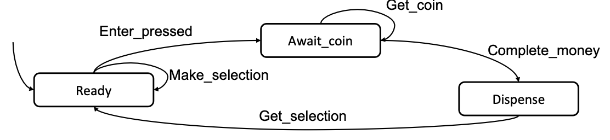
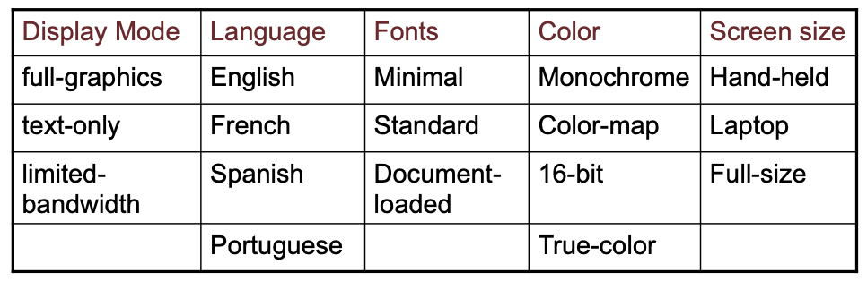
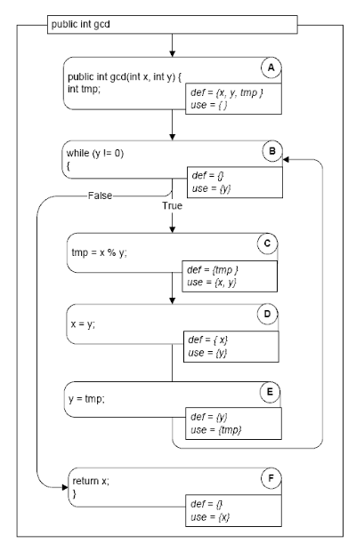
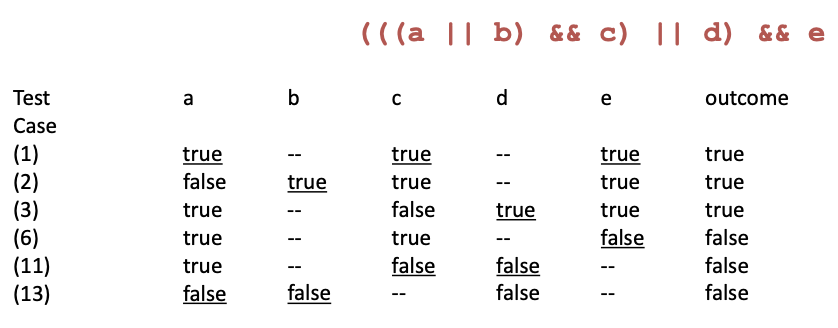
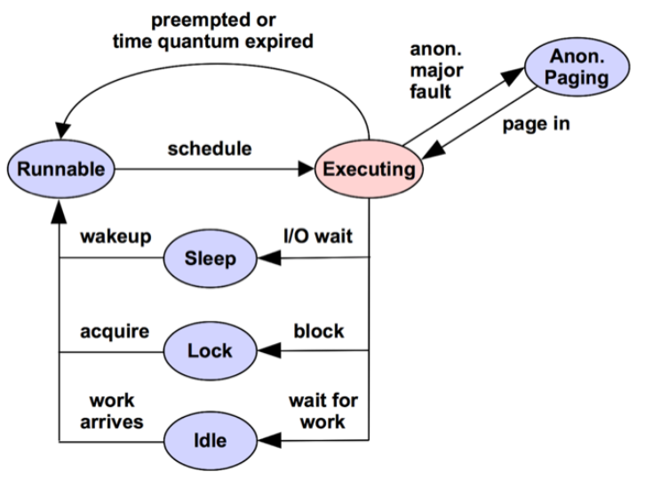
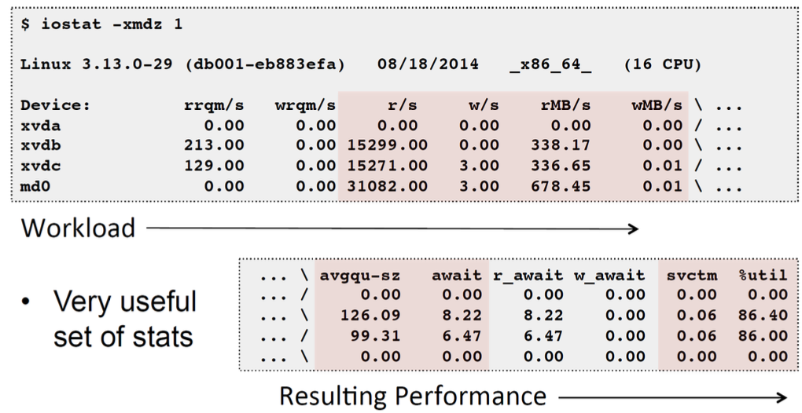

## L1: Fundamentals


**Fault:** An anomaly in the source code of a program that may lead to an error

**Error:** The runtime effect of executing a fault, which may result in failure

**Failure:** The manifestation of error external to the program

**Unit Testing**: Testing of a single module in an isolated environment

**Integration testing**: Testing parts of the system by combining the modules

**System testing**: Testing of the system as a whole after the integration phase

**Acceptance testing**: customer’s evaluation of a system (usually, a form of system testing)

**Regression testing**: exercise a changed system, focus on modifications or their impact (bottom-up, top-down, big-bang, sandwich)

**Driver**: A program that calls the interface procedures of the module being tested and reports the results. A driver simulates a module that calls the module currently being tested

**Stub**: A program that has the same interface as a module that is being used by the module being tested but simpler. A stub simulates a module called by the module currently being tested. **Mock objects**: Create an object that mimics only the behavior needed for testing

**Coverage Criteria**:

- **Line Coverage (Statement Coverage):** test every line of code
- **Branch Coverage:** test every line, and every branch on multi-branch
  lines
- **N-Length Sub-Path Coverage:** test every sub-path of length N. E.g: In a 10,000-line program, test every possible 10-line sequence of execution
- **Path coverage:** test every path through the program, from entry to exit → Infeasible in general, and still not even exhaustive!
- **Condition Coverage:** For each executable condition c
  - Check whether it can be both true or false (c could be unsatisfiable or valid in all program executions)
  - For all such conditions c, c should be true in at least one test in the test suite, and c should be false in at least one test in the test suite

**Random Testing:** Based on a description of the legal inputs, generate test cases
randomly over the program domain

- Drawbacks: (1) Need to have an oracle for each test case, (2) May not match the operational profile
- Benefits: (1) Easy to generate test cases, (2) Serves as a baseline for comparison, (3) Using the same number of test cases, does testing criterion X do as well as random testing at detecting faults/finding failure?

Error Seeding: Insert “typical” faults into a system

- Determine how many of the inserted faults are found
- If K of the N faults found, then assume that K/N of actual faults found as well
- Motivates developers/testers: Know there is something to find; Not looking for their own faults

## L2: Functional Testing

**Verification:** checking the consistency of an implementation with a specification

- Conforming to a requirement specification
- Specification is a statement about a proposed solution to a problem (might not achieve user’s needs)

**Validation**: assessing the degree to which a software system actually fulfils its requirements → Meeting user’s real needs

**Random Testing**: (uniform)

- Pick possible inputs uniformly
- Avoids designer bias. **Problem**: The test designer can make the same logical mistakes and bad assumptions as the program designer (especially if they are the same person)
- But treats all inputs as equally valuable
- Might miss boundary values

**Systematic Testing:** (non-uniform)

- Try to select inputs that are especially valuable
- Usually by choosing representatives of classes that are apt to fail often or
  not at all

→ Functional testing is systematic testing

→ It is also possible to combine both – can be a less expensive, effective strategy in practice.

1. Generate some boundary values first to capture corner cases or
   important relationships
2. Cover the rest of the input domain by random testing

**Example**: three integers a, b , c --- input to some method

- Possible corner cases: a= 0, b = 0, and so on
- Possible important relationships: a == b
- Cover the rest of the input domain by random testing

Using the Specification:

- Uses the specification (formal or informal) to partition the input space
- Test each category and boundaries between categories
  - No guarantees, but experience suggests failures often lie at the
    boundaries

**Functional Testing:** Deriving test cases from program specifications

- Verification – find discrepancies between what the program does and what it is intended to do
- Functional refers to the source of information used in test case design, not to what is tested
- Also known as: specification-based testing (from specifications) / black-box testing (no view of the code)
- Functional specification = description of intended program behavior (Either formal or informal)

**Functional vs. Structural:**

- Different testing strategies (functional, structural, fault-based, model-based) are most effective for different classes of faults
- Functional testing is best for **missing logic** faults
  - A common problem: some program logic was simply forgotten
  - Structural (code-based) testing will never focus on code that isn’t there!
- Functional test applies at all granularity levels: Unit (from module interface spec), Integration (from API or subsystem spec), System (from system requirements spec), Regression (from system requirements + bug history)
- Structural (code-based) test design applies to relatively small parts of a system: Unit, Integration

**WHY?** The base-line technique for designing test cases

- Timely - often useful in refining specifications and assessing testability before code is written
- Effective - finds some classes of fault (e.g., missing logic) that can elude other approaches
- Widely applicable: (1)To any description of program behavior serving as spec, (2) At any level of granularity from module to system testing
- Economical - typically less expensive to design and execute than structural (code-based) test cases

**From Specifications to Test Cases:**


1. Decompose the specification: If the specification is large, break it into **independently testable features** to be considered in testing
2. Select representatives: (1) **Representative values** of each input, or (2) **Representative behaviors** of a model: Models in program specification, in program design, and in test design
3. Form test specifications: Typically combinations of input values, or model behaviors
4. Produce and execute actual tests

**Independently Testable Feature:**

- Need NOT correspond to a unit of source code
  - The same source code may be tested several times, each time for a different feature.
  - Examples: File sorting utility - allows for sorting of files, merging of sorted files, searching within a sorted file → May be tested thrice for searching, sorting and merging
- Finding independently testable features is DIFFERENT from module decomposition
- Testing a website functionality
  - E.g: Sitemap, Registration of user profiles, Searching the internal database via web-forms, …
  - Any single feature may involve several modules, e.g. registration of user profile code may be spread across modules

**Example 1:** Postal Code Lookup

- **Input**: ZIP code (5-digit US Postal code)
- **Output**: List of cities
- Testable feature: the postal code
- Valid zip code: with 0 cities as output (boundary), 1 city as output, >1 cities as output
- Malformed zip code: empty, 1-4 characters, 6 characters (boundary), very long input, non-digit characters, non-character data

**Example 2:** Calculator

- **Input**: sequence of buttons pressed
- **Output**: calculated value
- Testable features: Mathematical function for each button
  - Each function is an independently testable feature.
  - Some functions like memory access may be related to other buttons – to retrieve a value, you should store it.

**Example 3:** Reservation number

Consider a program that checks the validity of a reservation number. A valid reservation number should contain exactly two letter characters followed by up to three digits (at least one digit is expected). The program allows the user to input a reservation number and returns true for a valid reservation number and false for an invalid reservation number.

What is(are) the independently testable feature(s)?

- ❌ Reservation number
- ✅ Checking the validity of the format of the reservation number
- ❌ Format check
- ✅ Checking that the reservation number exists in the system

**Model-based Testing: Why?**

- Models used in specification or design which have structure
  - Useful information for selecting representative classes of behavior; behaviors that are treated differently with respect to the model should be tried by a thorough test suite
  - In combinatorial testing, it is difficult to capture that structure clearly and
    correctly in constraints
- We can devise test cases to check actual behavior against behavior specified by the model. “Coverage” similar to structural testing, but applied to specification and design models

**State Machine Models:**

- Basic idea: (1) state of an object is modified by methods, (2)transitions model the methods, (3) test cases are sequences of transitions that traverse the state machine
- State machine can be derived from specification (functional testing), code (structural testing), or both

**Example 1:** Vending machine work flow: Selection is made → Coins are inserted → Product is dispensed when amount of coins is enough



- TC-1: Ready → Await_coin → Dispense
- TC-2: Ready → Await_coin → Await_coin → Dispense

**Model Coverage:**

- State coverage: Every state in the model should be visited by at least one test case
- Transition coverage: (1) Every transition between states should be traversed by at least one test case. (2) This is the most used criterion. (3) A transition can be thought of as a (precondition, postcondition) pair

**Testing Decision Structures:**

- Basic condition coverage: Test case specification for each column in the table
- Compound condition adequacy criterion: Test case specification for each combination of truth values of basic conditions
  - 2^n tests for n conditions (basic conditions)
- Modified condition/decision coverage (MC/DC): Each column in the table represents a test case specification. Add columns that differ in one input row and in outcome, then
  merge compatible columns

**Applying MC/DC:**

- Decision Table: (1) Rows = Basic Condition; (2) Columns = Combinations of basic conditions; (3) Out = last row of the table = Expected output for each combination (that column)
- MC/DC: (1) Generate a test case for each column, (2) Fill up “don’t care” in any way, without violating constraints
- The test cases are combinations of truth values for each basic condition that lead to specified outputs
- Add test cases to the test suite as long as flipping one value from a combination of truth values (test case) leads to different output
  - Systematically flip one truth value from the test cases – see if the new test case can be merged with an existing test case from the suite without violating any constraint → Many ways of merging test cases – due to “don’t care” cells!!
  - If the test case cannot be merged, add the new test case to the test suite – for the new test case, the output should be different from the original test case whose value was flipped → Output can represent “error” meaning a flipped column is infeasible.


→ Choose TC1 → Choose TC2, TC3, TC5

**Example:** The pricing function determines the adjusted price of a configuration for a particular customer.

- **Educational prices:** The adjusted price for a purchase charged to an educational account in good standing is the scheduled price from the educational price schedule. No further discounts apply.
- **Special-price non-discountable offers**: Sometimes a complete configuration is offered at a special, non-discountable price. When a special, non-discountable price is available for a configuration, the adjusted price is the non-discountable price or the regular price after any applicable discounts, whichever is less


Constraints: \[1] at-most-one (CP \< CT1, CP > CT2), \[2] CP > CT2 ⇒ CP > CT1, \[3] at-most-one (SP \< T1, SP > T2), \[4]SP > T2 ⇒ SP > T1


## L3: Combinatorial Testing

### Category-partition testing

1. **Decompose the specification** into independently testable features:
   - for each feature identify: parameters, environment elements
   - for each parameter and environment element identify elementary characteristics (categories)
2. Identify relevant values: for each characteristic (category) identify (classes of) values: normal values, boundary values, special values, error values
3. Introduce constraints
4. Enumerate tests

**Step 1:** Identify independently testable units and categories

- Categories reflect test designer's judgment, regarding which classes of values may be treated differently by an implementation
- Choosing categories well requires experience and knowledge of the application domain and product architecture. The test designer must look under the surface of the specification and identify hidden characteristics
- For example: Direct sales web-site of Chipmunk Computers
  - Configuration == Set of selected options for a computer
  - Check configuration is a testable feature – checks if a chosen configuration is valid, e.g. Digital LCD monitor with analog video-card is an invalid configuration!

**Example:**

- Parameter _Model:_ \[1] Model number, \[2] Number of required slots for selected model (#SMRS), \[3] Number of optional slots for selected model (#SMOS)
- Parameter _Components:_ \[1] Correspondence of selection with model slots, \[2] Number of required components with selection ≠ empty, \[3] Required component selection, \[4] Number of optional components with selection ≠ empty, \[5] Optional component selection
- Environment element: _Product database:_ \[1] Number of models in database (#DBM), \[2] Number of components in database (#DBC)

**Step 2:** Identify relevant values

- Identify (list) representative classes of values for each of the categories. Ignore interactions among values for different categories (considered in the next step)
- Representative values may be identified by applying
  - Boundary value testing: \[1] select extreme values within a class, \[2] select values outside but as close as possible to the class, \[3] select interior (non-extreme) values of the class
  - Erroneous condition testing: select values outside the normal domain of the program

**Example:**

- Model:
  - Model number: Malformed, Not in database, Valid
  - Number of required slots for selected model (#SMRS): 0, 1, Many
  - Number of optional slots for selected model (#SMOS): 0, 1, Many
- Component:
  - Correspondence of selection with model slots: Omitted slots, Extra slots, Mismatched slots, Complete correspondence
  - Number of required components with non empty selection: 0, \< number required slots, = number required slots
  - Required component selection: Some defaults, All valid, ≥ 1 incompatible with slots, ≥ 1 incompatible with another selection, ≥ 1 incompatible with model, ≥ 1 not in database
  - Number of optional components with non empty selection: 0, \< #SMOS, = #SMOS
  - Optional component selection: Some defaults, All valid, ≥ 1 incompatible with slots, ≥ 1 incompatible with another selection, ≥ 1 incompatible with model, ≥ 1 not in database
- Database:
  - Number of models in database (#DBM): 0, 1, Many
  - Number of components in database (#DBC): 0, 1, Many

**Step 3:** Introduce constraints

- A combination of values for each category corresponds to a
  test case specification. In the example we have 37 \* 62 \* 4 = 314,928 test cases, most of which are impossible! e.g. zero slots and at least one incompatible slot
- Introduce constraints to rule out impossible combinations and reduce the size of the test suite if too large

**Step 3:** Error constraint

- \[error] indicates a value class that corresponds to erroneous values and needs to be tried only once
- Error value classes: \[1] No need to test all possible combinations of errors, \[2] One test is enough (we assume that handling an error case bypasses other program logic)

**Example:** Error constraints reduce test suite from 314,928 to 2,711 test cases

- Model number:

  - Malformed \[error]
  - Not in database \[error]
  - Valid

- Correspondence of selection with model slots:

  - Omitted slots \[error]
  - Extra slots \[error]
  - Mismatched slots \[error]
  - Complete correspondence

- Number of required comp. with non empty selection:

  - 0 \[error]
  - \< number of required slots \[error]
  - Required comp. selection
  - ≥ 1 not in database \[error]

- Number of models in database (#DBM):

  - 0 \[error]

- Number of components in database (#DBC):

  - 0 \[error]

- Optional component selection:
  - ≥ 1 not in database \[error]

**Step 3:** Property constraints

- constraint \[property] \[if-property] rule out invalid combinations of values
- \[property] groups values of a single parameter to identify subsets of values with common properties
- \[if-property] bounds the choices of values for a category that can be combined with a particular value selected for a different category

**Example:** from 2,711 to 908 test cases

- Number of required slots for selected model (#SMRS):

  - 1 \[property RSNE]
  - Many \[property RSNE] \[property RSMANY]

- Number of optional slots for selected model (#SMOS):

  - 1 \[property OSNE]
  - Many \[property OSNE] \[property OSMANY]

- Number of required comp. with non empty selection:

  - 0 \[if RSNE] \[error]
  - \< number required slots \[if RSNE] \[error]
  - \= number required slots \[if RSMANY]

- Number of optional comp. with non empty selection:
  - \< number required slots \[if OSNE]
  - \= number required slots \[if OSMANY]

**Step 3:** Single constraints

- \[single] indicates a value class that test designers choose to test only once to reduce the number of test cases

**Example:** from 908 to 69 test cases

- Number of required slots for selected model (#SMRS):

  - 0 \[single]
  - 1 \[property RSNE] \[single]

- Number of optional slots for selected model (#SMOS):

  - 0 \[single]
  - 1 \[single] \[property OSNE]

- Required component selection:

  - Some default \[single]
  - Optional component selection
  - Some default \[single]

- Number of models in database (#DBM):

  - 1 \[single]

- Number of components in database (#DBC):
  - 1 \[single]

**Check configuration – Summary**

Parameter Model

- Model number
  - Malformed \[error]
  - Not in database \[error]
  - Valid
- Number of required slots for selected model (#SMRS)
  - 0 \[single]
  - 1 \[property RSNE] \[single]
  - Many \[property RSNE] \[property RSMANY]
- Number of optional slots for selected model (#SMOS)
  - 0 \[single]
  - 1 \[property OSNE] \[single]
  - Many \[property OSNE] \[property OSMANY]

Environment Product data base:

- Number of models in database (#DBM)
  - 0 \[error]
  - 1 \[single]
  - Many
- Number of components in database (#DBC)
  - 0 \[error]
  - 1 \[single]
  - Many

Parameter Component:

- Correspondence of selection with model slots
  - Omitted slots \[error]
  - Extra slots \[error]
  - Mismatched slots \[error]
  - Complete correspondence
- \# of required components (selection ≠ empty)
  - 0 \[if RSNE] \[error]
  - \< number required slots \[if RSNE] \[error]
  - \= number required slots \[if RSMANY]
- Required component selection
  - Some defaults \[single]
  - All valid
  - ≥ 1 incompatible with slots
  - ≥ 1 incompatible with another selection
  - ≥ 1 incompatible with model
  - ≥ 1 not in database \[error]
- \# of optional components (selection ≠ empty)
  - 0
  - \< #SMOS \[if OSNE]
  - \= #SMOS \[if OSMANY]
- Optional component selection
  - Some defaults \[single]
  - All valid
  - ≥ 1 incompatible with slots
  - ≥ 1 incompatible with another selection
  - ≥ 1 incompatible with model
  - ≥ 1 not in database \[error]

### Pairwise combinatorial testing:

much smaller test suites

- Generate combinations that efficiently cover all pairs (triples,…) of classes
- Covering pairs (triples,…) reduces the number of test cases, but reveals most faults
- Rationale: most failures are triggered by single values or
  combinations of a few values

**Example:**




**Adding Constraints:** color monochrome not compatible with screen laptop and full size


### Catalog based testing:

- Deriving value classes requires human judgment
- Gathering experience in a systematic collection can \[1] speed up the test design process, \[2] routinize many decisions, better focusing human effort, \[3] accelerate training and reduce human error
- Catalogs capture the experience of test designers by listing important cases for each possible type of variable
- **Example**: if the computation uses an integer variable a catalog might indicate the following relevant cases: \[1] The element immediately preceding the lower bound, \[2] The lower bound of the interval, \[3] A non-boundary element within the interval, \[4] The upper bound of the interval, \[5] The element immediately following the upper bound

1. Analyze the initial specification to identify simple elements: Pre-conditions, Post-conditions, Definitions, Variables, Operations
2. Derive a first set of test case specifications from pre-conditions, post-conditions and definitions
3. Complete the set of test case specifications using test catalogs

Example: `cgi_decode`

- Function `cgi_decode` translates a cgi-encoded string to a plain ASCII string, reversing the encoding applied by the common gateway interface (CGI) of most web servers
- CGI translates spaces to +, and translates most other non-alphanumeric
  characters to hexadecimal escape sequences
- `cgi_decode` maps + to spaces, %xy (where x and y are hexadecimal digits) to the corresponding ASCII character, and other alphanumeric characters to themselves

**\[INPUT]** encoded: string of characters (the input CGI sequence) can contain:

- alphanumeric characters
- the character +
- the substring %xy, where x and y are hexadecimal digits
- is terminated by a null character

**\[OUTPUT]** decoded: string of characters (the plain ASCII characters corresponding to the input CGI sequence)

- alphanumeric characters copied into output (in corresponding positions)
- blank for each + character in the input
- single ASCII character with value xy for each substring %xy

**\[OUTPUT]** return value cgi_decode returns

- 0 for success
- 1 if the input is malformed

**Step 1:** Identify simple elements

- Pre-conditions: conditions on inputs that must be true before the execution → \[1] validated preconditions: checked by the system, \[2] assumed preconditions: assumed by the system
- Post-conditions: results of the execution
- Variables: elements used for the computation
- Operations: main operations on variables and inputs
- Definitions: abbreviations

**Example:**

- **PRE 1 (Assumed)** input string **encoded** null-terminated string of chars

- **PRE 2 (Validated)** input string **encoded** sequence of CGI items

- **POST 1** if **encoded** contains alphanumeric characters, they are copied to the output string

- **POST 2** if **encoded** contains characters +, they are replaced in the output string by ASCII SPACE characters

- **POST 3** if **encoded** contains CGI hexadecimals, they are replaced by the corresponding ASCII characters

- **POST 4** if **encoded** is processed correctly, it returns 0

- **POST 5** if **encoded** contains a wrong CGI hexadecimal (a substring xy, where either x or y are absent or are not hexadecimal digits), cgi_decode returns 1

- **POST 6** if **encoded** contains any illegal character, it returns 1

- **VAR 1 encoded:** a string of ASCII characters

- **VAR 2 decoded:** a string of ASCII characters

- **VAR 3 return value:** a boolean

- **DEF 1 hexadecimal characters**, in range \['0' .. '9', 'A' .. 'F', 'a' .. 'f']

- **DEF 2 sequences %xy**, where x and y are hexadecimal characters

- **DEF 3 CGI items** as alphanumeric character, or '+', or CGI hexadecimal

- **OP 1** Scan encoded

**Step 2:** Derive initial set of test case specs

- Validated preconditions:
  - simple precondition (expression without operators): 2 classes of inputs: inputs that satisfy the precondition / inputs that do not satisfy the precondition
  - compound precondition (with AND or OR): apply modified condition/decision (MC/DC) criterion
- Assumed precondition: apply MC/DC only to “OR preconditions”
- Postconditions and Definitions: if given as conditional expressions, consider conditions as if they were validated preconditions

**Example:**

- **PRE 1 (Assumed)** input string encoded null-terminated string of chars – no tests are generated

- **PRE 2 (Validated)** input string encoded sequence of CGI items

  > _TC-PRE2-1_ Encoded: a sequence of CGI elements – refined by POST tc\
  > _TC-PRE2-2_ Encoded: not a sequence of CGI elements

- **POST 1** if encoded contains alphanumeric characters, they are copied to the output string

  > _TC-POST1-1_ Encoded: contains one or more alphanumeric characters\
  > _TC-POST1-2_ Encoded: does not contain any alphanumeric characters

- **POST 2** if encoded contains characters +, they are replaced in the output string by ASCII SPACE characters

  > _TC-POST2-1_ Encoded: contains one or more character ‘+’\
  > _TC-POST2-2_ Encoded: does not contains any character ‘+’

- **POST 3** if encoded contains CGI hexadecimals, they are replaced by the corresponding ASCII characters

  > _TC-POST3-1_ Encoded: contains one or more CGI-hexadecimal\
  > _TC-POST3-2_ Encoded: does not contains any CGI-hexadecimal

- **POST 4** if encoded is processed correctly, it returns 0 – covered by PRE2

- **POST 5** if encoded contains a wrong CGI hexadecimal (a substring xy, where either x or y are absent or are not hexadecimal digits, - cgi_decode returns 1

  > _TC_POST5-1_ Encoded: contains one or more malformed CGI-hexadecimals\
  > _POST 6_ if encoded contains any illegal character, it returns 1\
  > _TC_POST6-1_ Encoded: contains one or more illegal characters

- **VAR 1** **encoded**: a string of ASCII characters

- **VAR 2 decoded:** a string of ASCII characters

- **VAR 3 return value:** a boolean

- **DEF 1** hexadecimal characters, in range \['0' .. '9', 'A' .. 'F', 'a' .. 'f']

- **DEF 2** sequences %xy, where x and y are hexadecimal characters

- **DEF 3** CGI items as alphanumeric character, or '+', or CGI hexadecimal

- **OP 1** Scan encoded

Step 3: Apply the catalog

- Scan the catalog sequentially
- For each element of the catalog: \[1] scan the specifications, \[2] apply the catalog entry
- Delete redundant test cases
- Catalog: \[1] List of kinds of elements that can occur in a specification, \[2] Each catalog entry is associated with a list of generic test case specifications

**Example:**


Boolean

- True in/out
  False in/out

→ applies to _return value_
→ generates 2 test cases already covered by \*TC-PRE2-\*1 and _TC-PRE2-2_

Enumeration:

- Each enumerated value in/out
  Some value outside the enumerated set in

→ applies to _CGI item (DEF 3)_
→ included in _TC-POST1-1, TC-POST1-2, TC-POST2-1, TC-POST2-2, TC-POST3-1, TC-POST3-2_
→ applies also to improper CGI hexadecimals

- New test case specifications
  - _TC-POST5-2_ encoded terminated with %x , where x is a hexadecimal digit
  - _TC-POST5-3_ encoded contains %ky , where kis not a hexadecimal digit and y is a hexadecimal digit
  - _TC-POST5-4_ encoded contains %xk , where xis a hexadecimal digit and k is not
- _TC-POST3-1_ encoded contains CGI hexadecimals – already covers well-formed hexadecimals
- Old test case specifications can be eliminated if they are less specific than the newly generated cases
  - _TC-POST5-1_ encoded contains erroneous CGI hexadecimals

Range:

- hexadecimal digit _(DEF 2)_
  - characters / and : (before 0 and after 9 in the ASCII table)
    values 0 and 9 (bounds),
    one value between 0 and 9
    @, G, A, F, one value between A and F
    \}, g, a, f, one value between a and f
  - 30 new test cases (15 for each character %xy)
- Alphanumeric char _(DEF 3):_ 5 new test cases

Numeric Constant: does not apply

Non-Numeric Constant: applies to + and %, in DEF 3 and DEF 2: 6 new Test Cases (all redundant)

Sequence: applies to _encoded (VAR 1), decoded (VAR 2)_, and _cgi-item (DEF 2)_

- 6 new Test Cases for each variable
- Only 6 are non-redundant:
  - _encoded_: \[1] empty sequence. \[2] sequence of length one, \[3] long sequence
  - _cgi-item:_ \[1] % terminated sequence (subsequence with one char), \[2] % initiated sequence, \[3] sequence including %xyz, with x, y, and z hexadecimals

Scan: applies to _Scan encoded (OP 1)_ and generates 17 test cases: only 10 are non-redundant

## L4: Background on Debugging and Structural Testing

Control Flow Graph (Intra-procedure):

```java
String collapseNewlines(String argStr) {
  char last = argStr.charAt(0);
  StringBuffer argBuf = new StringBuffer();
  for (int cIdx = 0 ; cIdx < argStr.length(); cIdx++) {
    char ch = argStr.charAt(cIdx);
    if (ch != '\n' || last != '\n') {
      argBuf.append(ch);
      last = ch;
    }
  }
  return argBuf.toString();
}
```


Inter-procedural CFG:

- **Over-estimating call relation:** The static call graph includes calls that never occur in execution (due to dynamic bindings)

```java
public class C {
  public static C cFactory(String kind) {
    if (kind == "C") return new C();
    if (kind == "S") return new S();
    return null;}
  void foo() {
    System.out.println("You called the parent's method");}
  public static void main(String args[]) {
    (new A()).check();}}
class S extends C {
  void foo() {
    System.out.println("You called the child's method");}}
class A {
  void check() {
    C myC = C.cFactory("S"); myC.foo();}}
```


```java
public class Context {
  public static void main(String args[]) {
    Context c = new Context();
    c.foo(3); c.bar(17);}
  void foo(int n) {
    int[] myArray = new int[ n ];
    depends( myArray, 2);}
  void bar(int n) {
    int[] myArray = new int[ n ];
    depends( myArray, 16);}
  void depends( int[] a, int n ) {
    a[n] = 42;
}}
```

Context sensitive vs. insensitive call graph:


Def-use pair:


A **def-use (du) pair** associates a point in a program where a value is produced with a point where it is used

- **Definition**: where a variable gets a value: Variable declaration (often the special value “uninitialized”), Variable initialization, Assignment, Values received by a parameter
- **Use**: extraction of a value from a variable: Expressions, Conditional statements, Parameter passing, Returns

Definition-clear path:

- A definition-clear path is a path along the CFG from a definition to a use of the same variable without another definition of the variable in-between. If, instead, another definition is present on the path, then the latter definition kills the former
- A def-use pair is formed if and only if there is a definition-clear
  path between the definition and the use

Data dependence graph:




We define data dependencies corresponding to memory locations rather than variable names: `A[i] = 1; U = A[j]`

Static vs Dynamic data dependence:


p and q point to the same object?

- Static analysis is always conservative – uses the program text
  - Overestimate the data dependencies
- Dynamic analysis – uses the program runtime
  - Reduces the number of dependencies that need to be considered

Dominators - controlling decision:

- **Pre-dominators** in a rooted and directed graph (CFG) makes this intuitive notion of “controlling decision” precise
- Node M **dominates** node N if every path from the root to N passes through M.
  - A node will typically have many dominators, but except for the root, there is a unique immediate dominator of node N which is closest to N on any path from the root
  - Because each node (except the root) has a unique immediate dominator, the immediate dominator relation forms a tree
- **Post-dominators:** Calculated in the reverse of the control flow graph, using a special “exit” node as the root


- A pre-dominates all nodes; G post-dominates all nodes
- F and G post-dominate E
- G is the immediate post-dominator of B
- C does not post-dominate B
- B is the immediate pre-dominator of G
- F does not pre-dominate G

Control dependence:

- Node N is control-dependent on node C if:
  1. Node N is reached on some but not all execution paths in the CFG
  2. There is a node C with the following property: \[1] C has at least two successors in the control flow graph (i.e., it represents a control flow decision), \[2] C is not post-dominated by N, \[3] There is a successor of C that is post-dominated by N (including the node itself)
- Intuitively: C was the last decision that controlled whether N is executed

Static vs Dynamic control dependence:

```java
input n;
if (n > 0) {
  if (n < -10){
    S
}}
```

Static control dependence: B2→B4, B3→B4

Dynamic control dependence: 1 of the 2 static dependencies, depending on value of n


Control dependence graph:


Dynamic Slicing: Closure of Dynamic data dependencies & Dynamic control dependencies from the slicing criterion

Static vs Dynamic slicing:


Hierarchical slicing:

```java
void main() {
  init(db);
  operate(db);
  output (db);
  return;
}
```


Parallel dependence chains:

```java
x1 = f1();
x2 = f2();
x3 = f3();
y = x1 + x2 + x3;
print(y)   // Criterion
```


Hierarchical dynamic slicing:

- Compute “phases” of an execution trace: Control structure boundaries
- Augment dynamic slicing algorithm: \[1] Mark inter-phase dependencies, \[2] Compute only reachable nodes from selected inter-phase dependence
- Tester’s intervention: \[1] Select the first suspicious inter-phase dependence, \[2] Comprehension guides computation

## L5: Debugging

Statistical fault localization: Assign scores to program statements (s) based on their occurrence in passing / failing tests.

Given a test suite T

$$
score(s) = \frac{\frac{fail(s)}{allfail}}{\frac{fail(s)}{allfail} + \frac{pass(s)}{allpass}}
$$

- fail(s) = \# of failing executions in which statement s occurs
- pass(s) = \# of passing executions in which statement s occurs
- allfail = Total \# of failing executions
- allpass = Total \# of passing executions
- allfail + allpass = |T|

Ochiai metric:

$$
score(s) = \frac{fail(s)}{\sqrt{allfail\times(fail(s) + pass(s))}}


$$

Bucketing: Aggregate error reports likely to be originating from the same fault into the same bucket. \[1] Client side / Server side bucketing, \[2] Expanding / Condensing

Labelling - client side: Produce unique bucket label based on local information

- Program Name Version, Timestamp \[Expanding]
- Module Name, Version, … \[Expanding]
- Exception code, … \[Expanding]
- Assert tag, … \[Condensing]
  - MS Office build process assigns a unique permanent tag to each source-code
    assert
  - When an assert failure is reported, the bucket is labelled by assert tag, rather
    than module information

Classifying – server side: Server side bucketing – many heuristics exist

- Many heuristics to filter out error
  - Code comparison of memory dump against Microsoft binaries to find possible execution of corrupt code!
  - Debugging can then be stopped!
- Determine which thread context and stack frame are likely to have caused the error
- New heuristics get added every week in the WER team!

Testing-based fault localization:


- S = Set of statements executed in π = \{1,3,5,6,7,10}
- S1 = Set of statements executed in π1 = \{1,3,4,5,6,9,10}
- If π is faulty and π1 is OK → Bug report = S – S1 = \{7}
- Choice of the execution run to compare with is very important

Trace alignment and differences:


- Favor traces with lower number of differences
- Favor branches near to the observable error

Symbolic execution:


Concrete execution


Execution with symbolic input

Static symbolic execution:

```python
input in;
if (in >= 0)
  a = in;
else
  a = -1;
return a;
```


→ Does not scale!

Exploring 1 path: use of path conditions

```python
1. input in; ## in = 5
2. z = 0; x = 0;
3. if (in > 0){
4. z = in *2;
5. x = in +2;
6. x = x + 2;
7. }
8. else …
9. if ( z > x) {
      return error; }
```


- Continue the search for failing inputs, those which do not go through the “same” path
- Directed Automated Random Testing (DART)

Path coverage:

- Cover all paths in the program

  → Unboundedly many, unless loops can be bounded. Lot of infeasible paths i.e. paths which do not form execution trace for any input. Infeasible path detection will help test-suite construction

- Directed testing: a technique to help exercise new paths with new tests → Attempts to achieve path coverage. Basic idea: concrete and symbolic execution at the same time

Directed testing:

- Start with a random input I
- Execute program P with I. Suppose I executes path p in program P
  - While executing p, collect a symbolic formula f which captures the set of all inputs which execute path p in program P.
  - f is the path condition of path p traced by input i
- Minimally change f, to produce a formula f1. Solve f1 to get a new input i1 which executes a path p1 different from path p

Backwards execution:

- So far: forward execution using symbolic inputs, for programs or a program path
- Now: backwards symbolic execution from the end state → Capture reasons for reaching failing end state. Weakest pre-condition of a failing end state

## L6: Structural Testing

Structural Testing:

- Judging test suite thoroughness based on the structure of the program itself
- Complements functional testing
  - If part of a program is not executed by any test case, faults in that part cannot be exposed
  - But what’s a “part”? Typically, a control flow element or combination of statements (or CFG nodes), branches (or CFG edges), conditions, paths
  - Recall fundamental rationale: prefer test cases that are treated
    differently over cases treated the same
- Executing all control flow elements does not guarantee finding all faults
- Execution of a faulty statement may not always result in a failure. The state may not be corrupted when the statement is executed with some data values. Corrupt state may not propagate through execution to eventually lead to failure
- How important is the value of structural coverage? \[1] Increases confidence in thoroughness of testing, \[2] Removes some obvious inadequacies

In practice:

- Create functional test suite first, then measure structural coverage to identify what is not covered
- Interpret elements that are not covered: \[1] May be due to natural differences between specification and implementation, \[2] May reveal flaws of the software or its development process
- Attractive because measurable
  - Coverage measurements are convenient progress indicators
  - Sometimes used as a criterion of completion → Use with caution: does not ensure effective test suites

Statement Testing:

- **Adequacy criterion**: each statement (or node in the CFG) must be executed at least once
- Coverage: $\frac\{\text\{#executed stmts}}\{\text\{#stmts}}$
- **Rationale**: a fault in a statement can only be revealed by executing the faulty statement
- Complete statement coverage may not imply executing all branches in a program

Example:


T0 = \{“”, “test”, “test+case%1Dadequacy”} → 17/18 = 94% Stmt Cov.

T1 = \{“adequate+test%0Dexecution%7U”} → 18/18 = 100% Stmt Cov.

T2 = \{“%3D”, “%A”, “a+b”, “test”} → 18/18 = 100% Stmt Cov.

Branch Testing:

- **Adequacy criterion:** each branch (edge in the CFG) must be executed at least once
- Coverage: $\frac\{\text\{#executed branches}}\{\text\{#branches}}$

Example:

- T3 = \{“”, “+%0D+%4J”} → 100% Stmt Cov. 88% Branch Cov. (7/8 branches)
- T2 = \{“%3D”, “%A”, “a+b”, “test”} → 100% Stmt Cov. 100% Branch Cov. (8/8 branches)

Statements vs Branches:

- Traversing all edges of a graph causes all nodes to be visited
  - Test suites that satisfy the branch adequacy criterion for a program P also satisfy the statement adequacy criterion for the same program
  - The converse is not true (see T3): a statement-adequate (or node-adequate) test suite may not be branch-adequate (edge-adequate)

Condition Testing:

- Branch coverage exposes faults in how a computation has been decomposed into cases → intuitively attractive: check the programmer’s case analysis; but only roughly: groups cases with the same outcome
- Condition coverage considers case analysis in more detail
  - individual conditions in a compound Boolean expression, e.g. both parts of `digit_high == 1 || digit_low == -1`

(Basic) Condition Testing:

- **Adequacy criterion**: each basic condition must be executed at least once (once to TRUE and once to FALSE)
- Coverage: $\frac{\text{\#truth values taken by all basic conditions}}{2\times\text{\#basic conditions}}$

Basic Conditions vs Branches:

- Earlier: branch coverage can be achieved without basic condition coverage
- Basic condition adequacy criterion can be satisfied without satisfying branch coverage
- E.g: T4 = \{“first+test%9Ktest%K9”} → satisfies basic condition adequacy but not branch condition adequacy
- Branch and basic condition are not comparable (neither implies the other)

Covering Branches and Conditions:

- Branch and condition adequacy: Cover all conditions and all decisions
- Compound condition adequacy: \[1] Cover all possible evaluations of compound conditions, \[2] Cover all branches of a decision tree (basic conditions)


`digit_high == -1 && digit_low == 1`


Short-circuit eval

Compound Condition and MC/DC Adequacy:

- Compound condition adequacy requires a test for **each possible evaluation** of compound conditions and basic conditions
- MC/DC: Effectively test **important combinations** of conditions, without exponential blowup in test suite size
  - “Important” combinations mean: each basic condition shown to independently affect the outcome of each decision
  - Requires for each basic condition C, two test cases: \[1] Values of all evaluated conditions except C are the same, \[2] Compound condition, as a whole evaluates, to true for one and false for the other


Compound Conditions



Modified Condition Adequacy Criterion

Modified Condition/Decision Coverage (MC/DC):

- MC/DC is \[1] basic condition coverage (C), \[2] branch coverage (DC), \[3] plus one additional condition (M): every condition must independently affect the decision’s output
- MC/DC is subsumed by compound conditions (weaker). MC/DC subsumes statement and branch coverage (stronger)
- A good balance of thoroughness and test size (and therefore widely used)

Path Adequacy:

- Decision and condition adequacy criteria consider individual program decisions
- Path testing focuses consider combinations of decisions along paths
- **Adequacy criterion**: each path must be executed at least once
- Coverage: $\frac\{\text\{#executed paths}}\{\text\{#paths}}$

Practical Path Coverage Criteria:

- The number of paths in a program with loops is unbounded → Usually impossible to satisfy 100% path coverage
- For a feasible criterion: Partition infinite set of paths into a finite number of classes
- Useful criteria can be obtained by limiting \[1] the number of traversals of loops, \[2] the length of the paths to be traversed, \[3] the dependencies among selected paths

Boundary Interior Criterion:

- Group together paths that differ only in the subpath they follow when repeating the body of a loop. \[1] Follow each path in the control flow graph up to the first repeated node. \[2] The set of paths from the root of the tree to each leaf is the required set of subpaths for boundary/interior coverage


Limitations of Boundary Interior Adequacy:


- The number of paths can still grow exponentially
- The subpaths through this control flow can include or exclude each of the statements Si, so that in total N branches result in 2^N paths that must be traversed
- Choosing input data to force execution of one particular path may be very difficult, or even impossible if the conditions are not independent

Loop Boundary Adequacy

- Variant of the boundary/interior criterion that treats loop boundaries similarly but is less stringent with respect to other differences among paths
- **Criterion**: A test suite satisfies the loop boundary adequacy criterion iff for every loop: \[1] In at least one test case, the loop body is iterated zero times. \[2] In at least one test case, the loop body is iterated once. \[3] In at least one test case, the loop body is iterated more than once
- Corresponds to the cases that would be considered in a formal correctness proof for the loop

Path Partition:

```java
1.  int x,y,z; // input variables
2.  int out; // output variable
3.  int a;
4.  int b = 2;
5.  if(x - y > 0) //b1
6.  a = x;
7.  else
8.  a = y;
9.  if (x + y > 10) //b2
10. b = a;
11. if(z*z > 3) //b3
12. printf("square(z) > 3 \n");
13. else
14. printf("square(z) <= 3 \n");
15. out = b; //slicing criterion
```


Path Partition Coverage:

- Instead of path coverage try path partition coverage
  - Two paths are in the same partition, if they compute the same input-output relationship
  - The input-output relationship describes the output as an expression of the inputs
  - Different paths compute different relationships. Each such relationship becomes a path partition
- Computing these path partitions requires symbolic execution / program dependencies

Procedure Call Testing:

- Procedure entry and exit testing. Procedure may have multiple entry points (e.g., Fortran) and multiple exit points
- Call coverage: The same entry point may be called from many points

Satisfying Structural Criteria:

- Sometimes criteria may not be satisfiable. E.g: The criterion requires execution of
  - **statements** that cannot be executed as a result of defensive programming, code reuse (reusing code that is more general than strictly required for the application)
  - **conditions** that cannot be satisfied as a result of interdependent conditions
  - **paths** that cannot be executed as a result of interdependent decisions
- Large amounts of fossil code may indicate serious maintainability problems. But some unreachable code is common even in well-designed, well-maintained systems
- Solutions: \[1] Make allowances by setting a coverage goal less than 100%, \[2] Require justification of elements left uncovered

Data Flow Testing:

- Middle ground in structural testing: \[1] Node and edge coverage don’t test interactions. \[2] Path-based criteria require impractical number of test cases
- And only a few paths uncover additional faults anyway → Need to distinguish “important” paths
- Intuition: statements interact through data flow: \[1] Value computed in one statement, used in another. \[2] Bad value computation revealed only when it is used


- Value of x at 6 could be computed at 1 or at 4
- Bad computation at 1 or 4 could be revealed only if they are used at 6
- (1,6) and (4,6) are def-use (DU) pairs
  - defs at 1,4
  - use at 6


- 1,2,3,5,6 is a definition-clear path from 1 to 6
  - x is not re-assigned between 1 and 6
- 1,2,4,5,6 is not a definition-clear path from 1 to 6
  - the value of x is “killed” (reassigned) at node 4
- (1,6) is a DU pair because 1,2,3,5,6 is a definition-clear path

Adequacy Criteria:

- All DU pairs: Each DU pair is exercised by at least one test case
- All DU paths: Each simple (non looping) DU path is exercised by at least one test case
- All definitions: For each definition, there is at least one test case which exercises a DU pair containing it (Every computed value is used somewhere)
- Corresponding coverage fractions can also be defined

Data-flow Coverage with Complex Structures:

- Arrays and pointers are critical for data flow analysis. \[1] Under-estimation of aliases may fail to include some DU pairs. \[2] Over-estimation, on the other hand, may introduce unfeasible test obligations
- For testing, it may be preferable to accept under-estimation of alias set rather than over-estimation or expensive analysis
  - In other applications (e.g., compilers), a conservative over-estimation of aliases is usually required
  - Alias analysis may rely on external guidance or other global analysis to calculate good estimates
  - Undisciplined use of dynamic storage, pointer arithmetic, etc. may make the whole analysis infeasible

Infeasibility:


- Suppose cond has not changed between 1 and 5
  - Or the conditions could be different, but the first implies the second
- Then (3,6) is not a (feasible) DU pair
  - No test case can cover them
- The path-oriented nature of data flow analysis makes the infeasibility problem especially relevant. \[1] Combinations of elements matter! \[2] Impossible to distinguish feasible from infeasible paths. More paths = more work to check manually
- In practice, reasonable coverage is (often, not always) achievable. \[1] Number of paths is exponential in worst case, but often linear. \[2] All DU paths is more often impractical

## L7: Testing Object-Oriented Software


V-model

OO software vs procedural software:

**Object-oriented**

- Methods are short
- Interactions among method calls are more often and important
- Basic testing methods have some changes when applied in OO

**Procedural**

- Functions are long and prone to multiple faults
- Less attention needed in interactions among functions
- Basic testing methods are designed for procedural software

Intra-class Testing:

- Inheritance: Test individual methods
- State-dependent behaviour: Functional tests derived from state charts specification of the class and Structural tests derived from data flow information
- Exceptions: Test cases for exceptions thrown
- Polymorphic calls: Initial testcases to superclass/interface


An Orthogonal Approach to Testing

Inter-class Testing:

- Hierarchy of classes: Identify and test predecessor classes first
- Polymorphism: New test cases to cover polymorphic calls integration and interaction
- Exception-handling: Testcases for exceptions propagated across classes

State Machine Models:

- Basic idea: \[1] state of an object is modified by methods, \[2] methods can be modelled as state transitions, \[3] test cases are sequences of method calls that traverse the state machine
- State machine can be derived from specification (functional testing), code (structural testing), or both

Testing with Object states:

- Test cases can be derived from \[1] UML state diagrams (statecharts), \[2] UML message sequence diagrams, or \[3] corner-case scenarios discussed with the customer, … either directly or by “flattening” the diagrams to FSMs first (state explosion)
- State chart-based testing criteria: \[1] Transition coverage: percentage of covered state transitions. \[2] Intuition: “A good test suite covers many state transitions”

Inter-class Testing:

- Integration testing: do units work correctly together?
- Focus on interaction between classes
- Start from “uses” or “includes” hierarchy: \[1] **Uses**: Class A makes method calls to Class B. \[2] **Includes**: Object of Class A is constructed using object(s) of Class B. \[3] Inheritance is ignored, abstract classes are omitted
- Bottom-up integration: \[1] Stress the “depends”-relation, \[3] If A depends on B, first construct and test B, then A

Testing Dependencies:

- Each call should be exercised for all relevant states of the different classes. May lead to combinatorial explosion
- Test significant interaction scenarios in sequence diagrams (significant/difficult to understand interactions) → Vary scenarios for illegal/unexpected interactions

Structural Testing of Classes:

- Start with functional testing \[1] Derive unit tests and integration tests, \[2] Object states and sequence of method invocations to modify/observe object state
- Add more test cases derived from the source code: \[1] Allows to test design + implementation details, \[2] Increase quality of your test cases (coverage), \[3] Beyond control and data flows in a single method, \[4] Consider how sequences of method invocations interact

Intra-class Structural Testing: Reduce the number of object states and instance variables:

- Consider only instance variables that do not appear in the specification
- Def-use pairs for instance variables: cover the points where instance variables change values ()
- Select representative values

Intra-class Data Flow Testing:

- Exercise sequences of method calls according to DU pairs from setting/modifying a value for an instance variable to using this value in another method
- Inter-procedural control flow graph: \[1] Control flows across several methods, \[2] Testing to stress these inter-procedural control-flows and exercise otherwise inaccessible methods
- Adequacy criterion: \[1] Test all DU pairs, \[2] Might be impossible to achieve
- Cannot detect missing code

Inter-class Structural Testing:

- Incrementally follow the dependence relation derived from code
- Classify class methods as \[1] **Inspector**: examines but does not modify object state (getter), \[2] **Modifier**: modifies object state (setter), \[3] **Inspector**/**Modifier**: examines and modifies object state (stack.pop())

Inspector and Modifiers

- Bottom-up on the dependence relation: \[1] Start with leaf classes, \[2] Work up one level and approximate inspector and/or modifier type based on the direct children
- Precision vs. scalability

Test Scaffolding:

- Main idea: reuse, simplify. \[1] Test developer can focus on developing tests for the project. \[2] Scaffolding ensures controllability and observability
- Driver (e.g. JUnit): \[1] provides activation environment for tests )e.g., assert-method: allows test to fail if actual output != expected output, testX-method: executes one test for the given unit), \[2] collects and visualises test statistics, \[3] project-independent
- Stub (e.g. Mockito): \[1] provides prototype implementation of provider classes (a class upon which the tested unit depends), \[2] project-dependent, ad-hoc

Oracles:

- Checks correctness of a particular execution of the tested unit
  1. use modifiers to bring object into necessary state
  2. execute the tested behaviour
  3. use inspectors to access object state
  4. use assertions to check correctness of object state
- Identifies the test that causes a failure
- Project-dependent

Encapsulation for Oracles:

- Break the encapsulation: Allow inspection of private variables \[1] Modifications remain in code, \[2] Might generate/mask faults, \[3] Small differences in performance, \[4] Use observability interfaces (In C++, use friend classes, Useful in debugging and testing)

- Equivalent scenarios: Provide comparison methods for objects to Compare the final state of the object


Polymorphism Testing using Pair-wise approach:


Use Data Flow Analysis:

- Identify polymorphic calls, binding sets, defs and uses
- Derive a test case for each polymorphic \<def,use> pair
  - Consider each binding individually
  - As always: use pair-wise testing to reduce #test cases
- Example (dynamic binding of currency): \[1] test cases that bind calls to different methods in the same run, \[2] reveal faults due to use of different accounts with different currencies, \[3] reveal faults due to use of account with itself as subsidiary

Testing of Inheritance:

- Covered by testing of polymorphism and exception handling
- Optimize by reusing testcases and test executions. Identify methods that do not need to be retested
- Addressing combinatorial explosion
  - When writing tests for a subclass of a class with existing tests
  - Do not test inherited methods that are not overridden/unchanged, e.g. `hashCode()`, `getClass()` (inherited from Object in Java)
  - Do test overridden methods or those that might have changed
- Abstract classes and methods: \[1] Design test cases when abstract method is introduced, \[2] Even if it cannot be executed yet
- Dependence on state
  - If Child can overwrite the state of Parent,
  - Then the behaviour of foo() can also change
  - Re-execute test cases from superclass on subclass and add more test cases if needed

Test History Approach:

- Reusing test suites and test executions: \[1] Determine which new tests are needed, \[2] Determine which old tests must be re-executed
- New and changed behaviour: \[1] New methods must be tested, \[2] Overridden methods must be tested
- We can partially reuse test suites defined for ancestor. Inherited methods do not need to be tested

Generics:

- Generic classes
  - Designed to be instantiated with different parameter types, e.g. `class PriorityQueue<Elem Implements Comparable> {..}`
  - Designed to behave consistently across different parameter types, e.g. `new PriorityQueue<Customer>();`, `new PriorityQueue<Tasks>();`
- Testing generic classes can be broken in two parts: \[1] Showing that some instantiation is correct, \[2] Showing that all permitted instantiations behave consistently

Some Instantiation Is Correct:

- Design tests for one parameter type
  - Create objects of a (random) parameter type T
  - With various states that are relevant for generic class
  - Write test cases for generic class as if it was written for T
- Example: Test different behaviours of `PriorityQueue` with `Customer` objects. Since the parameter type inherits from `Comparable`, test `PriorityQueue` \[1] By adding the same customer twice, \[2] By adding different customers

Permitted Instantiations Behave Consistently:

- Identify potential interactions between generic and its parameters
  - By inspection or analysis, not testing
  - Look for: inspectors and modifiers of parameter object
  - Easy case: no interaction (e.g., container classes)
- Test potential interactions

Example:

- Generic class `PriorityQueue` expects that
  - `o.compareTo(o) == 0` for parameter object `o`
  - test whether expectations are met
- Parameter objects implement `java.lang.Comparable`
  - So, (x.compareTo(y) == 0) == (x.equals(y)). Right? → ❌ **Wrong**
  - e.g., it works for `String`, but not for `BigDecimal`
  - `new BigDecimal(“4.0”).equals(new BigDecimal(“4.00”))` is false
  - `new BigDecimal(“4.0”).compareTo(new BigDecimal(“4.00”))==0` is true

Testing Exception Handling:

- Exceptions create implicit control flows
- Dynamic association of exceptions with handlers
- Exceptions are separated from the normal control flow for test design
  - Dismiss exceptions triggered by normal testing of the system
  - Test exceptions that contain error recovery code

Exception Handlers:

- We cannot test all exceptions \[1] Every array subscript reference (OutOfBounds), \[2] Every method call on an object (NullPointer), \[3] Every user-defined exception, \[4] Multiplied by every handler in every possible call stack
- Many exceptions may be impossible from the system-level, e.g. NullPointer by calling method bind() with component set to null, but the program will never invoke bind() with null
- Instead, we test all exception handlers
- Local exception handlers
  - If throw-statement and handler are in the same method,
  - Consider a subset of \<throw,handler> pairs and
  - Test the exception handler
- Non-local exception handlers
  - Difficult to determine all pairings \<throw,handler>
  - Enforce (and test for) a design rule: If a method propagates an exception, the method call should have no other effect

## L8: Mutation Testing

Mutation Analysis:

- Form of software fault-based testing
- Create variants of the program under test by seeding faults
- **Mutation operators**: patterns for changing the program text
- **Mutant**: variant program

Assumptions:

- Competent programmer hypothesis \[1] Programs are often nearly correct, \[2] Real faults are often simple (i.e., need one-line fixes)
- Coupling effect hypothesis: A test suite that is effective to expose simple (artificial) errors, is also effective at exposing more complex (real) errors

Mutant:

- A slightly changed version of the original program
- Contains a seeded fault that is a
  - Valid (can be compiled) and
  - Simple (single statement)
  - Syntactic (not necessarily semantic) change
  - Useful (behavior differs from initial program)


return x → return 0

Operators:

- A rule to derive mutants from your program
- Based on typical, simple faults
- Defined for most languages (incl. C, Java)
- Replace/delete values, operators, variables, parameters, …
- Object oriented: change accessibility, type, constructor, cast, modifier, …
- A mutant m is killed if at least one test case in the test suite fails for m
- A test suite T is x% mutation-adequate
  - If T kills x% of all mutants
  - Mutation-adequacy subsumes statement coverage-adequacy

Weak Mutation Adequacy:

- Prioritise not-killed mutants with high impact
  - impact = #methods with changed coverage, or
  - impact = #methods with changed return value, etc
- Only require weak mutation-adequacy:
  - Test input must reach the mutation and infect the program state
  - vs. strong mutation-adequacy: test case must fail for mutant

Reduce Number of Mutants:

- Mutant sampling through statistical analysis:
  - Simple random sampling: mutation-adequacy for 1000 random mutants (e.g., 90%)
  - Law of large numbers: computed value similar to actual mutation-adequacy
  - Confidence interval: (e.g., actual adequacy: 88% - 92% at 95% confidence interval)
- Selective Mutation
  - Ignore mutants that are “subsumed” by others
  - Ignore mutants that are less “realistic”
  - Ignore operators that produce many equivalent mutants
  - Prefer operators that produce many stubborn mutants

Reduce Execution Time:

- Weak mutation: Use meta-mutants – execute multiple mutants at the same time
- Parallelization: No dependence between executions; Distribute over several machines
- Test selection: Execute only those test cases that actually execute the mutant

Meta-mutation: \*\*\[1] Inject several faults at once and compile, \[2] Control the active mutant via parameter

FOM and HOM:

- FOM (First-Order Mutant): simple, one-line fault
- HOM (Higher-Order Mutant): complex, multi-line faults
  - two or more statements changed to inject the fault
  - \#HOM = 2^#FOM - 1
- Measure percentage of higher-order mutants killed

## L9: Assertions as Oracles

Oracles:

- Decides whether a program passed or failed a test
- Problem: is it a bug or a feature? “Programs were written in order to determine the answer in the first place. There would be no need to write such programs if the correct
  answer were known.”
- Many programs are ‘non-testable’
  - Nearly impossible to construct an effective oracle
  - Many numerical algorithms, e.g. Multiplication of two large matrices containing large values

Assertions as Oracles:

- Problem: \[1] Program state transitions from sane to infected sometime during execution, \[2] Error observed only after the execution (if at all!)
- Main Idea: Check the sanity of important state transitions
- Compare the observed facts with the expected program behaviour using assertions

Observation vs. Assertion: Observation is limited to small probes in space, Assertions can automatically cover a large area.

Debugging vs. Assertions: (1) Debugging: Post-mortem, Manual sanity checking, (2) Assertions: At runtime; Automated sanity checking

Usage:

- Assertions should not interfere with the actual run (no side effects)
- Used systematically rather than sprinkled randomly across the code
- Major uses: \[1] Invariants - ensure data integrity, \[2] Pre- and post-conditions - ensure function correctness

Examples:

```java
void Time::set_hour(int h)
{
  // precondition
  assert (0 <= hour() && hour() <= 23) &&
          (0 <= minutes() && minutes() <= 59) &&
          (0 <= seconds() && seconds() <= 60);
  ...
  // postcondition
  assert (0 <= hour() && hour() <= 23) &&
          (0 <= minutes() && minutes() <= 59) &&
          (0 <= seconds() && seconds() <= 60);
}
```

```java
boolean sane() {
  assert (rootHasNoParent());
  assert (rootIsBlack());
  assert (redNodesHaveOnlyBlackChildren());
  assert (equalNumberOfBlackNodesOnSubtrees());
  assert (treeIsAcyclic());
  assert (parentsAreConsistent());
  return true;
}
```

Use Aspects:

```java
public aspect RedBlackTreeSanity {
  pointcut modify():
    call(void RedBlackTree.add*(..)) || call(void RedBlackTree.del*(..));
  before(): modify() {
    assert(sane());
  }
  after(): modify() {
    assert(sane());
  }
}
```

Design by Contract:

- Specification within the codes (assertions)
- Contract – formal, precise, and verifiable interface specifications
- Java Modelling Language (JML)
  - Behavioural interface specification language (contracts for Java)
  - JavaDoc annotations in source files
  - Static checking: ESC/Java
  - Runtime checking, e.g., during testing

Contracts in Eiffel:

```elm
set_hour (h: INTEGER) is
    -- Set the hour from ‘h’
  require
    sane_h: 0 <= h and h <= 23
  ensure
    hour_set: hour = h
    minute_unchanged: minutes = old minutes
    second_unchanged: seconds = old seconds
```

Contracts in JML:

```java
// 1
/*@ requires 0 <= h && h <= 23
  @ ensures hours() == h &&
  @ minutes() == \old(minutes()) &&
  @ seconds() == \old(seconds())
  @*/
void Time::set_hour(int h) {...}

// 2
**/*@ requires x >= 0.0;
  @ ensures JMLDouble.approximatelyEqualTo
  @     (x, \result * \result, eps);
  @*/

// 3
public class Purse {
  final int MAX_BALANCE;
  int balance;
  //@ invariant 0 <= balance && balance <= MAX_BALANCE;
  byte[] pin;
  /*@ invariant pin != null && pin.length == 4 &&
    @ (\forall int i; 0 <= i && i < 4;
    @ 0 <= byte[i] && byte[i] <= 9)
    @*/
  /*@ requires amount >= 0;
    @ assignable balance;
    @ ensures balance == \old(balance) - amount &&
    @ \result == balance;
    @ signals (PurseException) balance == \old(balance);
    @*/
  int debit(int amount) throws PurseException {...}
}**
```

Contracts in JML and Other Tools:

- JMLC conditions are translated into runtime assertions
- Documentation - JMLDOC documentation for JML specification
- Unit testing - JMLUNIT to generate test units against JML specifications
- Invariant generation - DAIKON invariant-detection tool
- Static checking - The ESC/JAVA static checker uses invariants to detect potential null pointer exceptions or out-of-bound array indexes
- Verification - JML specifications can be translated into proof obligations for various theorem provers

Reference Runs with JML

- Contracts may have bugs – specification needs to be changed
- Code changes – contracts ensure that the new version is at least as correct as previous version
- Extensions of JML – additional keywords to reference previous version, e.g. `signalled`, `ensured`, `required`

```java
public class Purse {
  final int MAX_BALANCE;
  int balance;
  byte[] pin;
  /*@ requires amount == 0;
    @ signalled PurseException;
    @ ensures \result == \old(balance);
    @*/
  int debit(int amount) throws PurseException { … }}
```

Fuzzing and Hardening:

- Oracles are only as good as the test cases: \[1] Do not prove correctness, \[2] No execution means no error reported
- Use oracles for “code hardening” during production
  - Execute the program with different inputs (fuzzing)
  - Depend in oracles to report any errors
  - Triage and fix all reported errors
  - Ship hardened program
- Fuzzing - generate random executions, scalable and efficient
  - Dumb fuzzing: purely random; may generate invalid inputs
  - Generation-based fuzzing: use input format for (semi-)valid random inputs
  - Mutation-based fuzzing: use valid seed files, randomly mutate input bits
  - White-box fuzzing: use symbolic execution to reach dangerous locations

## L10: Performance Testing and Profiling

Overview:

- Look inside the different processing tasks, and analyze their timing, and energy usage!
- Two main approaches for analyzing timing
  - Worst Case Execution Time (WCET) of a program for a given hardware platform. An upper bound on the execution time for all possible inputs
  - Analyze performance bottlenecks and tune codes to improve timing in normal/stressing scenarios

Aspects of Performance Testing:

- Measures the quality attributes of the system: Scalability. Reliability. Resource usage
- Workload: normal (loaded) and overloaded
- Timeline: \[1] Not time sensitive: testing before release, \[2] Time sensitive: incident performance response (Software Reliability Engineering - SRE)

Performance Testing Techniques:

- Load testing - understand the behaviour under a specific load → \[1] Measure critical transactions, \[2] Monitor the load on components (database, server, etc.)
- Stress testing - find upper limit capacity of the system, determine performance if load goes well above the expected maximum
- Soak testing (endurance testing) - determine the system parameters under continuous expected load (sustained use) → Monitor memory utilization, memory leaks
- Spike testing - suddenly increase the number of users

Load Testing:

- Putting simulated demand on software
- Single-user – workload (large/ many inputs, ordinary stress)
  - Processing large files in Word; opening multiple files at the same time should not affect response time
  - Task manager visible should not overload processor when there are many processes running
- Multi-user – number of users
  - Web-based applications should handle normal load within a Service Level Agreement (SLA) – response time

Anti-methodologies:

- The lack of a deliberate methodology…
- Street Light Anti-Method: Look for obvious issues in tools that are \[1] Familiar, \[2] Found on the Internet, \[3] Found at random
- Drunk Man Anti-Method: Tune things at random until the problem goes away

Problem Statement Method:

1. What makes you think there is a performance problem?
2. Has this system ever performed well?
3. What has changed recently? (Software? Hardware? Load?)
4. Can the performance degradation be expressed in terms of latency or run time?
5. Does the problem affect other people or applications (or is it just you)?
6. What is the environment? Software, hardware, instance types? Versions? Configuration?

Performance Analysis in 60 Sec (Linux):

1. Load averages → `uptime`
2. Kernel errors → `dmesg | tail`
3. Overall stats by time → `vmstat 1`
4. CPU balance → `mpstat -P ALL 1`
5. Process usage → `pidstat 1`
6. Disk I/O → `iostat -xz 1`
7. Memory usage → `free -m`
8. Network I/O → `sar -n DEV 1`
9. TCP stats → `sar -n TCP,ETCP 1`
10. Check overview → `top`


Resource Analysis:

- Typical approach for system performance analysis begin with system tools & metrics
- **Pros**: Generic; Aids resource perf tuning
- **Cons**: Uneven coverage; False positives

Resources to Check
**List**

- CPUs: sockets, cores, hardware threads (virtual CPUs)
- Memory: capacity
- Network interfaces
- Storage devices: I/O, capacity
- Controllers: storage, network cards
- Interconnects: CPUs, memory, I/O

USE Method:

- For every resource, check
  - Utilization: busy time
  - Saturation: queue length or queued time
  - Errors: easy to interpret (objective)
- Helps if you have a functional (block) diagram of your system / software / environment, showing all resources
- Start with the questions, then find the tools

Off-CPU Profiling:




Workload Analysis:

- Begin with application metrics & context
- **Pros**: Accurate, proportional metrics; App context
- **Cons**: App specific; Difficult to dig from app to resource

Types of Tools:

| Type          |                                                                                                                                       |
| ------------- | ------------------------------------------------------------------------------------------------------------------------------------- |
| Observability | Watch activity under workload. Safe, usually, depending on resource overhead. - insert timing statements - check performance counters |
| Static        | Examine attributes of the system at rest rather than under active workload. Should be safe.                                           |
| Benchmarking  | Load test. Caution: production tests can cause issues due to contention.                                                              |
| Tuning        | Change default settings. Danger: changes could hurt performance, now or later with load.                                              |

Observability Tools:

- Command line tools useful to study even if you never use them
- GUIs and commercial products often use the same interfaces as command line interfaces
- E.g: `uptime`, `top` (or `htop`), `vmstat`, `iostat`, `free`, `ps`, `perf_events`

Uptime: One way to print load averages:


- A measure of resource demand: CPUs + disks
- Exponentially-damped moving averages
- Time constants of 1, 5, and 15 minutes → Historic trend without the line graph
- Load > ## of CPUs, may mean CPU saturation. Don’t spend more than 5 seconds studying these

Top: System and per-process interval summary


- %CPU is summed across all CPUs
- Can miss short-lived processes (atop won’t)
- Can consume noticeable CPU to read /proc

vmstat: Virtual memory statistics and more


- USAGE: `vmstat [interval [count]]`
- First output line has some summary since boot values → Should be all; partial is confusing
- High level CPU summary - “r” is runnable tasks

iostat: Block I/O (disk) stats. 1st output is since boot.



free: Main memory usage


- buffers: block device I/O cache
- cached: virtual page cache

strace: System call tracer


- Eg: -ttt: time (us) since epoch; -T: syscall time (s)
- Translates syscall args → Very helpful for solving system usage issues
- Currently has massive overhead (ptrace based). Can slow the target by > 100x. Use extreme caution.

tcpdump: Sniff network packets for post analysis


- Study packet sequences with timestamps (us)
- CPU overhead optimized (socket ring buffers), but can still be significant. Use caution.

netstat:


- Various network protocol statistics using -s:
- A multi-tool:
  - -i: interface stats
  - -r: route table
  - default: list conns
- netstat -p: shows process details!
- Per-second interval with -c

ps: Process status listing (eg, “ASCII art forest”)


perf_events: Provides the "perf" command

- In Linux source code: tools/perf
  - Usually pkg added by linux-tools-common, etc.
- Multi-tool with many capabilities
  - CPU profiling
  - PMC profiling
  - Static & dynamic tracing


Benchmark Tools:

- Benchmarking is the act of running a computer program, a set of programs, or other operations, to assess the relative performance of an object
  - Benchmarks are like standard tests and trials that are used as workload
  - Synthetic workload
- \~100% of benchmarks are wrong
- Results are usually misleading
  - you benchmark A, but actually measure B, and conclude you measured C
- Common mistakes: \[1] Testing the wrong target: eg, FS cache instead of disk, \[2] Choosing the wrong target: eg, disk instead of FS cache … doesn’t resemble real world usage, \[3] Invalid results: eg, bugs

Active Benchmarking Method: (Synthetic Performance Testing)

- Run the benchmark for hours
- While running, analyze and confirm the performance limiter using observability tools
  - Disk benchmark: run iostat, …
  - CPU benchmark: run pidstat, perf, flame graphs, …
- Answer the question: why isn't the result 10x better?

Profiling:

- Objectives:
  - Profile CPU usage by stack sampling
  - Generate CPU flame graphs
- Use `perf_events`

CPU Profile Method:

- Understand all software in CPU profile > 1%
- Discovers a wide range of issues by CPU usage \[1] Directly: CPU consumers, \[2] Indirectly: initialization of I/O, locks, times, ...
- Narrows down software to study

Profiling with Flame Graphs:

- Each box presents a function in the stack (stack frame)
- x-axis: percent of time on CPU
- y-axis: stack depth
- colors: random, or can be a dimension


Performance Incident Response:

- Time sensitive performance testing
- Aim: resolve issue in minutes. Quick resolution. Can scale up, roll back, redirect traffic.
- Previously was in a "good" state. Spot the difference with historical graphs
- Reliability & performance issues often related
- Where to start? \[1] Correlate events in time. \[2] Which instance is down? \[3] Which resource is overloaded/faulty?
- Follow a checklist like a flight manual
- When to stop?

## L11: Testing Distributed Systems

Definition of Distributed Systems:

- Distributed system is a system where multiple processes located on networked computers communicate via messages to achieve a common goal
- Examples: client-server applications, map-reduce, grid computing, peer-to-peer networks, skype, cloud computing, email clients, music streaming, ftp connection, hadoop, web service compositions, video streaming, etc.

Challenges:

- Non-determinism of ordering and timing within a system – no now
- No centralized view
- Many states
- Aggregation – unexpected behavior from putting components together (concurrent access to resources)
- Partial failure - components can fail along the way, resulting in incomplete results or data
- No global clock \[1] How to execute each test step in certain order? \[2] When to timeout an expected response?
- No ordering of events \[1] Heisenbug: the bug disappears in a subsequent run \[2] Difficult to reproduce a failure!


- Resilience – Consistency - Consensus
- Hierarchy of Errors: Deadlocks, Livelock/starvation, Under specification, Over specification, Lack of consensus

Byzantine Failures:

- More disruptive that a crash failure
- A process that experiences a Byzantine failure may send contradictory or conflicting data to other processes, or it may sleep and then resume activity after a lengthy delay.
- Consensus protocols – to tolerate Byzantine failures
  - It has been proved that consensus is impossible in a fully asynchronous message-passing distributed system, in which one process may have a crash failure
  - Some forms of failures can be handled by a synchronous consensus protocol

Consensus Protocols: Formal requirements for a consensus protocol:

- Agreement - all correct processes must agree on the same value
- Weak validity - for each correct process, its output must be the input of some correct process
- Strong validity - if all correct processes receive the same input value, then they must all output that value
- Termination - all processes must eventually decide on an output value

Formal Methods (FM):

- Human assisted proofs → Considered slow and hard to use
  - Safety-critical domains (TLA+, COQ, ISABELLE)
- Model checking
  - State machine of properties and transitions
  - Particularly used in protocols (TLA+, MODIST, SPIN, …)
- Lightweight FM: Best of both worlds (ALLOY, SAT)
- **Pros**: Rigorous; Verify all traces exhaustively; Produce a system run that violates the requirement
- **Cons**: The specification used is faulty; Tedious in coming up with a complete specification; Time consuming

“Classic” Approach for Testing:

- Adapted integration/system/regression testing
- Adapted black-box/white-box testing
- End-to-end testing
- **Pros**: Pay-as-you-go: gradually increase confidence; Focus on important processes (e.g. performance, concurrency, etc.)
- **Cons**: Sacrifice rigor (less certainty) for something reasonable; Large state space

Testing Processes for DS: Conformance, Interoperability, Functional, Performance, Time-rate-resource, Reliability, Availability / Yield, Security

Simplistic Approach:

- Unit test: testing the classes and the code
- Integration test: testing a service with its attached resources
- End-to-end/ functional test: testing how different system components and services work together, e.g. API testing

End-to-end Testing:

- A simple DS – each component might run on a different machine
- Approach: make all the components run locally or in virtual machines
- Disadvantages: \[1] Network events are not tested, \[2] Infeasible for large number of components or components are inaccessible
- Complex DS – large number of components and some components might not be accessible
- Approach: write simulators to mimic various types of outputs from components
- Disadvantages: \[1] Time consuming, \[2] Impossible to know the outputs for other components, \[3] Impossible to know how other components react to inputs

Testing of Distributed Data Systems (DDS)

- Test DDS on their own (not in end-to-end)
- Asynchronous data delivery: \[1] Deliver to one node, \[2] Replicate on other nodes
- Problems: \[1] Check that data has been replicated and it is consistent on all nodes, \[2] Adding artificial delays to wait for consistency would change the overall system behavior
- Possible solution: Add delays and run tests in parallel

Node Failure in DDS:

- Checklist: \[1] The test data was added and fully propagated, \[2] The node is really down, \[3] Pull data without error
- Reconstructing information for the node that failed should be possible – consensus

Distributed Debugging

- Example: \[1] Message gets stalled into a network loop and delayed. \[2] Meanwhile, the message is resent. \[3] At the destination, the same message is received and applied twice. \[4] The final result is different because the same operation was applied twice instead of once
- Non-repeatable. Non-deterministic
- Solution: Record-replay, Simulation, “Simple testing”

Record-replay:

- Interpose on message and timer APIs
- Record the behaviour of the non-deterministic components
- Execute the regression test by replaying the failures
- Accelerate the execution when replaying

Deterministic Simulation of Failures:

- (Pseudo-)randomly simulate network/disk/CPU failures
- Easy to repeat and debug in detail
  - Debuggers can be difficult to use
  - Printf still used, but it is better because of determinism
- Problems:
  - Not an accurate representation of the actual failures
  - Sometimes deterministic failures might cause real (hardware) failures

Simple Testing:

- Failures require only 3 nodes to reproduce
- Multiple inputs needed (~ 3) in correct order
- Culprit: Complex sequences / Error handling code
- Even unit tests can help

Formal Methods at AWS:

- Precise description of system in TLA+ (PlusCal language - like c) in 6 large complex real-world systems, 7 teams
- Found subtle bugs
- Confidence to make aggressive optimizations w/o sacrificing correctness
- Use formal specification to teach system to new engineers

Game Days at AWS:

- A game day simulates a failure or event to test systems, processes, and team responses
- The purpose is to perform the actions the team would perform as if an exceptional event happened
- Process: \[1] Define scenario, \[2] Execute simulation, \[3] Analyze the game day

Netflix:

- Canary testing: \[1] Deploy new codes on less powerful /less used servers and observe for errors on that server, \[2] Automate deployment/observation
- A/B testing: \[1] Deploy two versions of the application (minor differences) to different users and observe specific metrics, \[2] Performance and user interaction

Simian Army (Netflix):

- Test many failures: Chaos Monkey - seek out AWS Auto Scaling Groups (ASGs) and terminate instances (virtual machines) per group, Latency Monkey, Conformity Monkey, Doctor Monkey, Janitor Monkey, Security Monkey, 10-18 Monkey (short for Localization-Internationalization), Chaos Gorilla
- The applications should continue working when an instance goes offline
- In case of problems (i.e. application crashes), engineers should be around to respond


Chaos Engineering:

- Break things on purpose!
- Involves running thoughtful, planned experiments that teach us how our systems behave in the face of failure

Performance Testing for Distributed Systems: Process of testing

- Setup the test environment
- Metrics (acceptance criteria)
- Design / implement/run tests
- Analyze, report, retest

## L12: Testing the User Interface

Types of User Interfaces:

- Command-line interfaces (CLI)
- Graphical user interfaces (GUI)
  - Hypertext – non-linear way of presenting information to the user
  - Web-based– access to remote resources
  - Form-based– independent graphical window
  - Direct manipulation – drag-and-drop
  - Rich client – online and offline
  - Multi-modal – extract meaning from communication among humans
- Voice user interfaces (VUI)


Desired Qualities

UI Errors: Usability errors, Functionality errors, Performance errors

Testing of Applications with Command-line Interface (CLI)

- Program takes highly structured inputs/files, e.g. xml, png, pdf, csv, json, java, zip, sql
- Most random text / files are rejected as invalid
  - PNG requires at least 52 bytes to be set correctly even if the image contains just one pixel
  - About 1 in 2 x 10125 random files is a valid PNG file.

Grammar-based Testing:

- Write a grammar to represent program inputs
  - Of varying unbounded size
  - With recursive structure
  - e.g., regular expressions for numbers, addresses: `^[A-Z0-9._%+-]+@[A-Z0-9.-]+\.[A-Z]{2,}$`
  - Words accepted by the grammar are valid programs inputs, e.g. correct phone numbers: 3469900, 9904567, 3300000, incorrect phone numbers: 3469\*\*\*, 123, PHONE
- Program parser can be buggy in three ways \[1] Does not accept a valid input \[2] Does not reject an invalid input \[3] Crashes during the attempt to parse an input
- Derive test cases from grammar
  - As productions (accepted words)
  - As slightly invalid inputs (aka. file fuzzing)
    - Take a valid input and inject tiny faults
    - “Mutate” valid input using bit flips and substitutions
  - To achieve production coverage
    - Each production rule must be used at least once
  - To achieve boundary condition coverage
    - Annotate each recursive production rule with min/max number of applications
    - Then generate: min, min+1, max, max-1

Example 1:

- BNF grammar:
  - <palindrome> ::= <letter><palindrome><letter>
  - <palindrome> ::= <letter> | <letter><letter>
  - Annotate palindrom max = 7
  - Annotate palindrom min = 1
  - <letter> ::= \[a-zA-Z]\[:space:]_\[:punct:]_ //ignore whitespace and punctuation
- Test cases (production- and boundary condition adequate)
  - “A” and “AA” — boundary condition min
  - “Step on no pets” and “Never odd or even” — boundary condition max
  - “Not so, Boston.” — exercise the \[:punct:] production

Example 2: Simple grammar fuzzer

- Starts with a start symbol (<start>)
- Keeps on expanding it
- Place a limit (max_nonterminals) on the number of nonterminals
- Limit the total number of expansion steps.

Testing of Applications with Graphical User Interface (GUI):

| UI Testing                                                             | UX Testing                                                                                  |
| ---------------------------------------------------------------------- | ------------------------------------------------------------------------------------------- |
| Focuses on the visual elements of an interface                         | Focuses on overall user experience                                                          |
| Validates the design, layout, and functionality                        | Assess user satisfaction, usability, and efficiency                                         |
| Tests individual components like buttons, menus, and forms             | Focuses on testing the entire user flow and product interaction                             |
| Ensure consistency, responsiveness, and accessibility in the interface | Ensures that users complete their jobs to be done effectively and enjoyable                 |
| Includes both manual and automated testing methods                     | Includes qualitative and quantitative research methods, such as user interviews and surveys |

Challenges:

- Test input is an event sequence
  - A program input is a sequence of left- and right clicks, drag and drops, touch, swipe, pinch, enter text
  - At different coordinates in the program’s UI
- Program is stateful and reactive
  - Same event sequence executed sequentially may produce different output each time
- Search space is huge
  - User may click so many pixels, choose so many options
  - At all times only a small portion of the GUI is visible

GUI Testing Checklist:

- Properties of GUI elements - size, position, width, length and acceptance of characters or numbers
- Intended functionality of the application can be executed using the GUI
- Error messages are displayed correctly
- Clear demarcation of different sections on screen
- Font used in application is readable, proper alignment of the text
- Colour of the font and warning messages is aesthetically pleasing
- Images have good clarity and are properly aligned
- Positioning of GUI elements for different screen resolutions

Approaches for GUI Testing:

- Manual based testing
  - graphical screens are checked manually by testers in conformance with the requirements
- Record and replay
  - During record, test steps are captured by the automation tool
  - During playback, the recorded test steps are executed on the System Under Test (SUT)
- Model based testing
  - Determine undesirable states that your GUI can attain

Record and Replay:

- Record: \[1] Launch application, \[2] Simulate and capture mouse and keyboard events, \[3] Capture GUI state at each event (e.g., screenshot)
- Playback: \[1] Launch application, \[2] Automated execution of captured events, \[3] Automated comparison of actual to captured GUI state

Black-box Automation Testing:

- Record: What happens if field names change?
- Write testing code – parametrize → Use variables for field names (things that can change). What if workflow changes?
- Embed a framework in your test → Testing code looks more like code than testing
- Advantages: \[1] Useful for regression, \[2] Less testing code tests more production code (compared to unit/integration testing)


Guidelines for Writing Tests:

- Never declare variable, never manage states
- Never specify a browser/DOM and never manipulate the browser directly
- Reduce number of parameters for methods
- Use default values instead of parameters (use enumeration)
- APIs should be simple, but framework can be complex

Model-based Testing: Models as abstractions

- Structural model to address a component uniquely
- Event-based model to represent GUI state transitions

Structural model:

- Tree structure representing contains-relationship
- E.g: Window 1 has Title, Menu bar, Icon bar, Main panel, A footer

Event-based Model:

- Graph model of all possible sequences a user can execute
- State: screenshot of the GUI or specific GUI structure
- Initial state: state after launch of the application
- State transition: event that changes the GUI state
- e.g., clicking on Window1->Menu->File->Open will open the FileChooser Window

Coverage:

- Achieve event coverage: All events executed, states visited, transitions exercised, … at least once
- Achieve structural GUI coverage: All windows opened, buttons pressed, options selected, … at least once
