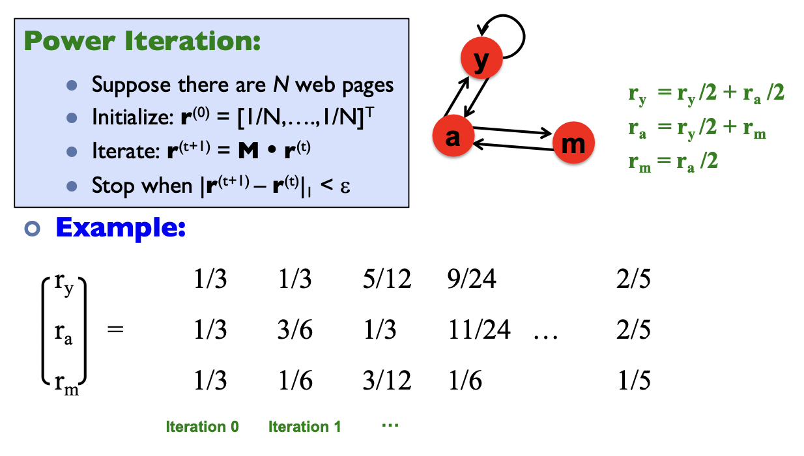
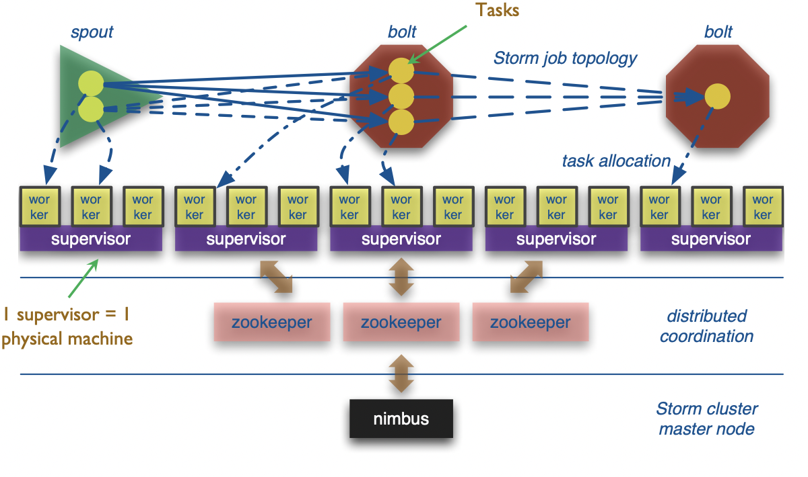

## Spark

### Motivation

Issues with Hadoop Mapreduce:

- **Network and disk I/O costs**: intermediate data has to be written to local disks and shuffled across machines, which is slow
- Not suitable for **iterative** (i.e. modifying small amounts of data repeatedly) processing, such as interactive workflows, as each individual step has to be modelled as a MapReduce job.

Spark stores most of its intermediate results in memory, making it much faster, especially for iterative processing

- When memory is insufficient, Spark **spills to disk** which requires disk I/O


Spark components and API stack

### Spark Architecture


**Driver Process** responds to user input, manages the Spark application etc.,
and distributes work to **Executors**, which run the code assigned to them
and send the results back to the driver

**Cluster Manager** (can be Spark’s standalone cluster manager, YARN,
Mesos or Kubernetes) allocates resources when the application requests it

In **local mode,** all these processes run on the same machine

### Spark APIs

**Resilient Distributed Datasets (2011)**

- A collection of JVM objects
- Functional operators (map, filter, etc)

**DataFrame (2013)**

- A collection of Row objects
- Expression-based operations
- Logical plans and optimizer

**DataSet (2013)**

- Internally ros, externally JVM objects
- Best of both worlds: type safe + fast

### RDD

```python
## Create an RDD of names, distributed over 3 partitions

dataRDD = sc.parallelize(["Alice", "Bob", "Carol", "Daniel"], 3) ## partition into 3 parts
```

RDDs are immutable, i.e. they cannot be changed once created.

This is an RDD with 4 strings. In actual hardware, it will be partitioned into the 3 workers.

#### Transformations

**Transformations** are a way of transforming RDDs into RDDs.

```python
nameLen = dataRDD.map(lambda s: len(s))
```

This represents the transformation that maps each string to its length, creating a new RDD. However, transformations are **lazy**. This means the transformation will not be executed yet, until an **action** is called on it

**Advantages of being lazy**: Spark can optimize the query plan to improve speed (e.g. removing unneeded operations)

• Examples of transformations: `map`, `order`, `groupBy`, `filter`, `join`, `select`

#### Actions

**Actions** trigger Spark to compute a result from a series of transformations.

```python
## Asks Spark to retrieve all elements of the RDD to the driver node.
nameLen.collect() ## output: [5, 3, 5, 6]
```

Examples of actions: `show`, `count`, `save`, `collect`

:::note
👉 RDDs are actually distributed across machines.
Thus, the transformations and actions are executed in parallel. The results are only sent to the driver in the final step.

:::


### Caching

**Log Mining example**: Load error messages from a log into memory, then interactively search for various patterns


`cache()`: saves an RDD to memory (of each worker node).¢
`persist(options)`: can be used to save an RDD to memory, disk, or off-heap memory (out-of-scope)

- When should we cache or not cache an RDD?
  - When it is expensive to compute and needs to be re-used multiple times.
  - If worker nodes have not enough memory, they will evict the “least recently used” RDDs. So, be aware of memory limitations when caching.

### Directed Acyclic Graph (DAG)

Internally, Spark creates a graph (DAG) which represents all the RDD objects and how they will be transformed.


**Narrow Dependencies:** each partition of the parent RDD is used by at most 1 partition of the child RDD. E.g. `map`, `flatMap`, `filter`, `contains`

**Wide dependencies:** the opposite (each partition of parent RDD is used by multiple partitions of the child RDD). E.g. `reduceByKey`, `groupBy`, `orderBy`

In the DAG, consecutive narrow dependencies are grouped together as “**stages**”.

**Within stages**, Spark performs consecutive transformations on the same machines.

**Across stages**, data needs to be **shuffled**, i.e. exchanged across partitions, in a process very similar to map-reduce, which involves writing intermediate results to disk

Minimizing shuffling is good practice for improving performance.

#### Lineage and Fault Tolerance

Unlike Hadoop, Spark does not use replication to allow fault tolerance.

- Spark tries to store all the data in memory, not disk. Memory capacity is much more limited than disk, so simply duplicating all data is expensive.

Lineage approach: if a worker node goes down, we replace it by a new worker node, and use the graph (DAG) to recompute the data in the lost partition.

- Note that we only need to recompute the RDDs from the lost partition.

### DataFrames

A DataFrame represents a table of data, similar to tables in SQL, or DataFrames in pandas.

Compared to RDDs, this is a higher level interface, e.g. it has transformations that resemble SQL operations.

- DataFrames (and Datasets) are the recommended interface for working with Spark - they are easier to use than RDDs and almost all tasks can be done with them, while only rarely using the RDD functions.
- However, all DataFrame operations are still ultimately compiled down to RDD operations by Spark.

```python
flightData2015 = spark
  .read
  .option("inferSchema", "true")
  .option("header", "true").csv("/mnt/defg/flight-data/csv/2015-summary.csv")

flightData2015.sort("count").take(3) ## Sorts by ‘count’ and output the first 3 rows (action)
## output: Array([United States,Romania,15], [United States,Croatia...

flightData2015.createOrReplaceTempView("flight_data_2015")
maxSql = spark.sql("""
  SELECT DEST_COUNTRY_NAME, sum(count) as destination_total
  FROM flight_data_2015
  GROUP BY DEST_COUNTRY_NAME
  ORDER BY sum(count) DESC
  LIMIT 5
""")
maxSql.collect()

from pyspark.sql.functions import desc
flightData2015
  .groupBy("DEST_COUNTRY_NAME")
  .sum("count")
  .withColumnRenamed("sum(count)", "destination_total")
  .sort(desc("destination_total"))
  .limit(5)
  .collect()
```

### DataSets

Datasets are similar to DataFrames, but are type-safe.

- In fact, in Spark (Scala), DataFrame is just an alias for DatasetRow]
- However, Datasets are not available in Python and R, since these are dynamically typed languages

```scala
case class Flight(DEST_COUNTRY_NAME: String, ORIGIN_COUNTRY_NAME: String, count: BigInt)
val flightsDF = spark.read.parquet("/mnt/defg/flight-data/parquet/2010-summary.parquet/")
val flights = flightsDF.as[Flight]
flights.collect() // return objects of the “Flight” class, instead of rows.
```

## Supervised ML Basics

### Typical ML Pipeline


### Data preprocessing

#### Data quality

W**hy is data missing?**

- ­Information was not collected: e.g. people decline to give weight
- _Missing at random_: missing values are randomly distributed. If data is instead _missing not at random_: then the missingness itself may be important information.

**How to handle missing values?**

- Eliminate objects (rows) with missing values
- Or: fill in the missing values ("imputation")
  - E.g. based on the **mean / median** of that attribute
  - Or: by fitting a **regression** model to predict that attribute given other attributes
  - **Dummy variables**: optionally insert a column which is 1 if the variable was missing, and 0 otherwise

#### One hot encoding


#### Normalization


### Training and Testing

#### Logistic Regression

Sigmoid function:

$$
\sigma(x) = \frac{1}{1 + e^{-x}}
$$


#### Decision Trees


#### Random Forests and Gradient Boosted Trees

Decision trees are simple, interpretable and fast, but suffer from poor accuracy, and are not robust to small changes

- For applications where interpretability is especially important, learning
  “optimal decision trees” is still an active area of research

Random Forests and Gradient Boosted Trees are very popular approaches which combine a large number of decision trees

On tabular data, their accuracy is still highly competitive with neural networks, and are faster, easier to tune, and more interpretable

### Evaluation


**Accuracy**: fraction of correct predictions (TN and TP)

**Sensitivity**: fraction of positive cases that are detected

**Specificity**: fraction of actual negatives that are correctly identified

## Spark MLLib

### Simple logistic regression model

```python
from pyspark.ml.classification import LogisticRegression

training = spark.read.format("libsvm").load("data/mllib/sample_libsvm_data.txt")
lr = LogisticRegression(maxIter=10)
lrModel = lr.fit(training)

print("Coefficients: " + str(lrModel.coefficients))
print("Intercept: " + str(lrModel.intercept))
```

### Pipelines


#### Transformers

**Transformers** are for mapping DataFrames to DataFrames

- Examples: one-hot encoding, tokenization
- Specifically, a Transformer object has a `transform()` method, which performs its transformation

Generally, these transformers output a new DataFrame which **_append_ their result to the original DataFrame.**

- Similarly, a fitted model (e.g. logistic regression) is a Transformer that transforms a DataFrame into one with the predictions appended.

#### Estimators

**Estimator** is an algorithm which takes in data, and outputs a fitted model. For example, a learning algorithm (the LogisticRegression object) can be fit to data, producing the trained logistic regression model.

They have a `fit()` method, which returns a Transformer

#### Training time

A pipeline chains together multiple Transformers and Estimators to form an ML workflow.

It is an Estimator. When `Pipeline.fit()` is called:

- Starting from the beginning of the pipeline:
- For Transformers, it calls transform()
- For Estimators, it calls fit() to fit the data, then transform() on the fitted
  model


#### Test time

The output of Pipeline.fit() is the estimated pipeline model (of type PipelineModel).

- It is a transformer, and consists of a series of Transformers.
- When its transform() is called, each stage’s transform() method is called.


#### Example

```python
training = spark.createDataFrame([
  (0, "a b c d e spark", 1.0), (1, "b d", 0.0),
  (2, "spark f g h", 1.0),
  (3, "hadoop mapreduce", 0.0)
], ["id", "text", "label"])

## Configure an ML pipeline, which consists of three stages: tokenizer, hashingTF, and lr.
tokenizer = Tokenizer(inputCol="text", outputCol="words")
hashingTF = HashingTF(inputCol=tokenizer.getOutputCol(), outputCol="features")
lr = LogisticRegression(maxIter=10, regParam=0.001)
pipeline = Pipeline(stages=[tokenizer, hashingTF, lr])

## Fit the pipeline to training documents.
model = pipeline.fit(training)
```

## Simplified PageRank

### Flow Model

Define a “rank” or importance $r_j$ \*\*for page _j_

$$
r_j = \sum_{i \rarr j}{\frac{r_i}{d_i}}
$$

where $d_i$ = number of out-links of node i (out-degree)


3 equations, 3 unknowns, 1 redundant equation

- No unique solution
- All solutions are rescalings of each other

Additional contraint: $r_y + r_a + r_m = 1$

Solution: $r_y=r_a=0.4, r_m=0.2$

### Matrix Formulation

**Stochastic adjacency matrix $M$:** page i has $d_i$ out-links, if $i \rarr j$, then $M_{ji} = \frac{1}{d_i}$ else $M_{ji}=0$

- M is a column stochastic matrix (columns sum to 1)

**Rank vector $r$:** $r_i$ is the importance score of page i, and $\sum_i{r_i} = 1$

The flow equation can be written as

$$
r = M \cdot r
$$


#### Power iteration method


**Intuitive interpretation of power iteration**: each node starts with equal importance (of 1/N). During each step, each node passes its current importance along its outgoing edges, to its neighbors.



### Random walk interpretation

Imagine a random web surfer:

- At time t = 0, surfer starts on a random page
- At any time t, surfer is on some page i
- At time t + 1, the surfer follows an out-link from i uniformly at random
- Process repeats indefinitely

Let:

- $p(t)$ ... vector whose $i^{th}$ coordinate is the prob. that the surfer is at page " at time t
- So, $p(t)$ is a probability distribution over pages

**Stationary Distribution**: as $t \rarr \infin$, the probability distribution approaches av‘steady state’ representing the long termvprobability that the random walker is at each node, which are the PageRank scores

## PageRank (with teleports)


Some pages are **dead ends** (have no out-links)

- Random walk has “nowhere” to go to
- Such pages cause importance to “leak out”


**Spider traps** (all out-links are within the group)

- Random walk gets “stuck” in a trap
- And eventually spider traps absorb all importance


### Teleports

The Google solution for spider traps: At each time step, the random surfer has two options

- With prob. b, follow a link at random
- With prob. 1-b, jump to some random page
- Common values for b are in the range 0.8 to 0.9

If at a Dead End, Always Teleport


### PageRank equation

$$
r_j = \sum_{i\rarr j}{\beta\frac{r_i}{d_i} + (1 - \beta)\frac 1 N}
$$

### The Google matrix

$$
A = \beta M + (1-\beta) \left[\frac 1 N \right]_{N\times N}
$$


## Topic-specific PageRank

Goal: Evaluate Web pages not just according to their popularity, but by how close they are to a particular topic, e.g. “sports” or “history”

**Standard PageRank:** Teleport can go to any page with equal probability

**Topic Specific PageRank:** Teleport can go to a topic-specific set of “relevant” pages (teleport set)


## **Pregel**

### **Computational Model**

Computation consists of a series of supersteps

In each superstep, the framework invokes a user-defined function, `compute()`, for each vertex (conceptually in parallel)

`compute()` specifies behavior at a single vertex _v_ and a superstep _s_:

- It can read messages sent to _v_ in superstep _s_ -1;
- It can send messages to other vertices that will be read in superstep _s_ + 1;
- It can read or write the value of _v_ and the value of its outgoing edges (or
  even add or remove edges)

Termination:

- A vertex can choose to deactivate itself
- Is “woken up” if new messages received
- Computation halts when all vertices are inactive

**Example:** Computing max

```python
Compute(v, messages):
  changed = False
  for m in messages:
    if v.getValue() < m:
      v.setValue(m)
      changed = True
  if changed:
    for each outneighbor w:
      sendMessage(w, v.getValue())
  else:
    voteToHalt()
```


### Implementation


Master & workers architecture

- Vertices are hash partitioned (by default) and assigned to workers
- Each worker maintains the state of its portion of the graph in memory
- Computations happen in memory
- In each superstep, each worker loops through its vertices and executes compute()
- Messages from vertices are sent, either to vertices on the same worker, or to vertices on different workers (buffered locally and sent as a batch to reduce network traffic)

Fault tolerance

- Checkpointing to persistent storage
- Failure detected through heartbeats; corrupt workers are reassigned and reloaded from checkpoints

### Giraph architecture

- Giraph originated as the open-source counterpart to _Pregel,_ with several features beyond the basic Pregel model.
- Employs Hadoop’s Map phase to run computations
- Employs ZooKeeper (service that provides distributed synchronization) to enforce barrier waits


### PageRank in Pregel


## Stream


### Reservoir Sampling


**Given**: a stream of items ${ a_1, a_2, \dots }$

**Goal**: maintain a ‘uniform random sample\*\*’\*\* of fixed size B over time

### Stream Data Processing System: Storm

**Tuple**: an ordered list of named values, like a database row

- Items in a tuple can be accessed either via their index, or their name

To do computation in Storm, the user creates a **topology**, which is a computation graph

- Nodes hold processing logic (i.e., transformation over its input)
- Edges indicate communication between nodes
- Each topology corresponds to a Storm **job**. Once started, a job continues running forever until killed.


#### Storm architecture



Bolts are executed by multiple executors in parallel, called “tasks”

Stream groupings:

- **Shuffle** grouping: tuples are randomly distributed across tasks
- **Field** grouping: based on the value of a (user-specified) field
- **All**: replicate tuple across all tasks of the target bolt
