## Introduction

### Storage hierarchy

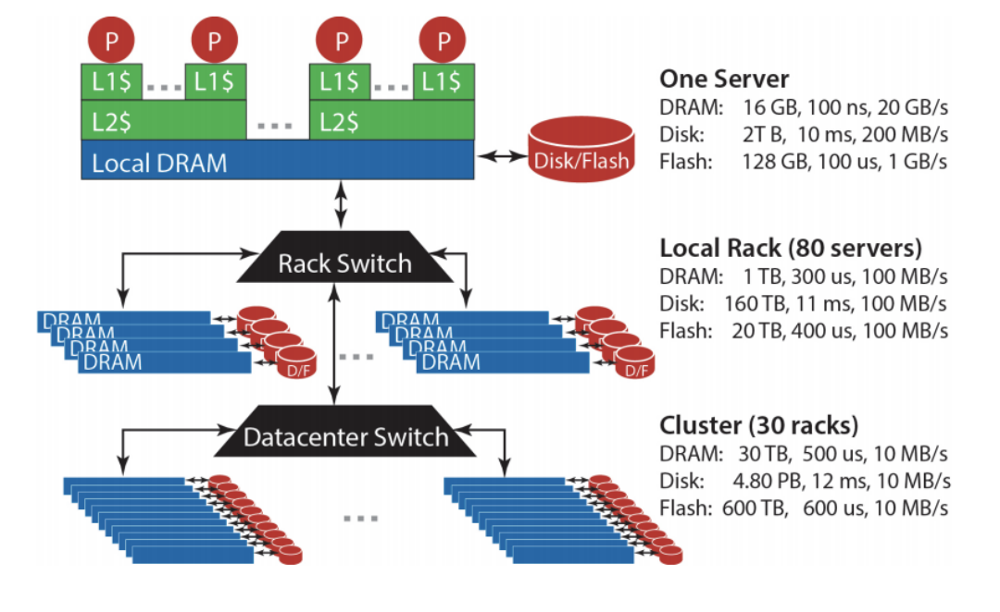

### Bandwidth vs Latency

**Bandwidth**: maximum amount of data that can be transmitted per unit time (e.g. in GB/s)

**Latency**: time taken for 1 packet to go from source to destination (one-way) or from source to destination back to source (round trip), e.g. in ms

When transmitting a large amount of data, **bandwidth** tells us roughly how long the transmission will take. When transmitting a very small amount of data, **latency** tells us how much delay there will be.
**Throughput** is similar to bandwidth, but instead of referring to capacity, it refers to the rate at which some data was actually transmitted across the network during some period of time.

### “Big Ideas” of Massive Data Processing in Data Centers

Scale “out”, not “up”:

- scale ‘out’ = combining many cheaper machines; scale ‘up’: increasing the power of each individual machine
- Also called ’horizontal’ vs ‘vertical’ scaling

Move processing to the data:

- Clusters have limited bandwidth: we should move the task to the
  machine where the data is stored

Process data sequentially, avoid random access. Seeks are expensive, disk throughput is reasonable

Seamless scalability:

- E.g. if processing a certain dataset takes 100 machine hours, ideal
  scalability is to use a cluster of 10 machines to do it in about 10 hours.

## MapReduce

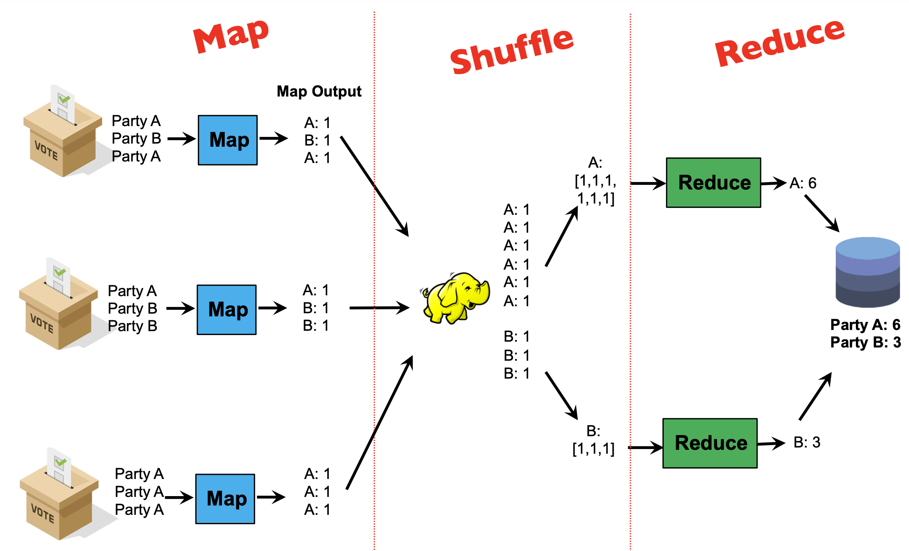

Programmers specify two functions:

- `map (k1, v1) → List(k2, v2)`
- `reduce (k2, List(v2)) → List(k3, v3)`
  - All values with the same key are sent to the same reducer

The execution framework handles the challenging issues...

- How do we assign work units to workers?
- What if we have more work units than workers? l What if workers need to share partial results?
- How do we aggregate partial results?
- How do we know all the workers have finished? l What if workers die/fail?

### MapReduce implementation

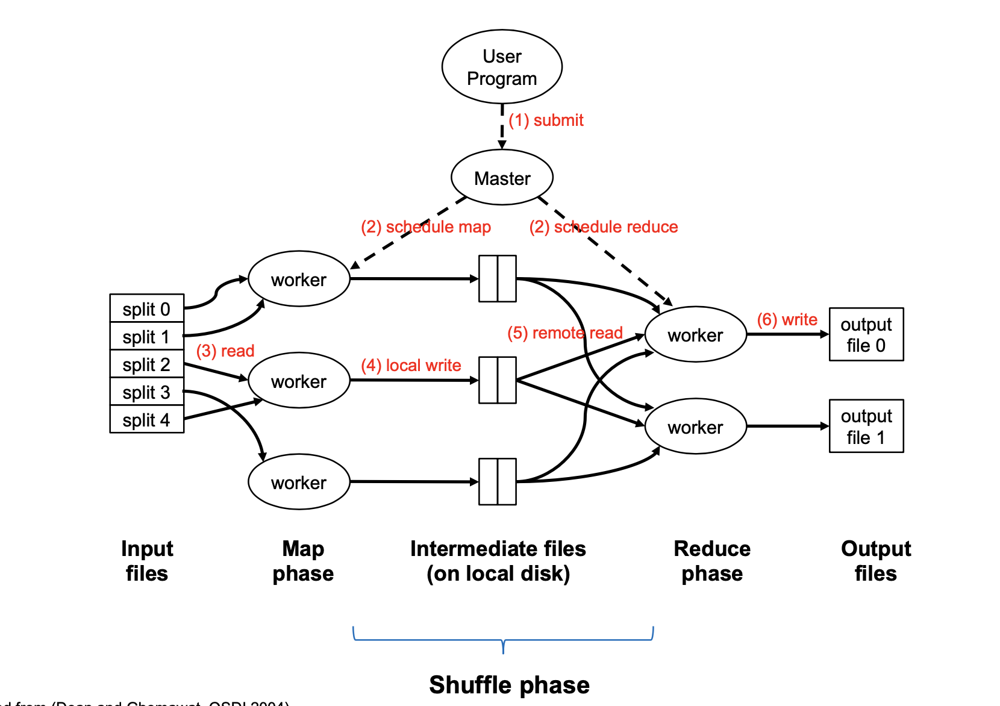

**Map Task** is a basic unit of work; it is typically 128MB. In the beginning, the input is broken into splits of 128MB. A map task is a **job** required to process one split; not a physical machine.

A single physical machine (or **worker**) can handle multiple map tasks. Typically, when a machine completes a map task (e.g. split 0), it is re-assigned to another task (e.g. split 3)

A “**mapper**” or “**reducer**” will generally refer to the process of executing a map or reduce task, not to physical machines.

“**Map Function**” is a single call to the user-defined `map (k1, v1) → List(k2, v2)` function.

Barrier between map and reduce phases. But we can begin copying intermediate data earlier

Keys arrive at each reducer in sorted order. No enforced ordering across reducers.

Usually, programmers optionally also specify `partition` and `combine` functions. These are an optional optimization to reduce network traffic.

### Partition step

By default, the assignment of keys to reducers is determined by a hash function, e.g., key `k` goes to reducer `(hash(k) mod num_reducers)`

Users can optionally implement a custom partition, e.g. to better spread out the load among reducers (if some keys have much more values than others)

### Combiner step

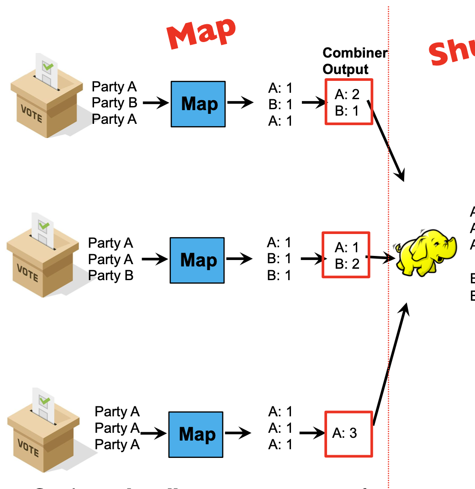

**Combiners** locally aggregate output from mappers.

**Combiners** are ‘mini-reducers’: in this example, **combiner** and **reducer** are the same functions!

It is the user’s responsibility to ensure that the combiner does not affect the correctness of the final output, whether the combiner runs 0, 1, or multiple times

**E.g:** in the election example, the combiner and reducer are a “sum” over values with the same key. Summing can be done in any order without affecting correctness. The same holds for “max” and “min”

In general, it is correct to use reducers as combiners if the reduction involves a binary operation that is both

- **Associative:** a+(b+c)=(a+b)+c
- **Commutative:** a+b=b+a

### Example

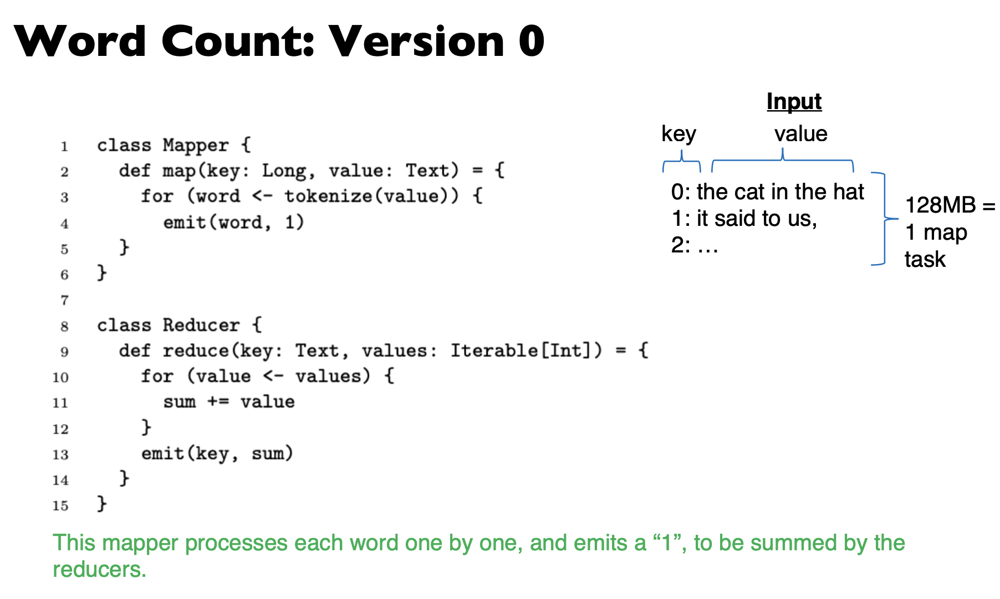

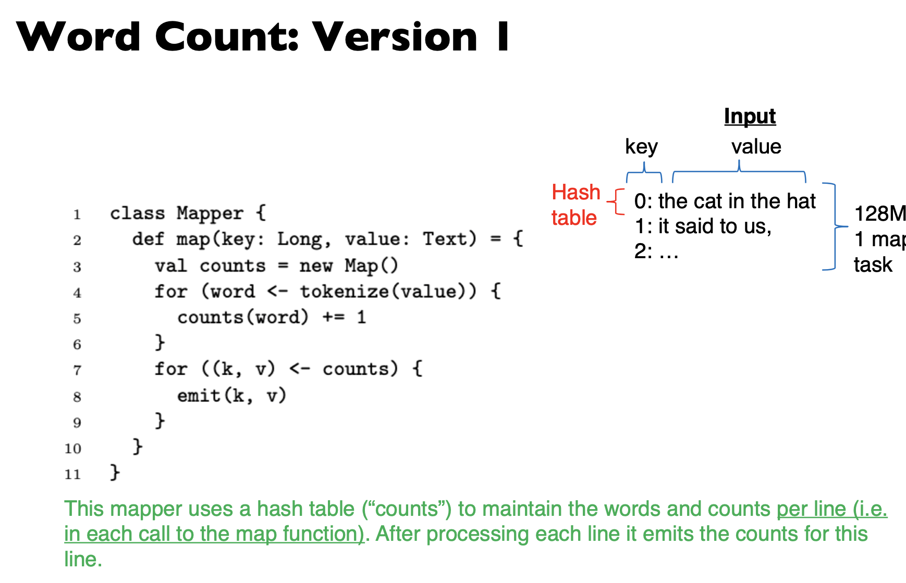

This mapper uses a hash table (“counts”) to maintain the words and counts per line (i.e. in each call to the map function). After processing each line it emits the counts for this line.

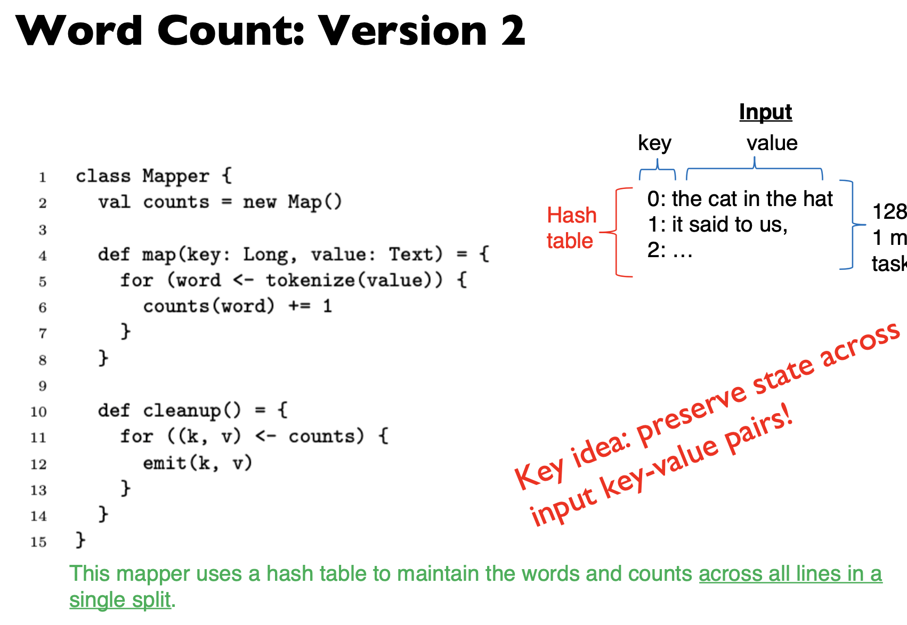

### **Preserving State in Mappers / Reducers**

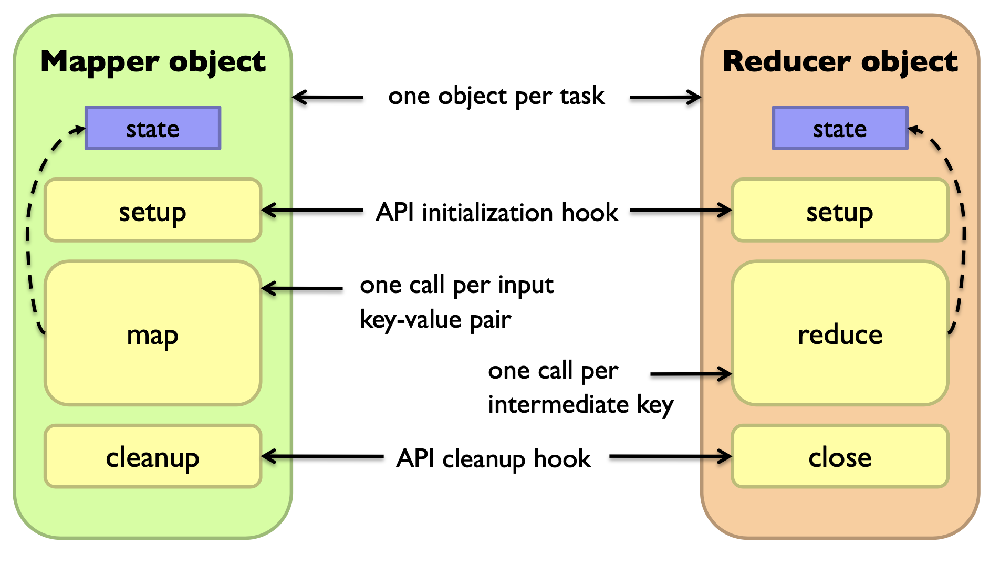

### Secondary sort

**Problem**: each reducer’s values arrive unsorted. But what if we want them to be sorted (e.g. sorted by temperature)?

**Solution**: define a new ‘composite key’ as `(K1, K2)`, where `K1` is the original key (“Natural Key”) and `K2` is the variable we want to use to sort

**Partitioner**: now needs to be customized, to partition by `K1` only, not `(K1, K2)`

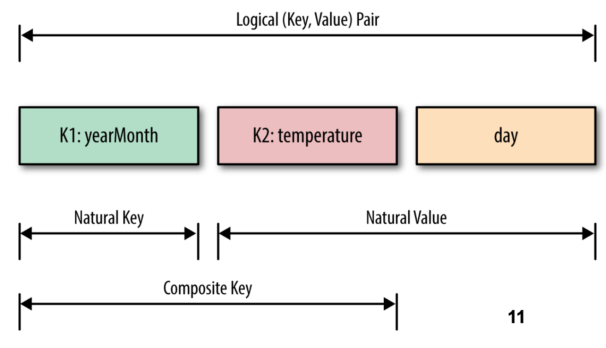

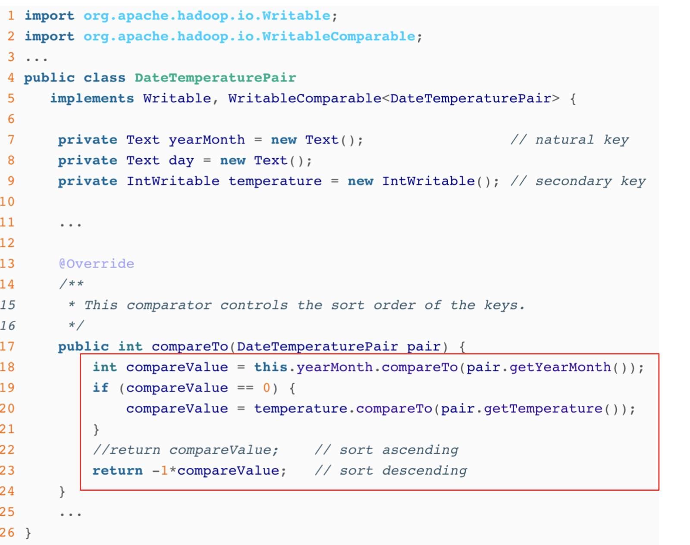

### Performance Guidelines for Basic Algorithmic Design

1. Linear scalability: more nodes can do more work at the same time
   - Linear on data size
   - Linear on computer resources
2. Minimize the amount of I/Os in hard disk and network
   - Minimize disk I/O; sequential vs. random.
   - Minimize network I/O; bulk send/recvs vs. many small send/recvs
3. Memory working set of each task/worker
   - Large memory working set → high probability of failures.

Guidelines are applicable to Hadoop, Spark, ...

## Hadoop File System

Don’t move data to workers... move workers to the data!

- Store data on the local disks of nodes in the cluster
- Start up the workers on the node that has the data local

A distributed file system is the answer

- GFS (Google File System) for Google’s MapReduce
- HDFS (Hadoop Distributed File System) for Hadoop

### GFS/HDFS assumptions

Commodity hardware instead of “exotic” hardware → Scale “out”, not “up”

High component failure rates. Inexpensive commodity components fail all the time

“Modest” number of huge files

Files are write-once, mostly appended to

Large streaming reads instead of random access → High sustained throughput over low latency

### Design decisions

Files stored as chunks → Fixed size (64MB for GFS, 128MB for HDFS)

Reliability through replication → Each chunk replicated across 3+ chunk servers

Single master to coordinate access, and keep metadata → Simple centralized management

### HDFS Architeccture

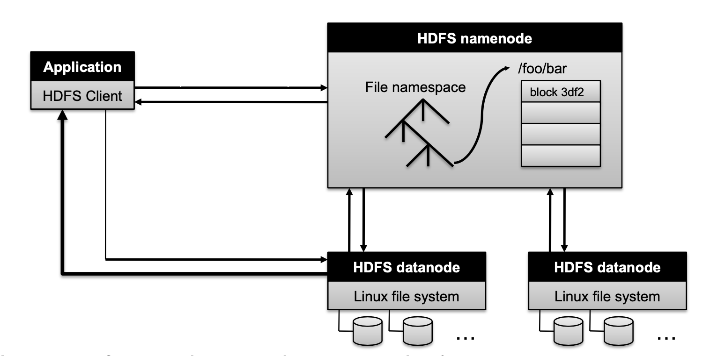

How to perform replication when writing data?

- Namenode decides which datanodes are to be used as replicas. The 1st datanode forwards data blocks to the 1st replica, which forwards them to the 2nd replica, and so on.

### Namenode responsibility

Managing the file system namespace:

- Holds file/directory structure, metadata, file-to-block mapping, access
  permissions, etc. Coordinating file operations:
- Directs clients to datanodes for reads and writes
- No data is moved through the namenode

Maintaining overall health:

- Periodic communication with the datanodes
- Block re-replication and rebalancing
- Garbage collection

What if the namenode’s data is lost?

- All files on the filesystem cannot be retrieved since there is no way to reconstruct them from the raw block data. Fortunately, Hadoop provides 2 ways of improving resilience, through backups and secondary namenodes

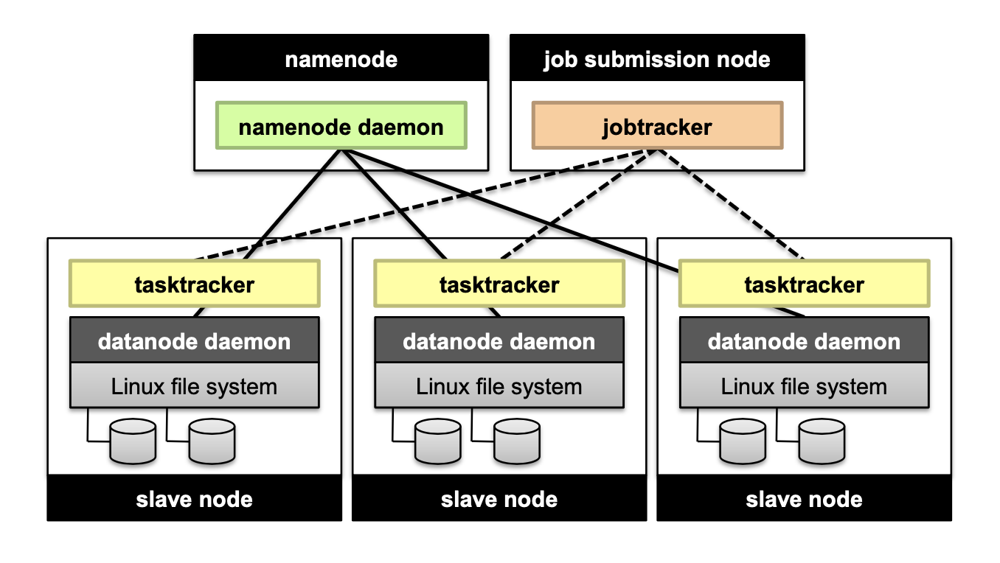

## MapReduce and relational database

### Projection in MapReduce

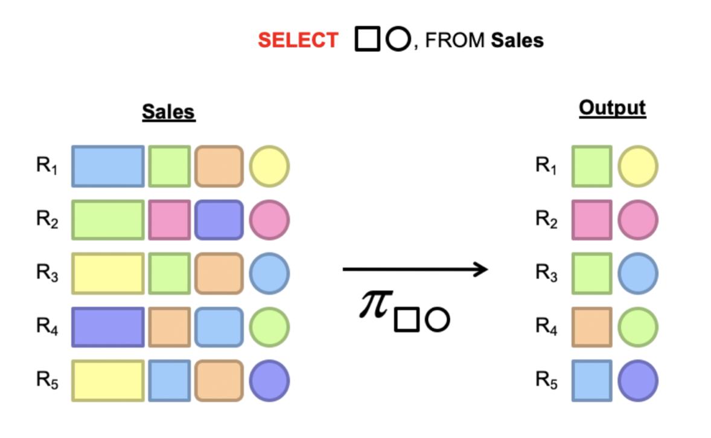

**Map**: take in a tuple (with tuple ID as key), and emit new tuples with appropriate attributes

No reducer needed (⇒ no need shuffle step)

### Selection in MapReduce

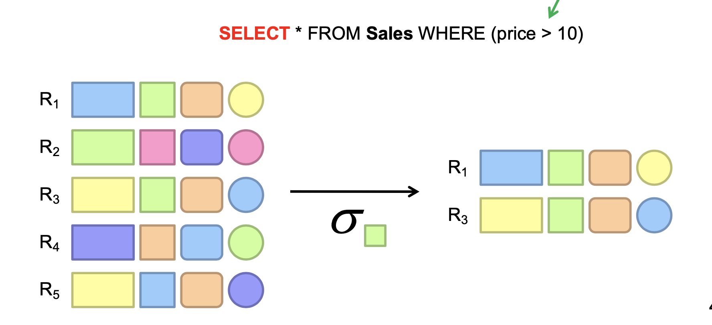

**Map**: take in a tuple (with tuple ID as key), and emit only tuples that meet the predicate.

No reducer needed

### Aggregation `GROUP BY`

Example: What is the average sale price per product?

In SQL: `SELECT product_id, AVG(price) FROM sales GROUP BY product_id`

In MapReduce:

- Map over tuples, emit `<product_id, price>`
- Framework automatically groups values by keys
- Compute average in reducer
- Optimize with combiners

### Inner join

#### Method 1: Broadcast join

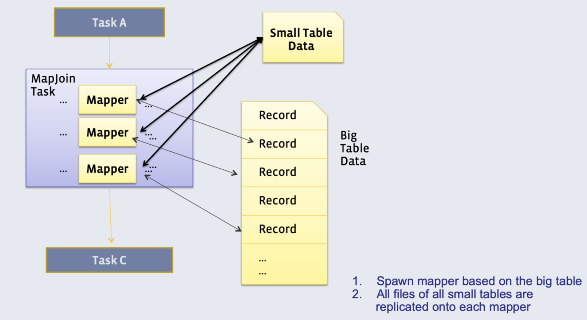

Requires one of the tables to fit in memory

- All mappers store a copy of the small table (for efficiency: we convert it to a hash table, with keys as the keys we want to join by)
- They iterate over the big table, and join the records with the small table

#### Method 2: Reduce-side (’Common’) join

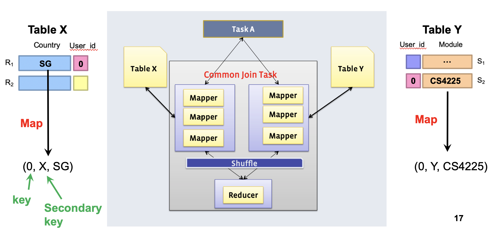

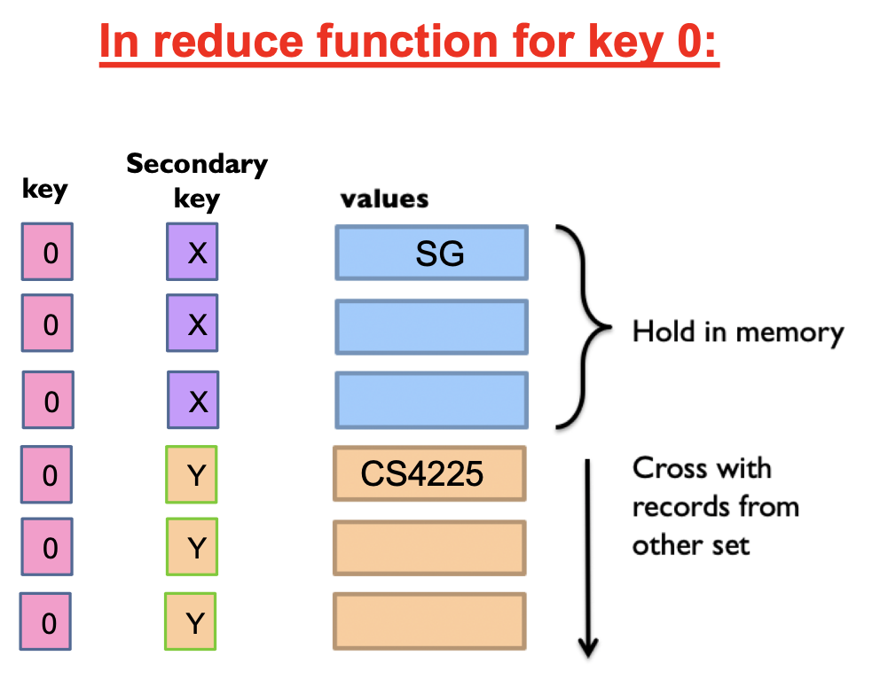

Doesn’t require a dataset to fit in memory, but slower than map-side join

- Different mappers operate on each table, and emit records, with key as the variable to join by

In reducer: we can use secondary sort to ensure that all
keys from table X arrive before table Y

- Then, hold the keys from table X in memory and cross them with records from table Y

## Similarity search

Euclidean distance, Manhattan distance

Cosine similarity: $s(a,b) = \frac{\vec{a} \cdot \vec{b}}{|a| \cdot |b|}$

Jaccard similarity: $s_{Jaccared}(A, B) = \frac{|A\cap B|}{|A\cup B|}$

Jaccard distance: $d_{Jaccard} = 1 - s_{Jaccard}$

### **Finding Similar Documents**

All pairs similarity: Given a large number N of documents, find all “near duplicate” pairs, e.g. with Jaccard distance below a threshold
Similarity search: Given a query document D, find all documents which are “near duplicates” with D

**Shingling**: Convert documents to sets of short phrases (“shingles”)

**Min-Hashing:** Convert these sets to short “signatures” of each document, while preserving similarity

- A “signature” is just a block of data representing the contents of a document in a compressed way
- Documents with the same signature are candidate pairs
- MinHash gives us a fast approximation to the result of using Jaccard similarities to compare all pairs of documents

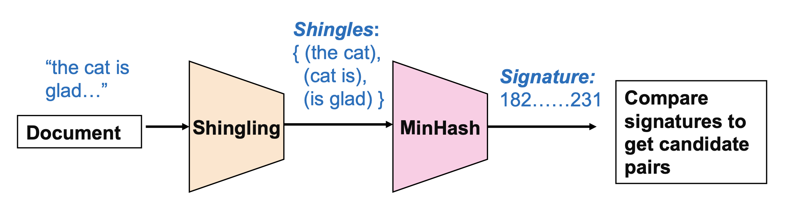

### MinHashing

Hash each column C to a small signature h(C), such that:

- h(C) is small enough that the signature fits in RAM
- highly similar documents usually have the same signature

Given a set of shingles, { (”the cat”), (”cat is)”, (”is glad”) }

1. We have a hash function h that maps each shingle to an integer: h(“the cat”) = 12, h(“cat is”) = 74, h(“is glad”) = 48
2. Then compute the minimum of these: min(12, 74, 48) = 12

**Key property:** the probability that two documents have the same MinHash signature is equal to their Jaccard similarity!

$$
Pr(h(C_1) = h(C_2)) = JaccardSim(C_1, C_2)
$$

**Candidate pairs:** the documents with the same final signature are “candidate pairs”. We can either directly use them as our final output, or compare them one by one to check if they are actually similar pairs.

**Extension to multiple hashes:** in practice, we usually use multiple hash functions (e.g. N=100), and generate N signatures for each document. “Candidate pairs” can be defined as those matching a ‘sufficient number’ (e.g. at least 50) among these signatures.

### MapReduce Implementation

Map:

- Read over the document and extract its shingles
- Hash each shingle and take the min of them to get the MinHash signature
- Emit `<signature, document_id>`

Reduce:

- Receive all documents with a given MinHash signature
- Generate all candidate pairs from these documents
- (Optional): compare each such pair to check if they are actually similar

## Clustering

### K-Means Algorithm

1. Initialization: Pick K random points as centers
2. Repeat:
   1. Assignment: assign each point to nearest cluster
   2. Update: move each cluster center to average of its assigned points
      Stop if no assignments change

### MapReduce implementation v1

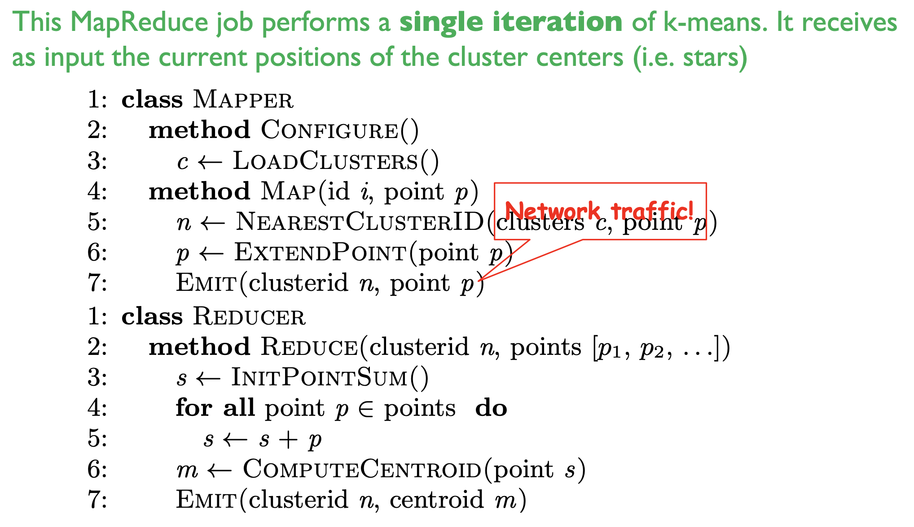

### MapReduce implementation v2 (with in-mapper combiner)

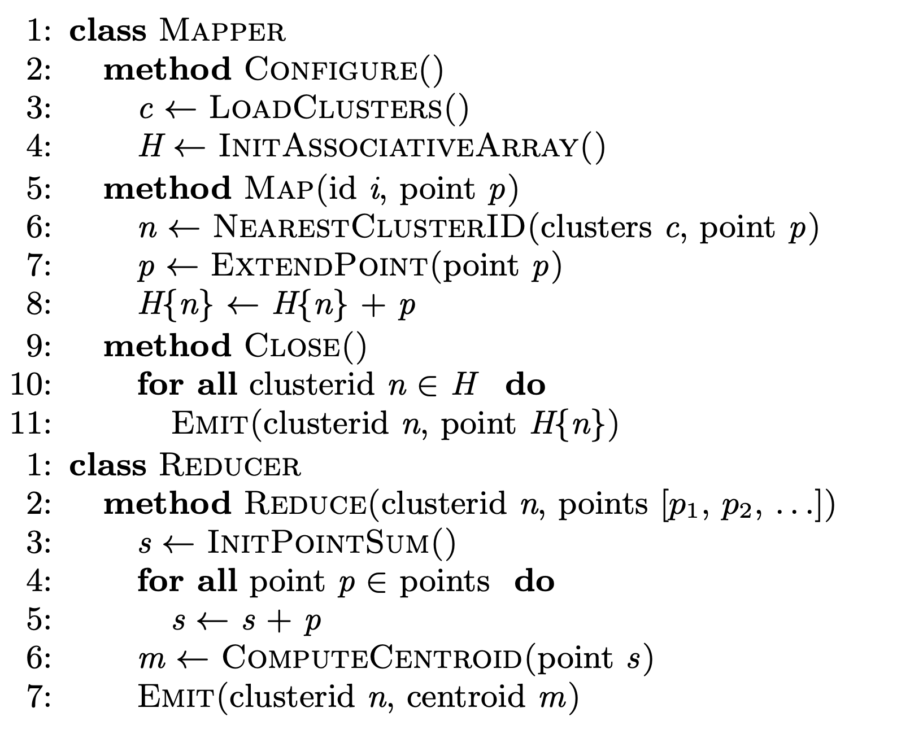

## NoSQL

Not Only SQL

- Key-Value store: Redis
- Document store: MongoDB
- Wide column databases: Cassandra
- Graph databases: Neo4j

### Key-value stores

Stores associations between keys and values
Keys are usually primitives and can be queried

- For example, ints, strings, raw bytes, etc.

Values can be primitive or complex; usually cannot be queried

- Examples: ints, strings, lists, JSON, HTML fragments, BLOB (basic large object), etc.

Non-persistent: Just a big in-memory hash table

- Examples: Memcached, Redis (But these can also backup the data to disk periodically)

Persistent: Data is stored persistently to disk

- Examples: RocksDB, Dynamo, Riak

### Document stores

A database can have multiple collections

Collections have multiple documents

A document is a JSON-like object: it has fields and values

- Different documents can have different fields
- Can be nested: i.e.JSON objects as values

Unlike (basic) key value stores, document stores allow some querying based on the content of a document

### Wide column stores

Rows describe entities

Related groups of columns are grouped as column families

Sparsity: if a column is not used for a row, it doesn’t use space

Examples: BigTable, Cassandra, HBase

### **Strong vs Eventual Consistency**

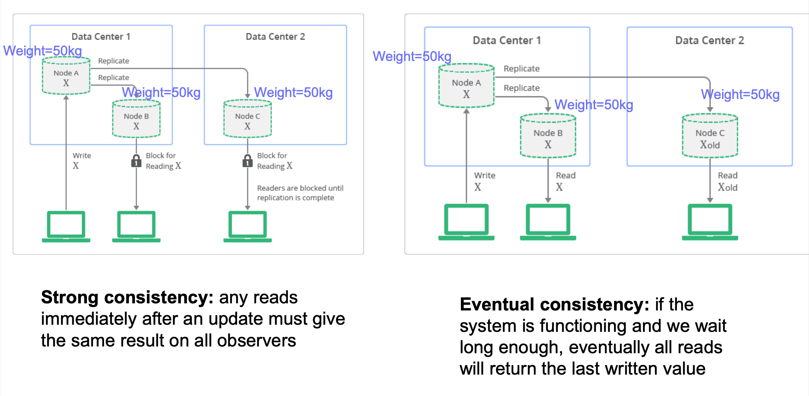

ACID vs BASE: Relational DBMS provide stronger (ACID) guarantees, but many NoSQL system relax this to weaker “BASE” approach:

- **Basically Available:** basic reading and writing operations are available most of the time
- **Soft State:** without guarantees, we only have some probability of knowing the state at any time
- **Eventually Consistent:** Contrast to “strong consistency”:

**Implications**: eventual consistency offers better availability at the cost of a much weaker consistency guarantee. This may be acceptable for some applications (e.g. statistical queries, tweets, social network feed, ...) but not for others (e.g. financial transactions)

- Note that while NoSQL systems allow for weaker consistency guarantees, many more recent systems / versions are often configurable, i.e. can be configured for multiple different consistency levels (including strong) – ‘tunable consistency’

### Pros and cons of NoSQL Systems

Pros:

- Flexible/dynamic schema: suitable for less well-structured data
- Horizontal scalability: we will discuss this more next week
- High performance and availability: due to their relaxed consistency model and fast reads/writes

Cons:

- No declarative query language: query logic (e.g. joins) may have to be handled on the application side, which can add additional programming
- Weaker consistency guarantees: application may receive stale data that may need to be handled on the application side

## NoSQL and Basics of Distributed Databases

### Distributed Database Architectures

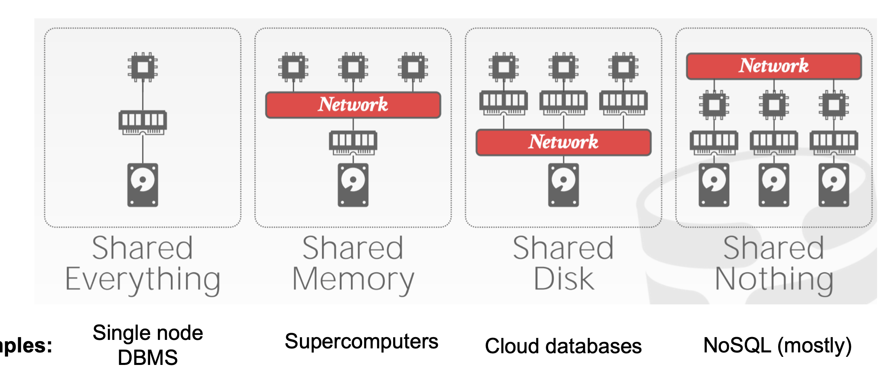

### Table partitioning

Put different tables (or collections) on different machines

**Problem**: scalability – each table cannot be split across multiple machines

### Horizontal Partitioning (Sharding)

Different tuples are stored in different nodes

Partition Key (or “shard key”) is the variable used to decide which node each tuple will be stored on: tuples with the same shard key will be on the same node

- How to choose partition key? If we often need to filter tuples based on a column, or “group by” a column, then that column is a suitable partition key
- Example: if we filter tuples by `user_id=100`, and `user_id` is the partition key, then all the `user_id=100` data will be on the same partition. Data from other partitions can be ignored (called ‘partition pruning’), which saves time as we don’t have to scan these tuples.

Imagine using each user’s city, `city_id` as a partition key; when is this good / bad?

- good if we mostly aggregate data only within individual cities. Bad if there are too few cities (or cities are very imbalanced) and this causes a lack of scalability.

#### Range partition

Split partition key based on range of values

- Beneficial if we need range-based queries. In the above example, if the user queries for `user_id < 50`, all the data in partition 2 can be ignored (‘partition pruning’); this saves a lot of work
- But: range partitioning can lead to imbalanced shards, e.g. if many rows have `user_id = 0`
- Splitting the range is automatically handled by a balancer (it tries to keep the shards balanced)

#### Hash partition

Hash partition key, then divide that into partitions based on ranges

- Hash function automatically spreads out partition key values roughly evenly

In previous approaches, how to add / remove a node? If we completely redo the partition, a lot of data may have to be moved around, which is inefficient.

- Answer: consistent hashing

#### Consistent hashing

Think of the output of the hash function as lying on a circle:

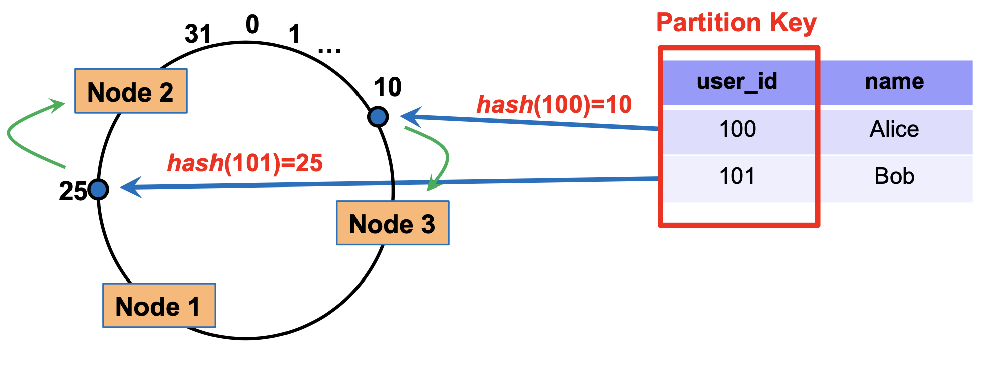

How to partition: each node has a ‘marker’ (rectangles)

Each tuple is placed on the circle, and assigned to the node that comes clockwise after it

To delete a node, we simply re-assign all its tuples to the node clock-wise after this one

Similarly, nodes can be added by splitting the largest current node into two

**Simple replication strategy:** replicate a tuple in the next few (e.g. 2) additional nodes clockwise after the primary node used to store it

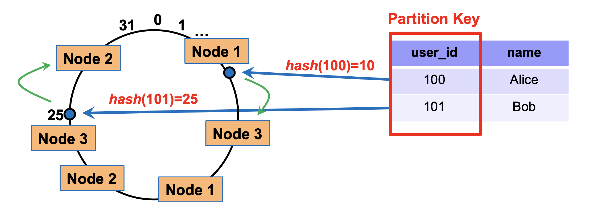

**Multiple markers:** we can also have multiple markers per node. For each tuple, we still assign it to the marker nearest to it in the clockwise direction.

Benefit: when we remove a node (e.g. node 1), its tuples will not allbe reassigned to the same node. So, this can balance load better.

## Query processing in NoSQL

### Architecture of MongoDB

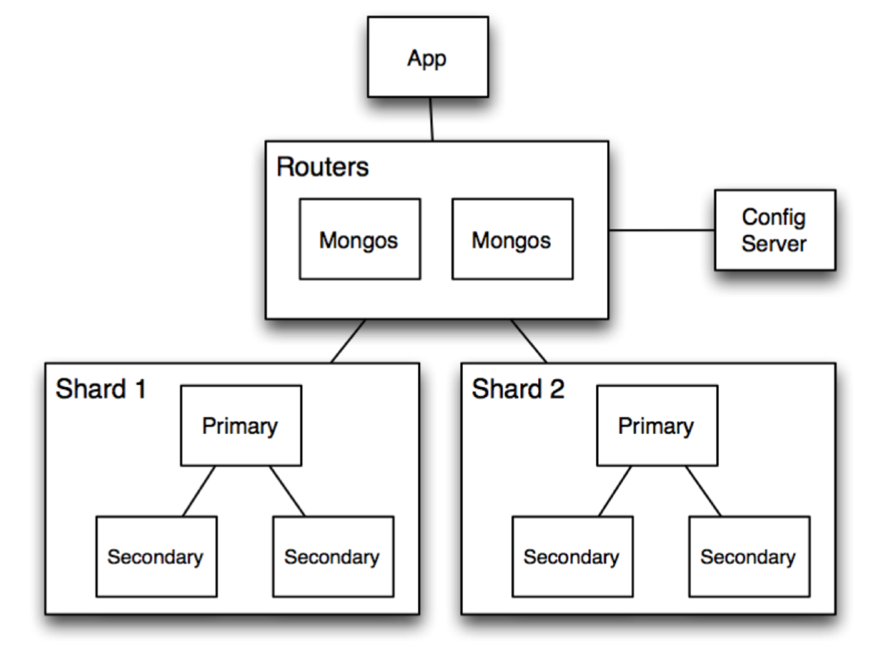

**Routers (mongos)**: handle requests from application and route the queries to correct shards

**Config Server:** stores metadata about which data is on which shard

**Shards:** store data, and run queries on their data

#### Example of Read or Write Query

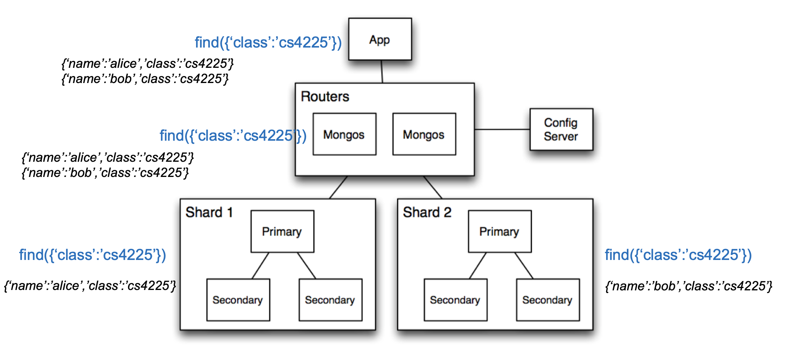

1. Query is issued to a router (mongos) instance
2. With help of config server, mongos determines which shards should be queried
3. Query is sent to relevant shards
4. Shards run query on their data, and send results back to mongos
5. mongos merges the query results and returns the merged results

### Reasons for Scalability & Performance of NoSQL

**Horizontal partitioning:** as we get more and more data, we can simply partition it into more and more shards (even if individual tables become very large)

- Horizontal partitioning improves speed due to parallelization.

**Duplication:** Unlike relational DBs where queries may require looking up multiple tables (joins), using duplication in NoSQL allows queries to go to only 1 collection.

**Relaxed consistency guarantees:** prioritize availability over consistency – can return slightly stale data
