## Basic operations

### Pixel‐wise Operations

Transform a into b: $b(x, y) = F\left(a(x, y)\right)$

E.g: Histogram manipulation, Grayscale modification, Image normalization

#### Grayscales modification

Find max and min gray level: $\max(a), \min(a)$

Dynamic range of a: $\left[ \min(a), \max(a) \right]$

Change to $\left[ newMin, newMax \right]$ by:

$$
b(x, y) = \left[ \frac{a(x, y) - \min(a)}{\max(a) - \min(a)}\times (newMax-newMin) \right] + newMin
$$

**Brightness**: The measured intensity of all the pixels comprising an ensemble that constitutes the digital image after it has been captured, digitized, and displayed.

**Contrast**: The amount of color or grayscale differentiation that exists between various image features in both analog and digital images.

### Histogram

Application: Histogram equalization, Histogram‐based color reduction, Used as a feature vector, Template matching

#### Histogram equalization

1. Original image has got `N` pixels, `G` gray levels, and should be converted to an image with `K` gray levels with uniform distribution.
2. Start from the lowest gray level, `g=0, k=0`.
3. Accumulatively count the number of pixels in gray levels and increase g, g++.
4. When the accumulated number of pixels gets to N/K, assign a new gray level, k, to that group.
5. g++, k++, number of pixels counter=0.
6. Continue from 3

#### Template matching algorithm

1. Key image `k`, its histogram `h_k`, input image `a`, its histogram `h_a`.
2. The Numbers of gray levels are equal in `k` and `a`.
3. Apply histogram equalization on `a`, results are `a1`, `h_a1`.
4. Use cumulative distribution of gray levels in `k`, try to put the equal number of pixels in the bins of `a2`, `a -> a1 -> a2`. the goal is to maximize the similarity between cumulative distribution of `h_k` and `h_a2`.

## Convolution

**Properties**: Commutative → $f*g=g*f$. Associative → $f*(g*h) = (f*g)*h$. Distributive → $f*(g+h) = f*g + g*h$

### Lowpass filter

Make the image less noisy but blur.

$$
h_{l1} = \frac{1}{9}\begin{bmatrix}
1 & 1 & 1 \\
1 & 1 & 1 \\
1 & 1 & 1
\end{bmatrix}
$$

Gaussian filter: $G(x,y)=\frac{1}{2\pi \sigma^2} \exp{(-\frac{x^2+y^2}{2\sigma^2})}$

$$
h_{l2} = \frac{1}{273} \begin{bmatrix}
1 & 4 & 7 & 4 & 1 \\
4 & 16 & 26 & 16 & 4 \\
7 & 26 & 41 & 26 & 7\\
4 & 16 & 26 & 16 & 4 \\
1 & 4 & 7 & 4 & 1
\end{bmatrix}
$$

**Padding:** Zero padding vs. Average padding vs. Random padding

**Stride:** #steps we are moving in each step in convolution (1 by default)

`m*m` image convolve with `n*n` kernel, output is of size `(m-n+1) * (m-n+1)`

- If padding `p` then `(m + 2*p - n + 1)*(m + 2*p - n + 1)`
- If stride `s` then `((m + 2*p - n + 1)/s + 1)*((m + 2*p - n + 1)/s + 1)`

### Median Filter

Can use mode instead. Good in dealing with dot (salt & pepper) noises. No unsharping/blurring effect. Patch size variant

### Noise

**White noise:** a random signal having equal intensity at different frequencies, giving it a constant power spectral density.

Presence of noise in an image might be **additive** or **multiplicative**.

**Dot noise:** Mostly result of the multiplication of a `[0,1]` or `[1,255]` matrix with your image. Could be due to channel disconnection or saturation.

**Signal to Noise Ratio:**

$$
SNR(a) = 10\log_{10}{\left(\frac{Power(a)}{Power(n)}\right)}
$$

Calculated in $dB$, Noise power is often calculated by $Power(n) = \sigma^2(n)$

### Highpass Filter

Typically a gradient or differentiation operator, tend to be differential and derivative operators (1st or 2nd order).

$$
h_{h1} = \begin{bmatrix}
1 & -1\\
-1 & 1
\end{bmatrix},\quad h_{h2} = \begin{bmatrix}
-1 & -1 & -1\\
-1 & 8 & -1\\
-1 & -1 & -1
\end{bmatrix}
$$

$$
h_{h3} = \begin{bmatrix}
-1 & -1 & -1\\
-1 & 9 & -1\\
-1 & -1 & -1
\end{bmatrix},\quad h_{h2} = \begin{bmatrix}
0 & -1 & 0\\
-1 & 4 & -1\\
0 & -1 & 0
\end{bmatrix}
$$

Discrete 1st derivative: $\frac{\partial f}{\partial x} = f(x+1) - f(x)$

Discrete 2nd derivative: $\frac{\partial^2 f}{\partial x^2} = f(x+1) + f(x-1) - 2f(x)$

Laplacian:

$$
\nabla^2f = \frac{\partial^2f}{\partial x^2} + \frac{\partial^2f}{\partial y^2} \\= \left[ f(x+1,y) + f(x-1,y) + f(x, y+1) + f(x,y-1) \right] - 4f(x,y)
$$

Laplacian Filter: $h = \begin{bmatrix}
0& 1& 0\\
1& -4& 1\\
0& 1& 0
\end{bmatrix}$

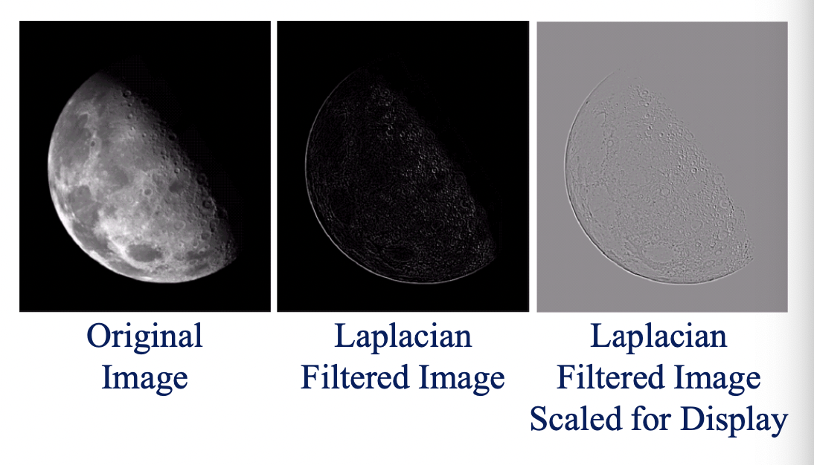

### Sobel Operator

$$
h_{sy} = \begin{bmatrix}
-1& -2& -1\\
0& 0& 0\\
1& 2& 1
\end{bmatrix},\quad
h_{sx} = \begin{bmatrix}
-1& 0& 1\\
-2& 0& 2\\
-1& 0& 1
\end{bmatrix},
$$

$$
G_x = a*h_{sx}, G_y = a*h_{sy}
$$

Edge strength map: $|G| = \sqrt{G_x^2 + G_y^2}$

Edge direction map: $\angle G = \arctan{\left(\frac{G_y}{G_x}\right)}$

Apply thresholding ($T$ is the threshold):

$$
⁍
$$

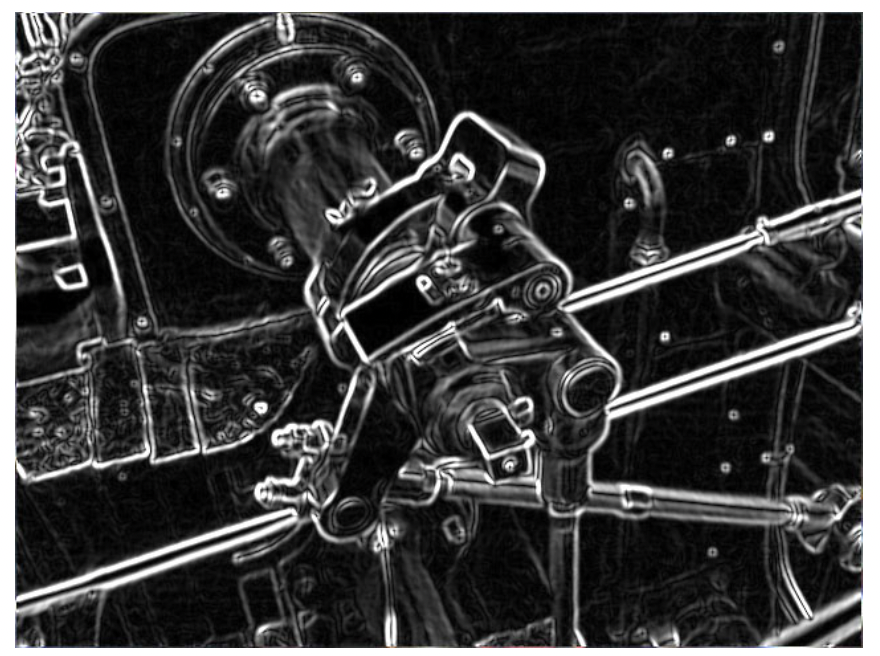

Many things can be done with $|G|$ and $\angle G$: Finding the strongest edges and their direction, border tracking and vectorization

Diagonal edge detection:

$$
h_{s135} = \begin{bmatrix}
-2 &-1 &0\\
-1 &0 &1\\
0 &1 &2
\end{bmatrix},\quad h_{s135} = \begin{bmatrix}
0 &1 &2\\
-1 &0 &1\\
-2 &1 &0
\end{bmatrix}
$$

→ Mathematically it’s a bit problematic due to the lack of orthogonality, but practically it’s not bad.

### Unsharp masking

Edge enhancement algorithm

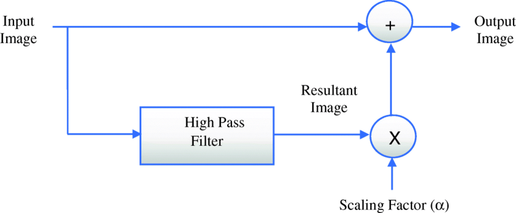

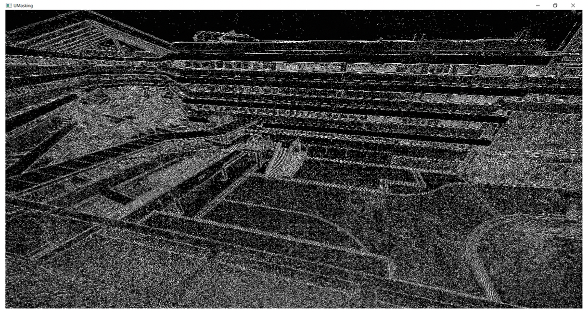

### Image Energy, Power, and Entropy

$$
Energy(a) = \sum_i\sum_j{a^2(i, j)}\\
Power(a) = \frac{1}{MN}\sum_i\sum_j{a^2(i, j)}\\
Entropy(a) = -\sum_{k}P_k\log_2{P_k}
$$

$P_k$ is the probability associated with gray level $k$. Entropy of an img measures the degree of randomness in the img → noisy img has higher entropy than original img

## Image transform

### Fourier transform

Continuous:

$$
F(f(x,y)) = F(u, v) = \int\limits_{-\infty}^{\infty}\int\limits_{-\infty}^{\infty}{f(x,y) e^{-j2\pi (ux+vy)}dx, dy}\\
F^-{1}(F(u,v)) = f(x, y) = \int\limits_{-\infty}^{\infty}\int\limits_{-\infty}^{\infty}{F(u,v) e^{-j2\pi (ux+vy)}du, dv}
$$

Discrete:

$$
F(u,v) = \frac{1}{MN}\sum_{x=0}^{M-1}\sum_{y=0}^{N-1} {f(x,y)\exp{\left[ -j2\pi(\frac{ux}{M} + \frac{vy}{N}) \right]}}\\
f(x,y) = \sum_{u=0}^{M-1}\sum_{v=0}^{N-1} {F(u,v)\exp{\left[j2\pi(\frac{ux}{M} + \frac{vy}{N}) \right]}}
$$

where:

$$
u = 0, 1, 2, \dots, M-1, v = 0, 1, 2, \dots, N-1, and\ x = 0, 1, 2, \dots, M-1, y = 0, 1, 2, \dots, N-1
$$

FFT is a one-to-one and invertible transform

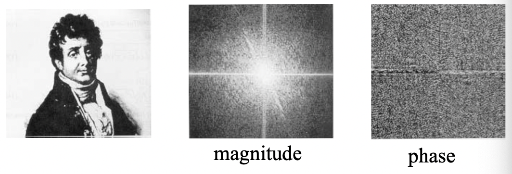

Power spectrum density: PSD = Magnitude of Fourier transformed

Phase → which components are present (more important). Magnitude → contributions of each components.

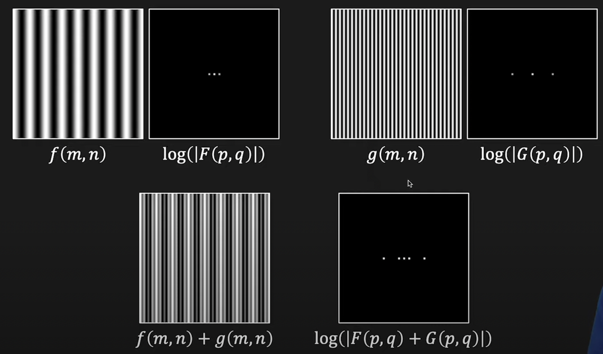

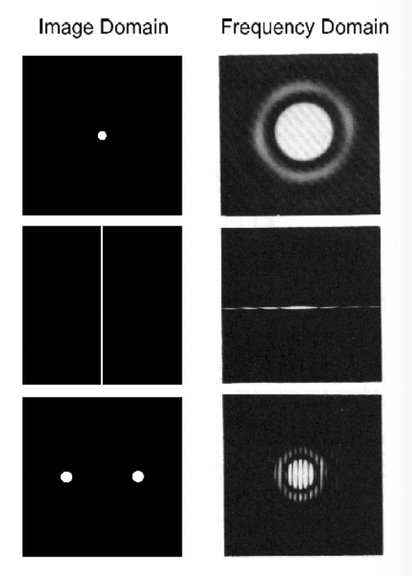

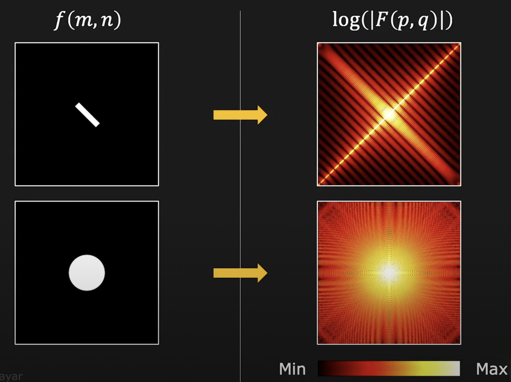

### Frequency domain filters

**Ideal:**

$$
H(u,v) = \begin{cases}
1, &D(u, v) \leq D_0\\
0, &otherwise
\end{cases}
$$

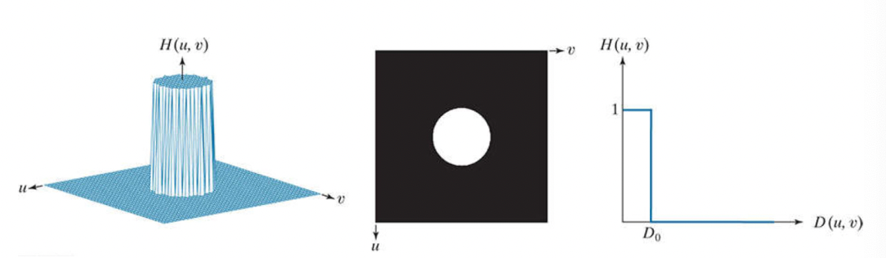

**Gaussian:**

$$
H(u, v) = \exp{\left(-\frac{D^2(u,v)}{2D_0^2} \right)}
$$

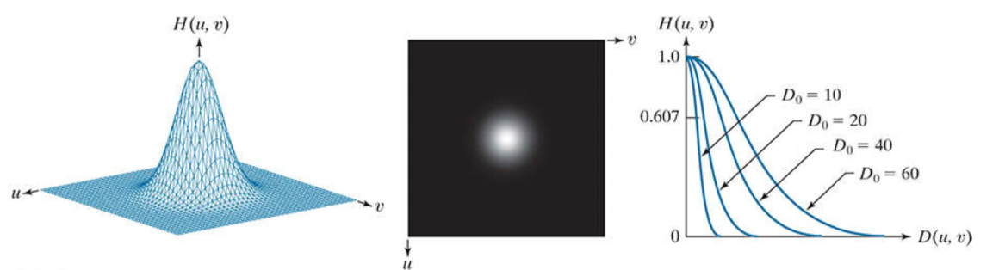

**Butterworth:**

$$
H(u,v) = \frac{1}{1 + \left(\frac{D(u,v)}{D_0}\right)^{2n}}
$$

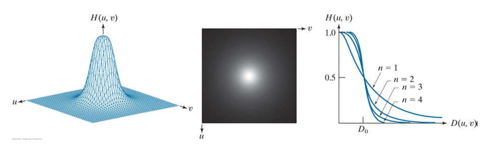

n = order of the Butterworth filter

$D(u,v)$ = distance to the $(u, v)$ frequency axes origin

$D_0$= filter bandwidth or coordination of the cut‐off point

Filter matrix size = image size = Fourier Transform matrix size

Cut-off point: where the magnitude of the filter raeches 0.5

Corresponding high pass filter obtains by 1‐LPF

Ideal filter → cause sidelobes and distortion

#### Lowpass Filter

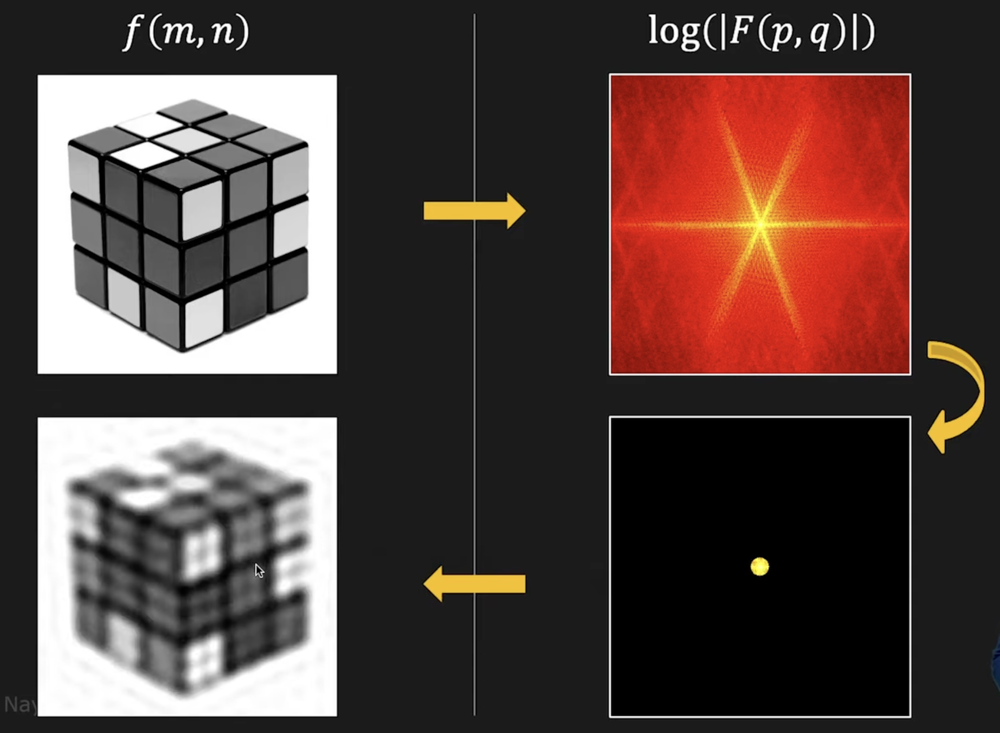

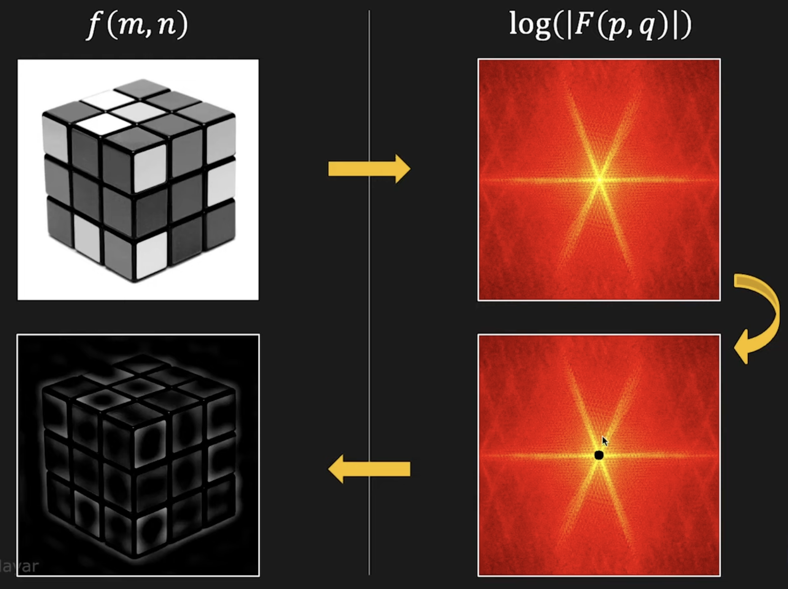

### Walsh/Hadamard Transform

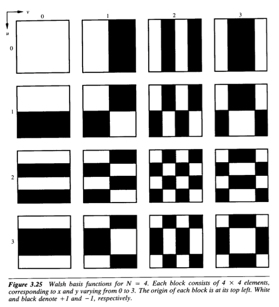

Use real square wave kernels → faster and computationally lighter

Hadamard transform: matrix-based Walsh transform, applicable when the input image is $2^n\times 2^n$

User term ‘Sequence’ instead of frequency, where S=2F

#### Hadamard Transform

Natural Hadamard matrix: $H_2=\begin{bmatrix}
1 &1\\
1 &-1
\end{bmatrix},\quad H_4=\begin{bmatrix}
1 &1 &1 &1\\
1 &-1 &1 &-1\\
1 &1 &-1 &-1\\
1 &-1 &-1 &1
\end{bmatrix}$

$$
H_N=\begin{bmatrix}
H_{N/2} \&H_{N/2}\\
H_{N/2} &-1_{N/2}\end{bmatrix}
$$

Natural Hadamard transform: $W = HfH^{T}$

Since $H = H^T = H^{-1}$, $W = HfH$ and $f = HWH$.

A $\frac{1}{N^2}$ coefficient is necessary for the transform

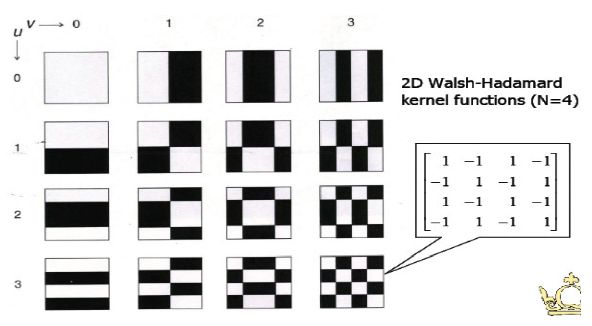

Sequence-ordered Hadamard matrix (reorder rows in increasing number of sign changes):

$H_4=\begin{bmatrix}
1 &1 &1 &1\\
1 &-1 &1 &-1\\
1 &1 &-1 &-1\\
1 &-1 &-1 &1
\end{bmatrix}\ \rarr W_4=\begin{bmatrix}
1 &1 &1 &1\\
1 &1 &-1 &-1\\
1 &-1 &-1 &1\\
1 &-1 &1 &-1\\
\end{bmatrix}$

$W[0, 0]$ is the sum of all pixels in the original images

### Discrete Cosine Transform

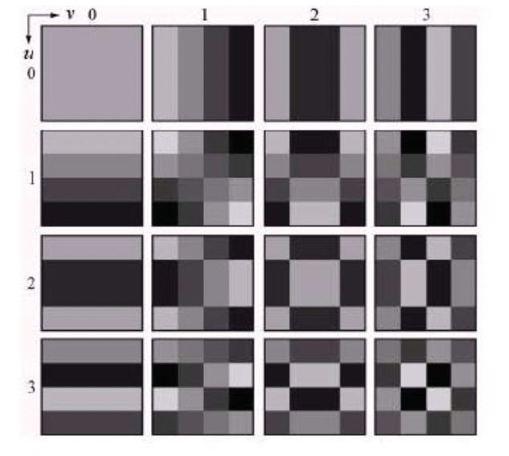

Cosine transform kernel functions are not complex.

## Hough Transform

Line in img space: $y=mx+n$ → Point in parameter space: $(n, m)$

Point in img space $(x_1, y_1)$ → Line in parameter space $n = -x_1m + y_1$

Colinear points → Intersecting lines

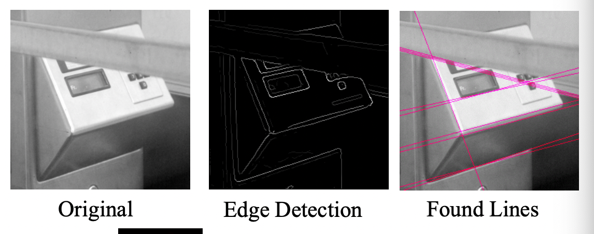

At each point of the (discrete) parameter space, count how many lines pass through it using an array of counters. The higher the count, the more edges are collinear in the image space. Find a peak in the counter array.

**Practical difficulties:**

- The slope of the line is $-\infty \< m \< \infty$ → Param space is infinite
- $y=mx+n$ does not express lines of the form $x=k$

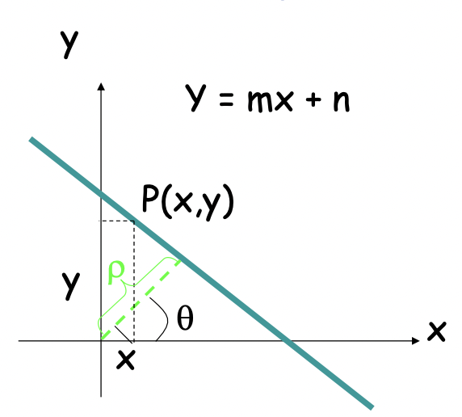

**Solution**: Use normal equation of a line $\rho = x\cos{\theta} + y\sin{\theta}$

The new param space is finite as $0\<\rho\<D$ where D is the image diagonal, and $0\<\theta\<\pi$

It can represents all line: $y=k$ with $\rho=k, \theta=90\degree$ and $x=k$ with $\rho=k, \theta=0\degree$

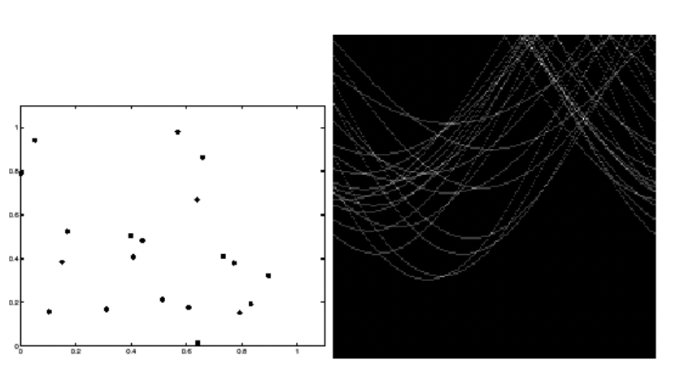

A point in image space is not represented as a sinusoid:

$$
⁍
$$

### Hough Transform Algorithm

Input is an edge img: `E[i, j] = 1` for edges

Discretize $\theta$ and $\rho$ in increments of $d\theta$ and $d\rho$. Let `A[R, T]` be an array of integer accumulators initialized to `0`

For each pixel `E[i, j] = 1` and `h = 1, 2, 3, ..., T` do

- $\rho = i\cos{(h\*d\theta)} + j\sin{(hd\theta)}$
- Find the closest integer k corresponding to $\rho$
- Increment counter `A[h, k]` by `1`

Find local maxima in `A[R, T]`

→ Can speed up if we now the orientation $\theta$ of the edge, can allow orientation uncertainty by incrementing a few counters around the nominal counter.

→ Can be generalized for curves $y = f(x, a_1, a_2, \dots, a_p)$ where $a_1, a_2, \dots, a_p$ are the parameters.

## Color spaces

### RGB color space

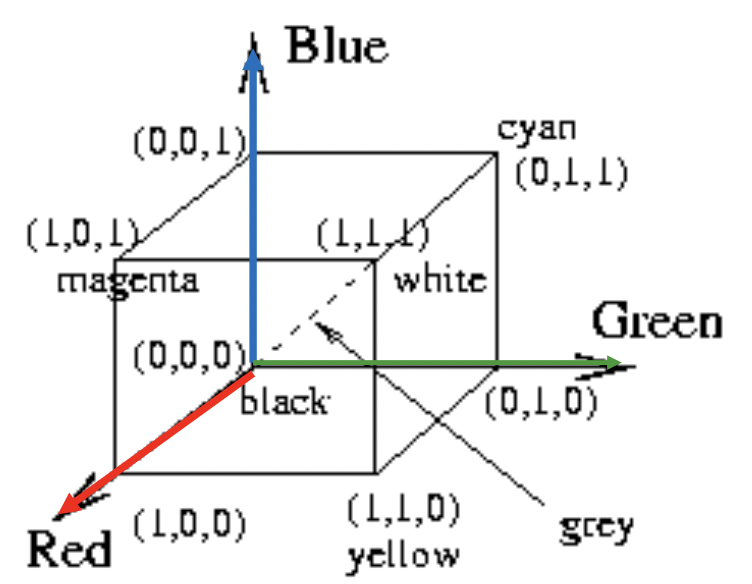

RGB values normalized to $(0, 1)$

Human perceives gray for triples on the diagonal

“Pure” color on corners

### HSI/HSV color space

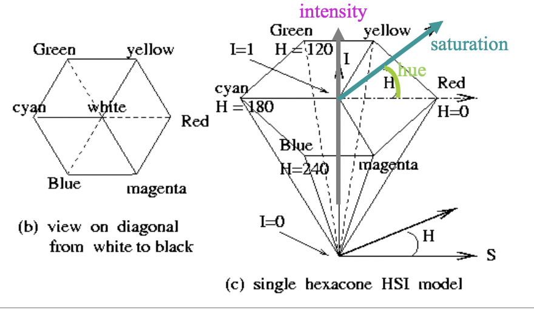

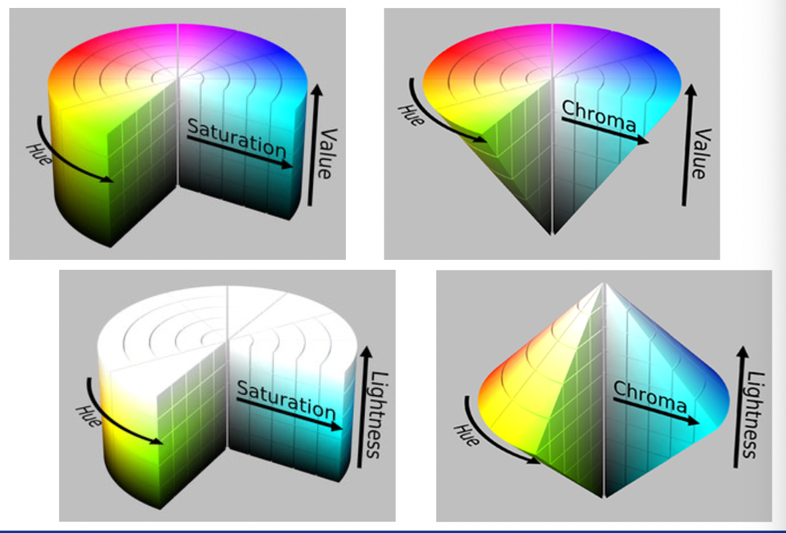

H and S ancodes chromaticity. Hue is defined by the angle. S models the purity of the color (S=1 for a completely pure or saturated color and S=0 for a shade of gray)

### YIQ and YUV for TV signals

Have better compression properties. Luminance Y encoded using more bits than
chrominance values I and Q, humans are more sensitive to Y than I, Q.

Luminance $Y = 0.3R + 0.59G + 0.11B$ → often used for color to grayscale conversion

### CIELAB color space

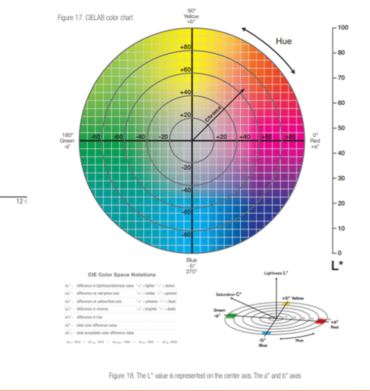

L\*: Lightness

a\*: Red/Green value

b\*: Blue/Yellow value

+a direction → shift towards red

+b direction → shift towards yellow

L=0 → black or total absorbtion

Center of the plane is gray or neutral

Hue: $H = \arctan{\frac{a}{b}}$, Chroma: $C=\sqrt{a^2 + b^2}$

## Texture Analysis

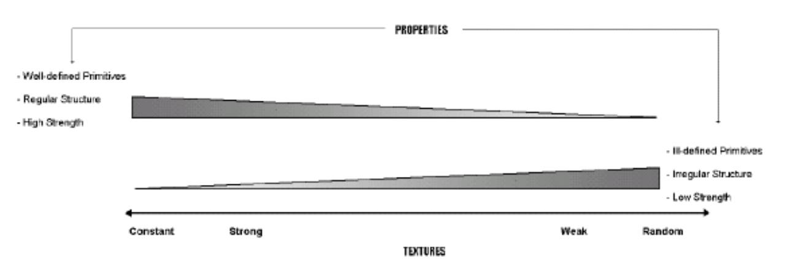

Categories

### Statistical methods

#### Local binary pattern (LBP)

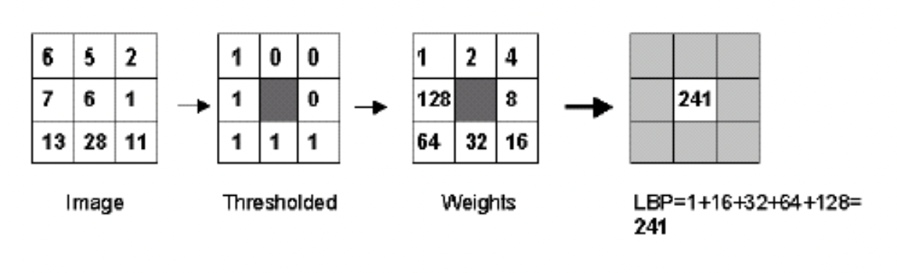

#### Gray level co-occurrence matrix (GLCM)

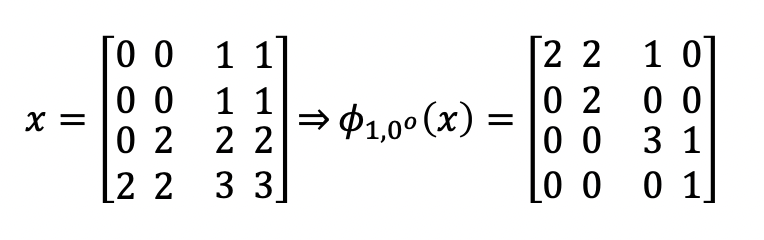

Usually $\Theta = {0\degree, 90\degree} \text{ or } \Theta = {0\degree, 45\degree, 90\degree, 135\degree}$ (clockwise) and $d = { 1, 2, 3 } \text{ or } d={1, 4, 26}$

Functions to be applied on GLCMs:

$$
f_1 = Maximum = \max_{i,j}{\Phi(i,j)}\\
f_2 = Energy = \sum_{i,j}{\Phi(i,j)^2}\\
f3 = Entropy = \sum_{i,j}{\Phi(i,j)\log{\left(\Phi(i,j)\right)}}\\
f_4 = Correlation = \sum_{i,j}{\frac{(i-\mu_i)(j-\mu_j)\Phi(i,j)}{\sigma_i\sigma_j}}\\
f_5 = Inverse\ Difference\ Moment = \sum_{i,j}{\frac{\Phi(i,j)}{1 + (i-j)^2}}\\
f_6 = Inertia = \sum_{i,j}{(i-j)^2\Phi(i,j)}
$$

$f_1, f_2$ are basic statistic of $\Phi$. **Entropy** $f_3$ measures the texture homogeneity. **Correlation** $f_4$ measures img linearity metric, large correlation in direction $\theta$ → linear directional structures in direction $\theta$. **IDM** $f_5$ measures the extent to which the same tone tends to be neighbors. **Inertia** (or Contrast) $f_6$ is a texture dissimilarity measure.

### Signal processing methods

#### **Karhonen‐Loeve Transform**

Using n*n sliding windows, n*n local neighbourhoods of the image can be extracted and rearranged as different observations of data into a k\*n\*\*2 matrix (k is the number of sliding windows). Neighborhood size is typically $n=3,5,7$

The covariance matrix is then computed, and the eigenvalues and eigenvectors of that population matrix are obtained:

$$
C(x) = E\left[(x-\mu_x)(x-\mu_x)^T\right]\\
(C(x) - \lambda_xI)e = 0
$$

A n*n rearrangement of the eigenvectors could be interpreted as a bank of adapted filters of the same size, which optimally cover all n*n relations of the test image pixels.

Detail images can be ontained by 2D spatial domain convolution of the test image by the members of the eigenfilter bank:

$$
D^A_i = A\otimes F^A_i, \quad 1 \leq i \leq n^2
$$

Then, to extract the feature vector, a few statistics of each detail image would be computed and used.

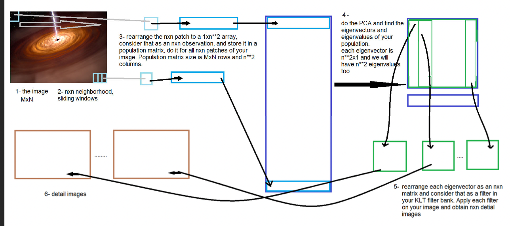

#### Ring/Wedge Filters

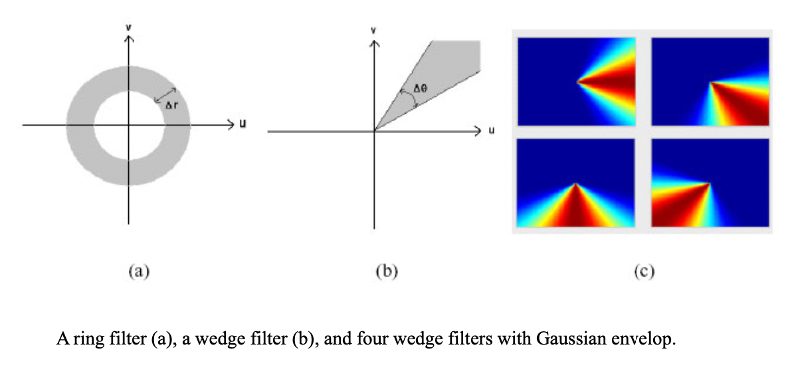

Wedge filter can etract info about edge in perpendicular direction in spatial domain. (e.g. vertical line for (c-1))

#### MSMD - Wavelet

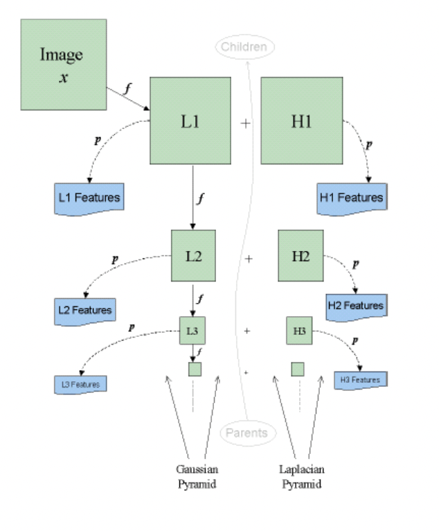

L1 + H1 = Image

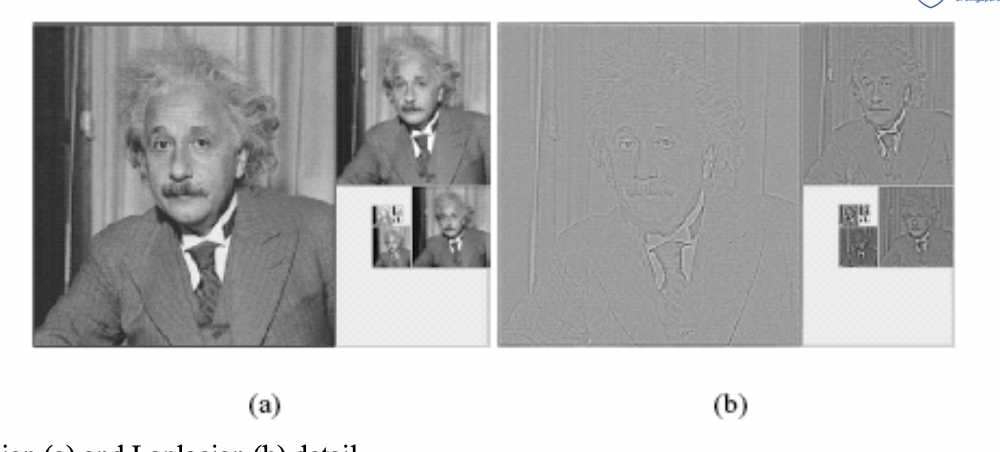

Gaussian (a) and Laplacian(b) detail of an img

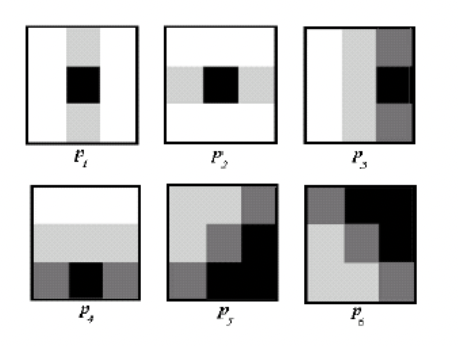

Filters employed for wavelet feature extraction

#### MSMD - Gabor filtering

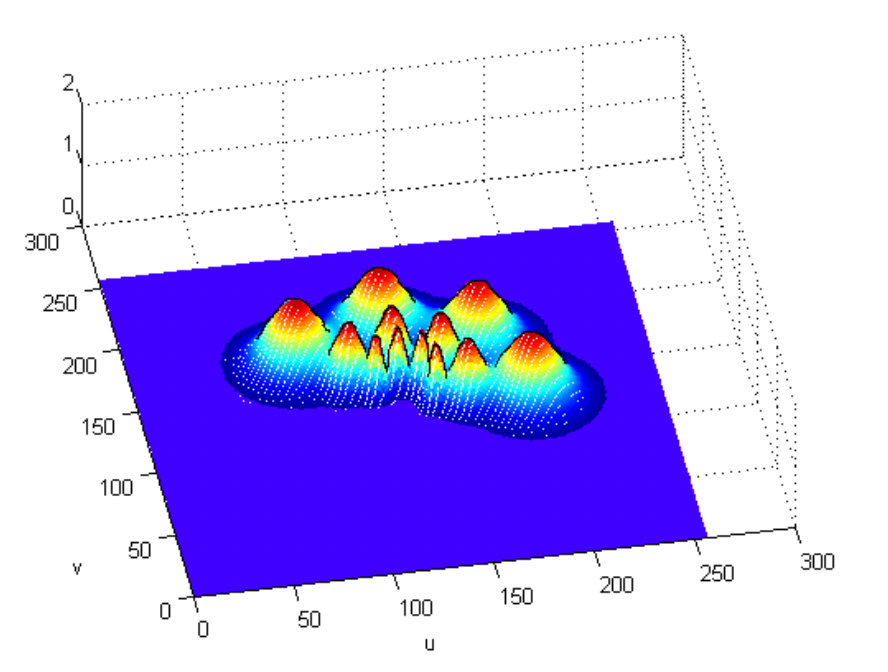

12 filters

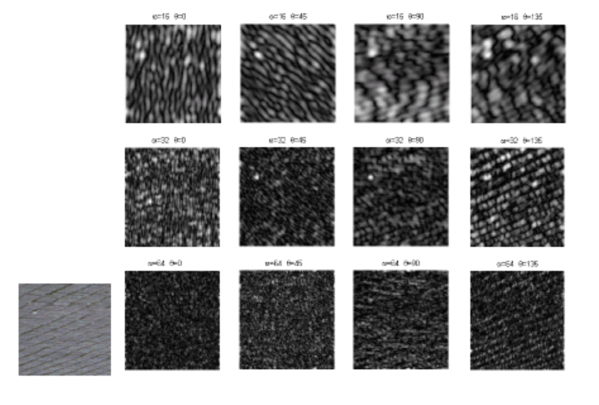

Intersection of a ring filter and a wedge filter in frequency domain

## ANN and Deep Learning

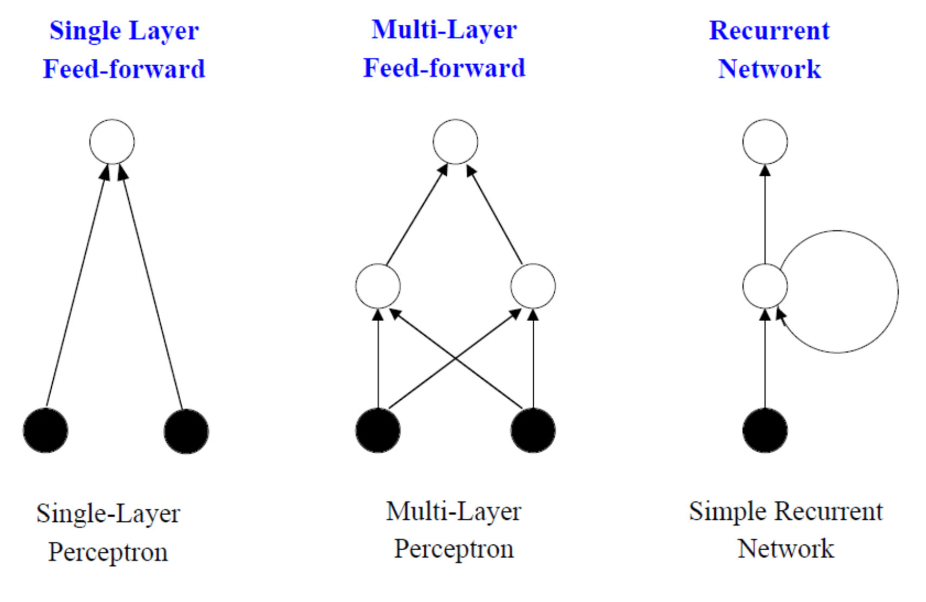

### Overfitting

Degree of freedom $F_0$, number of constraints $C$. To avoid loss of denerality in the system, $C$ must be $k$ times more than $F_0$, $k=4,5,\dots10$ → $C \geq kF_0$

In a NN, $C$ is the number of training examples,, and $F_0$ is the number of amendable parameters (mostly weights and biases)

### Generative adversarial network

The generator’s objective is to model or generate data that is very similar to the training data.

The adversarial stage tries to classify input data; that is, given the features of an instance of data, they predict a label or category to which that data belongs.

### Recurrent Neural Network

A class of artificial neural networks where connections between nodes form a directed or undirected graph along a temporal sequence. This allows it to exhibit temporal dynamic behavior.

Can use their internal state (memory) to process variable‐length sequences of inuts.

### LSTM and GRU

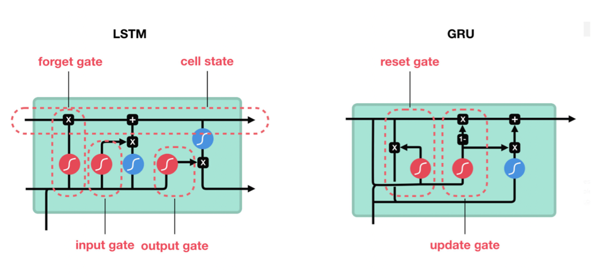

LSTM (Long short term memory) and GRU (Gated recurrent unit) have gates as internal mechanism, which control what info to keep and what info to throw out. By doing this, LSTM and GRU networks solve the exploding or vanishing gradient problem. These gates can learn which data in a sequence is important to keep or throw away.
