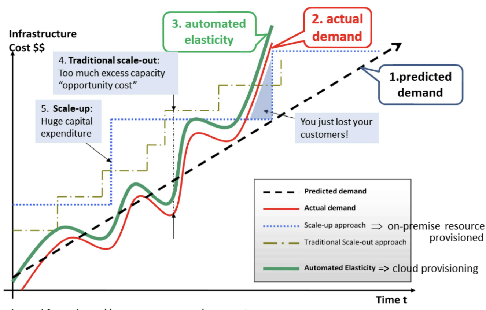
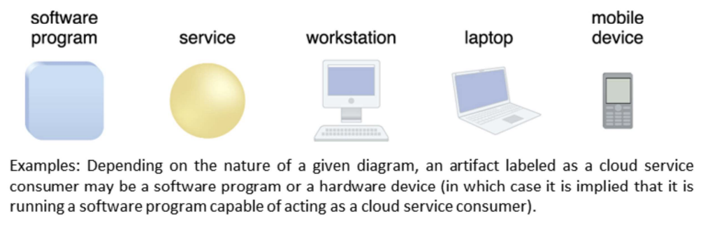
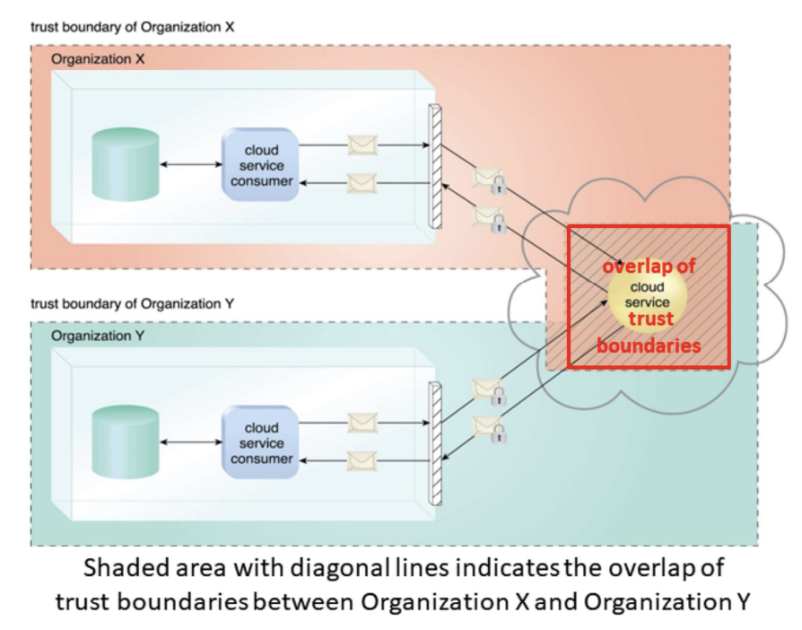

## Definitions

Cloud Computing is a model for enabling ubiquitous, convenient, on-demand network access to a shared pool of configurable computing resources (e.g. network, servers, storage, applications and services) that can be rapidly provisioned and released with minimal management effort or service provider interaction.

:::note
💡 On-Demand Service + Elastic Resource

:::

## Why cloud computing?

- Technology (cloud-enabled platforms and services) for current/future innovations and disruptions
- Reduces business cost:
  - Improve match between elastic resource demand and elastic computing resource
  - Resource demand:
    - Elastic user demand: peak/trough, business cycles
    - Mismatch between elastic resource demand and fixed (in-house) resource capability
    - Loss in business opportunity and higher business cost
  - Computing resource:
    - Commoditized and shared (economy at scale)
    - Internet (latency and bandwidth)
- Next wave of cloud disruption elivers advance capability around AI, blockchain, IoT, etc

## Key business driver

### Capacity planning

- Process of determining and fulfilling future demand of an organization’s IT resources, products and services
- Challenges: usage/demand fluctuations, peak usage, cost of resource provisioning
- Strategies:
  - Lead strategy: add capacity in anticipation of demand
  - Lag strategy: add capacity when resources reach its full capacity
  - Match strategy: add capacity in small increments as demand increases
- Cloud: on-demand self-service, rapid elasticity, measured service

#### Resource provisioning

import { Image } from "astro:assets";
import peakLoad from "./l1-introduction/untitled-1.png";

<figure class="mx-auto w-[320px]">
  <Image src={peakLoad} alt="Provisioning for peak load" />
  <figcaption class="text-center text-sm !mt-0">
    Provisioning for peak load
  </figcaption>
</figure>

**Provisioning for peak load:**

- Peak workload can be 2x-10x average
- Even if peak load can be correctly anticipated, resources are wasted (shaded area) during non-peak time

import underProvisioning from "./l1-introduction/untitled-2.png";

<figure class="mx-auto w-[320px]">
  <Image src={underProvisioning} alt="Under-provisioning" />
  <figcaption class="text-center text-sm !mt-0">Under-provisioning</figcaption>
</figure>

**Under-provisioning:** loss of potential revenue from users not served (shaded area)

### Cost reduction

- Difficult to align IT costs and business performance
- On-prem system:
  - IT department is a cost center in an enterprise
  - Costs: upfront investment (ownership) costs (capital expenditure) + operational costs
  - Operational costs: technical staff (manpower), utility bills (power and cooling), security and access control to protect infrastructure, administration/account staff (software licenses, etc)
- Cloud computing offers cost efficiency at scale

import traditionalIT from "./l1-introduction/untitled-3.png";
import cloudComputing from "./l1-introduction/untitled-4.png";

  <figure class="basis-72">
    <Image src={traditionalIT} alt="Traditional IT (on-prem)" />
    <figcaption class="text-center text-sm !mt-0">
      Traditional IT (on-prem)
    </figcaption>
  </figure>
  <figure class="basis-72 !mt-0">
    <Image src={cloudComputing} alt="Cloud computing" />
    <figcaption class="text-center text-sm !mt-0">Cloud computing</figcaption>
  </figure>

### Organizational agility

- A measure of an org’s responsiveness to change
- On-prem: Upfront investments and infra ownership costs may be prohibitive
- Cloud:
  - Elastic IT resources to respond to business cycles beyond what was previously predicted or planned
  - Software fixes/updates: update data centers vs millions of clients
  - Data center allows faster introduction of new hardware innovations

## Key terms

1. Elastic resource

2. Availability

3. Capacity planning (resource provisioning)

4. Scaling (horizontal, vertical)

5. Clousd-based IT resources

6. Cloud service

7. Trust boundary

## Scaling

- Ability of IT resources to handle increased or decreased usage (business) demand
- Horizontal scaling (out or in): add same resource type
- Vertical scaling (up or down): replace resource with higheer or lower capacity or add resources to a single node

|                         | Horizontal                                 | Vertical                                  |
| ----------------------- | ------------------------------------------ | ----------------------------------------- |
| Cost                    | Less expensive using commodity hardware    | More expensive using specialized hardware |
| Availability            | Resources instantly available              | Resources normally instantly available    |
| Ease of setup           | Resource replication and automated scaling | May need additional setup                 |
| Additional IT resources | Needed                                     | Not needed                                |
| Hardware capacity       | Not limited by hardware capacity           | Limited by hardware capacity              |

## Cloud service

- Any IT resource made remotely accessible via a cloud
- A multitude of service usage models: IaaS, PaaS, SaaS

### Cloud service consumer

- A runtime role assumed by a software program to access a cloud service

## Technical challenges

- Software development: different cloud platforms and services accross cloud providers
- Tools are continuously evolving
- Moving large data is still expensive
- Security
- Internet dependence
- Quality of Service
- Energy used
- …

## Non-technical challenges

- Increased security vulnerabilities
- Reduced operational governance control
- Privacy/Legal issues: data localization, multi-regional compliances
- Vendor lock-in
- Non-standard
- Sevice level aggrement
- …

### Increased security vulnerabilities

- Responsibility over data security becomes shared with cloud providers
- Expansion of trust boundary introduces new vulnerabilities
- Shared IT resources accross different cloud consumers introduces overlapping trust boundary
- Overlapping trust boundaries introduce opportunities for malicious cloud consumers to steal or damage business data

### Expanded trust boundaries

### Reduce Operational Governance Control

- Cloud consumers: different levels of IT resource governance between on-prem and cloud
- Unreliable cloud provider may not maintain/meet SLA guarantees
- Longer distance between cloud consumer and provider introduces additional fluctuating latency and bandwidth constraints
- Mitigate by legal contracts combined with SLAs, technology inspections and monitoring

### Privacy and Legal Issues

- Data centers are set up in affordable or convenient geographical locations
- Data localization/residency: Industry ir government regulations on data privacy or storage policies, e.g. personal data belonging to UK citizens be kept within UK
- Legal issues on accessibility and disclosure of data, e.g., laws require data to be disclosed to government agency
- Tension between personal rights (privacy) and society, e.g. Tracetogether (location, proximity data)
