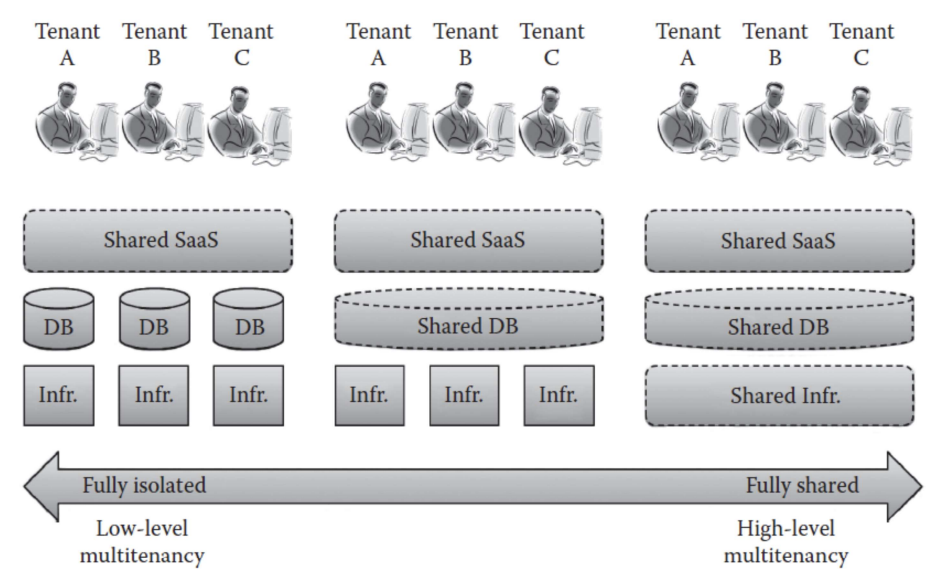
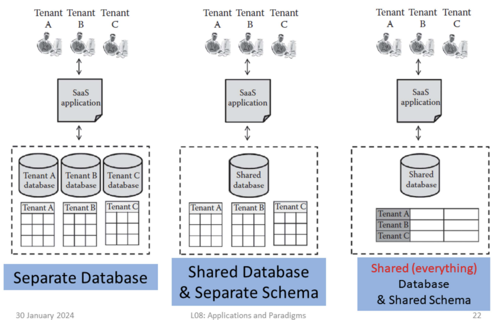

SaaS is different from traditional software:

- **Pay-per-use**: provides web access to commercial software on pay-as-you-use vs traditional pay the full license free
- **Zero infrastructure**: customers need not install the software (SaaS developed, deployed and managed by SaaS service provider) vs ASP (application service provider) owns and manages dedicated infrastructure for each customer
- **Reduced business cost**: one-to-many → same SaaS application shared by multiple customers (multi-tenants) vs traditional one-to-one end-users and software relationship
- **Automated updates**: Updates performed by SaaS service providers not by users (traditional)

Not suitable:

- Realtime processing where fast processing of data is needed
- Organization’s data is more confidential and data localization is needed
- When on-prem applications fulfill organization’s needs

Suitable:

- Consumers require on-demand software rather than full-term/licensing-based software
- Start-up company that cannot invest in buying licensed software
- Applications with unpredictable nd dynamic load

2 key challenges:

- Choosing the correct multi-tenancy level(s) - multi-tenancy can be achieved at different levels such as infrastructure, platform and application
- Governance and security over user data

4 perspective:

- SaaS with self-managed infrastructure and self-mananged platform
  - Multi-tenancy in SaaS layer only
  - Provider has full control over infrastructure and platform → user data is more secure
  - Cost and overhead of maintaining platform and infrastructure → lower resource utilization
- SaaS with self-managed platform
  - Shared SaaS application on shared IaaS but self managed platform
  - Multi-tenancy in SaaS & IaaS layers
  - When applciation does not required more data security
  - Higher infrastructure resource utilization
  - Overheads of maintaining platform
- SaaS with self-managed infrastructure
  - Shared SaaS application on shared PaaS but deployed on on-prem infrastructure
  - Multi-tenancy on SaaS and PaaS layers
  - Full governance over user data
  - E.g: Community deployment model - SaaS and PaaS shared by different organizations and infrastructure maintained by a gorup of organizations
- SaaS with cloud-enabled IaaS and PaaS
  - Shared everything, multi-tenancy at all layers
  - Higher SaaS application scalability through dynamic scaling by IaaS and PaaS providers
  - High availability → backup and recovery by service providers
  - Cons: no governance over user data; cross tenant attacks across all multi-tenanted layers

## Cloud-aware Software Development using PaaS

SaaS applications: multi-tenancy, dynamic scaling, high availability

### Requirement Analysis

- Delivery model to meet customer requirements
  - Security
  - ROI (return on investment)
- Deployment model:
  - Public PaaS: low maintenance overhead but higher security threats
  - Private PaaS: higher maintenance but moderate security threats

### Multi-tenant Architecture

- Multi-tenancy levels: infrastructure, development platform, database, application
- Trade-off: higher level of multi-tenancy → higher resource utilization, lower security of data

### Dynamic Scaling and Availability

Dynamic Scaling: maintain same performance on unpredictable load

- Software load balancer: user requests distributed across different application and database servers
- Hardware load balancer: load distributed across different VMs when there is a need for more computing power

Availability:

- High availability: multiple replica copy of VMs and database applications
- Recovery time: replica should be near customer location

### Database Design: Database-level Multitenancy

Database-level Multi-tenancy

### SaaS Development using PaaS

SaaS Developer/Provider: PaaS tools allow developer to develop the SaaS application online and deploy on service provider infrastructure

SaaS consumer: access SaaS using the web UI provided by SaaS provider

SaaS should include the following

- UI design to support multiple devices - desktops, laptops, tablets, mobiles
- Role based access control, access control list mechanism to identify users and tenants
- Performance monitoring tools
- Control panel for the tenant and admin to manage the users
- Self-service sign-up for users
- Usage statistics and bill calculation
- …

### Monitoring and SLA Maintenance

- Monitoring: tenant misbehavior, failure, security attacks, SLA violation
- SLA violation by both provider and consumer, monitoring tool notify developers to correct the errors
- Updates should not affect SaaS service, frequent automated updates to provide consumers with latest version
