## NIST Definition

:::note
💡 **Cloud Computing:** a model for enabling _ubiquitous, convenient, on‐demand_ network access to a shared pool of **configurable computing resources** (e.g., _networks, servers, storage, applications and services_) that can be rapidly provisioned and released with **minimal management effort** or **service provider interaction**
:::

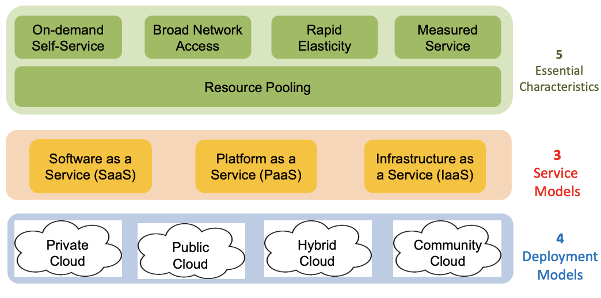

## Cloud Characteristics

1. On-demand self-service through a service portal
2. Broad network access (ubiquitous access)
3. Location-independent resource pooling (multi-tenancy)
4. Rapid elasticity - time to market / fast deployment
5. Measured service (pay-per-use)

### Resource Pooling & Sharing: Single vs Multi-tenancy

Cloud resources can be pooled (or shared) to improve utilization (reduce cost)

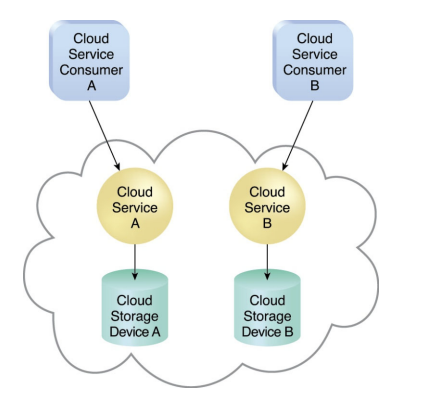

**Single tenancy:**

- Each cloud consumer has a **separate** IT resource instance
- Each cloud consumer, A and B, has its own instance of cloud storage device A and B, respectively

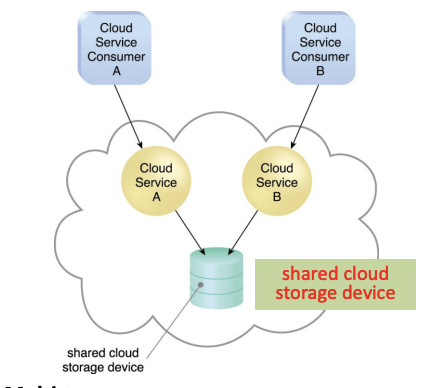

**Multi-tenancy:**

- A cloud provider pools its IT resources to serve multiple cloud service consumers
- An instance of the program serves different consumers (tenants) whereby each instance is isolated from the other
- Both cloud consumer A and B shared a cloud storage device. From the perspective of the cloud storage device, it serves more than one tenants, A and B.

**HOW:** Abstractions of resources (both physical resources and applications) as cloud services. In cloud computing, this abstraction is called virtualization

**Virtualization:**

- Applications - PaaS. and SaaS
- Physical resources - IaaS (processor, memory, storage, network), data

## Cloud Service (Delivery) Models

- SaaS: use provider’s application over a network, e.g. Salesforce, Google apps
- PaaS: deploy customer-related applications to a cloud, e.g. Google App Engine, Amazon AWS, Microsoft Windows Azure
- IaaA: rent processing, storage, network capacity and other fundamental computing resources, e.g. Amazon EC2

To be considered “cloud”, services must be deployed on top of a cloud infrastructure with the key characteristics

**WHY**: Different levels of abstraction provides ease of use (setup, programming), reduce management effort, fast deployment

### IaaS

Lowest level of abstraction where physical resources are abstracted as virtual resources

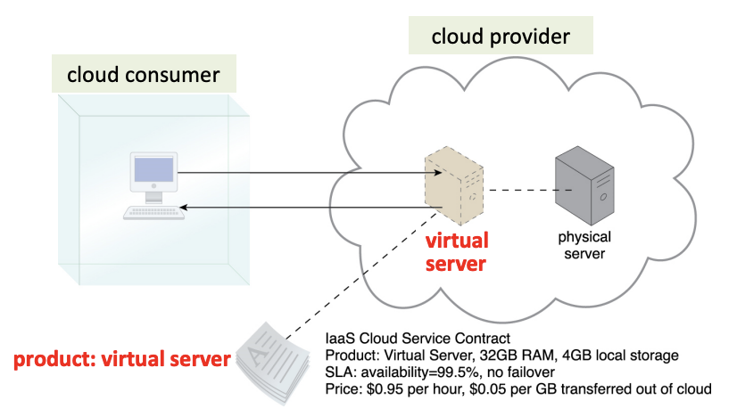

E.g: A physical server is abstracted as a virtual server. The cloud consumer uses the virtual server provided by IaaS cloud provider. Multiple virtual servers can also be mapped onto one physical server to increase the level of sharing and utilization of the physical server.

### PaaS

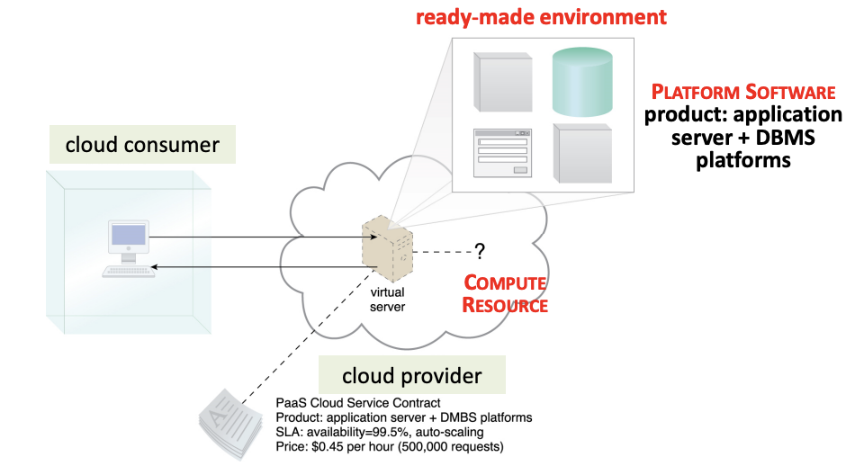

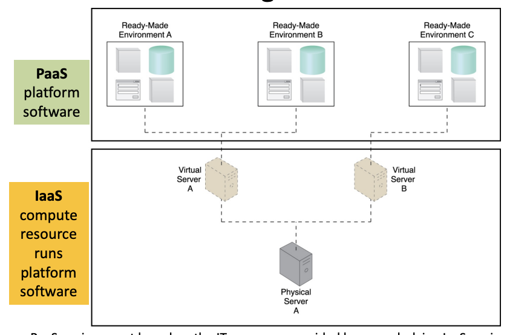

Where does the PaaS run?

- Application platforms such as application server and databses developed can be shared as platform services. A PaaS consists of 2 main parts, platform software and the computing resources needed to run/host the platform software.
- A PaaS provider develops the platform software and decides where to host/run the PaaS service. A PaaS consumer incorporates the ready-made PaaS service in the application being developed.

Example: Meeting Legal Requirements for Data Storage

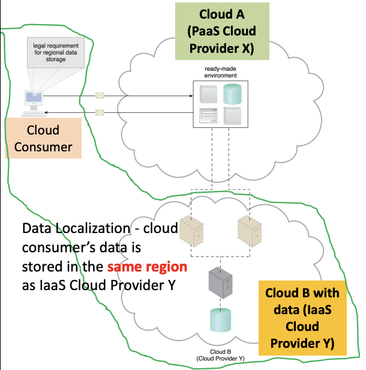

- A cloud consumer subscribes to PaaS offered by Cloud Provider X (Cloud A)
- To meet the legal requirement, services offered by cloud provider X are physically hosted on Cloud Provider Y (Cloud B)
- Thus, sensitive data that is legally required to stay in a specific region is physically kept in CLoud B, which is physically located in the same region as the cloud consumer

### SaaS

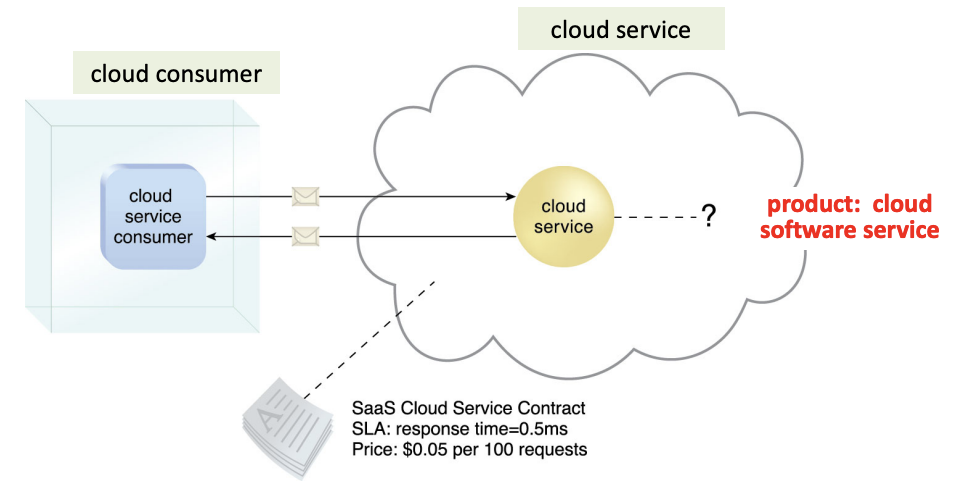

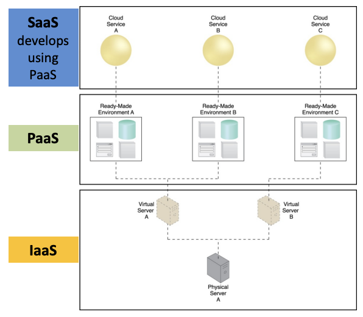

- A SaaS consumer consumes a SaaS service by providing data to obtain the results.
- The SaaS consumer uses the SaaS services without additional code developmet and without knowledge of implementation details and the underlying IT resources

### Variations of Service Models

- Storage-as-a-service
- Database-as-a-service
- Security-as-a-service
- Communication-as-a-service
- Integration-as-a-service
- Testing-as-a-service
- Process-as-a-service
- Function-as-a-service - serverless computing

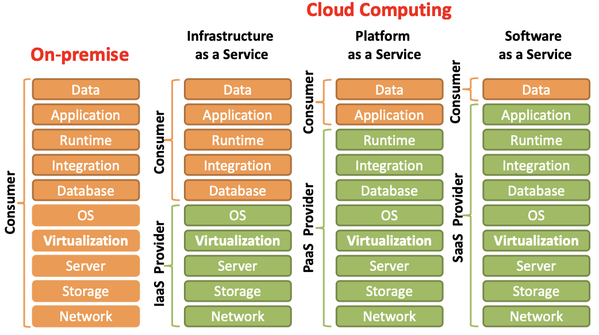

|         | Pros                             | Cons                |
| ------- | -------------------------------- | ------------------- |
| on-prem | highest flexibility              | long time-to-market |
| IaaS    | scalability, no hardware procure | privacy             |
| PaaS    | DB, Frameworks, middleware ready | vendor lock in      |
| SaaS    | time-to-market                   | lowest flexibility  |

## Cloud Computing Reference Architecture

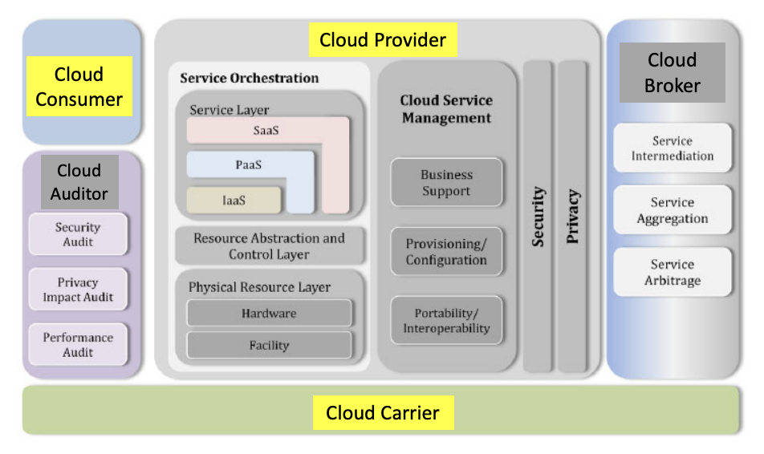

5 major actors: cloud consumer, cloud provider, cloud auditor, cloud broker, cloud carrier

**Actor**: entity (a person or org) that participates in a transaction or process and/or performs tasks in cloud computing

**Cloud consumer** requests cloud services from a **cloud provider** directly or via a **cloud broker** (with many providers)

**Cloud auditor** conducts independent audits by collecting necessary information

### Actor roles

1. **Cloud consumer**: maintains a business relationship with, and uses the service from, **cloud providers**
2. C**loud provider**: offeres a cloud service to **cloud consumers**
3. Cloud auditor: conducts independent assessment of cloud services, system operations, performance and security of the cloud implementation
4. Cloud broker: manages the use, performance and delivery of cloud services, and negotiates relationships between **cloud providers** and **cloud consumer**
5. Cloud carrier: provides connectivity and transport of cloud services from **cloud providers** to **cloud consumers**

### Cloud consumer

- Browses cloud provider service catalog, requests the appropriate service, sets up service contracts (including price and SLAs) with the cloud provider, and uses the service
- 3 types: SaaS consumer, PaaS consumer, IaaS consumer

### Cloud Provider

- **Acquires and manages computing infrastructure** required for providing services, **runs cloud software** to provide services and **make arrangement to deliver services** to cloud consumers through network access
- 3 types:

  - **SaaS cloud** **provider** develops, deploys, configures, maintains and updates operation of the software applications on a cloud infrastructure to provision services at the expected SLAs to cloud consumers, SaaS consumer have limited admin contril of the application
  - **PaaS cloud provider** develops and manages computing infrastructure for the platform and runs cloud platform component software such as runtime software execution stack and databases. Supports development, deployment and management process of PaaS cloud consumer
  - **IaaS cloud provider** provides virtual resources by acquring physical computing resources underlying the service, including servers, networks, storage and hosting infrastructure. Computing resources are made available to IaaS cloud consumer through a set of service interfaces and computing resource abstracitons such as virtual machines and virtual network interfaces

#### Key functions of a cloud provider

1. **Service deployment:** a cloud infrastructure may be operated in one of the following deployment models: public cloud, private cloud, community cloud, and hybrid cloud

2. **Service orchestration:** Cloud providers need system components in order to provision for and to compose cloud services to be delivered to cloud consumers. These system components are grouped into 3 main types, namely, service layers resource abstraction and control layer, and physical resource layer:

   - **Service layer:** defines interface for cloud consumers to access the computing devices. E.g: A SaaS application can be implemented and hosted on virtual machines from an IaaS cloud or it can be implemented directly on top of cloud resources without using IaaS virtual machines
   - **Resource abstraction** and **control layer** contains:
     - Software abstraction of system components that Cloud providers use to provide and manage access to the physical computing resources. E.g: hypervisors, VM, virtual data storage, etc; ensure efficient, secure and reliable usage of the underlying physical resources
     - Control refers to software components that are responsible for resource allocation, access control and usage monitoring
   - **Physical resource layer:** Include all physical computing resources: hardware resources such as computers (CPU, mem), networks (routers, firewalls, switches, network links and interfaces), storage components (hard disks); facility resources such as ventilation, cooling, power, communications and other aspects of the physical site.

3. **Cloud service management:**

   - All service-related functions for the management and operation of those services required by or proposed to cloud consumers
   - Perspectives: business support, provisioning and configuration, portability and interoperability requirements
     - **Business support:** set of business-related services to deal with clients (consumers) and supporting processes such as accounting & billing, pricing & rating
     - **Provisioning/configuration:** includes rapid provisioning (automatic resource deployments, charging, SLA managements, etc), on-demand self-service, rapid elasticity, measure service
     - **Portability:** can cloud consumers move their data or applications across multiple cloud environments (providers) at low cost and with minimum disruption?
     - **Service interoperability:** can cloud consumers use their data and services across multiple cloud providers with a unified management interface?
     - **System portability:** can cloud consumers migrate a VM instance or a machine image from one provider to another, or migrate applications & services and its contents from one provider to another

4. **Security and Privacy:**
   - Challenge: sharing beyond an organization
   - Security:
     - Cross-cutting and spans across all layers of the reference model ranging from physical to application security
     - Concerns all relevant actors
     - Needs to address security requirements such as authentication, authorization, availability, confidentiality, identity management, integrity, audit, security monitoring, incident response and security policy management
     - Cloud service model perspectives – SaaS, PaaS and IaaS consumers are expose to different entry points into cloud systems thus introducing different attacking surfaces for adversaries
     - Implications of cloud deployment models – different level of exclusivity of tenants (consumers) in a deployment model, e.g., a private cloud is dedicated to one organization but a public cloud has unpredictable co‐existing of tenants
   - Privacy: Cloud providers should protect the assured, proper and consistent collection, processing, communication, use and disposition of personal information and personally indentifiable information in the cloud

### Cloud auditor

- Independent examination of cloud service controls: security controls, privacy impact, performance, etc
- Security controls: management, operational and technical safeguards or counter-measures used within an organizational information system to protect confidentiality, integrity and availability of system and its information
- Verify compliance with regulation and security policy, and conformance to standards through review of objective evidence

### Cloud broker

- Integration of cloud services can be complex for cloud consumers to manage
- Cloud broker manages use, performance and delivery of cloud services and negotiates relationships between cloud providers and consumers
- 3 main services:
  - Service intermediation: enhances a given service by providing value-added services to cloud consumers such as managing access to cloud services, identify management, performance reporting, enhanced security, etc
  - Service aggregation: combines and integrates multiple services into one or more new services, and provides data integration and ensures the secure data movement between the cloud consumers and multiple cloud providers
  - Service arbitrage: flexibility to choose services from multiple agencies, similar to service aggregation except that the service being aggregated are not fixed

### Cloud carrier

- Provides connectivity and transport of cloud services between cloud consumers and providers through network, telecommunication and other access devices (computers, laptops, mobile phones, mobile internet devices, etc)
- Cloud providers set up SLAs with a cloud carrier to provide services consistent with the level of SLAs offered to cloud consumers
- Carrier may be required to provide dedicated and secured connections between cloud consumers and providers → VPN for private cloud

## Organizational Boundaries

Physical scope of IT resources owned and governed by an organization

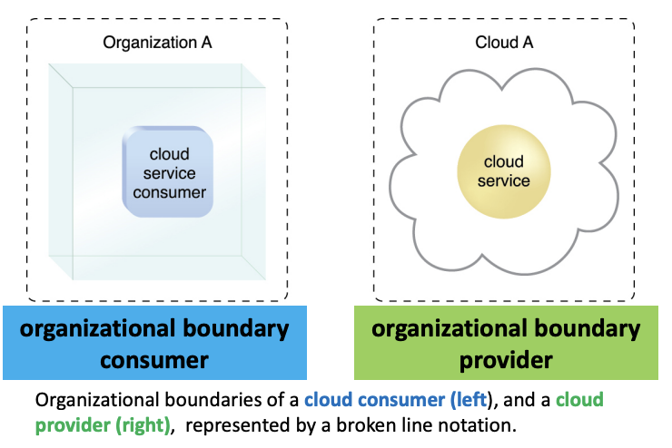

## Trust boundary

Logical perimeter that represents which IT resources are trusted by an organization

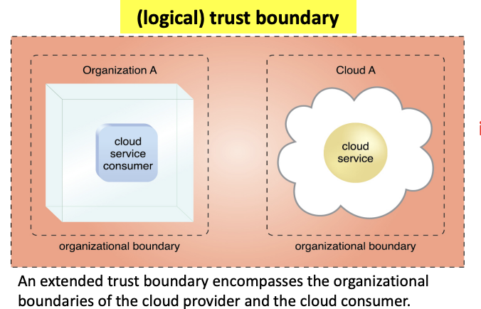

**Implication:** increased security vulnerabilities, reduces operational governance control

Multi-tenancy → overlapping trust boundary

## Cloud deployment models

- Private cloud: for enterprise with large scale IT (on-site or out-sourced)
- Public cloud: Concerns: limited SLA, reliability, availability, security, trust
- Community cloud: shared by several organizations and supporting a specific communitiy
- Hybrid (federated) cloud: extends private cloud(s) to include a shared public cloud
- Sovereign cloud:
  - Meet regulatory and compliance needs of a country or jurisdiction
  - Data residency (localization) not sufficient: only means that data centers used are physically located in a country but does not guarantees the data hosted never leaves the country
  - HOW: stores data (including metadata) within national borders; adheres to local data protection laws
