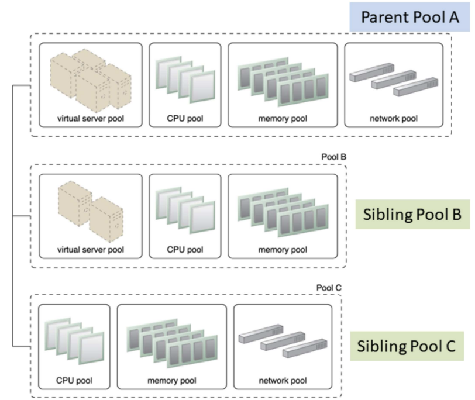
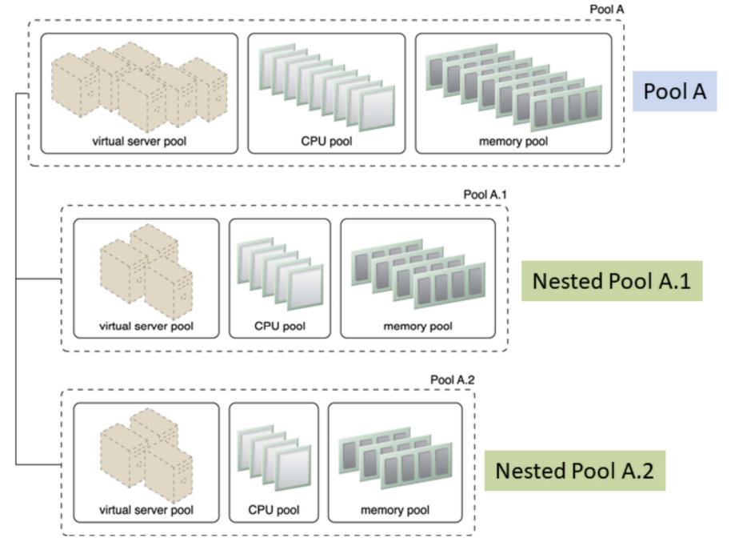
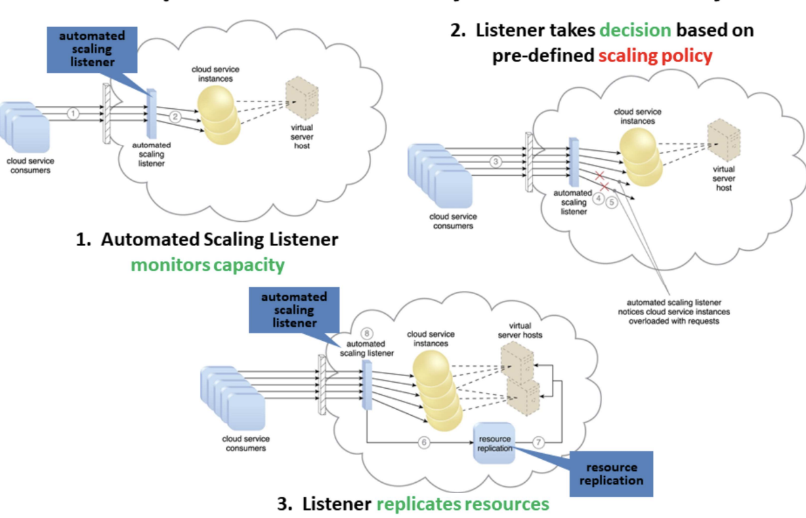
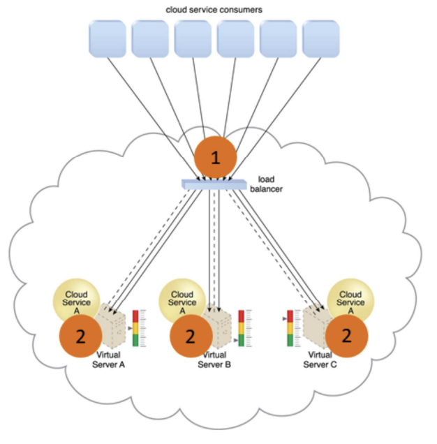
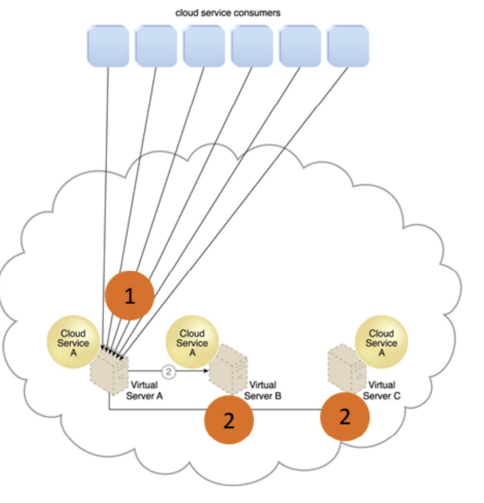
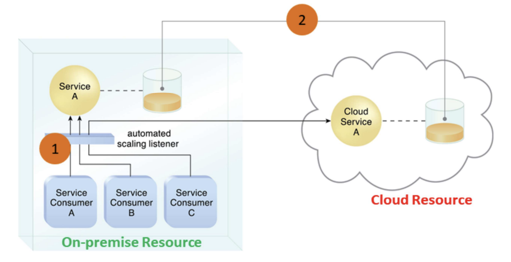
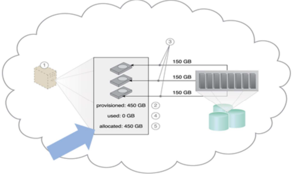
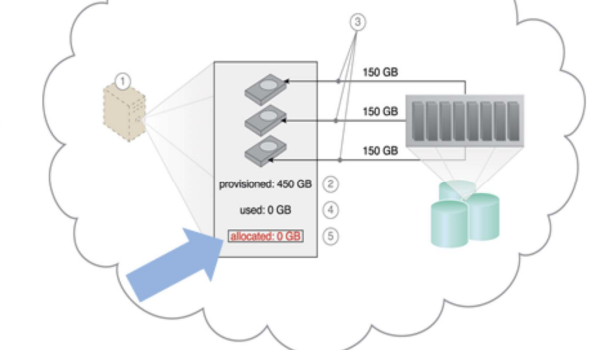
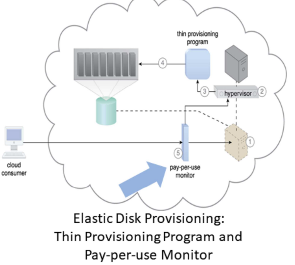

How to organize (partition) resources?

1. Workload distribution
2. Resource pooling
3. Dynamic Scalability (Usage fluctuation)
4. Elastic resource capacity (resource availability fluctuations)
5. Service load balancing

How to operate/manage resources to meet certain objectives?

- Cloud bursting
- Elastic disk provisioning

## Workload Distribution Architecture

- **What:** horizontal resource scaling
- **How:** Load balancer distributes workload to reduce over-utilization or under-utilization of resources
- Additional mechanisms:
  - **Audit monitor:** monitors resource pool usage for compliance
  - **Cloud usage monitor:** runtime tracking and synchronization
  - **Hypervisor (VM Manager):** hosts virtual servers (which are resource pools) and provides virtual server access to resource pool
  - **Logical network perimeter:** organizes and isolates resource pools
  - **Resource cluster:** clustered IT resources used to support workload balancing between different cluster nodes
  - **Resource replication:** generates new instances of virtualized IT resources in response to runtime workload distribution demands

### Amazon ELB

- Automatically distributes application traffic across multiple Amazon EC2 instances (VMs)
- Achieve greater levels of fault tolerance in your applications
- Seamlessly providing the required amount of load balancing capacity needed to distribute application traffic

## Resource Pooling Architecture

- Resource pooling: aggregate cloud resources of different types to serve needs of cloud consumers
- Architecture: automatically maintain identical IT resources to ensure that they remain synchronized
- Common resource pools:
  - Physical server pool
  - Virtual server pool
  - CPU pool
  - Memory pool
  - Storage pool
  - Network pool
- Dedicated pools: grouped each type of resource into a larger pool, where each individual pool becomes a sub-pool
  - E.g: dedicated pool with 4 sub-pools with CPUs, memory, storage and network devices
- Complex: multiple pools for specific application or customer
  - Creates hierarchical structure of parent, sibling and nested pools to meet diverse requirements

**Sibling Pools:** Pools B and C are sibling pools of Pool A

- Sibling resource pool:
  - Are drawn from physically grouped IT resources and not spread out across data centers
  - Isolated from one another so each cloud consumer is given access to its respective pool

**Nested Pools:** Nested pools A.1 and A.2 are comprised of the same IT resource types as pool A but in different quantities

- Nested resource pool:
  - Larger pools divided into smaller pools with same type of IT resources
  - For assigning resource pools to different departments and groups in the same organization
- Multiple instances from each pool may be created
- Additional mechanisms:
  - **Audit monitor:** monitors resource pool usage for compliance
  - **Cloud usage monitor:** runtime tracking and synchronization
  - **Hypervisor:** hosts virtual servers (which are resource pools) and provides virtual server access to resource pool
  - **Logical network perimeter:** organizes and isolates resource pools
  - **Pay-per-use monitor:** collects billing information information: consumer usage of different resource pools
  - **Remote administration system**
  - **Resource management:** provides cloud consumers with tools for administration resource pools
  - **Resource replication:** generates new instances of IT resources from resource pools

## Dynamic Scalability Architecture

- **Why:** enables variable resource utilization to meet usage demand fluctuations
- Based on predefined scaling conditions to trigger dynamic allocation of resources from resource pools

- Common types of dynamic scaling
  - Dynamic horizontal scaling (same resource types): resource instances scaled dynamically with fluctuating workloads, e.g. replicate resources
  - Dynamic vertical scaling (change size): scale processing capacity of a single IT resource, e.g. increased memory dynamically when virtual server is overloaded
  - Dynamic relocation (different resource types): resource relocated to host with larger capacity, e.g. SAN storage tape-based (4GB/s) to disk-based (8GB/s)

## Elastic Resource Capacity Architecture

- Dynamic provisioning of virtual servers:
  - Fluctuating processing requirements
  - Allocates and reclaims CPUs, RAMs
  - Runtime of virtual server is monitored
  - Additional resources leveraged before capacity threshold reached
  - Virtual server and It resources vertically scaled
  - Use Intelligent Automation Engine: sends scaling request to hypervisor or VIM (Virtual Infrastructure Manager)

import { Image } from "astro:assets";
import dynamicProvisioning1 from "./l3-cloud-architectures/untitled-3.png";
import dynamicProvisioning2 from "./l3-cloud-architectures/untitled-4.png";

  <figure class="basis-72">
    <Image src={dynamicProvisioning1} alt="Dynamic Provisioning 1" />
  </figure>
  <figure class="basis-72 !mt-0">
    <Image src={dynamicProvisioning2} alt="Dynamic Provisioning 2" />
  </figure>

1. Cloud service consumers send requests (1) to a cloud service, which are monitored by an automated scaling listener (2)
2. An intelligent automation engine deployed with workflow logic (3) notify the resource pool using allocation request (4)
3. Cloud service consumers requests increased (5), causing automated scaling listener to signal the intelligent automation engine to execute the workflow logic scripts (6)
4. The script then signals the hypervisor to allocate more resources from the resource pools (7)
5. The hypervisor allocates additional resources to the virtual service to handle the increased workload (8)

## Service Load Balancing Architecture

- A specialized variation of the workload distribution architecture for scaling cloud service implementations
- Redundant cloud service deployments are created with a load balancer to dynamically distributes workload
- Duplicate cloud service as a resource pool
- 2 type of load balancer:
  - Independent of cloud services as their host servers
  - Built-in into a cloud service as part of application or server’s environment (a primary server serves as a LB and communicates with neighboring servers to balance workload)

### Independent LB

1. Cloud service A is replicated and runs on different virtual servers
2. LB intercepts messages sent by cloud service consumers (1), and forwards them to the virtual servers so that the workload processing is horizontally scaled (2)

### Built-in LB

1. Cloud service consumer requests are sent to cloud service A on virtual server A (1)
2. Cloud service implementation includes built-in LB logic capable of distributing requests to the neighboring cloud service A implementations on virtual servers B and C (2)

### Amazon Auto Scaling Service

- Maintain application availability by scaling Amazon EC2 capacity up or down automatically according to workload conditions you define
- Automatically increase the number of instances during demand spikes to maintain performance and decrease capacity during lulls to reduce costs
- Combines with ELB to distribute traffic to your instances to run instances at optimal utilization

## Cloud Bursting Architecture

- To meet higher usage demand, dynamic scaling or “bursts-out” of on-prem resources to cloud-based resources
- Cloud services are redundant, pre-deployed and inactive until cloud bursting
- Releases or “bursts-in” to on-prem when no longer required
- Based on
  - Automated scaling listener to redirect requests to cloud-based services
  - Resource replication to maintain synchronicity between on-prem and cloud-based resources

1. Automated scaling listener monitors the usage of on-prem service A
2. When usage threshold is exceeded, Service Consumer C request to Service A is redirected to Service A’s redundant implementation in the cloud (Cloud Service A) (1)
3. A resource replication system ensures the state management databases are synchronized

## Elastic Disk Provisioning Architecture

- Typically, cloud consumers are charged based on fixed disk storage allocation
- Aim: achieve dynamic storage provisioning and charge based on actual usage

**Fixed Disk Storage Allocation:** charge at the point of allocation

**Elastic Disk Provision:** No charge when allocated but not used

- Granular billing for exact amount of storage actually used
- Runtime monitoring to collect data usage
- Thin-provisioning software on virtual servers
  - Dynamic storage allocation using hypervisor
  - Pay-per-use monitor tracks and reports usage for billing
