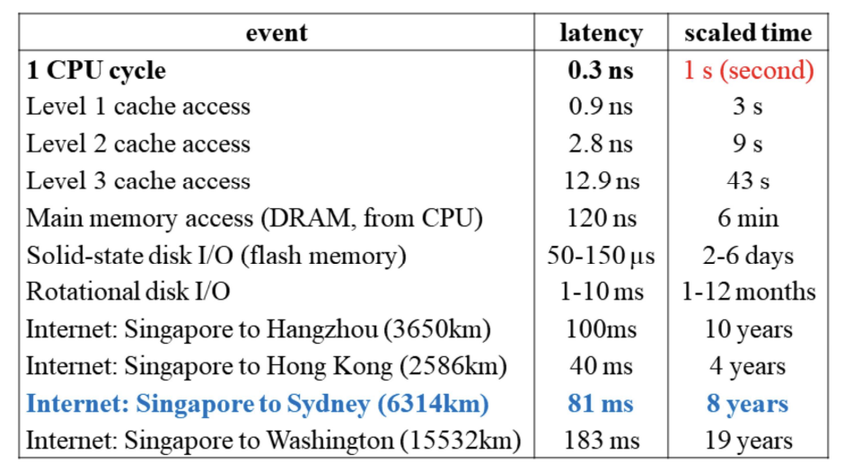
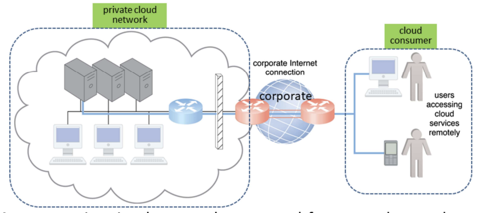
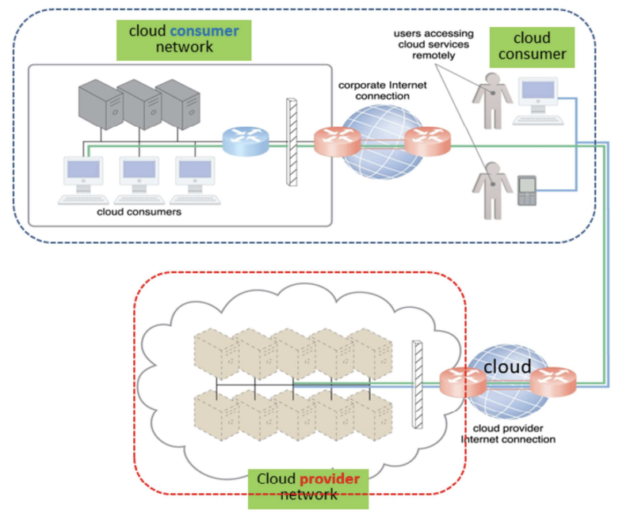
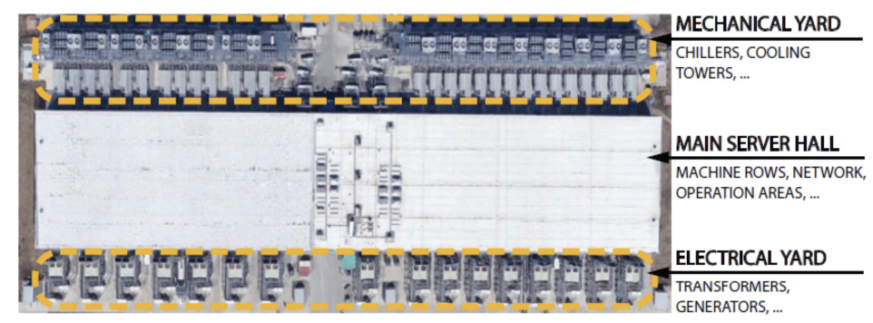
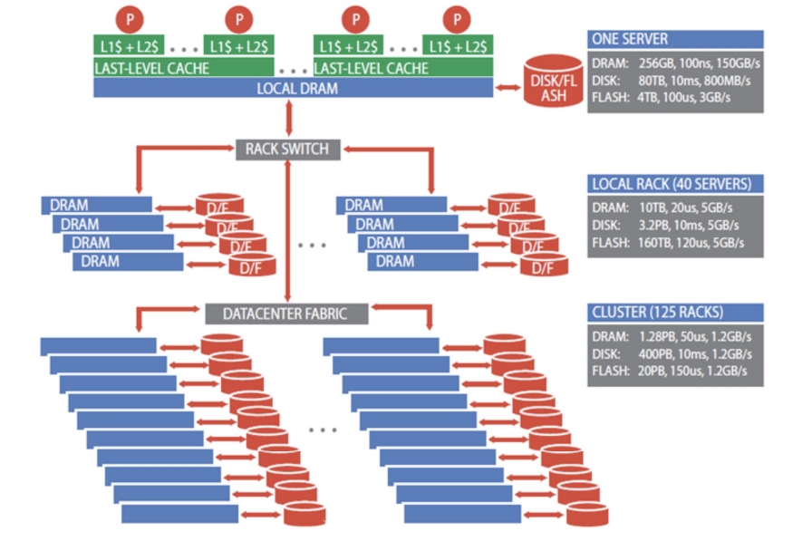

## Resource Hosting

On-prem:

- organizations responsible for deploying, operating and maintaining internet connectivity
- have complete control over QoS (Quality of Service)
- safeguard using firewalls and monitoring software

Cloud-based:

- use mutiple ISPs → difficult QoS management
- need multiple could carriers: connectivity and reliability of cloud application
- easier to adopt for applications with relaxed bandwidth and latency
- security concerns

## Private Cloud Networking

Latency: time it takes a packet to travel from 1 data node to another; highly variable latency with shared nodes; important when application requires swift response time

Bandwidth: number of bits transferred per unit time; important when applications require substantial amount of data transfer

## Cloud-based Networking

## On-prem vs Cloud-based

| On-prem IT Resources                                                                                                | Cloud-based IT Resources                                                                                                   |
| ------------------------------------------------------------------------------------------------------------------- | -------------------------------------------------------------------------------------------------------------------------- |
| internal users access corporate IT services using corporate network                                                 | internal users access corporate IT services using internet connection                                                      |
| while roaming in external networks, internal users access corporate IT services using corporate internet connection | while roaming in external networks, internal users access corporate IT services using cloud provider’s internet connection |
| external users access corporate IT services using corporate Internet connection                                     | external users access corporate IT services using cloud provider’s internet connection                                     |

## Datacenter

Besides housing the **physical resources** (server, storage and network) in a **building**, additional infrastructures includes **power and cooling**, humidity control, **fire protection** **and** **security** of access and installation.

Main components

Server (1U Server) → Cluster (42U Server Rack) → Multiple Clusters → Datacenter

### Machine Rack

- Support servers, storage and networking equipment
- Classic rack: 19-inch wide and 48-inch sizes to support different form factors
- Power conversion (AC to DC) and delivery, battery backup
- Rack-level switch, e.g. TOR (top of rack) with ports divided between downlinks that connect servers to TOR and uplinks that connect the TOR to datacenter network fabric

Example: Intel Haswell-based Server Tray

- Supports 2 Intel Haswell CPU sockets
- Each CPU can support up to 145W with DVFS, e.g. Haswell processot with 18-core per socket
- 16 DIMM (dual in-line memory modules) slots
- PCIe (peripheral component interconnect express) for SSD, NIC, accelerators
- SATA ports for DAS and PCIe-attached storage (disk trays)

### Computing Accelerator: GPUs

- GPU to CPU host via PCIe-attached accelerator tray with multiple GPUs
- within a tray GPUs use interconnects such as NVlink
- Multiple GPU trays are connected to datacenter with NICs, GPUs and NICs communicate directly through PCI-e

### Storage

- 2 categories of data:
  - private to individual running tasks: resides in local DRAM or disk
  - part of shared state of distributed workload - distributed storage network
- Example: Google’s disk tray with 22 hard drives, provides storage to servers over Ethernet

Storage Hierarchy

### Network

- carrier interconnection between external WAN and datacenter LAN
- LAN fabric
  - within a rack, e.g. Ethernet switch with 48 ports to connect servers at 40-100 Gbps
  - redundant connectivity
- SAN fabric between servers and storage systems (Fibre channel)

### Building

- Described in terms of either floor area for IT equipment or critical power supplied to IT equipment
- Power supply, UPS (uninterruptible power supply), battery power backup
- Cooling - Hot-Cold Aisles: 2 main types of cooling systems:
  1. Cold air is blown into the datacenter from the raised floor. The cold air blown into the cool aisles get suck into the rack and heat escape from the other side of the rack resulting in the hot aisles. Hot air rises and get suck out of the datacenter.
  2. Water cool – this is analogous to put the server in a refrigerator, i.e., the server rack is enclosed in a box and heat exchange using cold water is performed within the box. Hot water that take off the heat is discharged through pipes hidden under raised floor. This method has a higher cooling efficiency than using cold air.
- Fire protection
- Security and Monitoring

## Datacenter Tiers

Tier I: a single path for power consumption, UPS, and cooling distribution, no redundant components

→ Availability: 99.671% (29hrs downtime/yr)

Tier II: adds redundant components to this design (N + 1)

→ Availability: 99.741% (23hrs downtime/yr)

Tier III: one active and one alternate distribution path for utilities

- Each path with redundant components, concurrently maintainable
- Redundancy even during maintenance

  → Availability: 99.982% (1.5hrs downtime/yr)

Tier IV: 2 simultaneously active power and cooling distribution paths

- Redundant components in each path
- Tolerate any single equipment failure without impacting the load

  → Availability: 99.995% (0.5hrs downtime/yr)

## Energy Usage and Power Efficiency

PUE (Power Usage Efficiency) = total power used by datacenter / power used by IT equipment

→ Ideal: PUE = 1

→ Avg. US datacenter PUE = 2

→ Energy efficient datacenter PUE = 1.2

Energy-proportion systems:

- Even when power requirement scale linearly with the load, energy efficiency is not a linear function of load; idle system use 50% power
- An energy-proportional system consumes no power when idle, very little power under a light load and, gradually, more power as the load increases
- Dynamic power range: low and upper range of the power consumption of a device
  - Processor (70%), DRAM (50%), disk drive (25%), network switches (15%), human (?%)
  - wider range is better
