## Virtualization

- Enables a single physical infrastructure to function as a multiple logical infrastructure or resources
- Breaks the one-to-one relationship between hardware and OS. Many OSs can run and share a single hardware (one-to-many improves utilization)
- Not limited to hardware, e.g. processor, memory, storage, network, data, application
- Why? Improve resource utilization through sharing → lower cost and increase ROI, improve scalability, ease of administration

Pros:

- hardware independence
- resource consolidation
  - different virtual resources share 1 physical resource
  - increase hardware utilization, load balancing
- resource replication
  - virtual resources are created as virtual disk images (with binary copies of hardware content)
  - virtual images are accessible to the host OS, agility in migration and to deploy new instances (rapid scaling)

Cons:

- performance overhead
- single point of failure of virtualization software

**Processor virtualization** – process of abstracting physical processor to pool of virtual processor

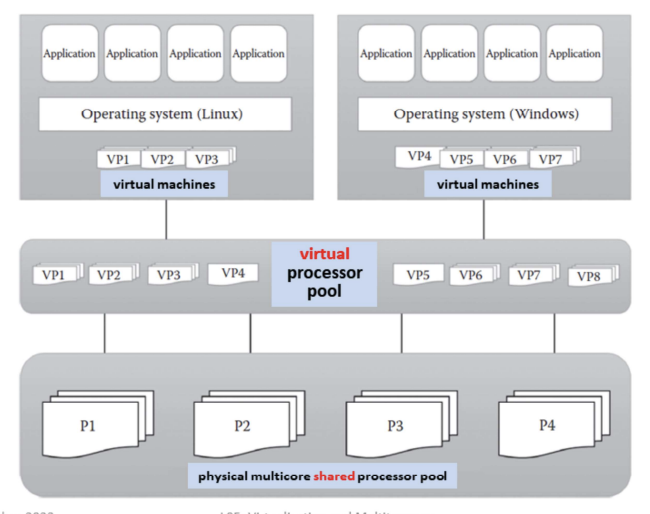

**Memory virtualization** – process of providing virtual main memory to the VMs that are abstracted form the physical main memory

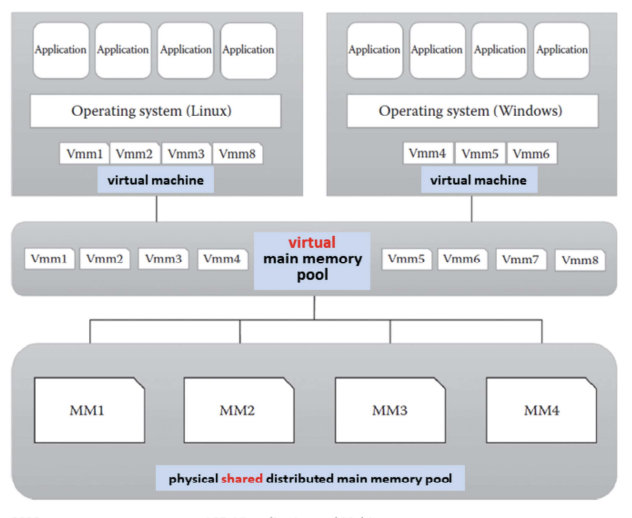

**Storage virtualization** – form of resource virtualization where a multiple physical storage is abstracted as a multiple logical storage

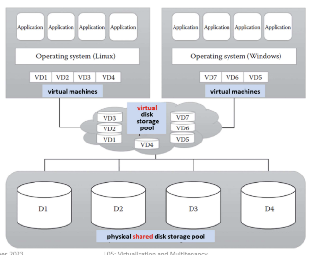

**Network virtualization** – process of abstracting physical network components to form a virtual network

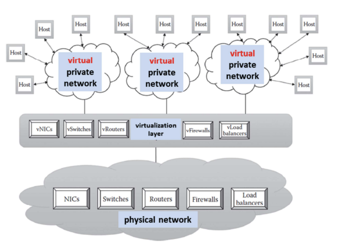

**Data virtualization** – aggregates heterogeneous data from different sources to a single logical or virtual volume of data

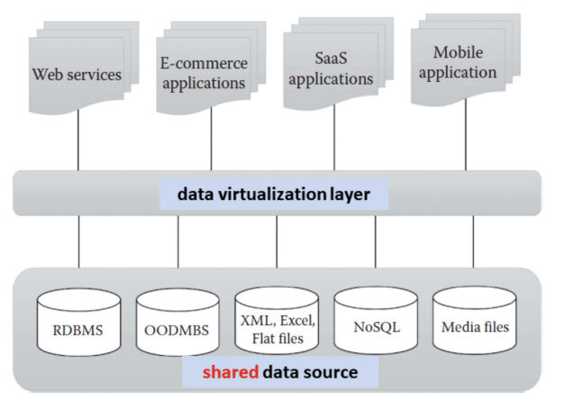

**Application virtualization** – allows users to access the virtual instance of centrally hosted application without installation

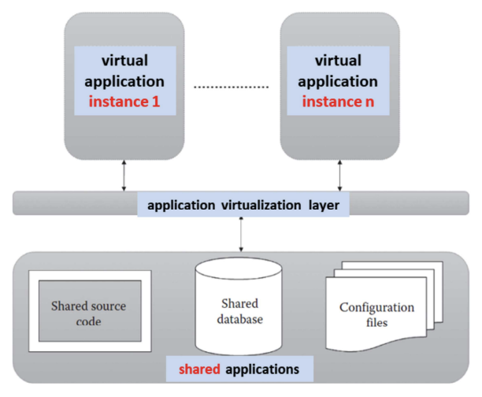

### Approaches

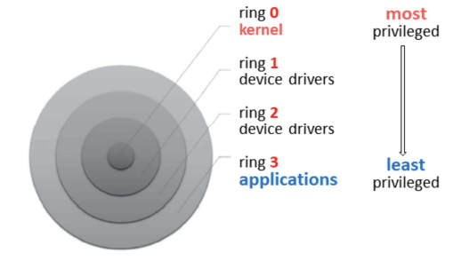

Protection Rings in OS

- Aim: restricts the misuse of resources and malicious behavior of untrusted user-level program
- How? protection rings isolate OS from untrusted users
  - **Ring 0**: programs have most privilege (e.g. highly trusted OS instructions)
  - **Ring 3:** programs/applications with least privilege (untrusted user application with restricted access to physical resources)
- Depending on the types of virtualization approach, the cirtualization software (ring 0) and guest OS will run in different privilege levels (ring 3)
- Virtualization software called hypervisor or virtual machine manager (VMM)
  - software that sits between VMs and physical infrastructure
  - allows IaaS provider to manage VMs and execute consumer;s guest OS
  - physical infrastructure resources are shared among the consumer;s VMs

#### Full Virtualization

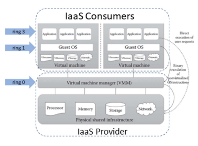

- VMs can run different guest OSs
- Guest OS is abstracted from the hardware, i.e. not aware that it is virtualized and thinks it is running on the real hardware
- VMM at ring 0 provides all the virtual infrastructures needed for VMs, i.e. guest IS communicates with hardware through VMM
- Guest OS communicates with VMM using binary translation - translates guest OS instructions with new instructions that have the same effect on the virtual infrastructure

Pros:

- Provides VMs with best isolation and security
- Different OSs can run simultaneously
- Virtual guest OS can easily be migrated to native hardware
- Easy to install and use - no changes to guest OS

Cons:

- Binary translation overhead reduces system performance
- Need for correct combination of hardware and software - hardware may not have drivers for virtualization software

#### Para Virtualization

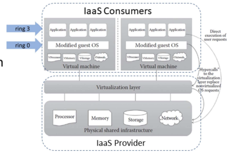

- Modified guest OS replaces OS requests with hypercalls - also called **OS-assisted virtualization**
- **hypercalls**: system calls with privilege to communicate directly between OS and hypervisor without translation
- Guest OS knows that it is running in a virtualized environment

Pros:

- Eliminates overhead of binary translation → improves performance
- No need for special hardware

Cons:

- Overhead of guest OS kernel modifications
- Modified guest OS cannot migrate to run on physical hardware
- VMs lack backward compatibility, difficult to migrate to other hosts

#### Hardware-assisted Virtualization

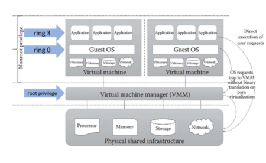

- IaaS Consumer:
  - Hardware (processor) extension supports virtualization: guest states are stored in virtual machine control structures
  - OS requests directly trap the hypervisor: eliminates binary translation and guest OS modification
- VMM has the highest root privilege and guest OS and user applications have the same non-root privilege

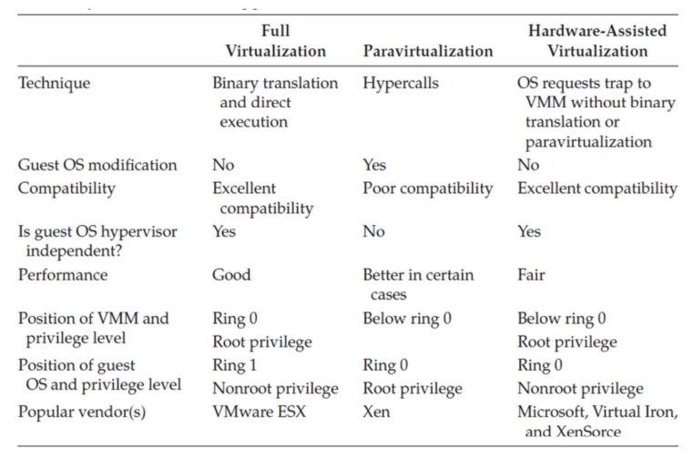

Summary

### Hypervisor

- Hypervisor or VMM sits between VMs and physical infrastructure to provides the required virtual infrastructure for VMs
- 2 types:
  - **bare metal** (or native) or **type 1 hypervisor**: hypervisor runs on physical infrastructure without any help from the host OS
  - **hosted** (or embedded) or **type 2 hypervisor**: require the help of host OS to communicate with the underlying infrastructure

import { Image } from "astro:assets";
import bareMetalHypervisor from "./l5-virtualization--multitenancy/untitled-11.png";
import hostedHypervisor from "./l5-virtualization--multitenancy/untitled-12.png";

  <figure class="basis-72">
    <Image src={bareMetalHypervisor} alt="Bare metal hypervisor" />
  </figure>
  <figure class="basis-72 !mt-0">
    <Image src={hostedHypervisor} alt="Hosted hypervisor" />
  </figure>

**Hypervisor Attacks:**

import attackThroughHost from "./l5-virtualization--multitenancy/untitled-13.png";

<figure class="mx-auto w-[520px]">
  <Image src={attackThroughHost} alt="Attack through Host OS" />
  <figcaption class="text-center text-sm !mt-0">
    Attack through Host OS
  </figcaption>
</figure>

import attackThroughGuest from "./l5-virtualization--multitenancy/untitled-14.png";

<figure class="mx-auto w-[520px]">
  <Image src={attackThroughGuest} alt="Attack through Guest OS" />
  <figcaption class="text-center text-sm !mt-0">
    Attack through Guest OS
  </figcaption>
</figure>

### Containers vs VMs

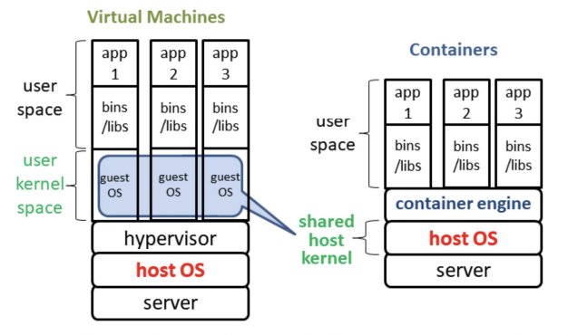

- **Containers (hosted virtualization)** allows existence of multiple isolated user space instances called containers, e.g. Docker
- Unlike VMs, containers share the host system’s kernel with other containers, making it lightweight

## Multitenancy

Cloud providers:

- A single instance of software runs on a server and serves multiple tenants
- Enable multiple users (tenant) to share the same application, e.g. cloud platforms, cloud services

Cloud consumers:

- **dedicated instance** of software with customized view
- **tenants isolation** ensures that tenants do not have access to data and configuration information that it do not own

import singleTenant from "./l5-virtualization--multitenancy/untitled-16.png";
import multiTenant from "./l5-virtualization--multitenancy/a682f6e3-e78b-4fe2-838c-20a3b44a4638.png";

  <figure class="basis-72">
    <Image src={singleTenant} alt="Single tenant" />
  </figure>
  <figure class="basis-72 !mt-0">
    <Image src={multiTenant} alt="Multi tenant" />
  </figure>

### Characteristics

- Usage/Tenant isolation: a tenant behavior does not affects other tenants
- Data security: separate procedures for each tenant
- Recovery: backup, restore
- Scalability:
  - Increase in usage by existing tenants
  - Increase in number of tenants
- Metered usage: each tenant is charged only for the features being used
- Data tier isolation: databases, tables, schemas can be isolated or allowed as shared resources among tenants
