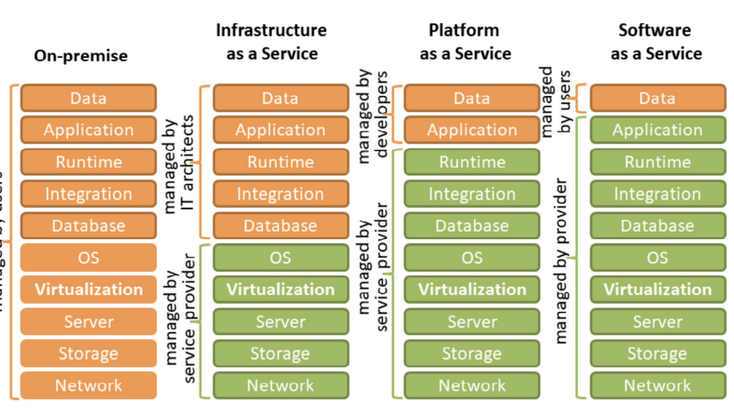
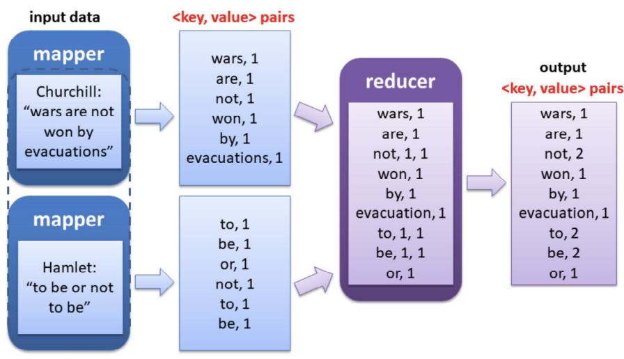

## Cloud Application:

- focus mainly on enterprise computing
- Ideally, an application can partition its workload into n segments and spawn n instances, and the execution time reduced by a factor of n
- Key challenges:
  - **Cloud consumer**: scale application to accommodate a dynamic load, recover after a system failure, efficiently support checkpoint/restart
  - **Cloud provider:** manage a large number of systems (cloud consumer applications), provides quality of service guarantee
- Ideal applications: workload that requires massive computing infrastructure
  - web services, database services, search services (web, images, etc), ML with massive-scale models
- Unlikely to perform well:
  - Applications with a complex workflow and multiple dependencies such as high-performance computing
  - Applications with intensive communication among concurrent instances
  - Workload cannot be arbitrarily partitioned

### Challenges in Developing Cloud Applications:

- Performance isolation: how to ensure that customer performance is not affected by other users

- Reliability: major concern, server failures expected when a large number of servers cooperate to compute

  → Checkpoint/restart, replicate service, autoscale and load balance

- Cloud infrastructure exhibits latency and bandwidth fluctuations which affect the application performance

- Performance considerations limit the amount of data logging (identify unexpected results, errors, monitor application performance)

### Architecture Styles for Cloud Applications

- Reliance on Internet and Web technology (high accessibility, web browser universality, ease of web-based service development)
- Cloud services use web technology as both the implementation medium and management interface
- 2 basic components of the web are web browser client and web server, i.e. based on client-server architecture

Architecture of web applications: 3-tier architecture

1. Presentation layer represents user-interface → sits on both the client and server side
2. Application layer represents implementation logic → web server receives client requests and retrieves the requested resources or generates web content based on application logic
3. Data layer comprises of persistent data stores → web server interacts with application servers and the underlying databases

→ PaaS typically provide separate instances of the web server, application server, and data storage server environments

Web Services technology: provides “as-a-service” cloud delivery models

1. **Simple Object Access Protocol (SOAP):** application protocol for web applications; defines a common web service messaging format for request and response message exchanges; based on the XML, uses TCP or UDP transport protocols
2. Representational State Transfer (REST): software architecture for distributed hypermedia systems. Supports client communcation with stateless servers, platform and language independent, supports data caching, and can be used in the presence of firewalls

- Cloud services are naturally distributed → a single service request might require message passing between multiple servers
- Cloud services are accessed by different clients using different programming languages and technologies → requires a standard interface for communication between clients and server
- Web Service APIs implement a standard communication interface for cloud services, e.g. REST API requests/responses are transferred on HTTP in formats such as SML and JSON

## Cloud Service Models

### Infrastructure as a Service (IaaS)

Characteristics of IaaS:

- Web access to resources
- Centralized physical resource management
- Elastic services and dynamic scaling
- Shared infrastructure across multiple users
- Preconfigured VMs
- Metered services

### Platform as a Service (PaaS)

Consumer:

- Creates software using tools and libraries from the PaaS provider
- Controls software deployment and configuration settings

Provider:

- Installs and maintains software, libraries and middlewares
- Handles the transparent infrastructure from the use
- Exposes an APU for programmers (PaaS consumer)
- Provides integrated services of scalability, maintenance and versioning

Characteristics of PaaS:

- All in one: same IDE to develop, test, deploy, host and maintain application
- Web access to development platforms
- Offline access for developers
- Built-in scalability
- Collaborative platform for developers
- Diverse client tools

### Software as a Service (SaaS)

- Application is located on the cloud
- Clients use a thin client (web browser) to access the program
- Often built on top of multi-tiered PaaS and IaaS
  - Clients do not deal with underlying PaaS and IaaS
  - Clients do not deal with APIs
- Various pricing mechanisms: free, pay-as-you-go, freemium, etc

Characteristics of a SaaS:

- Multi-tenanted applications
- Web access
- Centralized management of SaaS services
- Multi-device support
- Scalability under varying loads
- High availability
- API integration with other software

### Function as a Service (FaaS)

What? Build scalable event-driven applications

Why? Relieves cloud consumer server management (proisioning, scaling, and monitoring, etc), no idle capacity

How?

- Developer focuses on application/business logic, application is divided into smaller, single purpose (Lambda) functions
- Event triggers a Lambda function and dies after execution
- Lambda is stateless
- No VMs/containers in the programming models
- Vendor provides provision-free scalability
- Use cases: web/mobile backends, real-time data processing, chatbots, virtual assistants, etc

#### How a Lambda function runs

- Lambda function contain your application logic (your code)
- Configuration defines how your code is executed, i.e. configure event sources that invoke your functions
- E.g: API Gateway event source can invoke a lambda function on incoming HTTPS requests
- Taken care by system: code to integrate event source with lambda function, manage infrastructure that detects events and invoke lambda, etc

## MapReduce Programming Model

- Supports arbitrarily divisible workload
- Supports distributed computing on large datasets on multiple machines (clusters, public or private clouds, etc)
- How large an amount of work?
  - Web-scale data on the order of 100s of GBs to TBs ot PBs
  - Input data set will not likely fit on a single computer’s hard drive
  - A distributed file system (e.g. Google File System GFS) is typically required

- Key idea: (a) split data into blocks and assign each block to an instance/process for parallel execution (b) merge partial results produced by individual instances after all instances completed execution
- Transform a set of input \<key, value> pairs into a set of output \<key, value> pairs
- SPMD → Same Program Multiple Data
