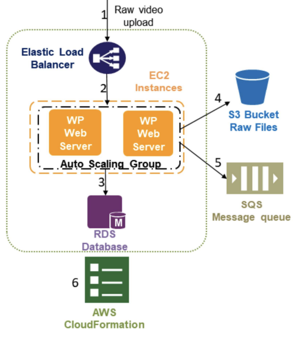

## K-means Clustering using Elastic MapReduce

### K-means Clustering

- An algorithm to cluster/partition m objects based on n attributes in to k groups (k \< m)
- All the object attributes form a vector space
- Partitions such that
  - Maximize distances between inter-cluster points
  - Minimize distances between intra-cluster points

### K-means in MapReduce

Map phase:

- Compute distances between an input point and all the previously obtained centroids of clusters
- Find the cluster with minimum distance
- Add the input point into the cluster with minimum distance

Reduce phase:

- Receive all the points belonging to a particular cluster
- Compute the new centroid

Input:

- Key: ID of a participating point
- Value: a vector of attributes of that particular point

Output:

- Key: ID of a cluster
- Value: a vector representing centroid for the cluster and number of points inside the cluster

### Implementation on AWS

1. Upload data in S3 bucket
2. Upload executable jar in S3 bucket and create cluster
3. On completion of execution, view the results in S3

## Building a Video-sharing SaaS Cloud Application

Problem: video-sharing website built with AWS components

- Users upload (store) videos and stream them later
- Website accepts video with different formats and converts them into a streaming format (encode videos)
  - x264 encoding for the video stream
  - mp4a encoding for the audio stream
- For simplicity, no user account

### AWS Components

**Elastic Compute Cloud (Amazon EC2)** is a web service that enables launching and managing server instances in Amazon’s data centers

**Simple Storage Service (Amazon S3)** is a web storage service

**Amazon Simple Queue Service** is a service that handles message or workflows between other components in a system

**Elastic Load Balancing** automatically distrubutes incoming traffic across multiple EC2 instances

**CloudFormation** enables the creation and provision of AWS infrastructure deployments predictably and repeatedly

**CloudFront** is a web service that speeds up (content) distribution of static and dynamic web content through a worldwide network of edge locations

### Design of Video-sharing Cloud App

Uploading → Encoding → Streaming

#### 1. Upload Process

Analysis of Service Models - Uploading

#### 2. Encoding Process

Analysis of Service Models - Encoding

#### 3. Streaming Process

Analysis of Service Models - Streaming

### Performance and Scaling

Upload process:

- EC2 auto-scaling launches/terminates instances on demand
- ELB routes traffic among available instances
- S3 storage scales transparently with demand

Encode process:

- EC2 auto-scaling for encoder
- SQS can be scaled up by distribution

Streaming process:

- Cloudfront scales similarly to a CDN

### Pricing

Costs: EC2 instances, S3 storage, RDS datbase, CloudFront CDN

Software: no infrastructure costs but based on usage

Example:

- 500 streaming hits per dat (~2 hits/sec)
  - Each user streams 100MB of HD movies (~3mins)
  - Assume same location
  - 50GB per day or 1.5TB per month
- 50 uploading hits per day
  - Each upload is 100MB of HD movie
  - Encoding process takes 1 min per movie
  - 5 GB per day or 150GB per month
