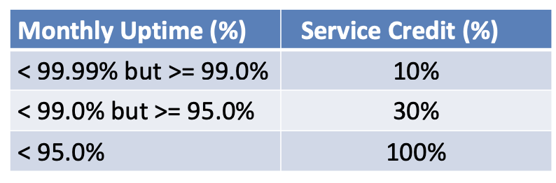
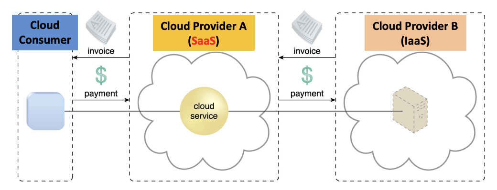
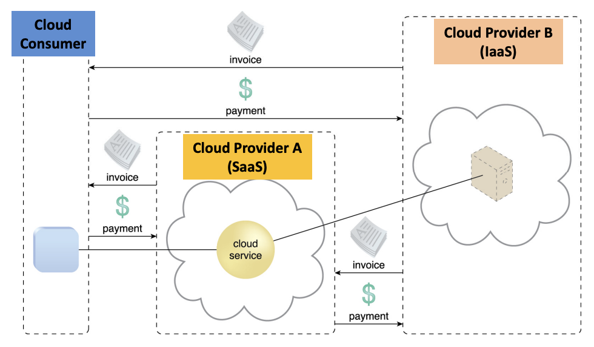

## Pricing Models

- Defines unit cost of resource usage according to usage cost metrics
- Factors influencing price model
  1. overhead in design, development, deployment and operation of cloud services and other IT resources
  2. opportunities to reduce expenses via IT resource sharing and data center optimization
  3. market competition and regulatory requirements

### Variables in a Pricing Model

- Cost metrics and associated prices → depends on on-demand (pay-per-use) or reserved allocation (upfront fee + discounted hourly rate)
- Definition of fixed (usage quota) and variable (actual usage) rates
- Discounts for higher volumes
- Payment options and schedules: customization, prepaid, postpaid, instalment

Example:

- **IaaS**: pricing based on resource allocation and usage including amount of network data transferred, number of virtual servers, allocated storage capacity
- **PaaS**: price also depends on software configurations, development tools and licensing fees
- **SaaS**: price is determined by number of application modules in the subscription, number of nominated cloud service consumers, number of transactions

Example: AWS EC2

- Types:

  1. General purposes: t2, m4
  2. Compute optimizedL c3, c4
  3. Memory optimized: x1, r3
  4. Storage optimized: i3, d2
  5. Accelerated computing: p2

- Sizes: Each instance type is further divided into subtypes based on the number of vCPUs and memory availability
  - E.g: nano(1), micro(1), small(1), medium(2), large(2), xlarge(4), 2xlarge(8), 4xlarge(16), 10xlarge(40), 16xlarge(64)

AWS SLA:

SaaS: Integrated Pricing Model

1. Cloud consumer leases a SaaS product from Cloud Provider A. Cloud Provider A leases an IaaS environment (including the virtual server used to host the cloud service) from Cloud Provider B.
2. Cloud consumer pays Cloud Provider A for providing the SaaS Cloud Provider A hosts the SaaS on Cloud Provider B and pays Cloud Provider B for the IaaS service

**SaaS: Separate Pricing Model**

1. Cloud consumer leases a virtual server from Cloud Provider B (IaaS) to host the SaaS service from Cloud Provider A (SaaS). Both leasing agreements may have been arranged for the cloud consumer by Cloud Provider A.
2. There may still be some fees billed directly by Cloud Provider B to Cloud Provider A

**Example: AWS Pricing**

- Charges differ across region and depends on the perating costs (energy, communication and maintenance)
- On-demand
  - multi-tenancy, pay by the second (minimum of 60 seconds)
  - start and stop as you wish
- Reserved
  - pay by the year - onetime upfront + pay as you go
  - 3 types: light, medium and heavy utilization
  - start or stop as needed
- Spot
  - Bid for unused capacity
  - Name your spot price and if market rate is less than your bid, you get the instance
  - Instance automatically terminates if your spot price becomes less than current market rate
- Dedicated
  - Instance runs in a VPC on hardware dedicated to a single customer
  - Instances are physically isolated at the host hardware level from instances that belong to other AS accounts

## Cost Metrics

- Financial analysis of cloud adoption
- Compare on-prem (total cost of ownership TCO) and cloud-based provisioning )utility-centric pay-per-use)
- Usage scenario
  - Cloud consumer
  - Cloud provider:
    - private cloud - determine resource charging within an organization (IaaS)
    - how to price a cloud service (SaaS), etc

### Business Cost Metrics

Upfront costs:

- Capital expenses (Capex)
- Initial investment to fund IT resourcess
- Obtain resource, deploy and administer
- on-prem → high: hardware, software and deployment costs
- cloud-based → low: labor cost for setting up cloud environment

On-going costs:

- Operational expenses (Opex)
- Run and maintain IT resources: licensing fee, electricity, maintenance
- Higher for on-prem

Additional costs:

1. Cost of capital
   - Cost incurred to raise funds → if high, leasing cloud-based is justified
2. Sunk costs
   - Prior investment on existing IT resources
   - If significant, cannot justify cloud-based
3. Integration costs
   - Effort needed to interoperate IT resources on new environment, e.g. new cloud platform
   - High cost → cloud-based less appealing
4. Locked-in costs
   - Movement from 1 cloud provider to another
   - high value → cloud-based less appealing

### Cloud Usage Cost Metrics

1. Network usage (data transfer): inbound, outbound and intra-cloud network traffic
   - Total network traffic in bytes
   - Accumulated over a pre-defined period, e.g. up to 1GB free, S\$0.01/GB till 1TB and S\$0.005/GB after 1TB per month
   - Applicable to IaaS, PaaS, SaaS
   - Inter-cloud:
     - Data replication, synchronization, …
     - May have different rates for inbound and outbound. Some providers may not charge for inbound
   - Intra-cloud: Some provider may not charge for it
2. Server usage (compute): on-demand and reserved VM allocation
   - range of performance attributes: CPU, RAM, dedicated storage, …
   - On-demand
     - pay-per-use fee short term
     - cumulative from server start to stop date
     - IaaS, PaaS
   - Reserved
     - upfront cost for reservation
     - start date to expiry date
     - costs: daily/monthly/yearly
     - IaaS, PaaS
3. Cloud storage device (storage): on-demand storage allocation, I/O data transfers
   - On-demand storage space
     - size of storage space in bytes
     - cumulative sum over date of allocation to release
     - IaaS, PaaS, SaaS
   - I/O data tranferred metric
     - I/O data in bytes
     - some providers may not charge (IaaS, PaaS)
4. Cloud service (service): subscription duration, number of users, number of transactions
   - SaaS
   - application subscription duration: cumulative sum from subscription start to expiry date
   - number of nominated users, e.g. S\$0.9/additional user per month
   - number of transactions
     - number of request response message exchanges, e.g. S\$0.05 per 1000 transactions
     - SaaS and PaaS

## Total Cost of Ownership of a Datacenter

:::note
costs = capital expenses (Capex) + operational expenses (Opex)
:::

Capex = upfront investment depreciated over a certain timeframe such as construction cost of datacenter and purchase price of servers

Opex = recurring cost of running datacenter such as electricity costs, repairs and maintenance, salaries, etc

:::note
TCO = datacenter depreciation + datacenter Opex + server depreciation + server Opex
:::
